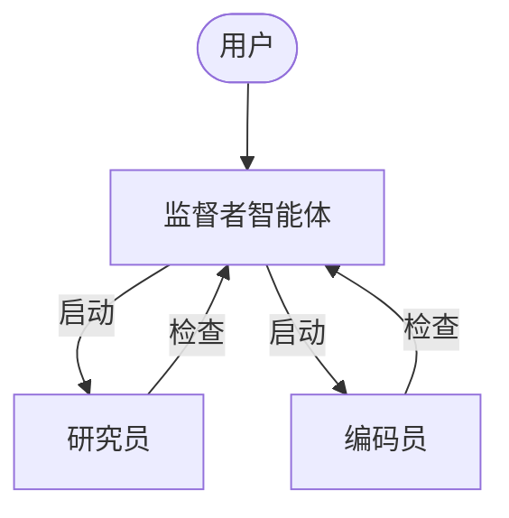
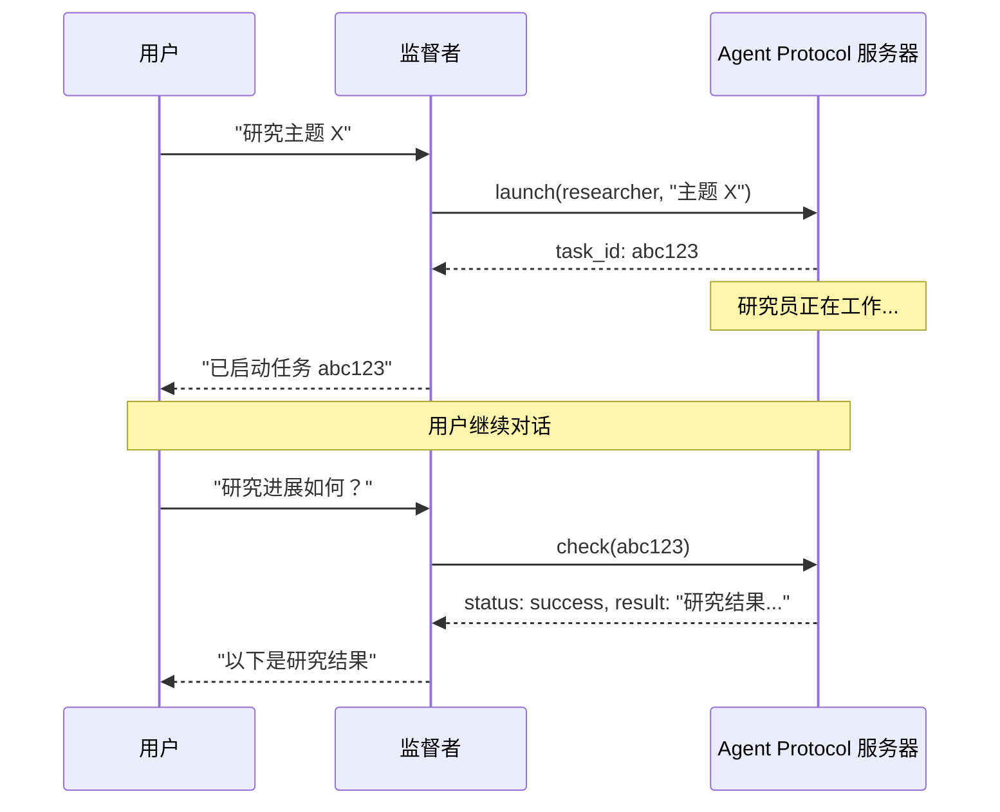

异步子智能体允许监督者智能体启动后台任务并立即返回，这样监督者可以在子智能体并发工作的同时继续与用户交互。监督者可以随时检查进度、发送后续指令或取消任务。

这是在[子智能体](/oss/javascript/deepagents/subagents)的基础上构建的，后者同步运行并阻塞监督者直到完成。当任务是长时间运行的、可并行化的或需要中途调整时，请使用异步子智能体。

<Note>

异步子智能体是 `deepagents` 1.9.0 中提供的预览功能。预览功能正在积极开发中，API 可能会发生变化。

</Note>



<Note>
异步子智能体可以与任何实现了 [Agent Protocol](https://github.com/langchain-ai/agent-protocol) 的服务器通信。你可以使用 [LangSmith Deployments](/langsmith/deployment)，或自托管任何兼容 Agent Protocol 的服务器。每个子智能体独立于监督者运行，监督者通过 SDK 控制它们的启动、检查、更新和取消。
</Note>

## 何时使用异步子智能体

| 维度                 | 同步子智能体                                                    | 异步子智能体                                                      |
|----------------------|-----------------------------------------------------------------|-------------------------------------------------------------------|
| **执行模型**         | 监督者阻塞直到子智能体完成                                      | 立即返回任务 ID；监督者继续                                       |
| **并发性**           | 并行但阻塞                                                      | 并行且非阻塞                                                      |
| **任务中更新**       | 不可能                                                          | 通过 `update_async_task` 发送后续指令                             |
| **取消**             | 不可能                                                          | 通过 `cancel_async_task` 取消正在运行的任务                       |
| **状态性**           | 无状态——调用之间没有持久状态                                     | 有状态——在自己的线程上维护跨交互的状态                            |
| **最适合**           | 智能体应等待结果后再继续的任务                                  | 在聊天中交互式管理的长时间运行的复杂任务                          |

## 配置异步子智能体

将异步子智能体定义为 [`AsyncSubAgent`](https://reference.langchain.com/javascript/deepagents/agent/createDeepAgent) 规格列表，每个指向一个 Agent Protocol 服务器：


```typescript
import { createDeepAgent, AsyncSubAgent } from "deepagents";

const asyncSubagents: AsyncSubAgent[] = [
  {
    name: "researcher",
    description: "用于信息收集和综合的研究智能体",
    graphId: "researcher",
    // 无 url → ASGI 传输（在同一部署中共同部署）
  },
  {
    name: "coder",
    description: "用于代码生成和审查的编程智能体",
    graphId: "coder",
    // url: "https://coder-deployment.langsmith.dev"  // 可选：用于远程的 HTTP 传输
  },
];

const agent = createDeepAgent({
  model: "google_genai:gemini-3.1-pro-preview",
  subagents: [...asyncSubagents],
});
```

| 字段 | 类型 | 描述 |
|-------|------|-------------|
| `name` | `string` | 必需。唯一标识符。监督者在启动任务时使用此名称。 |
| `description` | `string` | 必需。此子智能体的功能描述。监督者用此决定委派给哪个智能体。 |
| `graphId` | `string` | 必需。Agent Protocol 服务器上的图 ID（或助手 ID）。对于基于 LangGraph 的部署，必须匹配在 `langgraph.json` 中注册的图。 |
| `url` | `string` | 可选。省略时使用 ASGI 传输（进程内）。设置时使用 HTTP 传输连接到远程 Agent Protocol 服务器。 |
| `headers` | `Record<string, string>` | 可选。发送到远程服务器的请求的附加头信息。用于自托管 Agent Protocol 服务器的自定义认证。 |


对于基于 LangGraph 的部署，在同一个 `langgraph.json` 中注册所有图以实现共同部署：

```json
{
  "graphs": {
    "supervisor": "./src/supervisor.py:graph",
    "researcher": "./src/researcher.py:graph",
    "coder": "./src/coder.py:graph"
  }
}
```

## 使用异步子智能体工具

[`AsyncSubAgentMiddleware`](https://reference.langchain.com/javascript/deepagents/agent/createDeepAgent) 为监督者提供五个工具：

| 工具 | 用途 | 返回值 |
|------|---------|---------|
| `start_async_task` | 启动一个新的后台任务 | 任务 ID（立即返回） |
| `check_async_task` | 获取任务的当前状态和结果 | 状态 + 结果（如果已完成） |
| `update_async_task` | 向正在运行的任务发送新指令 | 确认 + 更新后的状态 |
| `cancel_async_task` | 停止正在运行的任务 | 确认 |
| `list_async_tasks` | 列出所有跟踪的任务及实时状态 | 所有任务的摘要 |

监督者的 LLM 像调用其他工具一样调用这些工具。中间件自动处理线程创建、运行管理和状态持久化。

### 理解生命周期

典型的交互遵循以下顺序：



- **启动**在服务器上创建一个新线程，以任务描述作为输入启动运行，并返回线程 ID 作为任务 ID。监督者将此 ID 报告给用户，不会轮询完成状态。
- **检查**获取当前运行状态。如果运行成功，它会检索线程状态以提取子智能体的最终输出。如果仍在运行，则向用户报告该状态。
- **更新**在同一线程上创建新的运行，使用中断多任务策略。之前的运行被中断，子智能体使用完整的对话历史加上新指令重新启动。任务 ID 保持不变。
- **取消**调用服务器上的 `runs.cancel()` 并将任务标记为 `"cancelled"`。
- **列出**遍历所有跟踪的任务。对于非终态任务，它并行从服务器获取实时状态。终态状态（`success`、`error`、`cancelled`）从缓存返回。

## 理解状态管理


任务元数据存储在监督者图上的专用状态通道（`asyncTasks`）中，与消息历史分离。这很关键，因为深度智能体在上下文窗口填满时会[压缩消息历史](/oss/javascript/deepagents/context-engineering#summarization)。如果任务 ID 仅存在于工具消息中，它们会在压缩过程中丢失。专用通道确保监督者始终可以通过 `list_async_tasks` 回忆其任务，即使经过多轮摘要。

每个跟踪的任务记录任务 ID、智能体名称、线程 ID、运行 ID、状态和时间戳（`createdAt`、`checkedAt`、`updatedAt`）。


## 选择传输方式

### ASGI 传输（共同部署）

当子智能体规格省略 `url` 字段时，LangGraph SDK 使用 ASGI 传输——SDK 调用通过进程内函数调用路由而非 HTTP。对于基于 LangGraph 的部署，这要求两个图在同一个 `langgraph.json` 中注册。

ASGI 传输消除了网络延迟且无需额外的认证配置。子智能体仍作为具有自己状态的独立线程运行。这是推荐的默认方式。

### HTTP 传输（远程）

添加 `url` 字段以切换到 HTTP 传输，SDK 调用通过网络发送到远程 Agent Protocol 服务器：


```typescript
{
  name: "researcher",
  description: "研究智能体",
  graphId: "researcher",
  url: "https://my-research-deployment.langsmith.dev",
}
```


对于 LangGraph 部署，认证由 LangGraph SDK 使用环境变量中的 `LANGSMITH_API_KEY`（或 `LANGGRAPH_API_KEY`）处理。自托管的 Agent Protocol 服务器可能使用不同的认证机制。

当子智能体需要独立扩展、不同的资源配置或由不同团队维护时，请使用 HTTP 传输。

## 选择部署拓扑

### 单一部署

单一部署意味着所有智能体使用 ASGI 传输在同一服务器上共同部署。对于基于 LangGraph 的部署，在一个 `langgraph.json` 中注册所有图。这是推荐的起点——一个服务器管理，智能体之间零网络延迟。

### 分离部署

监督者在一台服务器上，子智能体通过 HTTP 传输在另一台服务器上。当子智能体需要不同的计算配置或独立扩展时使用。

### 混合部署

在分离部署中，你将监督者放在一台服务器上，子智能体通过 HTTP 传输放在另一台服务器上。当子智能体需要不同的计算配置或独立扩展时使用。

### 混合部署

在混合部署中，一些子智能体通过 ASGI 共同部署，其他通过 HTTP 远程：


```typescript
const asyncSubagents: AsyncSubAgent[] = [
  {
    name: "researcher",
    description: "研究智能体",
    graphId: "researcher",
    // 无 url → ASGI（共同部署）
  },
  {
    name: "coder",
    description: "编程智能体",
    graphId: "coder",
    url: "https://coder-deployment.langsmith.dev",
    // 有 url → HTTP（远程）
  },
];
```


## 最佳实践

### 为本地开发调整工作池大小

在本地使用 `langgraph dev` 运行时，增加工作池以容纳并发的子智能体运行。每个活跃的运行占用一个工作槽。一个有 3 个并发子智能体任务的监督者需要 4 个槽（1 个监督者 + 3 个子智能体）。配置不足会导致启动排队。

```bash
langgraph dev --n-jobs-per-worker 10
```

### 编写清晰的子智能体描述

监督者使用描述来决定启动哪个子智能体。要具体且面向行动：


```typescript
// 好的
{
  name: "researcher",
  description: "使用网络搜索进行深入研究。用于需要多次搜索和综合的问题。",
  graphId: "researcher",
}

// 不好的
{
  name: "helper",
  description: "帮忙做事",
  graphId: "helper",
}
```


### 使用线程 ID 进行跟踪

使用基于 LangGraph 的部署时，每个异步子智能体的运行都是标准的 LangGraph 运行，在 LangSmith 中完全可见。监督者的跟踪显示 `launch`、`check`、`update`、`cancel` 和 `list` 的工具调用。每个子智能体运行显示为单独的跟踪，通过线程 ID 关联。使用线程 ID（任务 ID）将监督者编排跟踪与子智能体执行跟踪关联起来。

## 故障排除

### 监督者在启动后立即轮询

**问题**：监督者在启动后立即循环调用 `check`，将异步执行变成了阻塞。

**解决方案**：中间件注入了系统提示规则来防止这种行为。如果轮询持续存在，请在监督者的系统提示中强化该行为：


```typescript
const agent = createDeepAgent({
  model: "google_genai:gemini-3.1-pro-preview",
  systemPrompt: `...你的指令...

    启动异步子智能体后，必须将控制权返回给用户。
    永远不要在启动后立即调用 check_async_task。`,
  subagents: [...asyncSubagents],
});
```


### 监督者报告过期状态

**问题**：监督者引用对话历史中早期的任务状态，而不是进行新的 `check` 调用。

**解决方案**：中间件提示指示模型"对话历史中的任务状态始终是过期的"。如果仍然出现此问题，请添加明确的指令，始终在报告状态之前调用 `check` 或 `list`。

### 任务 ID 查找失败

**问题**：监督者截断或重新格式化了任务 ID，导致 `check` 或 `cancel` 失败。

**解决方案**：中间件提示指示模型始终使用完整的任务 ID。如果截断持续存在，这通常是模型特定的问题——尝试不同的模型或在系统提示中添加"始终显示完整的 task_id，永远不要截断或缩写"。

### 子智能体启动排队而非运行

**问题**：启动子智能体挂起或启动时间很长。

**解决方案**：工作池可能已耗尽。使用 `--n-jobs-per-worker` 增加池大小。请参阅[调整工作池大小](#为本地开发调整工作池大小)。

## 参考实现

[async-deep-agents](https://github.com/langchain-ai/async-deep-agents) 仓库包含 Python 和 TypeScript 的工作示例，可部署到 LangSmith Deployments。它演示了一个带有研究员和编码员子智能体的监督者，作为后台任务运行。

---

<div className="source-links">
<Callout icon="terminal-2">
    通过 MCP [连接这些文档](/use-these-docs)到 Claude、VSCode 等工具，获取实时答案。
</Callout>
<Callout icon="edit">
    [在 GitHub 上编辑此页面](https://github.com/langchain-ai/docs/edit/main/src/oss/deepagents/async-subagents.mdx)或[提交问题](https://github.com/langchain-ai/docs/issues/new/choose)。
</Callout>
</div>
