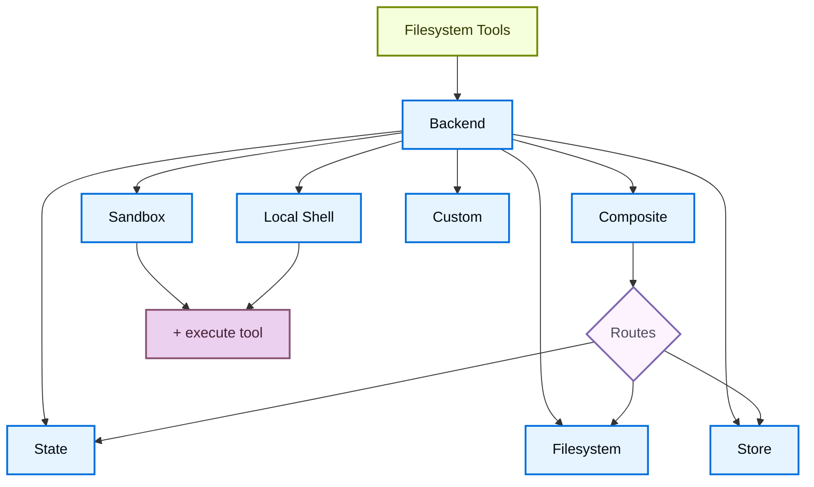

import BackendStatePy from '/snippets/backend-state-py.mdx';
import BackendStateJs from '/snippets/backend-state-js.mdx';
import BackendFilesystemPy from '/snippets/backend-filesystem-py.mdx';
import BackendFilesystemJs from '/snippets/backend-filesystem-js.mdx';
import BackendLocalShellPy from '/snippets/backend-local-shell-py.mdx';
import BackendLocalShellJs from '/snippets/backend-local-shell-js.mdx';
import BackendStorePy from '/snippets/backend-store-py.mdx';
import BackendStoreJs from '/snippets/backend-store-js.mdx';
import BackendCompositePy from '/snippets/backend-composite-py.mdx';
import BackendCompositeJs from '/snippets/backend-composite-js.mdx';

深度智能体通过 `ls`、`read_file`、`write_file`、`edit_file`、`glob` 和 `grep` 等工具向智能体暴露文件系统界面。这些工具通过可插拔的后端运行。`read_file` 工具在所有后端中原生支持图像文件（`.png`、`.jpg`、`.jpeg`、`.gif`、`.webp`），将它们作为多模态内容块返回。

`read_file` 工具在所有后端中原生支持二进制文件（图像、PDF、音频、视频），返回带有类型化 `content` 和 `mimeType` 的 `ReadResult`。


沙箱和 [`LocalShellBackend`](https://reference.langchain.com/javascript/deepagents/backends/LocalShellBackend) 还提供 `execute` 工具。
本页介绍如何：


- [选择后端](#specify-a-backend)，
- [将不同路径路由到不同后端](#route-to-different-backends)，
- [实现你自己的虚拟文件系统](#use-a-virtual-filesystem)（例如 S3 或 Postgres），
- [设置权限](#permissions)以控制文件系统访问，
- [添加策略钩子](#add-policy-hooks)，
[处理二进制和多模态文件](#multimodal-and-binary-files)，

- [遵守后端协议](#protocol-reference)，
- 以及[将现有后端更新到 v2](#update-existing-backends-to-v2)。


## 快速开始

以下是一些你可以快速与深度智能体配合使用的预构建文件系统后端：

| 内置后端 | 描述 |
|---|---|
| [Default](#statebackend) | `agent = create_deep_agent(model="google_genai:gemini-3.1-pro-preview")` <br></br> Thread-scoped. The default filesystem backend for an agent is stored in `langgraph` state. Files persist across turns within a thread (via your checkpointer) and are not shared across threads. |
| [Local filesystem persistence](#filesystembackend-local-disk) | `agent = create_deep_agent(model="google_genai:gemini-3.1-pro-preview", backend=FilesystemBackend(root_dir="/Users/nh/Desktop/"))` <br></br>This gives the deep agent access to your local machine's filesystem. You can specify the root directory that the agent has access to. Note that any provided `root_dir` must be an absolute path. |
| [Durable store (LangGraph store)](#storebackend-langgraph-store) | `agent = create_deep_agent(model="google_genai:gemini-3.1-pro-preview", backend=StoreBackend())` <br></br>This gives the agent access to long-term storage that is _persisted across threads_. This is great for storing longer term memories or instructions that are applicable to the agent over multiple executions. |
| [Sandbox](/oss/javascript/deepagents/sandboxes) | `agent = create_deep_agent(model="google_genai:gemini-3.1-pro-preview", backend=sandbox)` <br></br>Execute code in isolated environments. Sandboxes provide filesystem tools plus the `execute` tool for running shell commands. Choose from Modal, Daytona, Deno, or local VFS. |
| [Local shell](#localshellbackend-local-shell) | `agent = create_deep_agent(model="google_genai:gemini-3.1-pro-preview", backend=LocalShellBackend(root_dir=".", env={"PATH": "/usr/bin:/bin"}))` <br></br>Filesystem and shell execution directly on the host. No isolation—use only in controlled development environments. See [security considerations](#localshellbackend-local-shell) below. |
| [Composite](#compositebackend-router) | Thread-scoped by default, `/memories/` persisted across threads. The Composite backend is maximally flexible. You can specify different routes in the filesystem to point towards different backends. See Composite routing below for a ready-to-paste example. |




## 内置后端

### StateBackend


<BackendStateJs />


**工作原理：**
- 通过以下方式将文件存储在当前线程的 LangGraph 智能体状态中 [`StateBackend`](https://reference.langchain.com/javascript/deepagents/backends/StateBackend).
- 通过检查点在同一线程的多个智能体轮次之间持久化。文件不在线程之间共享。

<Warning>
设计为在图内使用。在图运行之外调用后端方法 (e.g., `state_backend.upload_files(...)`) outside of a graph run won't take effect until the graph executes.
</Warning>

**最佳用途：**
- 智能体写入中间结果的草稿本。
- 自动清除大型工具输出，智能体随后可以逐块读回。

请注意，此后端在监督智能体和子智能体之间共享, and any files a subagent writes will remain in the LangGraph agent state
even after that subagent's execution is complete. Those files will continue to be available to the supervisor agent and other subagents.

### FilesystemBackend（本地磁盘）

[`FilesystemBackend`](https://reference.langchain.com/javascript/deepagents/backends/FilesystemBackend) 在可配置的根目录下读写真实文件。

<Warning>
此后端授予智能体直接的文件系统读/写访问权限。
请谨慎使用，仅在适当的环境中使用。

**适当的使用场景：**
- 本地开发 CLI（编程助手、开发工具）
- CI/CD 流水线（参见下面的安全考虑）

**不适当的使用场景：**
- Web 服务器或 HTTP API - 请改用 `StateBackend`、`StoreBackend` 或 [sandbox backend](/oss/javascript/deepagents/sandboxes) instead

**安全风险：**
- 智能体可以读取任何可访问的文件，包括密钥（API 密钥、凭据、`.env` 文件）
- 结合网络工具，密钥可能通过 SSRF 攻击被窃取
- 文件修改是永久且不可逆的

**建议的安全措施：**
1. Enable [Human-in-the-Loop (HITL) middleware](/oss/javascript/deepagents/human-in-the-loop) to review sensitive operations.
1. Exclude secrets from accessible filesystem paths (especially in CI/CD).
1. Use a [sandbox backend](/oss/javascript/deepagents/sandboxes) for production environments requiring filesystem interaction.
1. **Always** use `virtual_mode=True` with `root_dir` to enable path-based access restrictions (blocks `..`, `~`, and absolute paths outside root).
   Note that the default (`virtual_mode=False`) provides no security even with `root_dir` set.
</Warning>


<BackendFilesystemJs />


**工作原理：**
- 在可配置的 `root_dir` 下读写真实文件。
- You can optionally set `virtual_mode=True` to sandbox and normalize paths under `root_dir`.
- Uses secure path resolution, prevents unsafe symlink traversal when possible, can use ripgrep for fast `grep`.

**最佳用途：**
- 你机器上的本地项目
- CI 沙箱
- 挂载的持久卷

### LocalShellBackend（本地 shell）

<Warning>
This backend grants agents direct filesystem read/write access **and** unrestricted shell execution on your host.
Use with extreme caution and only in appropriate environments.

**适当的使用场景：**
- 本地开发 CLI（编程助手、开发工具）
- Personal development environments where you trust the agent's code
- CI/CD pipelines with proper secret management

**不适当的使用场景：**
- Production environments (such as web servers, APIs, multi-tenant systems)
- Processing untrusted user input or executing untrusted code

**安全风险：**
- Agents can execute **arbitrary shell commands** with your user's permissions
- 智能体可以读取任何可访问的文件，包括密钥（API 密钥、凭据、`.env` 文件）
- Secrets may be exposed
- File modifications and command execution are **permanent and irreversible**
- Commands run directly on your host system
- Commands can consume unlimited CPU, memory, disk

**建议的安全措施：**
1. Enable [Human-in-the-Loop (HITL) middleware](/oss/javascript/deepagents/human-in-the-loop) to review and approve operations before execution. This is **strongly recommended**.
2. Run in dedicated development environments only. Never use on shared or production systems.
3. Use a [sandbox backend](/oss/javascript/deepagents/sandboxes) for production environments requiring shell execution.

**Note:** `virtual_mode=True` provides no security with shell access enabled, since commands can access any path on the system.
</Warning>


<BackendLocalShellJs />


**工作原理：**
- Extends `FilesystemBackend` with the `execute` tool for running shell commands on the host.
- Commands run directly on your machine using `subprocess.run(shell=True)` with no sandboxing.
- Supports `timeout` (default 120s), `max_output_bytes` (default 100,000), `env`, and `inherit_env` for environment variables.
- Shell commands use `root_dir` as the working directory but can access any path on the system.

**最佳用途：**
- Local coding assistants and development tools
- Quick iteration during development when you trust the agent

### StoreBackend（LangGraph 存储）


<BackendStoreJs />


<Tip>
    The `namespace` parameter controls data isolation. For multi-user deployments, always set a [namespace factory](/oss/javascript/deepagents/backends#namespace-factories) to isolate data per user or tenant.
</Tip>

**工作原理：**
- [`StoreBackend`](https://reference.langchain.com/javascript/deepagents/backends/StoreBackend) stores files in a LangGraph [`BaseStore`](https://reference.langchain.com/javascript/langchain-core/stores/BaseStore) provided by the runtime, enabling cross‑thread durable storage.

**最佳用途：**
- When you already run with a configured LangGraph store (for example, Redis, Postgres, or cloud implementations behind [`BaseStore`](https://reference.langchain.com/javascript/langchain-core/stores/BaseStore)).
- When you're deploying your agent through [LangSmith Deployment](/langsmith/deployment) (a store is automatically provisioned for your agent).

#### 命名空间工厂

A namespace factory controls where `StoreBackend` reads and writes data. It receives a LangGraph [`Runtime`](https://reference.langchain.com/javascript/langchain/index/Runtime) and returns a tuple of strings used as the store namespace. Use namespace factories to isolate data between users, tenants, or assistants.

Pass the namespace factory to the `namespace` parameter when constructing a `StoreBackend`:

```python
NamespaceFactory = Callable[[Runtime], tuple[str, ...]]
```

The `Runtime` provides:
- `rt.context` — User-supplied context passed via LangGraph's [context schema](https://langchain-ai.github.io/langgraph/concepts/runtime/) (for example, `user_id`)

- `rt.serverInfo` — Server-specific metadata when running on LangGraph Server (assistant ID, graph ID, authenticated user)
- `rt.executionInfo` — Execution identity information (thread ID, run ID, checkpoint ID)


<Note>
The `Runtime` argument is available in `deepagents>=1.9.1`. Earlier 1.9.x releases passed a `BackendContext` instead — see [migrating from `BackendContext`](#migrating-from-backendcontext) below. `rt.serverInfo` and `rt.executionInfo` require `deepagents>=1.9.0`.
</Note>


**常见命名空间模式：**


```typescript
import { StoreBackend } from "deepagents";

// Per-user: each user gets their own isolated storage
const backend = new StoreBackend({
  namespace: (rt) => [rt.serverInfo.user.identity],  // [!code highlight]
});

// Per-assistant: all users of the same assistant share storage
const backend = new StoreBackend({
  namespace: (rt) => [rt.serverInfo.assistantId],  // [!code highlight]
});

// Per-thread: storage scoped to a single conversation
const backend = new StoreBackend({
  namespace: (rt) => [rt.executionInfo.threadId],  // [!code highlight]
});
```


You can combine multiple components to create more specific scopes — for example, `(user_id, thread_id)` for per-user per-conversation isolation, or append a suffix like `"filesystem"` to disambiguate when the same scope uses multiple store namespaces.

Namespace components must contain only alphanumeric characters, hyphens, underscores, dots, `@`, `+`, colons, and tildes. Wildcards (`*`, `?`) are rejected to prevent glob injection.


<Warning>
    The `namespace` parameter will be **required** in v1.9.0. Always set it explicitly for new code.
</Warning>


<Note>
    When no namespace factory is provided, the legacy default uses the `assistant_id` from LangGraph config metadata. This means all users of the same [assistant](/langsmith/assistants) share the same storage. For multi-user [going to production](/oss/javascript/deepagents/going-to-production), always provide a namespace factory.
</Note>

### CompositeBackend（路由器）


<BackendCompositeJs />


**工作原理：**
- [`CompositeBackend`](https://reference.langchain.com/javascript/deepagents/backends/CompositeBackend) routes file operations to different backends based on path prefix.
- Preserves the original path prefixes in listings and search results.

**最佳用途：**
- When you want to give your agent both thread-scoped and cross-thread storage, a `CompositeBackend` allows you provide both a `StateBackend` and `StoreBackend`
- When you have multiple sources of information that you want to provide to your agent as part of a single filesystem.
    - e.g. You have long-term memories stored under `/memories/` in one Store and you also have a custom backend that has documentation accessible at /docs/.

## 指定后端


- 将后端实例传递给 `createDeepAgent({ backend: ... })`。文件系统中间件将其用于所有工具。
- 后端必须实现 `AnyBackendProtocol` (`BackendProtocolV1` or `BackendProtocolV2`) — for example, `new StateBackend()`, `new FilesystemBackend({ rootDir: "." })`, `new StoreBackend()`.
- 如果省略，默认为 `new StateBackend()`。

<Note>
Before version 1.9.0, only `BackendProtocol` was supported which is now `BackendProtocolV1`. V1 backends are automatically adapted to V2 at runtime via `adaptBackendProtocol()`. No code changes are required to keep using existing V1 backends. To update to v2, see [update existing backends to v2](#update-existing-backends-to-v2).
</Note>


## 路由到不同后端

将命名空间的部分路由到不同的后端。通常用于跨线程持久化 `/memories/*` 并保持其他所有内容为线程范围。


```typescript
import { createDeepAgent, CompositeBackend, FilesystemBackend, StateBackend } from "deepagents";

const agent = createDeepAgent({
  backend: new CompositeBackend(
    new StateBackend(),
    {
      "/memories/": new FilesystemBackend({ rootDir: "/deepagents/myagent", virtualMode: true }),
    },
  ),
});
```


行为：
- `/workspace/plan.md` → `StateBackend` (thread-scoped)
- `/memories/agent.md` → `FilesystemBackend` under `/deepagents/myagent`
- `ls`, `glob`, `grep` aggregate results and show original path prefixes.

注意事项：
- Longer prefixes win (for example, route `"/memories/projects/"` can override `"/memories/"`).
- For StoreBackend routing, ensure a store is provided via `create_deep_agent(model=..., store=...)` or provisioned by the platform.

## 使用虚拟文件系统

构建自定义后端以将远程或数据库文件系统（例如 S3 或 Postgres）投射到工具命名空间中。

设计指南：

- Paths are absolute (`/x/y.txt`). Decide how to map them to your storage keys/rows.
- Implement `ls` and `glob` efficiently (server-side filtering where available, otherwise local filter).
- For external persistence (S3, Postgres, etc.), return `files_update=None` (Python) or omit `filesUpdate` (JS) in write/edit results — only in-memory state backends need to return a files update dict.


- Use `ls` and `glob` as the method names.
- All query methods (`ls`, `read`, `readRaw`, `grep`, `glob`) must return structured Result objects (e.g., `LsResult`, `ReadResult`) with an optional `error` field.
- Support binary files in `read()` by returning `Uint8Array` content with the appropriate `mimeType`.


S3 风格大纲：


```typescript
import {
  type BackendProtocolV2,
  type LsResult,
  type ReadResult,
  type ReadRawResult,
  type GrepResult,
  type GlobResult,
  type WriteResult,
  type EditResult,
} from "deepagents";

class S3Backend implements BackendProtocolV2 {
  constructor(private bucket: string, private prefix: string = "") {
    this.prefix = prefix.replace(/\/$/, "");
  }

  private key(path: string): string {
    return `${this.prefix}${path}`;
  }

  async ls(path: string): Promise<LsResult> {
    // List objects under key(path); return { files: [...] }
    ...
  }

  async read(filePath: string, offset?: number, limit?: number): Promise<ReadResult> {
    // Fetch object; return { content, mimeType }
    // For binary files, return Uint8Array content
    ...
  }

  async readRaw(filePath: string): Promise<ReadRawResult> {
    // Return { data: FileData }
    ...
  }

  async grep(pattern: string, path?: string | null, glob?: string | null): Promise<GrepResult> {
    // Search text files; skip binary; return { matches: [...] }
    ...
  }

  async glob(pattern: string, path = "/"): Promise<GlobResult> {
    // Apply glob relative to path; return { files: [...] }
    ...
  }

  async write(filePath: string, content: string): Promise<WriteResult> {
    // Enforce create-only semantics; return { path: filePath, filesUpdate: null }
    ...
  }

  async edit(filePath: string, oldString: string, newString: string, replaceAll?: boolean): Promise<EditResult> {
    // Read → replace → write → return { path, occurrences }
    ...
  }
}
```


Postgres 风格大纲：


- Table `files(path text primary key, content text, mime_type text, created_at timestamptz, modified_at timestamptz)`
- Map tool operations onto SQL:
  - `ls` uses `WHERE path LIKE $1 || '%'` → return `LsResult`
  - `glob` filter in SQL or fetch then apply glob locally → return `GlobResult`
  - `grep` can fetch candidate rows by extension or last modified time, then scan lines (skip rows where `mime_type` is binary) → return `GrepResult`


## 权限

使用[权限](/oss/javascript/deepagents/permissions)以声明方式控制智能体可以读取或写入的文件和目录。权限适用于内置文件系统工具，并在调用后端之前进行评估。


有关规则排序、子智能体权限和组合后端交互等完整选项集，请参阅 [permissions guide](/oss/javascript/deepagents/permissions).

## 添加策略钩子

对于超出基于路径的允许/拒绝规则的自定义验证逻辑（速率限制、审计日志、内容检查），通过子类化或包装后端来执行企业规则。

阻止在选定前缀下的写入/编辑（子类）：


```typescript
import { FilesystemBackend, type WriteResult, type EditResult } from "deepagents";

class GuardedBackend extends FilesystemBackend {
  private denyPrefixes: string[];

  constructor({ denyPrefixes, ...options }: { denyPrefixes: string[]; rootDir?: string }) {
    super(options);
    this.denyPrefixes = denyPrefixes.map(p => p.endsWith("/") ? p : p + "/");
  }

  async write(filePath: string, content: string): Promise<WriteResult> {
    if (this.denyPrefixes.some(p => filePath.startsWith(p))) {
      return { error: `Writes are not allowed under ${filePath}` };
    }
    return super.write(filePath, content);
  }

  async edit(filePath: string, oldString: string, newString: string, replaceAll = false): Promise<EditResult> {
    if (this.denyPrefixes.some(p => filePath.startsWith(p))) {
      return { error: `Edits are not allowed under ${filePath}` };
    }
    return super.edit(filePath, oldString, newString, replaceAll);
  }
}
```


通用包装器（适用于任何后端）：


```typescript
import {
  type BackendProtocolV2,
  type LsResult,
  type ReadResult,
  type ReadRawResult,
  type GrepResult,
  type GlobResult,
  type WriteResult,
  type EditResult,
} from "deepagents";

class PolicyWrapper implements BackendProtocolV2 {
  private denyPrefixes: string[];

  constructor(private inner: BackendProtocolV2, denyPrefixes: string[] = []) {
    this.denyPrefixes = denyPrefixes.map(p => p.endsWith("/") ? p : p + "/");
  }

  private isDenied(path: string): boolean {
    return this.denyPrefixes.some(p => path.startsWith(p));
  }

  ls(path: string): Promise<LsResult> { return this.inner.ls(path); }
  read(filePath: string, offset?: number, limit?: number): Promise<ReadResult> { return this.inner.read(filePath, offset, limit); }
  readRaw(filePath: string): Promise<ReadRawResult> { return this.inner.readRaw(filePath); }
  grep(pattern: string, path?: string | null, glob?: string | null): Promise<GrepResult> { return this.inner.grep(pattern, path, glob); }
  glob(pattern: string, path?: string): Promise<GlobResult> { return this.inner.glob(pattern, path); }

  async write(filePath: string, content: string): Promise<WriteResult> {
    if (this.isDenied(filePath)) return { error: `Writes are not allowed under ${filePath}` };
    return this.inner.write(filePath, content);
  }

  async edit(filePath: string, oldString: string, newString: string, replaceAll = false): Promise<EditResult> {
    if (this.isDenied(filePath)) return { error: `Edits are not allowed under ${filePath}` };
    return this.inner.edit(filePath, oldString, newString, replaceAll);
  }
}
```


## 多模态和二进制文件

<Note>
Multi-modal file support (PDFs, audio, video) requires `deepagents>=1.9.0`.
</Note>

V2 后端原生支持二进制文件。 When `read()` encounters a binary file (determined by MIME type from the file extension), it returns a `ReadResult` with `Uint8Array` content and the corresponding `mimeType`. Text files return `string` content.

### 支持的 MIME 类型

| 类别 | 扩展名 | MIME 类型 |
|----------|-----------|------------|
| 图像 | `.png`, `.jpg`/`.jpeg`, `.gif`, `.webp`, `.svg`, `.heic`, `.heif` | `image/png`, `image/jpeg`, `image/gif`, `image/webp`, `image/svg+xml`, `image/heic`, `image/heif` |
| 音频 | `.mp3`, `.wav`, `.aiff`, `.aac`, `.ogg`, `.flac` | `audio/mpeg`, `audio/wav`, `audio/aiff`, `audio/aac`, `audio/ogg`, `audio/flac` |
| 视频 | `.mp4`, `.webm`, `.mpeg`/`.mpg`, `.mov`, `.avi`, `.flv`, `.wmv`, `.3gpp` | `video/mp4`, `video/webm`, `video/mpeg`, `video/quicktime`, `video/x-msvideo`, `video/x-flv`, `video/x-ms-wmv`, `video/3gpp` |
| 文档 | `.pdf`, `.ppt`, `.pptx` | `application/pdf`, `application/vnd.ms-powerpoint`, `application/vnd.openxmlformats-officedocument.presentationml.presentation` |
| 文本 | `.txt`, `.html`, `.json`, `.js`, `.ts`, `.py`, etc. | `text/plain`, `text/html`, `application/json`, etc. |

### 读取二进制文件

```typescript
const result = await backend.read("/workspace/screenshot.png");

if (result.error) {
  console.error(result.error);
} else if (result.content instanceof Uint8Array) {
  // Binary file — content is Uint8Array, mimeType is set
  console.log(`Binary file: ${result.mimeType}`); // "image/png"
} else {
  // Text file — content is string
  console.log(`Text file: ${result.mimeType}`); // "text/plain"
}
```

### FileData 格式

`FileData` is the type used to store file content in state and store backends.

```typescript
type FileData =
  // Current format (v2)
  | {
      content: string | Uint8Array; // string for text, Uint8Array for binary
      mimeType: string;             // e.g. "text/plain", "image/png"
      created_at: string;           // ISO 8601 timestamp
      modified_at: string;          // ISO 8601 timestamp
    }
  // Legacy format (v1)
  | {
      content: string[];            // array of lines
      created_at: string;           // ISO 8601 timestamp
      modified_at: string;          // ISO 8601 timestamp
    };
```

后端在从状态或存储读取时可能遇到任一格式。 The framework handles both transparently. New writes default to the v2 format. During rolling deployments where older readers need the legacy format, pass `fileFormat: "v1"` to the backend constructor (e.g., `new StoreBackend({ fileFormat: "v1" })`).


## 从后端工厂迁移

<Warning>

后端工厂模式已**弃用** as of `deepagents` 1.9.0. Pass pre-constructed backend instances directly instead of factory functions.

</Warning>

之前，`StateBackend` 和 `StoreBackend` 等后端需要一个工厂函数 that received a runtime object, because they needed runtime context (state, store) to operate. Backends now resolve this context internally via LangGraph's `get_config()`, `get_store()`, and `get_runtime()` helpers, so you can pass instances directly.

### 变更内容

| 之前（已弃用） | 之后 |
|---|---|
| `backend=lambda rt: StateBackend(rt)` | `backend=StateBackend()` |
| `backend=lambda rt: StoreBackend(rt)` | `backend=StoreBackend()` |
| `backend=lambda rt: CompositeBackend(default=StateBackend(rt), ...)` | `backend=CompositeBackend(default=StateBackend(), ...)` |
| `backend: (config) => new StateBackend(config)` | `backend: new StateBackend()` |
| `backend: (config) => new StoreBackend(config)` | `backend: new StoreBackend()` |

### 已弃用的 API


| 已弃用 | 替代 |
|---|---|
| `BackendFactory` type | Pass a backend instance directly |
| `BackendRuntime` interface | Backends resolve context internally |
| `StateBackend(runtime, options?)` constructor overload | `new StateBackend(options?)` |
| `StoreBackend(stateAndStore, options?)` constructor overload | `new StoreBackend(options?)` |
| `filesUpdate` field on `WriteResult` and `EditResult` | State writes are now handled internally by the backend |


<Note>
The factory pattern still works at runtime and emits a deprecation warning. Update your code to use direct instances before the next major version.
</Note>

### 迁移示例


```typescript
// Before (deprecated)
import { createDeepAgent, CompositeBackend, StateBackend, StoreBackend } from "deepagents";

const agent = createDeepAgent({
  backend: (config) => new CompositeBackend(
    new StateBackend(config),
    { "/memories/": new StoreBackend(config, {
      namespace: (rt) => [rt.serverInfo.user.identity],
    }) },
  ),
});

// After
const agent = createDeepAgent({
  backend: new CompositeBackend(
    new StateBackend(),
    { "/memories/": new StoreBackend({
      namespace: (rt) => [rt.serverInfo.user.identity],
    }) },
  ),
});
```


### 从 `BackendContext` 迁移

In `deepagents>=0.5.2` (Python) and `deepagents>=1.9.1` (TypeScript), namespace factories receive a LangGraph [`Runtime`](https://reference.langchain.com/javascript/langchain/index/Runtime) directly instead of a `BackendContext` wrapper. The old `BackendContext` form still works via backwards-compatible `.runtime` and `.state` accessors, but those accessors emit a deprecation warning and will be removed in `deepagents>=0.7`.

**What changed:**

- The factory argument is now a `Runtime`, not a `BackendContext`.
- Drop the `.runtime` accessor — for example, `ctx.runtime.context.user_id` becomes `rt.server_info.user.identity`.
- There is no direct replacement for `ctx.state`. Namespace info should be read-only and stable for the lifetime of a run, whereas state is mutable and changes step-to-step—deriving a namespace from it risks data ending up under inconsistent keys. If you have a use case that requires reading agent state, please [open an issue](https://github.com/langchain-ai/deepagents/issues).


```typescript
// Before (deprecated, removed in v0.7)
new StoreBackend({
  namespace: (ctx) => [ctx.runtime.context.userId],  // [!code --]
});

// After
new StoreBackend({
  namespace: (rt) => [rt.serverInfo.user.identity],  // [!code ++]
});
```


## 协议参考

后端必须实现 [`BackendProtocol`](https://reference.langchain.com/javascript/deepagents/backends/BackendProtocol).

必需方法：
- `ls(path: str) -> LsResult`
  - Return entries with at least `path`. Include `is_dir`, `size`, `modified_at` when available. Sort by `path` for deterministic output.
- `read(file_path: str, offset: int = 0, limit: int = 2000) -> ReadResult`
  - Return file data on success. On missing file, return `ReadResult(error="Error: File '/x' not found")`.
- `grep(pattern: str, path: Optional[str] = None, glob: Optional[str] = None) -> GrepResult`
  - Return structured matches. On error, return `GrepResult(error="...")` (do not raise).
- `glob(pattern: str, path: str = "/") -> GlobResult`
  - Return matched files as `FileInfo` entries (empty list if none).
- `write(file_path: str, content: str) -> WriteResult`
  - Create-only. On conflict, return `WriteResult(error=...)`. On success, set `path` and for state backends set `files_update={...}`; external backends should use `files_update=None`.
- `edit(file_path: str, old_string: str, new_string: str, replace_all: bool = False) -> EditResult`
  - Enforce uniqueness of `old_string` unless `replace_all=True`. If not found, return error. Include `occurrences` on success.

辅助类型：
- `LsResult(error, entries)` — `entries` is a `list[FileInfo]` on success, `None` on failure.
- `ReadResult(error, file_data)` — `file_data` is a `FileData` dict on success, `None` on failure.
- `GrepResult(error, matches)` — `matches` is a `list[GrepMatch]` on success, `None` on failure.
- `GlobResult(error, matches)` — `matches` is a `list[FileInfo]` on success, `None` on failure.
- `WriteResult(error, path, files_update)`
- `EditResult(error, path, files_update, occurrences)`
- `FileInfo` with fields: `path` (required), optionally `is_dir`, `size`, `modified_at`.
- `GrepMatch` with fields: `path`, `line`, `text`.
- `FileData` with fields: `content` (str), `encoding` (`"utf-8"` or `"base64"`), `created_at`, `modified_at`.
:::

Backends implement `BackendProtocolV2`. All query methods return structured Result objects with `{ error?: string, ...data }`.

### 必需方法

- **`ls(path: string) → LsResult`**
  - List files and directories in the specified directory (non-recursive). Directories have a trailing `/` in their path and `is_dir=true`. Include `is_dir`, `size`, `modified_at` when available.

- **`read(filePath: string, offset?: number, limit?: number) → ReadResult`**
  - Read file content. For text files, content is paginated by line offset/limit (default offset 0, limit 500). For binary files, the full raw `Uint8Array` content is returned with the `mimeType` field set. On missing file, return `{ error: "File '/x' not found" }`.

- **`readRaw(filePath: string) → ReadRawResult`**
  - Read file content as raw `FileData`. Returns the full file data including timestamps.

- **`grep(pattern: string, path?: string | null, glob?: string | null) → GrepResult`**
  - Search file contents for a literal text pattern. Binary files (determined by MIME type) are skipped. On failure, return `{ error: "..." }`.

- **`glob(pattern: string, path?: string) → GlobResult`**
  - Return files matching a glob pattern as `FileInfo` entries.

- **`write(filePath: string, content: string) → WriteResult`**
  - Create-only semantics. On conflict, return `{ error: "..." }`. On success, set `path` and for state backends set `filesUpdate={...}`; external backends should use `filesUpdate=null`.

- **`edit(filePath: string, oldString: string, newString: string, replaceAll?: boolean) → EditResult`**
  - Enforce uniqueness of `oldString` unless `replaceAll=true`. If not found, return error. Include `occurrences` on success.

### 可选方法

- **`uploadFiles(files: Array<[string, Uint8Array]>) → FileUploadResponse[]`** — Upload multiple files (for sandbox backends).
- **`downloadFiles(paths: string[]) → FileDownloadResponse[]`** — Download multiple files (for sandbox backends).

### 结果类型

| 类型 | 成功字段 | 错误字段 |
|------|----------------|-------------|
| `ReadResult` | `content?: string \| Uint8Array`, `mimeType?: string` | `error` |
| `ReadRawResult` | `data?: FileData` | `error` |
| `LsResult` | `files?: FileInfo[]` | `error` |
| `GlobResult` | `files?: FileInfo[]` | `error` |
| `GrepResult` | `matches?: GrepMatch[]` | `error` |
| `WriteResult` | `path?: string` | `error` |
| `EditResult` | `path?: string`, `occurrences?: number` | `error` |

### 辅助类型

- **`FileInfo`** — `path` (required), optionally `is_dir`, `size`, `modified_at`.
- **`GrepMatch`** — `path`, `line` (1-indexed), `text`.
- **`FileData`** — File content with timestamps. See [FileData format](#filedata-format).

### 沙箱扩展

`SandboxBackendProtocolV2` extends `BackendProtocolV2` with:

- **`execute(command: string) → ExecuteResponse`** — Run a shell command in the sandbox.
- **`readonly id: string`** — Unique identifier for the sandbox instance.


## 将现有后端更新到 V2

<Accordion title="Migration guide">

### 方法重命名

| V1 方法 | V2 方法 | 返回类型变更 |
|-----------|-----------|-------------------|
| `lsInfo(path)` | `ls(path)` | `FileInfo[]` → `LsResult` |
| `read(filePath, offset, limit)` | `read(filePath, offset, limit)` | `string` → `ReadResult` |
| `readRaw(filePath)` | `readRaw(filePath)` | `FileData` → `ReadRawResult` |
| `grepRaw(pattern, path, glob)` | `grep(pattern, path, glob)` | `GrepMatch[] \| string` → `GrepResult` |
| `globInfo(pattern, path)` | `glob(pattern, path)` | `FileInfo[]` → `GlobResult` |
| `write(...)` | `write(...)` | Unchanged (`WriteResult`) |
| `edit(...)` | `edit(...)` | Unchanged (`EditResult`) |

### 类型重命名

| V1 类型 | V2 类型 |
|---------|---------|
| `BackendProtocol` | `BackendProtocolV2` |
| `SandboxBackendProtocol` | `SandboxBackendProtocolV2` |

### 适配工具

If you have existing V1 backends that you need to use with V2-only code, use the adaptation functions:

```typescript
import { adaptBackendProtocol, adaptSandboxProtocol } from "deepagents";

// Adapt a V1 backend to V2
const v2Backend = adaptBackendProtocol(v1Backend);

// Adapt a V1 sandbox to V2
const v2Sandbox = adaptSandboxProtocol(v1Sandbox);
```

<Note>
The framework auto-adapts V1 backends passed to `createDeepAgent()`. Manual adaptation is only needed when calling protocol methods directly.
</Note>

</Accordion>

---

<div className="source-links">
<Callout icon="terminal-2">
    [将这些文档连接](/use-these-docs)到 Claude、VSCode 等，通过 MCP 获取实时答案。
</Callout>
<Callout icon="edit">
    [在 GitHub 上编辑此页面](https://github.com/langchain-ai/docs/edit/main/src/oss/deepagents/backends.mdx)或[提交 issue](https://github.com/langchain-ai/docs/issues/new/choose)。
</Callout>
</div>
