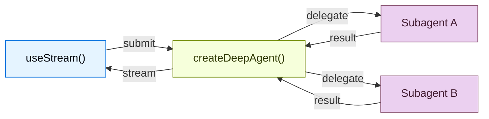

构建实时可视化深度智能体工作流的前端。 这些模式展示了如何渲染子智能体进度、任务规划、流式内容, 以及类 IDE 沙箱体验 `createDeepAgent`.

## 架构

深度智能体使用协调者-工作者架构。 主智能体规划任务并委派给专门的子智能体, 每个子智能体在隔离环境中运行。 On the frontend, `useStream` surfaces both the coordinator's messages and each subagent's streaming state.




```ts
import { createDeepAgent } from "deepagents";

const agent = createDeepAgent({
  tools: [getWeather],
  system: "You are a helpful assistant",
  subagents: [
    {
      name: "researcher",
      description: "Research assistant",
    },
  ],
});
```


On the frontend, connect with `useStream` the same way as with `createAgent`. Deep agent patterns use additional `useStream` features like `stream.subagents`, `stream.values.todos`, and `filterSubagentMessages` to render subagent-specific UIs.

```ts
import { useStream } from "@langchain/react";

function App() {
  const stream = useStream<typeof agent>({
    apiUrl: "http://localhost:2024",
    assistantId: "agent",
  });

  // Deep agent state beyond messages
  const todos = stream.values?.todos;
  const subagents = stream.subagents;
}
```

## Patterns

<CardGroup cols={3}>
  <Card title="Subagent streaming" icon="arrows-split" href="/oss/javascript/deepagents/frontend/subagent-streaming">
    Display specialist subagents with streaming content, progress tracking, and collapsible cards.
  </Card>
  <Card title="Todo list" icon="list-check" href="/oss/javascript/deepagents/frontend/todo-list">
    Track agent progress with a real-time todo list synced from agent state.
  </Card>
  <Card title="Sandbox" icon="code" href="/oss/javascript/deepagents/frontend/sandbox">
    Build an IDE-like UI with a file browser, code viewer, and diff panel backed by a sandbox.
  </Card>
</CardGroup>

## 相关资源 patterns

The [LangChain frontend patterns](/oss/javascript/langchain/frontend/overview), including
markdown messages, tool calling, and human-in-the-loop, all work with deep
agents too. Deep Agents are built on the same LangGraph runtime, so
`useStream` provides the same core API.

---

<div className="source-links">
<Callout icon="terminal-2">
    通过 MCP [连接这些文档](/use-these-docs)到 Claude、VSCode 等工具，获取实时答案。
</Callout>
<Callout icon="edit">
    [在 GitHub 上编辑此页面](https://github.com/langchain-ai/docs/edit/main/src/oss/deepagents/frontend/overview.mdx)或[提交问题](https://github.com/langchain-ai/docs/issues/new/choose)。
</Callout>
</div>
