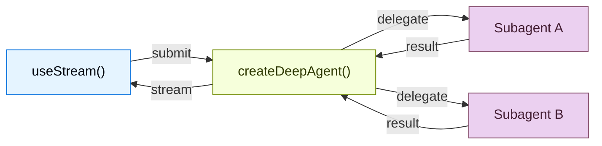

构建可实时可视化深度智能体工作流的前端。这些模式展示如何渲染子智能体进度、任务规划、流式输出内容，以及使用 `createDeepAgent` 创建的智能体的 IDE 风格沙箱体验。

## 架构

深度智能体使用协调器-工作器架构。主智能体规划任务并委派给专门的子智能体，每个子智能体在隔离环境中运行。在前端，`useStream` 同时展示协调器的消息和每个子智能体的流式输出状态。




```ts
import { createDeepAgent } from "deepagents";

const agent = createDeepAgent({
  tools: [getWeather],
  system: "You are a helpful assistant",
  subagents: [
    {
      name: "researcher",
      description: "Research assistant",
    },
  ],
});
```


在前端，使用 `useStream` 连接的方式与 `createAgent` 相同。深度智能体模式使用了 `useStream` 的额外功能，如 `stream.subagents`、`stream.values.todos` 和 `filterSubagentMessages`，用于渲染子智能体特定的 UI。

```ts
import { useStream } from "@langchain/react";

function App() {
  const stream = useStream<typeof agent>({
    apiUrl: "http://localhost:2024",
    assistantId: "agent",
  });

  // 消息之外的深度智能体状态
  const todos = stream.values?.todos;
  const subagents = stream.subagents;
}
```

## 模式

<CardGroup cols={3}>
  <Card title="子智能体流式输出" icon="arrows-split" href="/oss/javascript/deepagents/frontend/subagent-streaming">
    显示专业子智能体的流式输出内容、进度跟踪和可折叠卡片。
  </Card>
  <Card title="待办列表" icon="list-check" href="/oss/javascript/deepagents/frontend/todo-list">
    使用从智能体状态同步的实时待办列表跟踪智能体进度。
  </Card>
  <Card title="沙箱" icon="code" href="/oss/javascript/deepagents/frontend/sandbox">
    构建带有文件浏览器、代码查看器和差异面板的 IDE 风格 UI，由沙箱支持。
  </Card>
</CardGroup>

## 相关模式

[LangChain 前端模式](/oss/javascript/langchain/frontend/overview)（包括 markdown 消息、工具调用和人机协作）也适用于深度智能体。深度智能体构建在相同的 LangGraph 运行时之上，因此 `useStream` 提供相同的核心 API。

---

<div className="source-links">
<Callout icon="terminal-2">
    [通过 MCP 连接这些文档](/use-these-docs)到 Claude、VSCode 等以获取实时解答。
</Callout>
<Callout icon="edit">
    [在 GitHub 上编辑此页面](https://github.com/langchain-ai/docs/edit/main/src/oss/deepagents/frontend/overview.mdx) 或 [提交 issue](https://github.com/langchain-ai/docs/issues/new/choose)。
</Callout>
</div>
