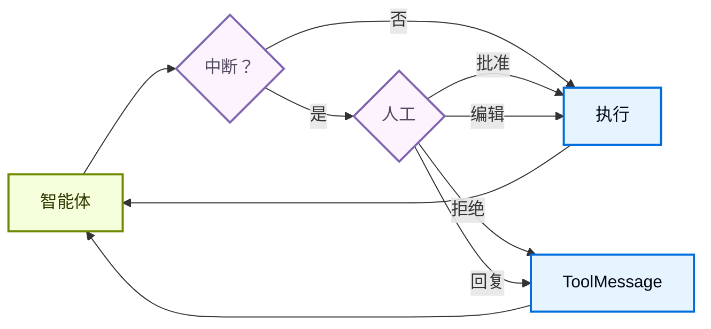

import HitlBasicConfigPy from '/snippets/hitl-basic-config-py.mdx';
import HitlBasicConfigJs from '/snippets/hitl-basic-config-js.mdx';

某些工具操作可能比较敏感，需要在执行前获得人工审批。深度智能体通过 LangGraph 的中断功能支持人机协作工作流。你可以使用 `interrupt_on` 参数配置哪些工具需要审批。



## 基本配置

`interrupt_on` 参数接受一个字典，将工具名称映射到中断配置。每个工具可以配置为：

- **`True`**：启用带默认行为的中断（允许批准、编辑、拒绝、回复）
- **`False`**：禁用此工具的中断
- **`{"allowed_decisions": [...]}`**：自定义配置，指定允许的决策类型


<HitlBasicConfigJs />


## 决策类型

`allowed_decisions` 列表控制人工在审查工具调用时可以采取的操作：

- **`"approve"`**：使用智能体提出的原始参数执行工具
- **`"edit"`**：在执行前修改工具参数
- **`"reject"`**：完全跳过执行此工具调用
- **`"respond"`**：将人工的消息直接作为工具结果返回，跳过执行——用于"询问用户"类型的工具

你可以自定义每个工具可用的决策：


```typescript
const interruptOn = {
  // 敏感操作：允许所有选项
  delete_file: { allowedDecisions: ["approve", "edit", "reject"] },

  // 中等风险：仅批准或拒绝
  write_file: { allowedDecisions: ["approve", "reject"] },

  // 必须批准（不允许拒绝）
  critical_operation: { allowedDecisions: ["approve"] },
};
```


## 处理中断

当中断被触发时，智能体暂停执行并返回控制权。检查结果中的中断并相应处理。


```typescript
import { v7 as uuid7 } from "uuid";
import { Command } from "@langchain/langgraph";

// 创建带 thread_id 的配置用于状态持久化
const config = { configurable: { thread_id: uuid7() } };

// 调用智能体
let result = await agent.invoke({
  messages: [{ role: "user", content: "Delete the file temp.txt" }],
}, config);

// 检查执行是否被中断
if (result.__interrupt__) {
  // 提取中断信息
  const interrupts = result.__interrupt__[0].value;
  const actionRequests = interrupts.actionRequests;
  const reviewConfigs = interrupts.reviewConfigs;

  // 创建从工具名称到审查配置的查找映射
  const configMap = Object.fromEntries(
    reviewConfigs.map((cfg) => [cfg.actionName, cfg])
  );

  // 向用户显示待处理的操作
  for (const action of actionRequests) {
    const reviewConfig = configMap[action.name];
    console.log(`工具: ${action.name}`);
    console.log(`参数: ${JSON.stringify(action.args)}`);
    console.log(`允许的决策: ${reviewConfig.allowedDecisions}`);
  }

  // 获取用户决策（按顺序对应每个 actionRequest）
  const decisions = [
    { type: "approve" }  // 用户批准了删除
  ];

  // 使用决策恢复执行
  result = await agent.invoke(
    new Command({ resume: { decisions } }),
    config  // 必须使用相同的 config！
  );
}

// 处理最终结果
console.log(result.messages[result.messages.length - 1].content);
```


## 多个工具调用

当智能体调用多个需要审批的工具时，所有中断会被批量合并为单个中断。你必须按顺序为每个提供决策。


```typescript
const config = { configurable: { thread_id: uuid7() } };

let result = await agent.invoke({
  messages: [{
    role: "user",
    content: "Delete temp.txt and send an email to admin@example.com"
  }]
}, config);

if (result.__interrupt__) {
  const interrupts = result.__interrupt__[0].value;
  const actionRequests = interrupts.actionRequests;

  // 两个工具需要审批
  console.assert(actionRequests.length === 2);

  // 按与 actionRequests 相同的顺序提供决策
  const decisions = [
    { type: "approve" },  // 第一个工具：delete_file
    { type: "reject" }    // 第二个工具：send_email
  ];

  result = await agent.invoke(
    new Command({ resume: { decisions } }),
    config
  );
}
```


## 编辑工具参数

当 `"edit"` 在允许的决策中时，你可以在执行前修改工具参数：


```typescript
if (result.__interrupt__) {
  const interrupts = result.__interrupt__[0].value;
  const actionRequest = interrupts.actionRequests[0];

  // 智能体的原始参数
  console.log(actionRequest.args);  // { to: "everyone@company.com", ... }

  // 用户决定编辑收件人
  const decisions = [{
    type: "edit",
    editedAction: {
      name: actionRequest.name,  // 必须包含工具名称
      args: { to: "team@company.com", subject: "...", body: "..." }
    }
  }];

  result = await agent.invoke(
    new Command({ resume: { decisions } }),
    config
  );
}
```


## 子智能体中断

使用子智能体时，你可以在[工具调用上](#interrupts-on-tool-calls)和[工具调用内](#interrupts-within-tool-calls)使用中断。

### 工具调用上的中断

每个子智能体可以有自己的 `interrupt_on` 配置，覆盖主智能体的设置：


```typescript
const agent = createDeepAgent({
  tools: [deleteFile, readFile],
  interruptOn: {
    delete_file: true,
    read_file: false,
  },
  subagents: [{
    name: "file-manager",
    description: "Manages file operations",
    systemPrompt: "You are a file management assistant.",
    tools: [deleteFile, readFile],
    interruptOn: {
      // 覆盖：在此子智能体中要求读取审批
      delete_file: true,
      read_file: true,  // 与主智能体不同！
    }
  }],
  checkpointer
});
```


当子智能体触发中断时，处理方式相同——检查结果中的 `interrupts` 并使用 `Command` 恢复。

### 工具调用内的中断

子智能体工具可以直接调用 `interrupt()` 来暂停执行并等待审批：


```typescript
import { createAgent, tool } from "langchain";
import { ChatOpenAI } from "@langchain/openai";
import { HumanMessage } from "@langchain/core/messages";
import { MemorySaver, Command, interrupt } from "@langchain/langgraph";
import { createDeepAgent } from "deepagents";
import { z } from "zod";

const requestApproval = tool(
  async ({ actionDescription }: { actionDescription: string }) => {
    const approval = interrupt({
      type: "approval_request",
      action: actionDescription,
      message: `Please approve or reject: ${actionDescription}`,
    }) as { approved?: boolean; reason?: string };

    if (approval.approved) {
      return `Action '${actionDescription}' was APPROVED. Proceeding...`;
    } else {
      return `Action '${actionDescription}' was REJECTED. Reason: ${
        approval.reason || "No reason provided"
      }`;
    }
  },
  {
    name: "request_approval",
    description: "Request human approval before proceeding with an action.",
    schema: z.object({
      actionDescription: z
        .string()
        .describe("The action that requires approval"),
    }),
  }
);

async function main() {
  const checkpointer = new MemorySaver();
  const model = new ChatOpenAI({
    model: "gpt-4o-mini",
    maxTokens: 4096,
  });

  const compiledSubagent = createAgent({
    model: model,
    tools: [requestApproval],
    name: "approval-agent",
  });

  const parentAgent = await createDeepAgent({
    checkpointer: checkpointer,
    subagents: [
      {
        name: "approval-agent",
        description: "An agent that can request approvals",
        runnable: compiledSubagent as any,
      },
    ],
  });

  const threadId = "test_interrupt_directly";
  const config = { configurable: { thread_id: threadId } };

  console.log("Invoking agent - sub-agent will use request_approval tool...");

  let result = await parentAgent.invoke(
    {
      messages: [
        new HumanMessage({
          content:
            "Use the task tool to launch the approval-agent sub-agent. " +
            "Tell it to use the request_approval tool to request approval for 'deploying to production'.",
        }),
      ],
    },
    config
  );

  if (result.__interrupt__) {
    const interruptValue = result.__interrupt__[0].value as {
      type?: string;
      action?: string;
      message?: string;
    };
    console.log("\nInterrupt received!");
    console.log(`  Type: ${interruptValue.type}`);
    console.log(`  Action: ${interruptValue.action}`);
    console.log(`  Message: ${interruptValue.message}`);

    console.log("\nResuming with Command(resume={'approved': true})...");
    const result2 = await parentAgent.invoke(
      new Command({ resume: { approved: true } }),
      config
    );

    if (!result2.__interrupt__) {
      console.log("\nExecution completed!");
      const toolMsgs = result2.messages?.filter((m) => m.type === "tool") || [];
      if (toolMsgs.length > 0) {
        const lastToolMsg = toolMsgs[toolMsgs.length - 1];
        console.log(`  Tool result: ${lastToolMsg.content}`);
      }
    } else {
      console.log("\nAnother interrupt occurred");
    }
  } else {
    console.log(
      "\n  No interrupt - the model may not have called request_approval"
    );
  }
}

main().catch(console.error);
```

运行时，产生以下输出：

```typescript
Invoking agent - sub-agent will use request_approval tool...

Interrupt received!
  Type: approval_request
  Action: deploying to production
  Message: Please approve or reject: deploying to production

Resuming with Command(resume={'approved': true})...

Execution completed!
  Tool result: Approval for "deploying to production" has been granted. You can proceed with the deployment.
```


## 最佳实践

### 始终使用检查点器

人机协作需要检查点器在中断和恢复之间持久化智能体状态：


### 使用相同的线程 ID

恢复时，你必须使用具有相同 `thread_id` 的相同配置：


### 决策顺序与操作匹配

决策列表必须与 `action_requests` 的顺序匹配：


### 根据风险等级定制配置

根据风险等级为不同工具配置不同选项：

---

<div className="source-links">
<Callout icon="terminal-2">
    [连接这些文档](/use-these-docs)到 Claude、VSCode 等工具，通过 MCP 获取实时解答。
</Callout>
<Callout icon="edit">
    [在 GitHub 上编辑此页面](https://github.com/langchain-ai/docs/edit/main/src/oss/deepagents/human-in-the-loop.mdx)或[提交问题](https://github.com/langchain-ai/docs/issues/new/choose)。
</Callout>
</div>
