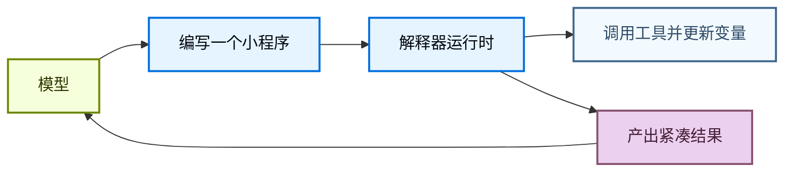
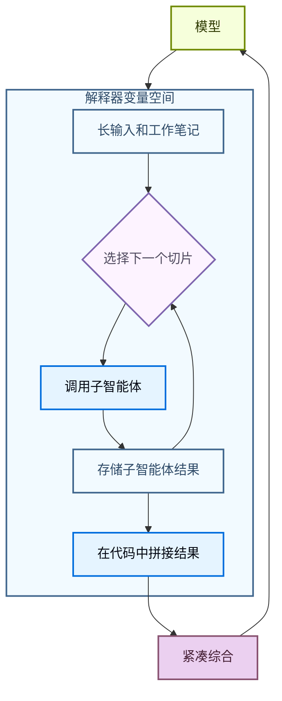

解释器为智能体提供了一个可编程工作区，可以在其中探索数据、协调工具调用，并将中间工作保留在模型上下文之外。智能体编写代码来表达其意图，然后**内存中**的运行时执行该代码并返回相关结果。

[沙箱](/oss/javascript/deepagents/sandboxes)是一种以代码为先的方式来作用于环境（例如运行命令、安装依赖和编辑文件），而解释器是一种以代码为先的方式来作用于智能体循环内部：组合工具、保持状态，以及决定什么信息应该返回给模型。

<Warning>
    解释器是实验性的。API 和生命周期行为可能在版本之间发生变化。
</Warning>


## 何时使用解释器

大多数智能体工作在模型推理和工具执行之间交替。这对简单操作有效，但当智能体需要组合许多步骤、对结构化数据进行推理或管理中间状态时就变得笨拙了。

解释器为智能体提供了一个运行时来完成这项工作。智能体可以编写一个小程序来运行控制流、调用允许列表中的工具、存储变量并向模型返回紧凑的结果，而不是让模型每次一个工具调用地选择下一步。

在以下情况使用解释器：

- 用代码组合多个工具调用，包括循环、分支、重试和并发。
- 从代码中协调子智能体，将工作拆分为聚焦的调用、存储结果并将结果拼接成最终综合。
- 将中间值保存在运行时状态中，而不是将每个临时结果发送回模型上下文。
- 确定性地转换结构化数据，例如排序、分组、解析、验证、评分或聚合。
- 探索大型变量空间并仅向模型返回选定的证据、摘要或输出。



这通过在 [**QuickJS**](https://github.com/quickjs-ng/quickjs) 上运行代码来实现，QuickJS 是一个为嵌入式执行设计的轻量级 JavaScript 运行时。该运行时为智能体提供了一个评估代码的地方，默认不暴露宿主文件系统、网络、shell、包或时钟 API。

QuickJS 是解释器代码的执行边界。显式桥接（如程序化工具调用）决定代码可以访问哪些能力。

## 选择正确的执行路径

| 需求 | 使用 |
| --- | --- |
| 一两个简单的外部调用 | 普通工具调用 |
| 一个循环、分支、重试或聚合结果的小程序 | 解释器 |
| 许多应该从代码运行的选定工具调用 | 带程序化工具调用的解释器 |
| 跨线程使用的可复用辅助工具 | 带[解释器技能](/oss/javascript/deepagents/skills#use-interpreter-skills)的解释器 |
| Shell 命令、包安装、测试或完整的操作系统文件系统访问 | [沙箱](/oss/javascript/deepagents/sandboxes) |

## 向智能体添加解释器

安装 QuickJS 中间件包，然后在创建智能体时添加中间件。


<CodeGroup>
```bash npm
npm install deepagents @langchain/quickjs
```

```bash pnpm
pnpm add deepagents @langchain/quickjs
```

```bash yarn
yarn add deepagents @langchain/quickjs
```
</CodeGroup>

```typescript
import { createDeepAgent } from "deepagents";
import { createCodeInterpreterMiddleware } from "@langchain/quickjs";

const agent = createDeepAgent({
  model: "openai:gpt-5.4",
  middleware: [createCodeInterpreterMiddleware()],
});
```


## 在解释器中运行代码

中间件向智能体添加了一个 `eval` 工具。该工具在持久化上下文中运行 TypeScript，捕获 `console.log`，并返回最后一个表达式的结果。

智能体可以编写如下代码：

```javascript
const rows = [
  { team: "alpha", score: 8 },
  { team: "beta", score: 13 },
  { team: "alpha", score: 21 },
];

const totals = rows.reduce((acc, row) => {
  acc[row.team] = (acc[row.team] ?? 0) + row.score;
  console.log(`${row.team} score: ${acc[row.team]}`)
  return acc;
}, {});

totals;
```


## 程序化工具调用

程序化工具调用（PTC）将选定的智能体工具暴露在解释器的全局 `tools` 命名空间下。智能体可以编写代码在循环、分支、重试或并行批次中调用工具，而不是让模型发出一个工具调用、等待结果，然后决定下一个调用。

当中间工具结果仅作为下一步的输入时，这很有用。解释器可以在任何内容返回到模型上下文之前处理、过滤或聚合这些结果，这可以使多工具/多步骤工作流更加 Token 高效。

PTC 在深度智能体中是模型无关的。它由中间件实现，而不是提供商特定的代码执行或工具调用 API。

### 工作原理

1. 你用 `ptc` 允许列表选择解释器可以调用哪些工具。
2. 中间件将这些工具作为 `tools` 下的异步 JavaScript 函数暴露。
3. 智能体编写使用 `await` 调用这些函数的解释器代码。
4. 解释器运行工具桥接，接收工具结果并继续执行代码。
5. 模型接收最终的解释器输出，而不是每个中间值。

每个允许列表中的工具变成一个异步函数。工具名称被转换为驼峰命名法，但输入对象仍遵循工具的 schema。例如，名为 `web_search` 的工具变为 `tools.webSearch(...)`：

```typescript
const result: string = await tools.webSearch({
  query: "deepagents interpreters",
});
```

### 有用的模式

| **模式** | **解释器可以做什么** |
| --- | --- |
| 批处理 | 循环遍历多个输入并为每个调用工具。 |
| 并行工作 | 对独立调用使用 `Promise.all`。 |
| 条件逻辑 | 根据早期结果选择下一个工具调用。 |
| 提前终止 | 一旦满足成功条件就停止调用工具。 |
| 数据过滤 | 仅向模型返回相关的行、片段、错误或摘要。 |
| 递归编排 | 重复调用 `task`，然后在代码中组合子智能体结果。 |

### 启用 PTC

使用显式允许列表启用 PTC：


```typescript
import { createDeepAgent } from "deepagents";
import { createCodeInterpreterMiddleware } from "@langchain/quickjs";

const agent = createDeepAgent({
  model: "openai:gpt-5.4",
  middleware: [createCodeInterpreterMiddleware({ ptc: ["task"] })],
});
```


启用 PTC 后，智能体可以从解释器代码调用允许列表中的工具。以下示例并行启动多个子智能体并在返回模型之前组合其最终报告：

```javascript
const topics = ["retrieval", "memory", "evaluation"];

const reports = await Promise.all(
  topics.map((topic) =>
    tools.task({
      description: `Research ${topic} in Deep Agents and return three concise findings.`,
      subagent_type: "general-purpose",
    }),
  ),
);

reports.join("\n\n");
```

因为这是代码，智能体也可以在本地处理失败：

```javascript
try {
  const report = await tools.task({
    description: "Check the migration notes and return breaking changes.",
    subagent_type: "general-purpose",
  });
  console.log(report);
} catch (error) {
  console.log(`Subagent failed: ${error.message}`);
}
```

<Warning>
    PTC 调用目前通过解释器桥接执行，不经过正常的工具调用路径。因此，`interrupt_on` 审批工作流不会针对每个 PTC 调用的工具执行。
</Warning>

## 递归语言模型

递归语言模型使用解释器作为分解的工作区。模型将大型输入或工作集保存在运行时变量中，编写代码检查和拆分它，对较小的片段调用子智能体或其他模型工具，然后在代码中将返回的结果拼接在一起。

这将变量空间与智能体的上下文分离。变量空间是存储在解释器中的信息，智能体的上下文是模型在下一次模型调用中实际处理的内容。模型可以决定哪些片段成为子智能体任务，哪些结果需要再次处理，以及什么最终综合应该返回到主对话。



有关此模式的背景，请参阅[递归语言模型论文](https://arxiv.org/abs/2512.24601)。

在深度智能体中，递归调用通常是通过程序化工具调用暴露的 `task` 工具。解释器可以在多个切片上调用子智能体，组合其答案，并返回单个综合结果：

```javascript
const candidates = notes
  .filter((note) => note.includes("migration"))
  .slice(0, 5);

const riskReports = await Promise.all(
  candidates.map((note) =>
    tools.task({
      description: `Analyze this migration note for release risk. Return risks, affected users, and recommended follow-up:\n\n${note}`,
      subagent_type: "general-purpose",
    }),
  ),
);

const releaseSummary = riskReports
  .map((report, index) => `## Candidate ${index + 1}\n${report}`)
  .join("\n\n");

releaseSummary;
```

## 解释器技能

解释器技能是将代码模块暴露给解释器的[技能](/oss/javascript/deepagents/skills)。当与解释器中间件一起配置时，智能体可以从代码中导入这些模块并将它们用于确定性的辅助逻辑。

解释器技能在智能体需要用于结构化数据工作流的可复用辅助工具时很有用，例如排序、分组、评分、解析、验证或聚合数据。设置详情请参阅[解释器技能](/oss/javascript/deepagents/skills#use-interpreter-skills)。


## 安全性和限制

解释器使用 QuickJS 运行不受信任的 JavaScript，具有严格的默认隔离。将其视为受限的解释器运行时，而不是完整的生产沙箱后端。

你通过 PTC 暴露的每个工具都是解释器代码可以使用的外部能力。将 PTC 允许列表视为权限边界：仅暴露智能体需要的工具，避免桥接可以访问敏感系统、花费金钱、修改数据或调用不受限制的网络的广泛工具，除非该行为是有意的。


| 能力 | 默认可用 | 如何暴露 |
| --- | --- | --- |
| JavaScript 执行 | 是 | 添加解释器中间件 |
| 顶层 `await` | 是 | 在解释器代码中使用 Promise |
| `console.log` 捕获 | 是 | 使用 `captureConsole: false` 禁用 |
| 智能体工具 | 否 | 添加 PTC 允许列表 |
| 解释器技能模块 | 否 | 添加 `module` 条目并配置 `skills_backend` 或 `skillsBackend` |
| 文件系统访问 | 否 | 通过 PTC 允许列表添加[内置文件系统工具](/oss/javascript/deepagents/harness#virtual-filesystem-access) |
| 网络访问 | 否 | 通过 PTC 暴露特定的网络工具 |
| 挂钟或日期时间访问 | 否 | 如果需要，暴露显式的时间工具 |
| Shell 命令、包安装、测试、操作系统级执行 | 否 | 使用[沙箱后端](/oss/javascript/deepagents/sandboxes) |


## 中间件选项


`createCodeInterpreterMiddleware` 接受以下选项：

| 选项 | 默认值 | 用途 |
| --- | --- | --- |
| `ptc` | 省略 | PTC 允许列表：工具名称或 `StructuredToolInterface` 实例数组。 |
| `memoryLimitBytes` | `64 * 1024 * 1024` <br/>(64 MB) | QuickJS 内存限制（字节）。 |
| `maxStackSizeBytes` | `320 * 1024` | QuickJS 栈大小限制（字节）。 |
| `executionTimeoutMs` | `5000` | 每次 eval 的超时时间（毫秒）。负值禁用超时。 |
| `systemPrompt` | `null` | 覆盖内置解释器系统提示。 |
| `skillsBackend` | 省略 | 用于解析解释器技能模块的后端。 |
| `maxPtcCalls` | `256` | 每次 eval 的最大 `tools.*` 调用次数。仅在受信任环境中使用 `null`。 |
| `maxResultChars` | `4000` | 从控制台输出、结果和错误字符串中保留的最大字符数。 |
| `toolName` | `"eval"` | 暴露给模型的解释器工具名称。 |
| `captureConsole` | `true` | 是否捕获 `console.log`、`console.warn` 和 `console.error` 输出。 |

---

<div className="source-links">
<Callout icon="terminal-2">
    [连接这些文档](/use-these-docs)到 Claude、VSCode 等工具，通过 MCP 获取实时解答。
</Callout>
<Callout icon="edit">
    [在 GitHub 上编辑此页面](https://github.com/langchain-ai/docs/edit/main/src/oss/deepagents/interpreters.mdx)或[提交问题](https://github.com/langchain-ai/docs/issues/new/choose)。
</Callout>
</div>
