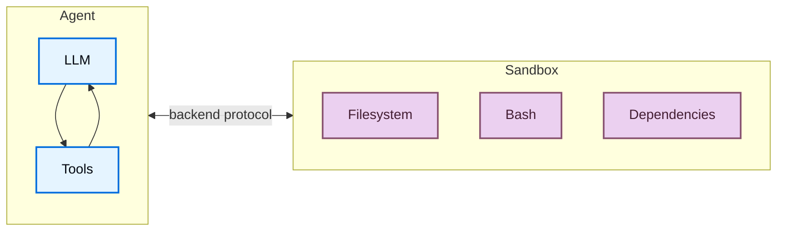
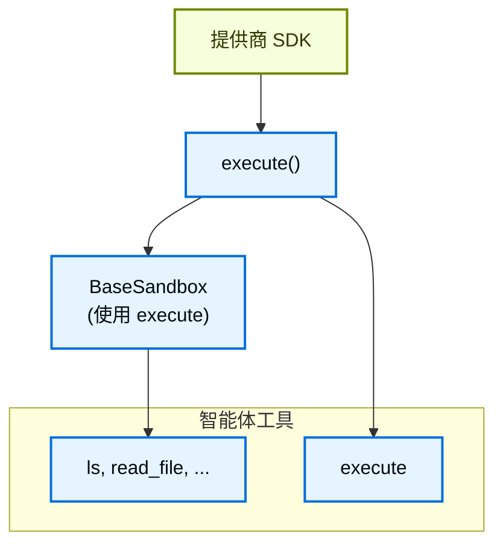
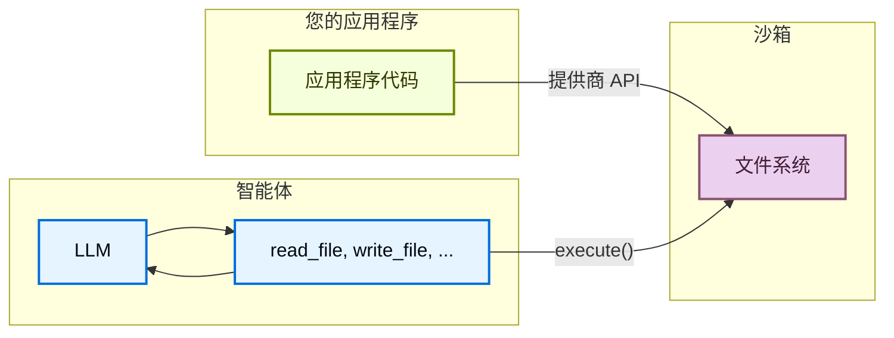

import SandboxBasicJs from '/snippets/deepagents-sandbox-basic-js.mdx';
import SandboxBasicPy from '/snippets/deepagents-sandbox-basic-py.mdx';
import SandboxLifecycleFactoryAssistantPy from '/snippets/deepagents-sandbox-lifecycle-factory-assistant-py.mdx';
import SandboxLifecycleFactoryAssistantTs from '/snippets/deepagents-sandbox-lifecycle-factory-assistant-ts.mdx';
import SandboxLifecycleFactoryThreadPy from '/snippets/deepagents-sandbox-lifecycle-factory-thread-py.mdx';
import SandboxLifecycleFactoryThreadTs from '/snippets/deepagents-sandbox-lifecycle-factory-thread-ts.mdx';

智能体会生成代码、与文件系统交互并运行 shell 命令。由于我们无法预测智能体可能做什么，因此其运行环境的隔离非常重要，这样它就无法访问凭证、文件或网络。沙箱通过在智能体的执行环境和您的主机系统之间创建边界来提供这种隔离。

在深度智能体中，**沙箱是[后端](/oss/javascript/deepagents/backends)**，定义了智能体运行的环境。与其他后端（State、Filesystem、Store）仅暴露文件操作不同，沙箱后端还为智能体提供了用于运行 shell 命令的 `execute` 工具。当您配置沙箱后端时，智能体会获得：

- 所有标准文件系统工具（`ls`、`read_file`、`write_file`、`edit_file`、`glob`、`grep`）
- 用于在沙箱中运行任意 shell 命令的 `execute` 工具
- 保护您主机系统的安全边界



## 为什么使用沙箱？

沙箱用于安全。它们让智能体可以执行任意代码、访问文件和使用网络，而不会危及您的凭证、本地文件或主机系统。当智能体自主运行时，这种隔离至关重要。

沙箱特别适用于：

- 编程智能体：自主运行的智能体可以使用 shell、git、克隆仓库（许多提供商提供原生 git API，例如 [Daytona 的 git 操作](https://www.daytona.io/docs/en/git-operations/)），以及运行 Docker-in-Docker 用于构建和测试流水线
- 数据分析智能体——在安全隔离的环境中加载文件、安装数据分析库（pandas、numpy 等）、运行统计计算，并创建 PowerPoint 演示文稿等输出

<Tip>
    **使用深度智能体 CLI？** CLI 通过 `--sandbox` 标志内置了沙箱支持。参见[使用远程沙箱](/oss/javascript/deepagents/cli/remote-sandboxes)了解 CLI 特定的设置、标志（`--sandbox-id`、`--sandbox-setup`）和示例。
</Tip>

## 基本用法

这些示例假设您已使用提供商的 SDK 创建了沙箱/devbox 并设置了凭证。有关注册、身份验证和提供商特定的生命周期详细信息，请参见[可用提供商](#available-providers)。

<SandboxBasicJs />


## 可用提供商


<Note>
技能需要 `deepagents>=1.7.0`。
</Note>

<div className="grid grid-cols-1 md:grid-cols-2 gap-3">
    <a href="/oss/javascript/integrations/providers/modal" className="flex items-center justify-center gap-1.5 p-2 rounded-lg border border-gray-200 dark:border-gray-700 hover:border-gray-300 dark:hover:border-gray-600 no-underline">
        
        
        <span className="font-semibold">Modal</span>
    </a>

    <a href="/oss/javascript/integrations/providers/daytona" className="flex items-center justify-center gap-1.5 p-2 rounded-lg border border-gray-200 dark:border-gray-700 hover:border-gray-300 dark:hover:border-gray-600 no-underline">
        
        
        <span className="font-semibold">Daytona</span>
    </a>

    <a href="/oss/javascript/integrations/providers/deno" className="flex items-center justify-center gap-1.5 p-2 rounded-lg border border-gray-200 dark:border-gray-700 hover:border-gray-300 dark:hover:border-gray-600 no-underline">
        
        
        <span className="font-semibold">Deno</span>
    </a>

    <a href="/oss/javascript/integrations/providers/node-vfs" className="flex items-center justify-center gap-1.5 p-2 rounded-lg border border-gray-200 dark:border-gray-700 hover:border-gray-300 dark:hover:border-gray-600 no-underline">
        
        
        <span className="font-semibold">Node VFS</span>
    </a>

    <a href="/langsmith/sandboxes" className="flex items-center justify-center gap-1.5 p-2 rounded-lg border border-gray-200 dark:border-gray-700 hover:border-gray-300 dark:hover:border-gray-600 no-underline">
        
        <span className="font-semibold">LangSmith</span>
    </a>
</div>


没有看到您的提供商？您可以实现自己的沙箱后端。参见[贡献沙箱集成](/oss/javascript/contributing/integrations-langchain)。

## 生命周期和作用域

大多数应用程序选择每个[线程](/langsmith/use-threads)一个沙箱（线程作用域）或同一[助手](/langsmith/assistants)的所有线程共享一个沙箱（助手作用域）。

沙箱消耗资源并产生费用直到关闭。确保不再使用时关闭沙箱。

完整的生命周期表、异步[图工厂](/langsmith/graph-rebuild)说明、TTL 行为、LangGraph 部署接线和客户端示例，请参见"走向生产环境"中的[沙箱生命周期](/oss/javascript/deepagents/going-to-production#lifecycle)。

### 线程作用域（默认）

每个对话获得自己的沙箱。第一次运行时创建；同一线程的后续轮次复用它。当线程结束或沙箱 TTL 过期时，环境消失。使用提供商标签或元数据存储映射（如下面的示例），以便每次运行都解析到相同的沙箱。

<Tip>
当用户可能在空闲后返回时，在沙箱上配置 TTL，以便提供商自动删除或归档空闲环境。
</Tip>

<Tabs>
    <Tab title="Python">

<SandboxLifecycleFactoryThreadPy />

    </Tab>
    <Tab title="TypeScript">

<SandboxLifecycleFactoryThreadTs />

    </Tab>
</Tabs>

### 助手作用域

同一助手的所有线程复用一个沙箱。文件、已安装的包和克隆的仓库跨对话持久化。

<Warning>
助手作用域的沙箱会随时间累积沙箱内状态。在沙箱提供商处配置 TTL、使用快照定期重置，或实现清理逻辑以防止磁盘和内存无限增长。
</Warning>

<Tabs>
    <Tab title="Python">

<SandboxLifecycleFactoryAssistantPy />

    </Tab>
    <Tab title="TypeScript">

<SandboxLifecycleFactoryAssistantTs />

    </Tab>
</Tabs>

对于在图工厂外的手动创建、执行和拆除，请参见[基本用法](#basic-usage)和[沙箱集成](/oss/javascript/integrations/sandboxes)了解提供商特定的 API。

## 集成模式

根据智能体运行的位置，有两种将智能体与沙箱集成的架构模式。

### 智能体在沙箱中模式

智能体在沙箱内运行，您通过网络与其通信。您构建一个预装了智能体框架的 Docker 或 VM 镜像，在沙箱内运行它，然后从外部连接发送消息。

优势：

- 紧密模拟本地开发
- 智能体与环境紧密耦合

权衡：

- API 密钥必须存在于沙箱内（安全风险）
- 更新需要重建镜像
- 需要通信基础设施（WebSocket 或 HTTP 层）

要在沙箱中运行智能体，构建一个镜像并在其上安装 deepagents。

```dockerfile
FROM python:3.11
RUN pip install deepagents-cli
```

然后在沙箱内运行智能体。要使用沙箱内的智能体，您必须添加额外的基础设施来处理应用程序和沙箱内智能体之间的通信。

### 沙箱即工具模式

智能体在您的机器或服务器上运行。当需要执行代码时，它调用沙箱工具（如 `execute`、`read_file` 或 `write_file`），这些工具调用提供商的 API 在远程沙箱中运行操作。

优势：

- 无需重建镜像即可立即更新智能体代码
- 智能体状态和执行之间更清晰的分离
    - API 密钥保留在沙箱之外
    - 沙箱故障不会丢失智能体状态
    - 可以在多个沙箱中并行运行任务的选项
- 仅为执行时间付费

权衡：

- 每次执行调用的网络延迟


```typescript Example
import "dotenv/config";
import { DaytonaSandbox } from "@langchain/daytona";
import { createDeepAgent } from "deepagents";

// 也可以使用 E2B、Runloop、Modal
const sandbox = await DaytonaSandbox.create();

const agent = createDeepAgent({
  backend: sandbox,
  systemPrompt:
    "You are a coding assistant with sandbox access. You can create and run code in the sandbox.",
});

try {
  const result = await agent.invoke({
    messages: [
      {
        role: "user",
        content: "Create a hello world Python script and run it",
      },
    ],
  });
  const lastMessage = result.messages[result.messages.length - 1];
  console.log(
    typeof lastMessage.content === "string"
      ? lastMessage.content
      : String(lastMessage.content),
  );
} catch (err) {
  // 可选：在异常时主动删除沙箱
  await sandbox.close();
  throw err;
}
```


本文档中的示例使用沙箱即工具模式。当您的提供商的 SDK 处理通信层且您希望生产环境模拟本地开发时，选择智能体在沙箱中模式。当您需要快速迭代智能体逻辑、将 API 密钥保留在沙箱外，或偏好更清晰的关注点分离时，选择沙箱即工具模式。

## 沙箱工作原理

### 隔离边界

所有沙箱提供商都保护您的主机系统免受智能体的文件系统和 shell 操作的影响。智能体无法读取您的本地文件、访问您机器上的环境变量或干扰其他进程。然而，沙箱本身**不能**防止：

- **上下文注入**：控制智能体部分输入的攻击者可以指示它在沙箱内运行任意命令。沙箱是隔离的，但智能体在其中拥有完全控制。
- **网络泄露**：除非网络访问被阻止，否则被上下文注入的智能体可以通过 HTTP 或 DNS 从沙箱发送数据。一些提供商支持阻止网络访问（例如 Modal 上的 `blockNetwork: true`）。

参见[安全注意事项](#security-considerations)了解如何处理密钥和减轻这些风险。

### `execute` 方法

沙箱后端有一个简单的架构：提供商必须实现的唯一方法是 `execute()`，它运行 shell 命令并返回其输出。所有其他文件系统操作（`read`、`write`、`edit`、`ls`、`glob`、`grep`）都由 [`BaseSandbox`](https://reference.langchain.com/javascript/deepagents/backends/BaseSandbox) 基类在 `execute()` 之上构建，它构造脚本并通过 `execute()` 在沙箱内运行它们。



这种设计意味着：
- **添加新提供商很简单。** 实现 `execute()` ——基类处理其他一切。
- **`execute` 工具是有条件可用的。** 在每次模型调用时，harness 检查后端是否实现了 [`SandboxBackendProtocol`](https://reference.langchain.com/javascript/deepagents/backends/SandboxBackendProtocol)。如果没有，工具被过滤掉，智能体永远看不到它。

当智能体调用 `execute` 工具时，它提供一个 `command` 字符串，并获得组合的 stdout/stderr、退出代码，以及输出过大时的截断通知。

您也可以在应用程序代码中直接调用后端 `execute()` 方法。


例如：

```
4
[Command succeeded with exit code 0]
```

```
bash: foobar: command not found
[Command failed with exit code 127]
```

如果命令产生非常大的输出，结果会自动保存到文件，并指示智能体使用 `read_file` 增量访问。这可以防止上下文窗口溢出。

### 两个文件访问层面

文件进出沙箱有两种截然不同的方式，了解何时使用哪种很重要：

**智能体文件系统工具**：`read_file`、`write_file`、`edit_file`、`ls`、`glob`、`grep` 和 `execute` 是大语言模型(LLM)在执行过程中调用的工具。这些通过沙箱内的 `execute()` 进行。智能体使用它们来读取代码、写入文件和运行命令。

**文件传输 API**：您的应用程序代码调用的 `uploadFiles()` 和 `downloadFiles()` 方法。这些使用提供商的原生文件传输 API（而不是 shell 命令），旨在在您的主机环境和沙箱之间移动文件。用途：
- 在智能体运行前**初始化沙箱**的源代码、配置或数据
- 智能体完成后**检索工件**（生成的代码、构建输出、报告）
- **预填充依赖**，供智能体使用



## 使用文件

### 初始化沙箱

使用 `uploadFiles()` 在智能体运行前填充沙箱。文件内容以 `Uint8Array` 形式提供：

```typescript
const encoder = new TextEncoder();
const responses = await sandbox.uploadFiles([
  ["src/index.js", encoder.encode("console.log('Hello')")],
  ["package.json", encoder.encode('{"name": "my-app"}')],
]);

// 每个响应指示成功或失败
for (const res of responses) {
  if (res.error) {
    console.error(`Failed to upload ${res.path}: ${res.error}`);
  }
}
```

### 检索工件

使用 `downloadFiles()` 在智能体完成后从沙箱检索文件：

```typescript
const results = await sandbox.downloadFiles(["src/index.js", "output.txt"]);

const decoder = new TextDecoder();
for (const result of results) {
  if (result.content) {
    console.log(`${result.path}: ${decoder.decode(result.content)}`);
  } else {
    console.error(`Failed to download ${result.path}: ${result.error}`);
  }
}
```

<Note>
在沙箱内，智能体使用自己的文件系统工具（`read_file`、`write_file`），而不是 `uploadFiles` 或 `downloadFiles`。这些方法是供您的应用程序代码在主机和沙箱之间移动文件的。
</Note>


## 安全注意事项

沙箱将代码执行与主机系统隔离，但不能防止**上下文注入**。控制智能体部分输入的攻击者可以指示它读取文件、运行命令或从沙箱内泄露数据。这使得沙箱内的凭证特别危险。

<Warning>
**永远不要将密钥放入沙箱。** 注入到沙箱中的 API 密钥、Token、数据库凭证和其他密钥（通过环境变量、挂载文件或 `secrets` 选项）可以被上下文注入的智能体读取和泄露。即使是短期或范围限定的凭证也是如此——如果智能体可以访问它们，攻击者也可以。
</Warning>

### 安全处理密钥

如果您的智能体需要调用经过身份验证的 API 或访问受保护的资源，有两个选项：

1. **将密钥保留在沙箱外的工具中。** 定义在主机环境（而非沙箱内）运行的工具，在那里处理身份验证。智能体按名称调用这些工具，但永远看不到凭证。这是推荐的方法。

2. **使用注入凭证的网络代理。** 一些沙箱提供商支持拦截沙箱发出的 HTTP 请求并在转发前附加凭证（例如 `Authorization` 头）的代理。智能体永远看不到密钥——它只是向 URL 发出普通请求。这种方法尚未在所有提供商中广泛可用。

<Warning>
如果您必须将密钥注入沙箱（不推荐），请采取以下预防措施：

- 为**所有**工具调用启用[人机协作](/oss/javascript/deepagents/human-in-the-loop)审批，而不仅仅是敏感操作
- 阻止或限制沙箱的网络访问以限制泄露路径
- 使用尽可能窄的凭证范围和尽可能短的生命周期
- 监控沙箱网络流量以检测意外的出站请求

即使有这些保障措施，这仍然是不安全的变通方法。足够巧妙的上下文注入攻击可以绕过输出过滤和人机协作审查。
</Warning>

### 通用最佳实践

- 在应用程序中采取行动前审查沙箱输出
- 不需要时阻止沙箱网络访问
- 使用[中间件](/oss/javascript/langchain/middleware)过滤或编辑工具输出中的敏感模式
- 将沙箱中产生的一切视为不受信任的输入

---

<div className="source-links">
<Callout icon="terminal-2">
    [通过 MCP 连接这些文档](/use-these-docs)到 Claude、VSCode 等以获取实时解答。
</Callout>
<Callout icon="edit">
    [在 GitHub 上编辑此页面](https://github.com/langchain-ai/docs/edit/main/src/oss/deepagents/sandboxes.mdx) 或 [提交 issue](https://github.com/langchain-ai/docs/issues/new/choose)。
</Callout>
</div>
