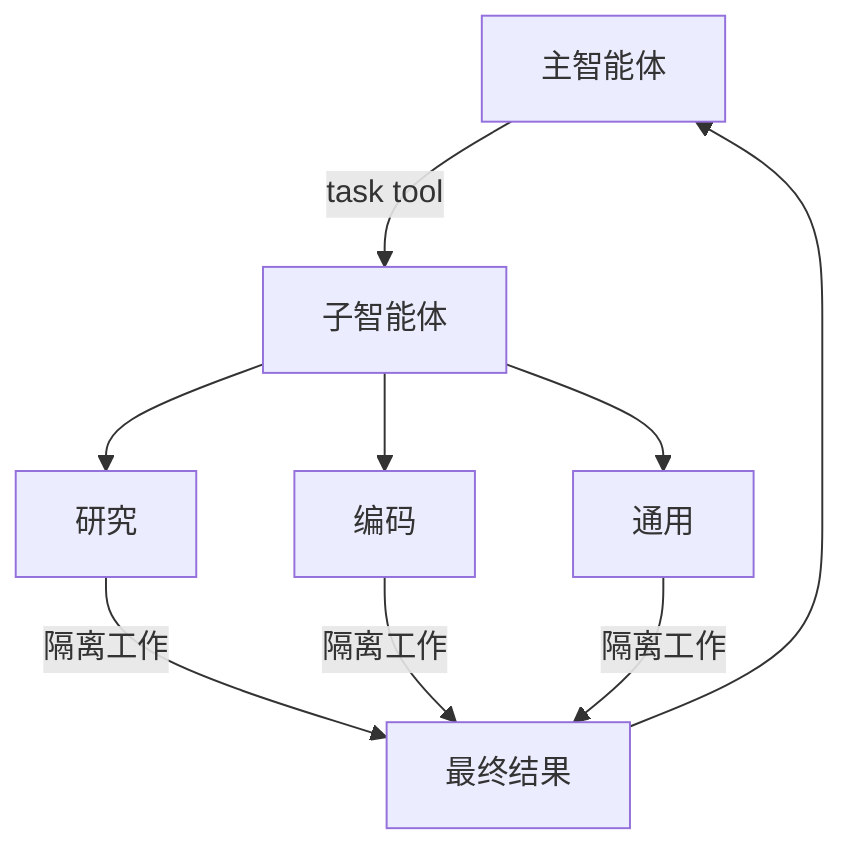

import SubagentBasicPy from '/snippets/subagent-basic-py.mdx';
import SubagentBasicJs from '/snippets/subagent-basic-js.mdx';

深度智能体可以创建子智能体来委派工作。您可以在 `subagents` 参数中指定自定义子智能体。子智能体适用于[上下文隔离](https://www.dbreunig.com/2025/06/26/how-to-fix-your-context.html#context-quarantine)（保持主智能体的上下文整洁）和提供专业化指令。

本页涵盖**同步**子智能体，即主管阻塞直到子智能体完成。对于长时间运行的任务、并行工作流，或需要中途控制和取消的场景，请参见[异步子智能体](/oss/javascript/deepagents/async-subagents)。



## 为什么使用子智能体？

子智能体解决**上下文膨胀问题**。当智能体使用产生大量输出的工具（网络搜索、文件读取、数据库查询）时，上下文窗口会快速被中间结果填满。子智能体隔离这些详细工作——主智能体只接收最终结果，而不是产生它的数十个工具调用。

**何时使用子智能体：**
- 多步骤任务会使主智能体的上下文变得混乱
- 需要自定义指令或工具的专业领域
- 需要不同模型能力的任务
- 当您希望让主智能体专注于高层协调时

**何时不使用子智能体：**
- 简单的单步骤任务
- 当您需要保持中间上下文时
- 当开销超过收益时

## 配置

`subagents` 应是字典列表或 [`CompiledSubAgent`](https://reference.langchain.com/javascript/deepagents/middleware/CompiledSubAgent) 对象列表。有两种类型：

### 默认子智能体

深度智能体自动添加一个同步 `general-purpose` 子智能体，除非您已提供同名的同步子智能体。

- 要替换它，传入您自己名为 `general-purpose` 的子智能体。
- 要重命名或重新提示自动添加的版本，在活动的[harness 配置文件](/oss/javascript/deepagents/profiles#harness-profiles)上设置 `general_purpose_subagent=GeneralPurposeSubagentProfile(...)`。
- 要禁用它，请参见下方[不使用子智能体运行](#running-without-subagents)。

### 不使用子智能体运行

要运行没有 `task` 工具的智能体，需要做两件事：

1. 在活动的 [harness 配置文件](/oss/javascript/deepagents/profiles#harness-profiles)上设置 `general_purpose_subagent=GeneralPurposeSubagentProfile(enabled=False)`。
2. 不通过 `create_deep_agent` 的 `subagents=` 传入同步子智能体。

仅当至少存在一个同步子智能体时，深度智能体才附加 `SubAgentMiddleware`（和 `task` 工具）。既没有默认的也没有调用者提供的时，智能体在没有委派的情况下运行。

异步子智能体不受影响——它们通过自己的中间件和工具流转，详见[异步子智能体](/oss/javascript/deepagents/async-subagents)。

<Tip>
    不要在这里使用 `excluded_middleware`——`SubAgentMiddleware` 是必需的脚手架，列出它会引发 `ValueError`。`general_purpose_subagent.enabled = False` 开关是支持的路径。
</Tip>

### SubAgent（基于字典）

对于大多数使用场景，将子智能体定义为匹配 [`SubAgent`](https://reference.langchain.com/javascript/deepagents/middleware/SubAgent) 规范的字典，包含以下字段：


| 字段 | 类型 | 描述 |
|-------|------|-------------|
| `name` | `str` | 必需。子智能体的唯一标识符。主智能体在调用 `task()` 工具时使用此名称。子智能体名称成为 `AIMessage` 和流式输出的元数据，有助于区分不同智能体。 |
| `description` | `str` | 必需。此子智能体做什么的描述。要具体且面向操作。主智能体使用它来决定何时委派。 |
| `system_prompt` | `str` | 必需。子智能体的指令。自定义子智能体必须定义自己的。包括工具使用指导和输出格式要求。<br></br>不从主智能体继承。 |
| `tools` | `list[Callable]` | 可选。子智能体可以使用的工具。保持最小且仅包含所需的。<br></br>默认从主智能体继承。指定时完全覆盖继承的工具。 |
| `model` | `str` \| `BaseChatModel` | 可选。覆盖主智能体的模型。省略则使用主智能体的模型。<br></br>默认从主智能体继承。您可以传入模型标识符字符串如 `'openai:gpt-5.4'`（使用 `'provider:model'` 格式）或 LangChain 聊天模型对象（`await initChatModel("gpt-5.4")` 或 `new ChatOpenAI({ model: "gpt-5.4" })`）。 |
| `middleware` | `list[Middleware]` | 可选。用于自定义行为、日志记录或速率限制的额外中间件。<br></br>不从主智能体继承。 |
| `interrupt_on` | `dict[str, bool]` | 可选。为特定工具配置[人机协作](/oss/javascript/deepagents/human-in-the-loop)。子智能体值覆盖主智能体。需要检查点器。<br></br>默认从主智能体继承。子智能体值覆盖默认值。 |
| `skills` | `list[str]` | 可选。[技能](/oss/javascript/deepagents/skills)源路径。指定时，子智能体将从这些目录加载技能（例如 `["/skills/research/", "/skills/web-search/"]`）。这允许子智能体拥有与主智能体不同的技能集。<br></br>不从主智能体继承。只有通用子智能体继承主智能体的技能。当子智能体拥有技能时，它运行自己独立的 [`SkillsMiddleware`](https://reference.langchain.com/javascript/deepagents/middleware/createSkillsMiddleware) 实例。技能状态完全隔离——子智能体加载的技能对父级不可见，反之亦然。 |
| `responseFormat` | `ResponseFormat` | 可选。子智能体的[结构化输出](/oss/javascript/langchain/structured-output)模式。设置后，父级接收子智能体的结果为 JSON 而非自由格式文本。接受 Zod 模式、JSON 模式对象、`toolStrategy(...)` 或 `providerStrategy(...)`。参见[结构化输出](#structured-output)。 |


<Tip>
    **CLI 用户：** 您也可以在磁盘上将子智能体定义为 `AGENTS.md` 文件而非代码。`name`、`description` 和 `model` 字段映射到 YAML frontmatter，markdown 正文成为 `system_prompt`。参见[在 CLI 中使用子智能体](/oss/javascript/deepagents/cli/subagents)了解文件格式。

    **部署用户：** 在 `subagents/` 下定义子智能体为目录，包含自己的 `deepagents.toml` 和 `AGENTS.md`。打包器自动发现它们。参见[部署子智能体](/oss/javascript/deepagents/deploy#subagents)了解完整的配置参考。
</Tip>

### CompiledSubAgent

对于复杂的工作流，使用预构建的 LangGraph 图作为 [`CompiledSubAgent`](https://reference.langchain.com/javascript/deepagents/middleware/CompiledSubAgent)：

| 字段 | 类型 | 描述 |
|-------|------|-------------|
| `name` | `str` | 必需。子智能体的唯一标识符。子智能体名称成为 `AIMessage` 和流式输出的元数据，有助于区分不同智能体。 |
| `description` | `str` | 必需。此子智能体做什么。 |
| `runnable` | `Runnable` | 必需。编译后的 LangGraph 图（必须先调用 `.compile()`）。 |

## 使用 SubAgent


<SubagentBasicJs />


## 使用 CompiledSubAgent

对于更复杂的使用场景，您可以使用 [`CompiledSubAgent`](https://reference.langchain.com/javascript/deepagents/middleware/CompiledSubAgent) 提供自定义子智能体。
您可以使用 LangChain 的 [`create_agent`](https://reference.langchain.com/javascript/langchain/index/createAgent) 或通过[图 API](/oss/javascript/langgraph/graph-api) 创建自定义 LangGraph 图来创建自定义子智能体。

如果您创建自定义 LangGraph 图，请确保图具有[名为 `"messages"` 的状态键](/oss/javascript/langgraph/quickstart#2-define-state)：


```typescript
import { createDeepAgent, CompiledSubAgent } from "deepagents";
import { createAgent } from "langchain";

// 创建自定义智能体图
const customGraph = createAgent({
  model: yourModel,
  tools: specializedTools,
  prompt: "You are a specialized agent for data analysis...",
});

// 将其用作自定义子智能体
const customSubagent: CompiledSubAgent = {
  name: "data-analyzer",
  description: "Specialized agent for complex data analysis tasks",
  runnable: customGraph,
};

const subagents = [customSubagent];

const agent = createDeepAgent({
  model: "google_genai:gemini-3.1-pro-preview",
  tools: [internetSearch],
  systemPrompt: researchInstructions,
  subagents: subagents,
});
```


## 流式输出

流式传输追踪信息时，智能体名称可在元数据的 `lc_agent_name` 中获取。
审查追踪信息时，您可以使用此元数据来区分数据来自哪个智能体。

以下示例创建了一个名为 `main-agent` 的深度智能体和一个名为 `research-agent` 的子智能体：

```python
import os
from typing import Literal
from tavily import TavilyClient
from deepagents import create_deep_agent

tavily_client = TavilyClient(api_key=os.environ["TAVILY_API_KEY"])

def internet_search(
    query: str,
    max_results: int = 5,
    topic: Literal["general", "news", "finance"] = "general",
    include_raw_content: bool = False,
):
    """Run a web search"""
    return tavily_client.search(
        query,
        max_results=max_results,
        include_raw_content=include_raw_content,
        topic=topic,
    )

research_subagent = {
    "name": "research-agent",
    "description": "Used to research more in depth questions",
    "system_prompt": "You are a great researcher",
    "tools": [internet_search],
    "model": "google_genai:gemini-3.1-pro-preview",  # 可选覆盖，默认使用主智能体模型
}
subagents = [research_subagent]

agent = create_deep_agent(
    model="google_genai:gemini-3.1-pro-preview",
    subagents=subagents,
    name="main-agent"
)
```

当您提示深度智能体时，由子智能体或深度智能体执行的所有智能体运行都会在其元数据中包含智能体名称。
在此例中，名为 `"research-agent"` 的子智能体将在任何关联的智能体运行元数据中包含 `{'lc_agent_name': 'research-agent'}`：


## 结构化输出

子智能体支持[结构化输出](/oss/javascript/langchain/structured-output)，因此父智能体接收的是可预测、可解析的 JSON，而非自由格式文本。


<Note>
    子智能体的结构化输出需要 `deepagents>=1.8.4`。
</Note>

在子智能体配置上传入 `responseFormat`。当子智能体完成时，其结构化响应被 JSON 序列化并作为 `ToolMessage` 内容返回给父智能体。模式接受 `createAgent` 支持的任何内容：Zod 模式、JSON 模式对象、`toolStrategy(...)` 或 `providerStrategy(...)`。

```typescript
import { z } from "zod";
import { createDeepAgent } from "deepagents";

const ResearchFindings = z.object({
  summary: z.string().describe("Summary of findings"),
  confidence: z.number().describe("Confidence score from 0 to 1"),
  sources: z.array(z.string()).describe("List of source URLs"),
});

const researchSubagent = {
  name: "researcher",
  description: "Researches topics and returns structured findings",
  systemPrompt: "Research the given topic thoroughly. Return your findings.",
  tools: [webSearch],
  responseFormat: ResearchFindings,
};

const agent = createDeepAgent({
  model: "claude-sonnet-4-6",
  subagents: [researchSubagent],
});

const result = await agent.invoke({
  messages: [{ role: "user", content: "Research recent advances in quantum computing" }],
});

// 父级的 ToolMessage 包含 JSON 序列化的结构化数据：
// '{"summary": "...", "confidence": 0.87, "sources": ["https://..."]}'
```


不使用 `response_format` 时，父级接收子智能体的最后消息文本原样。使用后，父级始终获得匹配模式的有效 JSON，当父级需要程序化处理结果或将其传递给下游工具时很有用。

有关模式类型和策略（工具调用 vs 提供商原生）的完整详细信息，请参见[结构化输出](/oss/javascript/langchain/structured-output)。

## 通用子智能体

除了任何用户定义的子智能体外，每个深度智能体始终可以访问一个 `general-purpose` 子智能体。此子智能体：

- 与主智能体具有相同的系统提示
- 可访问所有相同的工具
- 使用相同的模型（除非被覆盖）
- 当配置了技能时继承主智能体的技能

### 覆盖通用子智能体


在 `subagents` 列表中包含名为 `"general-purpose"` 的子智能体以替换默认值。使用此方法为通用子智能体配置不同的模型、工具或系统提示：

```typescript
import { createDeepAgent } from "deepagents";

// 主智能体使用 Gemini；通用子智能体使用 GPT
const agent = await createDeepAgent({
  model: "google_genai:gemini-3.1-pro-preview",
  tools: [internetSearch],
  subagents: [
    {
      name: "general-purpose",
      description: "General-purpose agent for research and multi-step tasks",
      systemPrompt: "You are a general-purpose assistant.",
      tools: [internetSearch],
      model: "openai:gpt-5.4",  // 委派任务使用不同模型
    },
  ],
});
```


当您提供具有通用名称的子智能体时，默认的通用子智能体不会被添加。您的规范完全替换它。

要完全移除内置的通用子智能体而非替换它，请将活动 harness 配置文件的通用子智能体 `enabled` 标志设置为 `False`。

### 何时使用它

通用子智能体适用于无需专业行为的上下文隔离。主智能体可以将复杂的多步骤任务委派给此子智能体，并获得简洁的结果返回，而不会有来自中间工具调用的膨胀。

<Card title="示例">
    主智能体不会自己进行 10 次网络搜索并用结果填满上下文，而是委派给通用子智能体：`task(name="general-purpose", task="Research quantum computing trends")`。子智能体在内部执行所有搜索并只返回摘要。
</Card>

### 技能继承

使用 `create_deep_agent` 配置[技能](/oss/javascript/deepagents/skills)时：

- **通用子智能体**：自动继承主智能体的技能
- **自定义子智能体**：默认**不**继承技能——使用 `skills` 参数赋予它们自己的技能

<Note>
    只有配置了技能的子智能体才会获得 `SkillsMiddleware` 实例——没有 `skills` 参数的自定义子智能体不会。存在时，技能状态双向完全隔离：父级的技能对子级不可见，子级的技能不会传播回父级。
</Note>


```typescript
import { createDeepAgent, SubAgent } from "deepagents";

// 拥有自己技能的研究子智能体
const researchSubagent: SubAgent = {
  name: "researcher",
  description: "Research assistant with specialized skills",
  systemPrompt: "You are a researcher.",
  tools: [webSearch],
  skills: ["/skills/research/", "/skills/web-search/"],  // 子智能体特定的技能
};

const agent = createDeepAgent({
  model: "google_genai:gemini-3.1-pro-preview",
  skills: ["/skills/main/"],  // 主智能体和通用子智能体获得这些
  subagents: [researchSubagent],  // 仅获得 /skills/research/ 和 /skills/web-search/
});
```


## 最佳实践

### 编写清晰的描述

主智能体使用描述来决定调用哪个子智能体。要具体：

**好：** `"Analyzes financial data and generates investment insights with confidence scores"`

**差：** `"Does finance stuff"`

### 保持系统提示详细

包括关于如何使用工具和格式化输出的具体指导：


```typescript
const researchSubagent = {
  name: "research-agent",
  description: "Conducts in-depth research using web search and synthesizes findings",
  systemPrompt: `You are a thorough researcher. Your job is to:

  1. Break down the research question into searchable queries
  2. Use internet_search to find relevant information
  3. Synthesize findings into a comprehensive but concise summary
  4. Cite sources when making claims

  Output format:
  - Summary (2-3 paragraphs)
  - Key findings (bullet points)
  - Sources (with URLs)

  Keep your response under 500 words to maintain clean context.`,
  tools: [internetSearch],
};
```


### 最小化工具集

只给子智能体它们需要的工具。这提高了专注度和安全性：


```typescript
// 好：专注的工具集
const emailAgent = {
  name: "email-sender",
  tools: [sendEmail, validateEmail],  // 仅与邮件相关
};

// 差：工具太多
const emailAgentBad = {
  name: "email-sender",
  tools: [sendEmail, webSearch, databaseQuery, fileUpload],  // 不聚焦
};
```


### 按任务选择模型

不同的模型擅长不同的任务：


```typescript
const subagents = [
  {
    name: "contract-reviewer",
    description: "Reviews legal documents and contracts",
    systemPrompt: "You are an expert legal reviewer...",
    tools: [readDocument, analyzeContract],
    model: "google_genai:gemini-3.1-pro-preview",  // 大上下文适合长文档
  },
  {
    name: "financial-analyst",
    description: "Analyzes financial data and market trends",
    systemPrompt: "You are an expert financial analyst...",
    tools: [getStockPrice, analyzeFundamentals],
    model: "gpt-5.4",  // 更适合数值分析
  },
];
```


### 返回简洁结果

指示子智能体返回摘要而非原始数据：


```typescript
const dataAnalyst = {
  systemPrompt: `Analyze the data and return:
  1. Key insights (3-5 bullet points)
  2. Overall confidence score
  3. Recommended next actions

  Do NOT include:
  - Raw data
  - Intermediate calculations
  - Detailed tool outputs

  Keep response under 300 words.`,
};
```


## 常见模式

### 多个专业子智能体

为不同领域创建专业子智能体：


```typescript
import { createDeepAgent } from "deepagents";

const subagents = [
  {
    name: "data-collector",
    description: "Gathers raw data from various sources",
    systemPrompt: "Collect comprehensive data on the topic",
    tools: [webSearch, apiCall, databaseQuery],
  },
  {
    name: "data-analyzer",
    description: "Analyzes collected data for insights",
    systemPrompt: "Analyze data and extract key insights",
    tools: [statisticalAnalysis],
  },
  {
    name: "report-writer",
    description: "Writes polished reports from analysis",
    systemPrompt: "Create professional reports from insights",
    tools: [formatDocument],
  },
];

const agent = createDeepAgent({
  model: "google_genai:gemini-3.1-pro-preview",
  systemPrompt: "You coordinate data analysis and reporting. Use subagents for specialized tasks.",
  subagents: subagents,
});
```


**工作流：**
1. 主智能体创建高层计划
2. 将数据收集委派给 data-collector
3. 将结果传递给 data-analyzer
4. 将洞察发送给 report-writer
5. 编译最终输出

每个子智能体使用干净的上下文，仅专注于其任务。

## 上下文管理

当您使用[运行时上下文](/oss/javascript/langchain/runtime)调用父智能体时，该上下文会自动传播到所有子智能体。每次子智能体运行都会收到您在父级 `invoke` / `ainvoke` 调用中传入的相同运行时上下文。

这意味着在任何子智能体内运行的工具可以访问您提供给父级的相同上下文值：


```typescript
import { createDeepAgent } from "deepagents";
import { tool } from "langchain";
import type { ToolRuntime } from "@langchain/core/tools";
import { z } from "zod";

const contextSchema = z.object({
  userId: z.string(),
  sessionId: z.string(),
});

const getUserData = tool(
  async (input, runtime: ToolRuntime<unknown, typeof contextSchema>) => {
    const userId = runtime.context?.userId;
    return `Data for user ${userId}: ${input.query}`;
  },
  {
    name: "get_user_data",
    description: "Fetch data for the current user",
    schema: z.object({ query: z.string() }),
  }
);

const researchSubagent = {
  name: "researcher",
  description: "Conducts research for the current user",
  systemPrompt: "You are a research assistant.",
  tools: [getUserData],
};

const agent = createDeepAgent({
  model: "google_genai:gemini-3.1-pro-preview",
  subagents: [researchSubagent],
  contextSchema,
});

// 上下文自动流向研究子智能体及其工具
const result = await agent.invoke(
  { messages: [new HumanMessage("Look up my recent activity")] },
  { context: { userId: "user-123", sessionId: "abc" } },
);
```


### 每子智能体的上下文

所有子智能体接收相同的父上下文。要传递特定于某个子智能体的配置，使用**命名空间键**（为键加上子智能体名称前缀，例如 `researcher:max_depth`）在扁平的 `context` 映射中，**或者**将这些设置建模为上下文类型的独立字段：


```typescript
import { tool } from "langchain";
import type { ToolRuntime } from "@langchain/core/tools";
import { z } from "zod";

const contextSchema = z.object({
  userId: z.string(),
  researcherMaxDepth: z.number().optional(),
  factCheckerStrictMode: z.boolean().optional(),
});

const result = await agent.invoke(
  { messages: [new HumanMessage("Research this and verify the claims")] },
  {
    context: {
      userId: "user-123",                        // 所有智能体共享
      "researcher:maxDepth": 3,                  // 仅用于研究员
      "fact-checker:strictMode": true,           // 仅用于事实核查员
    },
  },
);

const verifyClaim = tool(
  async (input, runtime: ToolRuntime<unknown, typeof contextSchema>) => {
    const strictMode = runtime.context?.factCheckerStrictMode ?? false;
    if (strictMode) {
      return strictVerification(input.claim);
    }
    return basicVerification(input.claim);
  },
  {
    name: "verify_claim",
    description: "Verify a factual claim",
    schema: z.object({ claim: z.string() }),
  }
);
```


### 识别哪个子智能体调用了工具

当同一工具在父级和多个子智能体之间共享时，您可以使用 `lc_agent_name` 元数据（与[流式输出](#streaming)中使用的相同值）来确定哪个智能体发起了调用：


```typescript
import { tool } from "langchain";
import type { ToolRuntime } from "@langchain/core/tools";

const sharedLookup = tool(
  async (input, runtime: ToolRuntime) => {
    const agentName = runtime.config?.metadata?.lc_agent_name;
    if (agentName === "fact-checker") {
      return strictLookup(input.query);
    }
    return generalLookup(input.query);
  },
  {
    name: "shared_lookup",
    description: "Look up information from various sources",
    schema: z.object({ query: z.string() }),
  }
);
```


您可以组合两种模式——从 `runtime.context` 读取智能体特定的设置，从 `runtime.config` 元数据读取 `lc_agent_name` 来分支工具行为。


```typescript
const flexibleSearch = tool(
  async (input, runtime: ToolRuntime<unknown, typeof contextSchema>) => {
    const agentName = runtime.config?.metadata?.lc_agent_name ?? "unknown";
    const ctx = runtime.context;
    const maxResults =
      agentName === "researcher" ? ctx?.researcherMaxDepth ?? 5 : 5;
    const includeRaw = false;

    return performSearch(input.query, { maxResults, includeRaw });
  },
  {
    name: "flexible_search",
    description: "Search with agent-specific settings",
    schema: z.object({ query: z.string() }),
  }
);
```


## 故障排除

### 子智能体未被调用

**问题**：主智能体试图自己做工作而不是委派。

**解决方案**：

1. **使描述更具体：**


   ```typescript
   // 好
   { name: "research-specialist", description: "Conducts in-depth research on specific topics using web search. Use when you need detailed information that requires multiple searches." }

   // 差
   { name: "helper", description: "helps with stuff" }
   ```


2. **指示主智能体进行委派：**


   ```typescript
   const agent = createDeepAgent({
     systemPrompt: `...your instructions...

     IMPORTANT: For complex tasks, delegate to your subagents using the task() tool.
     This keeps your context clean and improves results.`,
     subagents: [...]
   });
   ```


### 上下文仍然膨胀

**问题**：尽管使用了子智能体，上下文仍然填满。

**解决方案**：

1. **指示子智能体返回简洁结果：**


   ```typescript
   systemPrompt: `...

   IMPORTANT: Return only the essential summary.
   Do NOT include raw data, intermediate search results, or detailed tool outputs.
   Your response should be under 500 words.`
   ```


2. **对大数据使用文件系统：**


   ```typescript
   systemPrompt: `When you gather large amounts of data:
   1. Save raw data to /data/raw_results.txt
   2. Process and analyze the data
   3. Return only the analysis summary

   This keeps context clean.`
   ```


### 选择了错误的子智能体

**问题**：主智能体为任务调用了不适当的子智能体。

**解决方案**：在描述中清晰区分子智能体：


```typescript
const subagents = [
  {
    name: "quick-researcher",
    description: "For simple, quick research questions that need 1-2 searches. Use when you need basic facts or definitions.",
  },
  {
    name: "deep-researcher",
    description: "For complex, in-depth research requiring multiple searches, synthesis, and analysis. Use for comprehensive reports.",
  }
];
```

:::

---

<div className="source-links">
<Callout icon="terminal-2">
    [通过 MCP 连接这些文档](/use-these-docs)到 Claude、VSCode 等以获取实时解答。
</Callout>
<Callout icon="edit">
    [在 GitHub 上编辑此页面](https://github.com/langchain-ai/docs/edit/main/src/oss/deepagents/subagents.mdx) 或 [提交 issue](https://github.com/langchain-ai/docs/issues/new/choose)。
</Callout>
</div>
