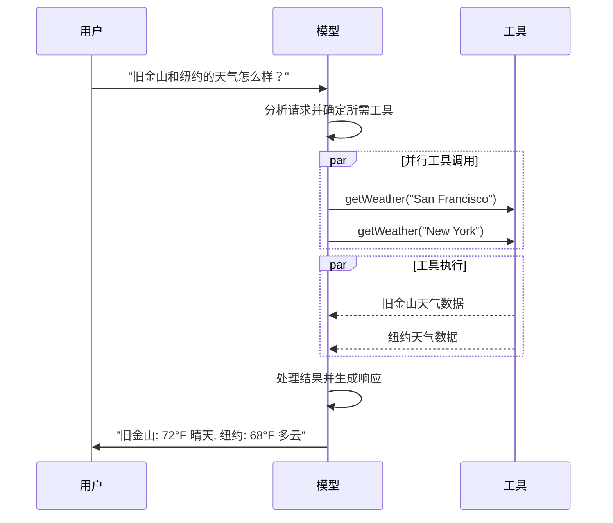

import ChatModelTabsPy from '/snippets/chat-model-tabs.mdx';
import ChatModelTabsJS from '/snippets/chat-model-tabs-js.mdx';

[LLM](https://en.wikipedia.org/wiki/Large_language_model)（大语言模型）是强大的 AI 工具，能够像人类一样解释和生成文本。它们足够灵活，可以编写内容、翻译语言、总结和回答问题，而无需为每个任务进行专门训练。

除了文本生成，许多模型还支持：

* <Icon icon="hammer" size={16} /> [工具调用](#tool-calling) - 调用外部工具（如数据库查询或 API 调用）并在响应中使用结果。
* <Icon icon="layout-grid" size={16} /> [结构化输出](#structured-output) - 模型的响应被约束为遵循定义的格式。
* <Icon icon="photo" size={16} /> [多模态](#multimodal) - 处理和返回文本以外的数据，如图像、音频和视频。
* <Icon icon="brain" size={16} /> [推理](#reasoning) - 模型执行多步推理以得出结论。

模型是[智能体](/oss/javascript/langchain/agents)的推理引擎。它们驱动智能体的决策过程，决定调用哪些工具、如何解释结果以及何时提供最终答案。

你选择的模型的质量和能力直接影响智能体的基线可靠性和性能。不同的模型擅长不同的任务——有些更擅长遵循复杂指令，有些更擅长结构化推理，有些支持更大的上下文窗口以处理更多信息。

LangChain 的标准模型接口让你可以访问众多不同的提供商集成，使你能够轻松实验和切换模型以找到最适合你用例的模型。

<Info>
    有关提供商特定的集成信息和能力，请参阅提供商的[聊天模型页面](/oss/javascript/integrations/chat)。
</Info>

## 基础用法

模型可以通过两种方式使用：

1. **与智能体一起使用** - 在创建[智能体](/oss/javascript/langchain/agents#model)时可以动态指定模型。
2. **独立使用** - 可以直接调用模型（在智能体循环之外）进行文本生成、分类或提取等任务，无需智能体框架。

相同的模型接口在两种上下文中都有效，这让你可以灵活地从简单开始，并根据需要扩展到更复杂的基于智能体的工作流。

### 初始化模型


在 LangChain 中开始使用独立模型最简单的方法是使用 `initChatModel` 从你选择的[聊天模型提供商](/oss/javascript/integrations/chat)初始化一个（示例如下）：

<ChatModelTabsJS />
```typescript
const response = await model.invoke("为什么鹦鹉会说话？");
```
请参阅 [`initChatModel`](https://reference.langchain.com/javascript/langchain/chat_models/universal/initChatModel) 了解更多详情，包括如何传递模型[参数](#parameters)的信息。


### 支持的提供商和模型

LangChain 通过专用的集成包支持所有主要模型提供商。每个提供商包实现相同的标准接口，因此你可以在不重写应用逻辑的情况下切换提供商。新的模型名称可以立即使用——无需更新 LangChain——因为提供商包直接将模型名称传递给提供商的 API。

浏览[支持的提供商完整列表](/oss/javascript/integrations/providers/overview)，或参阅[提供商和模型](/oss/javascript/concepts/providers-and-models)了解提供商、包和模型名称在 LangChain 中如何协同工作的概念概述。

### 关键方法

<Card title="调用" href="#invoke" icon="send" arrow="true" horizontal>
    模型接收消息作为输入，在生成完整响应后输出消息。
</Card>
<Card title="流式输出" href="#stream" icon="broadcast" arrow="true" horizontal>
    调用模型，但在生成时实时流式输出结果。
</Card>
<Card title="批处理" href="#batch" icon="grip-vertical" arrow="true" horizontal>
    批量向模型发送多个请求以提高处理效率。
</Card>

<Info>
    除了聊天模型，LangChain 还提供对其他相关技术的支持，如向量嵌入模型和向量存储。请参阅[集成页面](/oss/javascript/integrations/providers/overview)了解详情。
</Info>

## 参数

聊天模型接受可用于配置其行为的参数。支持的完整参数集因模型和提供商而异，但标准参数包括：

<ParamField body="model" type="string" required>
   要与提供商一起使用的特定模型的名称或标识符。你也可以使用 '{model_provider}:{model}' 格式在单个参数中指定模型及其提供商，例如 'openai:o1'。
</ParamField>


<ParamField body="apiKey" type="string">
    与模型提供商进行身份验证所需的密钥。这通常在你注册获取模型访问权限时颁发。通常通过设置<Tooltip tip="一个值在程序外部设置的变量，通常通过操作系统或微服务的内置功能。">环境变量</Tooltip>来访问。
</ParamField>


<ParamField body="temperature" type="number">
    控制模型输出的随机性。较高的数值使响应更有创意；较低的数值使响应更确定性。
</ParamField>


<ParamField body="maxTokens" type="number">
    限制响应中 <Tooltip tip="模型读取和生成的基本单元。提供商的定义可能不同，但通常它们可以表示一个完整的或部分的单词。">Token</Tooltip> 的总数，有效控制输出的长度。
</ParamField>


<ParamField body="timeout" type="number">
    在取消请求之前等待模型响应的最长时间（以秒为单位）。
</ParamField>


<ParamField body="maxRetries" type="number" default="6">
    如果请求因网络超时或速率限制等问题失败，系统将尝试重新发送请求的最大次数。重试使用带抖动的指数退避。网络错误、速率限制（429）和服务器错误（5xx）会自动重试。客户端错误如 401（未授权）或 404 不会重试。对于不可靠网络上的长时间运行的[智能体](/oss/javascript/deepagents/overview)任务，考虑将此值增加到 10-15。
</ParamField>


使用 `initChatModel` 时，将这些参数作为内联参数传递：

```typescript 使用模型参数初始化
const model = await initChatModel(
    "claude-sonnet-4-6",
    { temperature: 0.7, timeout: 30, maxTokens: 1000, maxRetries: 6 }
)
```


### 连接弹性

LangChain 聊天模型自动使用指数退避重试失败的 API 请求。默认情况下，模型对网络错误、速率限制（429）和服务器错误（5xx）最多重试 **6 次**。客户端错误如 401（未授权）或 404 不会重试。


你可以在创建模型时调整 `maxRetries` 和 `timeout`，然后将该实例传递给 `createAgent`、`createDeepAgent` 或独立调用：

```typescript
import { ChatAnthropic } from "@langchain/anthropic";

const model = new ChatAnthropic({
  model: "google_genai:gemini-3.1-pro-preview",
  maxRetries: 10, // 为不可靠网络增加（默认：6）
  timeout: 120_000, // 毫秒；为慢连接增加
});
```


<Tip>
    对于不可靠网络上的长时间运行的智能体图，考虑使用更高的 `max_retries`（例如 10-15）和[检查点器](/oss/javascript/langgraph/persistence)，以便在失败时保留进度。
</Tip>

<Info>
    每个聊天模型集成可能有额外的参数用于控制提供商特定的功能。

    例如，[`ChatOpenAI`](https://reference.langchain.com/javascript/langchain-openai/ChatOpenAI) 有 `use_responses_api` 来指定是否使用 OpenAI Responses 或 Completions API。

    要查找给定聊天模型支持的所有参数，请前往[聊天模型集成](/oss/javascript/integrations/chat)页面。
</Info>

---

## 调用

聊天模型必须被调用才能生成输出。有三种主要的调用方法，每种适用于不同的用例。

### 调用

调用模型最直接的方式是使用 [`invoke()`](https://reference.langchain.com/javascript/classes/_langchain_core.language_models_chat_models.BaseChatModel.html#invoke) 传入单条消息或消息列表。


```typescript 单条消息
const response = await model.invoke("为什么鹦鹉有彩色的羽毛？");
console.log(response);
```


可以向聊天模型提供消息列表来表示对话历史。每条消息有一个角色，模型用它来指示对话中谁发送了消息。

请参阅[消息](/oss/javascript/langchain/messages)指南了解更多关于角色、类型和内容的详情。


```typescript 对象格式
const conversation = [
  { role: "system", content: "You are a helpful assistant that translates English to French." },
  { role: "user", content: "Translate: I love programming." },
  { role: "assistant", content: "J'adore la programmation." },
  { role: "user", content: "Translate: I love building applications." },
];

const response = await model.invoke(conversation);
console.log(response);  // AIMessage("J'adore créer des applications.")
```
```typescript 消息对象
import { HumanMessage, AIMessage, SystemMessage } from "langchain";

const conversation = [
  new SystemMessage("You are a helpful assistant that translates English to French."),
  new HumanMessage("Translate: I love programming."),
  new AIMessage("J'adore la programmation."),
  new HumanMessage("Translate: I love building applications."),
];

const response = await model.invoke(conversation);
console.log(response);  // AIMessage("J'adore créer des applications.")
```


<Info>
    如果你的调用返回类型是字符串，请确保你使用的是聊天模型而不是 LLM。传统的文本补全 LLM 直接返回字符串。LangChain 聊天模型以 "Chat" 为前缀，例如 [`ChatOpenAI`](https://reference.langchain.com/javascript/langchain-openai/ChatOpenAI)(/oss/integrations/chat/openai)。
</Info>

### 流式输出

大多数模型可以在生成时流式输出其内容。通过逐步显示输出，流式输出显著改善了用户体验，特别是对于较长的响应。

调用 [`stream()`](https://reference.langchain.com/javascript/classes/_langchain_core.language_models_chat_models.BaseChatModel.html#stream) 返回一个<Tooltip tip="一个逐步提供集合中每个项目的按序访问的对象。">迭代器</Tooltip>，在产生输出块时逐个产出。你可以使用循环实时处理每个块：


<CodeGroup>
    ```typescript 基础文本流式输出
    const stream = await model.stream("为什么鹦鹉有彩色的羽毛？");
    for await (const chunk of stream) {
      console.log(chunk.text)
    }
    ```

    ```typescript 流式输出工具调用、推理和其他内容
    const stream = await model.stream("天空是什么颜色的？");
    for await (const chunk of stream) {
      for (const block of chunk.contentBlocks) {
        if (block.type === "reasoning") {
          console.log(`推理: ${block.reasoning}`);
        } else if (block.type === "tool_call_chunk") {
          console.log(`工具调用块: ${block}`);
        } else if (block.type === "text") {
          console.log(block.text);
        } else {
          ...
        }
      }
    }
    ```
</CodeGroup>


与 [`invoke()`](#invoke) 在模型完成生成完整响应后返回单个 [`AIMessage`](https://reference.langchain.com/javascript/langchain-core/messages/AIMessage) 不同，`stream()` 返回多个 [`AIMessageChunk`](https://reference.langchain.com/javascript/langchain-core/messages/AIMessageChunk) 对象，每个包含输出文本的一部分。重要的是，流中的每个块被设计为通过求和聚合为完整消息：


```typescript 构造 AIMessage
let full: AIMessageChunk | null = null;
for await (const chunk of stream) {
  full = full ? full.concat(chunk) : chunk;
  console.log(full.text);
}

// The
// The sky
// The sky is
// The sky is typically
// The sky is typically blue
// ...

console.log(full.contentBlocks);
// [{"type": "text", "text": "The sky is typically blue..."}]
```


生成的消息可以像使用 [`invoke()`](#invoke) 生成的消息一样处理——例如，它可以聚合到消息历史中并作为对话上下文传回模型。

<Warning>
    流式输出仅在程序中的所有步骤都知道如何处理块流时才有效。例如，一个不支持流式的应用程序需要在处理之前将整个输出存储在内存中。
</Warning>

<Accordion title="高级流式输出主题">
    <Accordion title="流式事件">


        LangChain 聊天模型还可以使用
        [`streamEvents()`][BaseChatModel.streamEvents] 流式传输语义事件。

        这简化了基于事件类型和其他元数据的过滤，并会在后台聚合完整消息。请参阅下面的示例。

        ```typescript
        const stream = await model.streamEvents("Hello");
        for await (const event of stream) {
            if (event.event === "on_chat_model_start") {
                console.log(`输入: ${event.data.input}`);
            }
            if (event.event === "on_chat_model_stream") {
                console.log(`Token: ${event.data.chunk.text}`);
            }
            if (event.event === "on_chat_model_end") {
                console.log(`完整消息: ${event.data.output.text}`);
            }
        }
        ```
        ```txt
        输入: Hello
        Token: Hi
        Token:  there
        Token: !
        Token:  How
        Token:  can
        Token:  I
        ...
        完整消息: Hi there! How can I help today?
        ```

        请参阅 [`streamEvents()`](https://reference.langchain.com/javascript/classes/_langchain_core.language_models_chat_models.BaseChatModel.html#streamEvents) 参考了解事件类型和其他详情。

    </Accordion>
    <Accordion title="聊天模型的'自动流式输出'">
        LangChain 通过在某些情况下自动启用流式模式来简化聊天模型的流式输出，即使你没有显式调用流式方法。当你使用非流式的 invoke 方法但仍想流式输出整个应用程序（包括聊天模型的中间结果）时，这特别有用。

        在 [LangGraph 智能体](/oss/javascript/langchain/agents)中，例如，你可以在节点内调用 `model.invoke()`，但如果在流式模式下运行，LangChain 将自动委托给流式输出。

        #### 工作原理

        当你 `invoke()` 一个聊天模型时，如果 LangChain 检测到你正在尝试流式输出整个应用程序，它将自动切换到内部流式模式。就使用 invoke 的代码而言，调用的结果将是相同的；然而，当聊天模型正在被流式输出时，LangChain 将负责在 LangChain 的回调系统中调用 [`on_llm_new_token`](https://reference.langchain.com/javascript/interfaces/_langchain_core.callbacks_base.BaseCallbackHandlerMethods.html#onLlmNewToken) 事件。


        回调事件允许 LangGraph 的 `stream()` 和 `streamEvents()` 实时展示聊天模型的输出。

    </Accordion>
</Accordion>

### 批处理

对模型的一组独立请求进行批处理可以显著提高性能并降低成本，因为处理可以并行完成：


```typescript 批处理
const responses = await model.batch([
  "为什么鹦鹉有彩色的羽毛？",
  "飞机是如何飞行的？",
  "什么是量子计算？",
  "为什么鹦鹉有彩色的羽毛？",
  "飞机是如何飞行的？",
  "什么是量子计算？",
]);
for (const response of responses) {
  console.log(response);
}
```

<Tip>
    当使用 `batch()` 处理大量输入时，你可能需要控制最大并行调用数。这可以通过在 [`RunnableConfig`](https://reference.langchain.com/javascript/langchain-core/runnables/RunnableConfig) 字典中设置 `maxConcurrency` 属性来实现。

    ```typescript 带最大并发数的批处理
    model.batch(
      listOfInputs,
      {
        maxConcurrency: 5,  // 限制为 5 个并行调用
      }
    )
    ```

    请参阅 [`RunnableConfig`](https://reference.langchain.com/javascript/langchain-core/runnables/RunnableConfig) 参考了解支持的完整属性列表。
</Tip>

有关批处理的更多详情，请参阅[参考文档](https://reference.langchain.com/javascript/classes/_langchain_core.language_models_chat_models.BaseChatModel.html#batch)。


---

## 工具调用

模型可以请求调用执行任务的工具，如从数据库获取数据、搜索网络或运行代码。工具是以下两者的配对：

1. 模式，包括工具的名称、描述和/或参数定义（通常是 JSON schema）
2. 要执行的函数或<Tooltip tip="一个可以暂停执行并在稍后恢复的方法">协程</Tooltip>。

<Note>
    你可能听到过"函数调用"这个术语。我们将其与"工具调用"互换使用。
</Note>

以下是用户和模型之间的基本工具调用流程：





要使你定义的工具可供模型使用，你必须使用 [`bindTools`](https://reference.langchain.com/javascript/classes/_langchain_core.language_models_chat_models.BaseChatModel.html#bindTools) 绑定它们。在后续调用中，模型可以根据需要选择调用任何已绑定的工具。


某些模型提供商提供<Tooltip tip="在服务端执行的工具，如网络搜索和代码解释器">内置工具</Tooltip>，可以通过模型或调用参数启用（例如 [`ChatOpenAI`](/oss/javascript/integrations/chat/openai)、[`ChatAnthropic`](/oss/javascript/integrations/chat/anthropic)）。请查看相应的[提供商参考](/oss/javascript/integrations/providers/overview)了解详情。

<Tip>
    请参阅[工具指南](/oss/javascript/langchain/tools)了解创建工具的详情和其他选项。
</Tip>


```typescript 绑定用户工具
import { tool } from "langchain";
import * as z from "zod";
import { ChatOpenAI } from "@langchain/openai";

const getWeather = tool(
  (input) => `It's sunny in ${input.location}.`,
  {
    name: "get_weather",
    description: "Get the weather at a location.",
    schema: z.object({
      location: z.string().describe("The location to get the weather for"),
    }),
  },
);

const model = new ChatOpenAI({ model: "gpt-5.4" });
const modelWithTools = model.bindTools([getWeather]);  // [!code highlight]

const response = await modelWithTools.invoke("波士顿的天气怎么样？");
const toolCalls = response.tool_calls || [];
for (const tool_call of toolCalls) {
  // 查看模型发出的工具调用
  console.log(`工具: ${tool_call.name}`);
  console.log(`参数: ${tool_call.args}`);
}
```


绑定用户定义的工具时，模型的响应包含执行工具的**请求**。当在[智能体](/oss/javascript/langchain/agents)之外单独使用模型时，你需要自己执行请求的工具并将结果返回给模型，以便在后续推理中使用。当使用[智能体](/oss/javascript/langchain/agents)时，智能体循环会为你处理工具执行循环。

下面展示了一些使用工具调用的常见方式。

<AccordionGroup>
    <Accordion title="工具执行循环" icon="refresh">
        当模型返回工具调用时，你需要执行工具并将结果传回模型。这创建了一个对话循环，模型可以使用工具结果生成最终响应。LangChain 包含为你处理此编排的[智能体](/oss/javascript/langchain/agents)抽象。

        以下是一个简单示例：


        ```typescript 工具执行循环
        // 绑定（可能多个）工具到模型
        const modelWithTools = model.bindTools([get_weather])

        // 步骤 1：模型生成工具调用
        const messages = [{"role": "user", "content": "波士顿的天气怎么样？"}]
        const ai_msg = await modelWithTools.invoke(messages)
        messages.push(ai_msg)

        // 步骤 2：执行工具并收集结果
        for (const tool_call of ai_msg.tool_calls) {
            // 使用生成的参数执行工具
            const tool_result = await get_weather.invoke(tool_call)
            messages.push(tool_result)
        }

        // 步骤 3：将结果传回模型以获取最终响应
        const final_response = await modelWithTools.invoke(messages)
        console.log(final_response.text)
        // "波士顿当前天气为 72°F，晴天。"
        ```


        工具返回的每个 [`ToolMessage`](https://reference.langchain.com/javascript/langchain-core/messages/ToolMessage) 包含与原始工具调用匹配的 `tool_call_id`，帮助模型将结果与请求关联。
    </Accordion>
    <Accordion title="强制工具调用" icon="asterisk">
        默认情况下，模型可以根据用户的输入自由选择使用哪个绑定的工具。但是，你可能需要强制选择工具，确保模型使用特定工具或给定列表中的**任何**工具：


        <CodeGroup>
            ```typescript 强制使用任何工具
            const modelWithTools = model.bindTools([tool_1], { toolChoice: "any" })
            ```
            ```typescript 强制使用特定工具
            const modelWithTools = model.bindTools([tool_1], { toolChoice: "tool_1" })
            ```
        </CodeGroup>

    </Accordion>
    <Accordion title="并行工具调用" icon="stack-2">
        许多模型支持在适当时并行调用多个工具。这允许模型同时从不同来源收集信息。


        ```typescript 并行工具调用
        const modelWithTools = model.bind_tools([get_weather])

        const response = await modelWithTools.invoke(
            "波士顿和东京的天气怎么样？"
        )


        // 模型可能生成多个工具调用
        console.log(response.tool_calls)
        // [
        //   { name: 'get_weather', args: { location: 'Boston' }, id: 'call_1' },
        //   { name: 'get_time', args: { location: 'Tokyo' }, id: 'call_2' }
        // ]


        // 执行所有工具（可以使用 async 并行完成）
        const results = []
        for (const tool_call of response.tool_calls || []) {
            if (tool_call.name === 'get_weather') {
                const result = await get_weather.invoke(tool_call)
                results.push(result)
            }
        }
        ```


        模型会根据请求操作的独立性智能确定何时适合并行执行。

        <Tip>
        大多数支持工具调用的模型默认启用并行工具调用。某些模型（包括 [OpenAI](/oss/javascript/integrations/chat/openai) 和 [Anthropic](/oss/javascript/integrations/chat/anthropic)）允许你禁用此功能。要这样做，设置 `parallel_tool_calls=False`：
        ```python
        model.bind_tools([get_weather], parallel_tool_calls=False)
        ```
        </Tip>
    </Accordion>
    <Accordion title="流式工具调用" icon="rss">
        流式输出响应时，工具调用通过 [`ToolCallChunk`](https://reference.langchain.com/javascript/langchain-core/messages/ContentBlock/Tools/ToolCallChunk) 逐步构建。这允许你在工具调用生成过程中看到它们，而不是等待完整响应。


        ```typescript 流式工具调用
        const stream = await modelWithTools.stream(
            "波士顿和东京的天气怎么样？"
        )
        for await (const chunk of stream) {
            // 工具调用块逐步到达
            if (chunk.tool_call_chunks) {
                for (const tool_chunk of chunk.tool_call_chunks) {
                console.log(`工具: ${tool_chunk.get('name', '')}`)
                console.log(`参数: ${tool_chunk.get('args', '')}`)
                }
            }
        }

        // 输出:
        // 工具: get_weather
        // 参数:
        // 工具:
        // 参数: {"loc
        // 工具:
        // 参数: ation": "BOS"}
        // 工具: get_time
        // 参数:
        // 工具:
        // 参数: {"timezone": "Tokyo"}
        ```

        你可以累积块来构建完整的工具调用：

        ```typescript 累积工具调用
        let full: AIMessageChunk | null = null
        const stream = await modelWithTools.stream("波士顿的天气怎么样？")
        for await (const chunk of stream) {
            full = full ? full.concat(chunk) : chunk
            console.log(full.contentBlocks)
        }
        ```


    </Accordion>
</AccordionGroup>

---

## 结构化输出

可以请求模型以匹配给定模式的格式提供响应。这对于确保输出可以轻松解析并在后续处理中使用很有用。LangChain 支持多种模式类型和强制结构化输出的方法。

<Tip>
    要了解结构化输出，请参阅[结构化输出](/oss/javascript/langchain/structured-output)。
</Tip>


<Tabs>
    <Tab title="Zod">
        [zod schema](https://zod.dev/) 是定义输出模式的首选方法。请注意，当提供 zod schema 时，模型输出还将使用 zod 的 parse 方法进行验证。

        ```typescript
        import * as z from "zod";

        const Movie = z.object({
          title: z.string().describe("The title of the movie"),
          year: z.number().describe("The year the movie was released"),
          director: z.string().describe("The director of the movie"),
          rating: z.number().describe("The movie's rating out of 10"),
        });

        const modelWithStructure = model.withStructuredOutput(Movie);

        const response = await modelWithStructure.invoke("提供关于电影《盗梦空间》的详情");
        console.log(response);
        // {
        //   title: "Inception",
        //   year: 2010,
        //   director: "Christopher Nolan",
        //   rating: 8.8,
        // }
        ```
    </Tab>
    <Tab title="JSON Schema">
        为了最大程度的控制或互操作性，你可以提供原始 JSON Schema。

        ```typescript
        const jsonSchema = {
          "title": "Movie",
          "description": "A movie with details",
          "type": "object",
          "properties": {
            "title": {
              "type": "string",
              "description": "The title of the movie",
            },
            "year": {
              "type": "integer",
              "description": "The year the movie was released",
            },
            "director": {
              "type": "string",
              "description": "The director of the movie",
            },
            "rating": {
              "type": "number",
              "description": "The movie's rating out of 10",
            },
          },
          "required": ["title", "year", "director", "rating"],
        }

        const modelWithStructure = model.withStructuredOutput(
          jsonSchema,
          { method: "jsonSchema" },
        )

        const response = await modelWithStructure.invoke("提供关于电影《盗梦空间》的详情")
        console.log(response)  // {'title': 'Inception', 'year': 2010, ...}
        ```
    </Tab>
    <Tab title="Standard Schema">
        任何实现 [Standard Schema](https://standardschema.dev/) 规范的库的模式也是支持的。Standard Schema 对象在运行时通过模式的 `~standard.validate()` 方法进行验证。

        ```typescript
        import * as v from "valibot";
        import { toStandardJsonSchema } from "@valibot/to-json-schema";

        const Movie = toStandardJsonSchema(
          v.object({
            title: v.pipe(v.string(), v.description("The title of the movie")),
            year: v.pipe(v.number(), v.description("The year the movie was released")),
            director: v.pipe(v.string(), v.description("The director of the movie")),
            rating: v.pipe(v.number(), v.description("The movie's rating out of 10")),
          })
        );

        const modelWithStructure = model.withStructuredOutput(Movie);

        const response = await modelWithStructure.invoke("提供关于电影《盗梦空间》的详情");
        console.log(response);
        // {
        //   title: "Inception",
        //   year: 2010,
        //   director: "Christopher Nolan",
        //   rating: 8.8,
        // }
        ```
    </Tab>
</Tabs>


<Note>
    **结构化输出的关键注意事项：**

    - **method 参数**：某些提供商支持不同的方法（`'jsonSchema'`、`'functionCalling'`、`'jsonMode'`）
    - **includeRaw**：使用 [`includeRaw: true`](https://reference.langchain.com/javascript/classes/_langchain_core.language_models_chat_models.BaseChatModel.html#withStructuredOutput) 同时获取解析后的输出和原始 [`AIMessage`](https://reference.langchain.com/javascript/langchain-core/messages/AIMessage)
    - **验证**：Zod 和 Standard Schema 对象提供自动验证，而 JSON Schema 需要手动验证
    - **Standard Schema**：任何实现 [Standard Schema](https://standardschema.dev/) 规范的模式库都受支持并在运行时验证

    请参阅你的[提供商集成页面](/oss/javascript/integrations/providers/overview)了解支持的方法和配置选项。
</Note>


<Accordion title="示例：解析结构旁的消息输出">

有时返回原始 [`AIMessage`](https://reference.langchain.com/javascript/langchain-core/messages/AIMessage) 对象和解析后的表示一起会很有用，以便访问响应元数据如 [Token 用量](#token-usage)。为此，在调用 [`with_structured_output`](https://reference.langchain.com/javascript/classes/_langchain_core.language_models_chat_models.BaseChatModel.html#withStructuredOutput) 时设置 [`include_raw=True`](https://reference.langchain.com/javascript/classes/_langchain_core.language_models_chat_models.BaseChatModel.html#withStructuredOutput)：


    ```typescript
    import * as z from "zod";

    const Movie = z.object({
      title: z.string().describe("The title of the movie"),
      year: z.number().describe("The year the movie was released"),
      director: z.string().describe("The director of the movie"),
      rating: z.number().describe("The movie's rating out of 10"),
      title: z.string().describe("The title of the movie"),
      year: z.number().describe("The year the movie was released"),
      director: z.string().describe("The director of the movie"),  // [!code highlight]
      rating: z.number().describe("The movie's rating out of 10"),
    });

    const modelWithStructure = model.withStructuredOutput(Movie, { includeRaw: true });

    const response = await modelWithStructure.invoke("提供关于电影《盗梦空间》的详情");
    console.log(response);
    // {
    //   raw: AIMessage { ... },
    //   parsed: { title: "Inception", ... }
    // }
    ```

</Accordion>
<Accordion title="示例：嵌套结构">
    模式可以嵌套：


    ```typescript
    import * as z from "zod";

    const Actor = z.object({
      name: str
      role: z.string(),
    });

    const MovieDetails = z.object({
      title: z.string(),
      year: z.number(),
      cast: z.array(Actor),
      genres: z.array(z.string()),
      budget: z.number().nullable().describe("Budget in millions USD"),
    });

    const modelWithStructure = model.withStructuredOutput(MovieDetails);
    ```

</Accordion>

---

## 高级主题

### 模型配置

<Info>
    模型配置需要 `langchain>=1.1`。
</Info>


LangChain 聊天模型可以通过 `profile` 属性暴露支持的功能和能力字典：

```typescript
model.profile;
// {
//   maxInputTokens: 400000,
//   imageInputs: true,
//   reasoningOutput: true,
//   toolCalling: true,
//   ...
// }
```

请参阅 [API 参考](https://reference.langchain.com/javascript/langchain-core/language_models/profile/ModelProfile)了解完整的字段集。

大部分模型配置数据由 [models.dev](https://github.com/sst/models.dev) 项目提供支持，这是一个提供模型能力数据的开源项目。这些数据通过额外字段进行增强，以便与 LangChain 一起使用。这些增强内容会随着上游项目的发展保持同步。

模型配置数据允许应用程序动态适应模型能力。例如：

1. [摘要中间件](/oss/javascript/langchain/middleware/built-in#summarization)可以根据模型的上下文窗口大小触发摘要。
2. `createAgent` 中的[结构化输出](/oss/javascript/langchain/structured-output)策略可以自动推断（例如，通过检查对原生结构化输出功能的支持）。
3. 模型输入可以根据支持的[模态](#multimodal)和最大输入 Token 数进行限制。
4. [深度智能体 CLI](/oss/javascript/deepagents/cli) 将[交互式模型切换器](/oss/javascript/deepagents/cli/providers#which-models-appear-in-the-switcher)过滤为配置报告支持 `tool_calling` 和文本 I/O 的模型，并在选择器详情视图中显示上下文窗口大小和能力标志。

<Accordion title="修改配置数据">
    如果模型配置数据缺失、过期或不正确，可以更改。

    **选项 1（快速修复）**

    你可以使用任何有效配置实例化聊天模型：

    ```typescript
    const customProfile = {
    maxInputTokens: 100_000,
    toolCalling: true,
    structuredOutput: true,
    // ...
    };
    const model = initChatModel("...", { profile: customProfile });
    ```

    **选项 2（修复上游数据）**

    数据的主要来源是 [models.dev](https://models.dev/) 项目。这些数据与 LangChain [集成包](/oss/javascript/integrations/providers/overview)中的额外字段和覆盖合并，并随这些包一起发布。

    可以通过以下流程更新模型配置数据：

    1. （如需）通过向其 [GitHub 仓库](https://github.com/sst/models.dev)提交 pull request 更新 [models.dev](https://models.dev/) 的源数据。
    2. （如需）通过向 LangChain [集成包](/oss/javascript/integrations/providers/overview)提交 pull request 更新 `langchain-<package>/profiles.toml` 中的额外字段和覆盖。
</Accordion>


<Warning>
    模型配置是 beta 功能。配置的格式可能会发生变化。
</Warning>

### 多模态

某些模型可以处理和返回非文本数据，如图像、音频和视频。你可以通过提供[内容块](/oss/javascript/langchain/messages#message-content)向模型传递非文本数据。

<Tip>
    所有具有底层多模态能力的 LangChain 聊天模型支持：

    1. 跨提供商标准格式的数据（请参阅[我们的消息指南](/oss/javascript/langchain/messages)）
    2. OpenAI [chat completions](https://platform.openai.com/docs/api-reference/chat) 格式
    3. 特定提供商原生的任何格式（例如，Anthropic 模型接受 Anthropic 原生格式）
</Tip>

请参阅消息指南的[多模态部分](/oss/javascript/langchain/messages#multimodal)了解详情。

<Tooltip tip="并非所有 LLM 都是一样的！" cta="查看参考" href="https://models.dev/">某些模型</Tooltip>可以在响应中返回多模态数据。如果被调用这样做，生成的 [`AIMessage`](https://reference.langchain.com/javascript/langchain-core/messages/AIMessage) 将包含多模态类型的内容块。


```typescript 多模态输出
const response = await model.invoke("创建一张猫的图片");
console.log(response.contentBlocks);
// [
//   { type: "text", text: "这是一张猫的图片" },
//   { type: "image", data: "...", mimeType: "image/jpeg" },
// ]
```


请参阅[集成页面](/oss/javascript/integrations/providers/overview)了解特定提供商的详情。

### 推理

许多模型能够执行多步推理以得出结论。这涉及将复杂问题分解为更小、更易管理的步骤。

**如果底层模型支持，** 你可以展示此推理过程以更好地理解模型如何得出最终答案。


<CodeGroup>
    ```typescript 流式推理输出
    const stream = model.stream("为什么鹦鹉有彩色的羽毛？");
    for await (const chunk of stream) {
        const reasoningSteps = chunk.contentBlocks.filter(b => b.type === "reasoning");
        console.log(reasoningSteps.length > 0 ? reasoningSteps : chunk.text);
    }
    ```

    ```typescript 完整推理输出
    const response = await model.invoke("为什么鹦鹉有彩色的羽毛？");
    const reasoningSteps = response.contentBlocks.filter(b => b.type === "reasoning");
    console.log(reasoningSteps.map(step => step.reasoning).join(" "));
    ```
</CodeGroup>


根据模型不同，你有时可以指定模型在推理上投入的努力程度。同样，你可以请求模型完全关闭推理。这可能采用分类的推理"层级"（例如 `'low'` 或 `'high'`）或整数 Token 预算的形式。

有关详情，请参阅你相应聊天模型的[集成页面](/oss/javascript/integrations/providers/overview)或[参考文档](https://reference.langchain.com/python/integrations/)。


### 本地模型

LangChain 支持在你自己的硬件上本地运行模型。这对于数据隐私至关重要、你想调用自定义模型或你想避免使用云端模型产生的成本等场景很有用。

[Ollama](/oss/javascript/integrations/chat/ollama) 是本地运行聊天和向量嵌入模型最简单的方式之一。

{/* TODO: whenever we have a better integrations directory, x-ref to that page with a local query filter */}

### 提示词缓存

许多提供商提供提示词缓存功能，以减少重复处理相同 Token 的延迟和成本。这些功能可以是**隐式**或**显式**的：

- **隐式提示词缓存：** 提供商会在请求命中缓存时自动传递成本节省。示例：[OpenAI](/oss/javascript/integrations/chat/openai) 和 [Gemini](/oss/javascript/integrations/chat/google_generative_ai)。
- **显式缓存：** 提供商允许你手动指示缓存点，以获得更大的控制权或保证成本节省。示例：
    - [`ChatOpenAI`](https://reference.langchain.com/javascript/langchain-openai/ChatOpenAI)（通过 `prompt_cache_key`）
    - Anthropic 的 [`AnthropicPromptCachingMiddleware`](/oss/javascript/integrations/chat/anthropic#prompt-caching)
    - [Gemini](https://reference.langchain.com/python/integrations/langchain_google_genai/)。
    - [AWS Bedrock](/oss/javascript/integrations/chat/bedrock)

<Warning>
    提示词缓存通常只在超过最小输入 Token 阈值时才会启用。请参阅[提供商页面](/oss/javascript/integrations/chat)了解详情。
</Warning>

缓存使用情况将反映在模型响应的[使用元数据](/oss/javascript/langchain/messages#token-usage)中。

### 服务端工具使用

某些提供商支持服务端[工具调用](#tool-calling)循环：模型可以在单个对话轮次中与网络搜索、代码解释器和其他工具交互并分析结果。

如果模型在服务端调用工具，响应消息的内容将包含表示工具调用和结果的内容。访问响应的[内容块](/oss/javascript/langchain/messages#standard-content-blocks)将以提供商无关的格式返回服务端工具调用和结果：


```typescript
import { initChatModel } from "langchain";

const model = await initChatModel("gpt-5.4-mini");
const modelWithTools = model.bindTools([{ type: "web_search" }])

const message = await modelWithTools.invoke("今天有什么好消息？");
console.log(message.contentBlocks);
```

这代表单个对话轮次；不需要像客户端[工具调用](#tool-calling)那样传入关联的 [ToolMessage](/oss/javascript/langchain/messages#tool-message) 对象。

请参阅你给定提供商的[集成页面](/oss/javascript/integrations/chat)了解可用工具和使用详情。


### 基础 URL 和代理设置

你可以为实现 OpenAI Chat Completions API 的提供商配置自定义基础 URL。

<Warning>
    `model_provider="openai"`（或直接使用 `ChatOpenAI`）针对的是官方 OpenAI API 规范。来自路由器和代理的提供商特定字段可能不会被提取或保留。

    对于 OpenRouter 和 LiteLLM，建议使用专用集成：
    - [OpenRouter 通过 `ChatOpenRouter`](/oss/javascript/integrations/chat/openrouter)（`langchain-openrouter`）
    - [LiteLLM 通过 `ChatLiteLLM` / `ChatLiteLLMRouter`](/oss/javascript/integrations/chat)（`langchain-litellm`）
</Warning>

<Accordion title="自定义基础 URL" icon="link">


    许多模型提供商提供与 OpenAI 兼容的 API（例如 [Together AI](https://www.together.ai/)、[vLLM](https://github.com/vllm-project/vllm)）。你可以通过指定适当的 `base_url` 参数将 `initChatModel` 与这些提供商一起使用：

    ```python
    model = initChatModel(
        "MODEL_NAME",
        {
            modelProvider: "openai",
            baseUrl: "BASE_URL",
            apiKey: "YOUR_API_KEY",
        }
    )
    ```


    <Note>
        使用直接聊天模型类实例化时，参数名称可能因提供商而异。请查看相应的[参考文档](/oss/javascript/integrations/providers/overview)了解详情。
    </Note>
</Accordion>


### 对数概率

某些模型可以配置为在初始化模型时通过设置 `logprobs` 参数返回表示给定 Token 可能性的 Token 级对数概率：


```typescript
const model = new ChatOpenAI({
    model: "gpt-5.4",
    logprobs: true,
});

const responseMessage = await model.invoke("为什么鹦鹉会说话？");

responseMessage.response_metadata.logprobs.content.slice(0, 5);
```


### Token 用量

许多模型提供商在调用响应中返回 Token 用量信息。当可用时，此信息将包含在相应模型生成的 [`AIMessage`](https://reference.langchain.com/javascript/langchain-core/messages/AIMessage) 对象中。有关更多详情，请参阅[消息](/oss/javascript/langchain/messages)指南。


### 调用配置


调用模型时，你可以通过使用 [`RunnableConfig`](https://reference.langchain.com/javascript/langchain-core/runnables/RunnableConfig) 对象的 `config` 参数传递额外配置。这提供了对执行行为、回调和元数据追踪的运行时控制。


常见的配置选项包括：


```typescript 带配置的调用
const response = await model.invoke(
    "讲一个笑话",
    {
        runName: "joke_generation",      // 此次运行的自定义名称
        tags: ["humor", "demo"],          // 用于分类的标签
        metadata: {"user_id": "123"},     // 自定义元数据
        callbacks: [my_callback_handler], // 回调处理器
    }
)
```


这些配置值在以下情况下特别有用：
- 使用 [LangSmith](/langsmith/home) 追踪进行调试
- 实现自定义日志或监控
- 在生产中控制资源使用
- 在复杂管道中追踪调用


<Accordion title="关键配置属性">
    <ParamField body="runName" type="string">
        在日志和追踪中标识此特定调用。不会被子调用继承。
    </ParamField>

    <ParamField body="tags" type="string[]">
        由所有子调用继承的标签，用于调试工具中的过滤和组织。
    </ParamField>

    <ParamField body="metadata" type="object">
        用于追踪额外上下文的自定义键值对，由所有子调用继承。
    </ParamField>

    <ParamField body="maxConcurrency" type="number">
        使用 `batch()` 时控制最大并行调用数。
    </ParamField>

    <ParamField body="callbacks" type="CallbackHandler[]">
        用于监控和响应执行期间事件的处理器。
    </ParamField>

    <ParamField body="recursion_limit" type="number">
        链的最大递归深度，防止复杂管道中的无限循环。
    </ParamField>
</Accordion>


<Tip>
    请参阅完整的 [`RunnableConfig`](https://reference.langchain.com/javascript/langchain-core/runnables/RunnableConfig) 参考了解所有支持的属性。
</Tip>

---

<div className="source-links">
<Callout icon="terminal-2">
    [连接这些文档](/use-these-docs)到 Claude、VSCode 等，通过 MCP 获取实时答案。
</Callout>
<Callout icon="edit">
    [在 GitHub 上编辑此页面](https://github.com/langchain-ai/docs/edit/main/src/oss/langchain/models.mdx)或[提交 Issue](https://github.com/langchain-ai/docs/issues/new/choose)。
</Callout>
</div>
