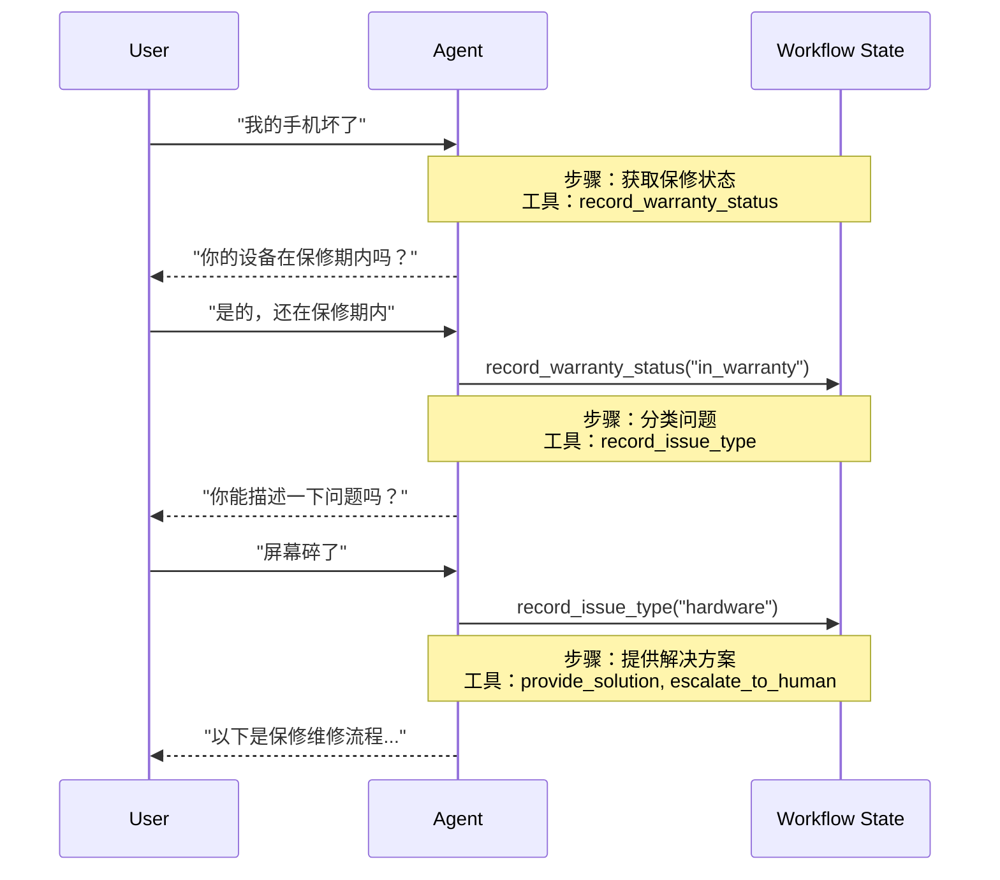

在**交接**架构中，行为基于状态动态变化。核心机制：[工具](/oss/javascript/langchain/tools)更新一个跨轮次持久化的状态变量（例如 `current_step` 或 `active_agent`），系统读取这个变量来调整行为——要么应用不同的配置（系统提示词、工具），要么路由到不同的[智能体](/oss/javascript/langchain/agents)。此模式同时支持不同智能体之间的交接和单个智能体内部的动态配置变更。

<Tip>
**交接**一词由 [OpenAI](https://openai.github.io/openai-agents-python/handoffs/) 提出，指使用工具调用（例如 `transfer_to_sales_agent`）在智能体或状态之间转移控制权。
</Tip>



## 关键特征

* 状态驱动行为：行为基于状态变量变化（例如 `current_step` 或 `active_agent`）
* 基于工具的转换：工具更新状态变量以在状态之间移动
* 直接用户交互：每个状态的配置直接处理用户消息
* 持久状态：状态在对话轮次之间保持

## 何时使用

当你需要强制执行顺序约束（只有在满足前置条件后才解锁功能）、智能体需要在不同状态下与用户直接对话、或者你正在构建多阶段对话流时，使用交接模式。此模式对于需要按特定顺序收集信息的客户支持场景特别有价值——例如在处理退款之前先收集保修 ID。

## 基本实现

核心机制是一个[工具](/oss/javascript/langchain/tools)，返回一个 [`Command`](/oss/javascript/langgraph/graph-api#command) 来更新状态，触发到新步骤或智能体的转换：


```typescript
import { tool, ToolMessage, type ToolRuntime } from "langchain";
import { Command } from "@langchain/langgraph";
import { z } from "zod";

const transferToSpecialist = tool(
  async (_, config: ToolRuntime<typeof StateSchema>) => {
    return new Command({
      update: {
        messages: [
          new ToolMessage({  // [!code highlight]
            content: "Transferred to specialist",
            tool_call_id: config.toolCallId  // [!code highlight]
          })
        ],
        currentStep: "specialist"  // 触发行为变更
      }
    });
  },
  {
    name: "transfer_to_specialist",
    description: "Transfer to the specialist agent.",
    schema: z.object({})
  }
);
```


<Note>
**为什么要包含 `ToolMessage`？** 当 LLM 调用一个工具时，它期望一个响应。带有匹配 `tool_call_id` 的 `ToolMessage` 完成了这个请求-响应循环——没有它，对话历史会变得格式不正确。当你的交接工具更新消息时，这是必需的。
</Note>

如需完整实现，请参阅下面的教程。

<Card
    title="教程：使用交接构建客户支持"
    icon="users"
    href="/oss/javascript/langchain/multi-agent/handoffs-customer-support"
    arrow cta="了解更多"
>
    学习如何使用交接模式构建客户支持智能体，其中单个智能体在不同配置之间转换。
</Card>

## 实现方式

交接有两种实现方式：**[带中间件的单一智能体](#带中间件的单一智能体)**（一个带有动态配置的智能体）或**[多智能体子图](#多智能体子图)**（作为图节点的不同智能体）。

### 带中间件的单一智能体

单个智能体基于状态改变其行为。中间件拦截每次模型调用，动态调整系统提示词和可用工具。工具更新状态变量以触发转换：


```typescript
import { tool, ToolMessage, type ToolRuntime } from "langchain";
import { Command } from "@langchain/langgraph";
import { z } from "zod";

const recordWarrantyStatus = tool(
  async ({ status }, config: ToolRuntime<typeof StateSchema>) => {
    return new Command({
      update: {
        messages: [
          new ToolMessage({
            content: `Warranty status recorded: ${status}`,
            tool_call_id: config.toolCallId,
          }),
        ],
        warrantyStatus: status,
        currentStep: "specialist", // 更新状态以触发转换
      },
    });
  },
  {
    name: "record_warranty_status",
    description: "Record warranty status and transition to next step.",
    schema: z.object({
      status: z.string(),
    }),
  }
);
```


<Accordion title="完整示例：使用中间件的客户支持">


```typescript
import {
  createAgent,
  createMiddleware,
  tool,
  ToolMessage,
  type ToolRuntime,
} from "langchain";
import { Command, MemorySaver, StateSchema } from "@langchain/langgraph";
import { z } from "zod";

// 1. 定义带有 current_step 跟踪器的状态
const SupportState = new StateSchema({ // [!code highlight]
  currentStep: z.string().default("triage"), // [!code highlight]
  warrantyStatus: z.string().optional(),
});

// 2. 工具通过 Command 更新 currentStep
const recordWarrantyStatus = tool(
  async ({ status }, config: ToolRuntime<typeof SupportState.State>) => {
    return new Command({ // [!code highlight]
      update: { // [!code highlight]
        messages: [ // [!code highlight]
          new ToolMessage({
            content: `Warranty status recorded: ${status}`,
            tool_call_id: config.toolCallId,
          }),
        ],
        warrantyStatus: status,
        // 转换到下一步
        currentStep: "specialist", // [!code highlight]
      },
    });
  },
  {
    name: "record_warranty_status",
    description: "Record warranty status and transition",
    schema: z.object({ status: z.string() }),
  }
);

// 3. 中间件基于 currentStep 应用动态配置
const applyStepConfig = createMiddleware({
  name: "applyStepConfig",
  stateSchema: SupportState, // [!code highlight]
  wrapModelCall: async (request, handler) => {
    const step = request.state.currentStep || "triage"; // [!code highlight]

    // 将步骤映射到其配置
    const configs = {
      triage: {
        prompt: "Collect warranty information...",
        tools: [recordWarrantyStatus],
      },
      specialist: {
        prompt: `Provide solutions based on warranty: ${request.state.warrantyStatus}`,
        tools: [provideSolution, escalate],
      },
    };

    const config = configs[step as keyof typeof configs];
    return handler({
      ...request,
      systemPrompt: config.prompt,
      tools: config.tools,
    });
  },
});

// 4. 使用中间件创建智能体
const agent = createAgent({
  model,
  tools: [recordWarrantyStatus, provideSolution, escalate],
  middleware: [applyStepConfig], // [!code highlight]
  checkpointer: new MemorySaver(), // 跨轮次持久化状态  // [!code highlight]
});
```


</Accordion>

### 多智能体子图

多个不同的智能体作为图中的独立节点存在。交接工具使用 `Command.PARENT` 在智能体节点之间导航，指定下一个要执行的节点。

<Warning>
子图交接需要仔细的**[上下文工程](/oss/javascript/langchain/context-engineering)**。与单一智能体中间件（消息历史自然流动）不同，你必须明确决定智能体之间传递什么消息。如果做错了，智能体会收到格式不正确的对话历史或膨胀的上下文。请参阅下面的[上下文工程](#上下文工程)。
</Warning>


```typescript
import {
  tool,
  ToolMessage,
  AIMessage,
  type ToolRuntime,
} from "langchain";
import { Command, StateSchema, MessagesValue } from "@langchain/langgraph";

const CustomState = new StateSchema({
  messages: MessagesValue,
});

const transferToSales = tool(
  async (_, runtime: ToolRuntime<typeof CustomState.State>) => {
    const lastAiMessage = runtime.state.messages // [!code highlight]
      .reverse() // [!code highlight]
      .find(AIMessage.isInstance); // [!code highlight]

    const transferMessage = new ToolMessage({ // [!code highlight]
      content: "Transferred to sales agent", // [!code highlight]
      tool_call_id: runtime.toolCallId, // [!code highlight]
    }); // [!code highlight]
    return new Command({
      goto: "sales_agent",
      update: {
        activeAgent: "sales_agent",
        messages: [lastAiMessage, transferMessage].filter(Boolean), // [!code highlight]
      },
      graph: Command.PARENT,
    });
  },
  {
    name: "transfer_to_sales",
    description: "Transfer to the sales agent.",
    schema: z.object({}),
  }
);
```


<Accordion title="完整示例：使用交接的销售和支持">

此示例展示了一个包含独立销售和支持智能体的多智能体系统。每个智能体是一个单独的图节点，交接工具允许智能体之间互相转移对话。


```typescript
import {
  StateGraph,
  START,
  END,
  StateSchema,
  MessagesValue,
  Command,
  ConditionalEdgeRouter,
  GraphNode,
} from "@langchain/langgraph";
import { createAgent, AIMessage, ToolMessage } from "langchain";
import { tool, ToolRuntime } from "@langchain/core/tools";
import { z } from "zod/v4";

// 1. 定义带有 active_agent 跟踪器的状态
const MultiAgentState = new StateSchema({
  messages: MessagesValue,
  activeAgent: z.string().optional(),
});

// 2. 创建交接工具
const transferToSales = tool(
  async (_, runtime: ToolRuntime<typeof MultiAgentState.State>) => {
    const lastAiMessage = [...runtime.state.messages] // [!code highlight]
      .reverse() // [!code highlight]
      .find(AIMessage.isInstance); // [!code highlight]
    const transferMessage = new ToolMessage({ // [!code highlight]
      content: "Transferred to sales agent from support agent", // [!code highlight]
      tool_call_id: runtime.toolCallId, // [!code highlight]
    }); // [!code highlight]
    return new Command({
      goto: "sales_agent",
      update: {
        activeAgent: "sales_agent",
        messages: [lastAiMessage, transferMessage].filter(Boolean), // [!code highlight]
      },
      graph: Command.PARENT,
    });
  },
  {
    name: "transfer_to_sales",
    description: "Transfer to the sales agent.",
    schema: z.object({}),
  }
);

const transferToSupport = tool(
  async (_, runtime: ToolRuntime<typeof MultiAgentState.State>) => {
    const lastAiMessage = [...runtime.state.messages] // [!code highlight]
      .reverse() // [!code highlight]
      .find(AIMessage.isInstance); // [!code highlight]
    const transferMessage = new ToolMessage({ // [!code highlight]
      content: "Transferred to support agent from sales agent", // [!code highlight]
      tool_call_id: runtime.toolCallId, // [!code highlight]
    }); // [!code highlight]
    return new Command({
      goto: "support_agent",
      update: {
        activeAgent: "support_agent",
        messages: [lastAiMessage, transferMessage].filter(Boolean), // [!code highlight]
      },
      graph: Command.PARENT,
    });
  },
  {
    name: "transfer_to_support",
    description: "Transfer to the support agent.",
    schema: z.object({}),
  }
);

// 3. 创建带有交接工具的智能体
const salesAgent = createAgent({
  model: "google_genai:gemini-3.1-pro-preview",
  tools: [transferToSupport],
  systemPrompt:
    "You are a sales agent. Help with sales inquiries. If asked about technical issues or support, transfer to the support agent.",
});

const supportAgent = createAgent({
  model: "google_genai:gemini-3.1-pro-preview",
  tools: [transferToSales],
  systemPrompt:
    "You are a support agent. Help with technical issues. If asked about pricing or purchasing, transfer to the sales agent.",
});

// 4. 创建调用智能体的智能体节点
const callSalesAgent: GraphNode<typeof MultiAgentState.State> = async (state) => {
  const response = await salesAgent.invoke(state);
  return response;
};

const callSupportAgent: GraphNode<typeof MultiAgentState.State> = async (state) => {
  const response = await supportAgent.invoke(state);
  return response;
};

// 5. 创建路由器检查是否应该结束或继续
const routeAfterAgent: ConditionalEdgeRouter<
  typeof MultiAgentState.State,
  "sales_agent" | "support_agent"
> = (state) => {
  const messages = state.messages ?? [];

  // 检查最后一条消息——如果是没有工具调用的 AIMessage，则完成
  if (messages.length > 0) {
    const lastMsg = messages[messages.length - 1];
    if (lastMsg instanceof AIMessage && !lastMsg.tool_calls?.length) { // [!code highlight]
      return END; // [!code highlight]
    } // [!code highlight]
  }

  // 否则路由到活跃智能体
  const active = state.activeAgent ?? "sales_agent";
  return active as "sales_agent" | "support_agent";
};

const routeInitial: ConditionalEdgeRouter<
  typeof MultiAgentState.State,
  "sales_agent" | "support_agent"
> = (state) => {
  // 基于状态路由到活跃智能体，默认为销售智能体
  return (state.activeAgent ?? "sales_agent") as
    | "sales_agent"
    | "support_agent";
};

// 6. 构建图
const builder = new StateGraph(MultiAgentState)
  .addNode("sales_agent", callSalesAgent)
  .addNode("support_agent", callSupportAgent);
  // 基于初始 activeAgent 的条件路由开始
  .addConditionalEdges(START, routeInitial, [
    "sales_agent",
    "support_agent",
  ])
  // 每个智能体之后，检查是否应该结束或路由到另一个智能体
  .addConditionalEdges("sales_agent", routeAfterAgent, [
    "sales_agent",
    "support_agent",
    END,
  ]);
  builder.addConditionalEdges("support_agent", routeAfterAgent, [
    "sales_agent",
    "support_agent",
    END,
  ]);

const graph = builder.compile();
const result = await graph.invoke({
  messages: [
    {
      role: "user",
      content: "Hi, I'm having trouble with my account login. Can you help?",
    },
  ],
});

for (const msg of result.messages) {
  console.log(msg.content);
}
```


</Accordion>

<Tip>
大多数交接用例使用**带中间件的单一智能体**——它更简单。只有当你需要定制的智能体实现（例如一个节点本身就是带有反思或检索步骤的复杂图）时，才使用**多智能体子图**。
</Tip>

#### 上下文工程

使用子图交接时，你可以精确控制智能体之间流动的消息。这种精确性对于维护有效的对话历史和避免可能混淆下游智能体的上下文膨胀至关重要。有关此主题的更多信息，请参阅[上下文工程](/oss/javascript/langchain/context-engineering)。

**交接期间处理上下文**

在智能体之间进行交接时，你需要确保对话历史保持有效。LLM 期望工具调用与其响应配对，因此当使用 `Command.PARENT` 交接到另一个智能体时，你必须同时包含：

1. **包含工具调用的 `AIMessage`**（触发交接的消息）
2. **确认交接的 `ToolMessage`**（对该工具调用的人工响应）

没有这种配对，接收智能体将看到不完整的对话并可能产生错误或意外行为。

以下示例假设只调用了交接工具（没有并行工具调用）：


```typescript
const transferToSales = tool(
  async (_, runtime: ToolRuntime<typeof MultiAgentState.State>) => {
    // 获取触发此交接的 AI 消息
    const lastAiMessage = runtime.state.messages.at(-1);

    // 创建人工工具响应以完成配对
    const transferMessage = new ToolMessage({
      content: "Transferred to sales agent",
      tool_call_id: runtime.toolCallId,
    });

    return new Command({
      goto: "sales_agent",
      update: {
        activeAgent: "sales_agent",
        // 只传递这两条消息，而非完整的子智能体历史
        messages: [lastAiMessage, transferMessage],
      },
      graph: Command.PARENT,
    });
  },
  {
    name: "transfer_to_sales",
    description: "Transfer to the sales agent.",
    schema: z.object({}),
  }
);
```


<Note>
**为什么不传递所有子智能体消息？** 虽然你可以在交接中包含完整的子智能体对话，但这通常会造成问题。接收智能体可能会被不相关的内部推理所困惑，而且 Token 成本会不必要地增加。通过只传递交接配对，你可以保持父图的上下文聚焦于高层协调。如果接收智能体需要额外的上下文，考虑在 ToolMessage 内容中总结子智能体的工作，而不是传递原始消息历史。
</Note>

**将控制权返回给用户**

当将控制权返回给用户（结束智能体的回合）时，确保最终消息是 `AIMessage`。这维护了有效的对话历史，并向用户界面发出信号表明智能体已完成其工作。

## 实现注意事项

在设计多智能体系统时，请考虑：

* **上下文过滤策略**：每个智能体是接收完整对话历史、过滤后的部分还是摘要？不同的智能体可能根据其角色需要不同的上下文。
* **工具语义**：明确交接工具是否只更新路由状态还是也执行副作用。例如，`transfer_to_sales()` 是否也应该创建支持工单，还是应该是单独的操作？
* **Token 效率**：在上下文完整性和 Token 成本之间取得平衡。随着对话变长，摘要和选择性上下文传递变得更加重要。

---

<div className="source-links">
<Callout icon="terminal-2">
    [连接这些文档](/use-these-docs)到 Claude、VSCode 等，通过 MCP 获取实时答案。
</Callout>
<Callout icon="edit">
    [在 GitHub 上编辑此页面](https://github.com/langchain-ai/docs/edit/main/src/oss/langchain/multi-agent/handoffs.mdx)或[提交 issue](https://github.com/langchain-ai/docs/issues/new/choose)。
</Callout>
</div>
