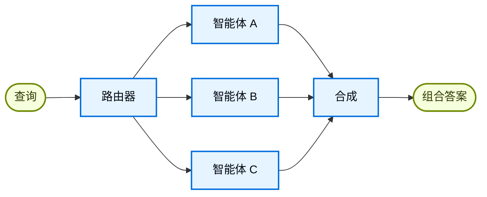

在**路由器**架构中，一个路由步骤对输入进行分类，并将其定向到专业化的[智能体](/oss/javascript/langchain/agents)。当你有不同的**垂直领域**（需要各自专属智能体的独立知识域）时，这特别有用。



## 关键特征

* 路由器分解查询
* 零个或多个专业智能体被并行调用
* 结果被合成为连贯的响应

## 何时使用

当你有不同的垂直领域（需要各自专属智能体的独立知识域）、需要并行查询多个来源、并且想要将结果合成为组合响应时，使用路由器模式。

## 基本实现

路由器对查询进行分类，并将其定向到适当的智能体。使用 [`Command`](/oss/javascript/langgraph/graph-api#command) 进行单智能体路由，或使用 [`Send`](/oss/javascript/langgraph/graph-api#send) 并行扇出到多个智能体。

<Tabs>
<Tab title="单个智能体">

使用 `Command` 路由到单个专业智能体：


```typescript
import { z } from "zod";
import { Command } from "@langchain/langgraph";

const ClassificationResult = z.object({
  query: z.string(),
  agent: z.string(),
});

function classifyQuery(query: string): z.infer<typeof ClassificationResult> {
  // 使用 LLM 对查询进行分类并确定合适的智能体
  // 分类逻辑在此
  ...
}

function routeQuery(state: z.infer<typeof ClassificationResult>) {
  const classification = classifyQuery(state.query);

  // 路由到选定的智能体
  return new Command({ goto: classification.agent });
}
```


</Tab>
<Tab title="多个智能体（并行）">

使用 `Send` 并行扇出到多个专业智能体：


```typescript
import { z } from "zod";
import { Command } from "@langchain/langgraph";

const ClassificationResult = z.object({
  query: z.string(),
  agent: z.string(),
});

function classifyQuery(query: string): z.infer<typeof ClassificationResult>[] {
  // 使用 LLM 对查询进行分类并确定合适的智能体
  // 分类逻辑在此
  ...
}

function routeQuery(state: typeof State.State) {
  const classifications = classifyQuery(state.query);

  // 并行扇出到选定的智能体
  return classifications.map(
    (c) => new Send(c.agent, { query: c.query })
  );
}
```


</Tab>
</Tabs>

如需完整实现，请参阅下面的教程。

<Card title="教程：使用路由构建多源知识库" icon="book" href="/oss/javascript/langchain/multi-agent/router-knowledge-base">
构建一个路由器，并行查询 GitHub、Notion 和 Slack，然后将结果合成为连贯的答案。涵盖状态定义、专业智能体、使用 `Send` 进行并行执行和结果合成。
</Card>

## 无状态 vs 有状态

两种方法：
* [**无状态路由器**](#无状态)独立处理每个请求
* [**有状态路由器**](#有状态)跨请求维护对话历史

## 无状态

每个请求被独立路由——调用之间没有记忆。如需多轮对话，请参阅[有状态路由器](#有状态)。

<Tip>
**路由器 vs 子智能体**：两种模式都可以将工作分发给多个智能体，但它们在路由决策的方式上有所不同：

- **路由器**：一个专用的路由步骤（通常是单次 LLM 调用或基于规则的逻辑）对输入进行分类并分发给智能体。路由器本身通常不维护对话历史或执行多轮编排——它是一个预处理步骤。
- **子智能体**：一个主管智能体动态决定在持续对话中调用哪些[子智能体](/oss/javascript/langchain/multi-agent/subagents)。主智能体维护上下文，可以跨轮次调用多个子智能体，并编排复杂的多步工作流。

当你有明确的输入类别并希望确定性或轻量级分类时，使用**路由器**。当你需要灵活的、感知对话的编排，让 LLM 根据不断演变的上下文决定下一步时，使用**主管**。
</Tip>


## 有状态

对于多轮对话，你需要跨调用维护上下文。

### 工具包装

最简单的方法：将无状态路由器包装为会话智能体可以调用的工具。会话智能体处理记忆和上下文；路由器保持无状态。这避免了跨多个并行智能体管理对话历史的复杂性。


```typescript
const searchDocs = tool(
  async ({ query }) => {
    const result = await workflow.invoke({ query }); // [!code highlight]
    return result.finalAnswer;
  },
  {
    name: "search_docs",
    description: "Search across multiple documentation sources",
    schema: z.object({
      query: z.string().describe("The search query"),
    }),
  }
);

// 会话智能体使用路由器作为工具
const conversationalAgent = createAgent({
  model,
  tools: [searchDocs],
  systemPrompt: "You are a helpful assistant. Use search_docs to answer questions.",
});
```


### 完整持久化

如果你需要路由器本身维护状态，使用[持久化](/oss/javascript/langchain/short-term-memory)来存储消息历史。当路由到智能体时，从状态中获取先前的消息，并选择性地将它们包含在智能体的上下文中——这是[上下文工程](/oss/javascript/langchain/context-engineering)的一个杠杆。

<Warning>
**有状态路由器需要自定义历史管理。** 如果路由器在不同轮次之间切换智能体，当智能体有不同的语气或提示词时，对话对终端用户来说可能不够流畅。使用并行调用时，你需要在路由器层面维护历史（输入和合成输出），并在路由逻辑中利用这些历史。考虑使用[交接模式](/oss/javascript/langchain/multi-agent/handoffs)或[子智能体模式](/oss/javascript/langchain/multi-agent/subagents)代替——两者都为多轮对话提供了更清晰的语义。
</Warning>

---

<div className="source-links">
<Callout icon="terminal-2">
    [连接这些文档](/use-these-docs)到 Claude、VSCode 等，通过 MCP 获取实时答案。
</Callout>
<Callout icon="edit">
    [在 GitHub 上编辑此页面](https://github.com/langchain-ai/docs/edit/main/src/oss/langchain/multi-agent/router.mdx)或[提交 issue](https://github.com/langchain-ai/docs/issues/new/choose)。
</Callout>
</div>
