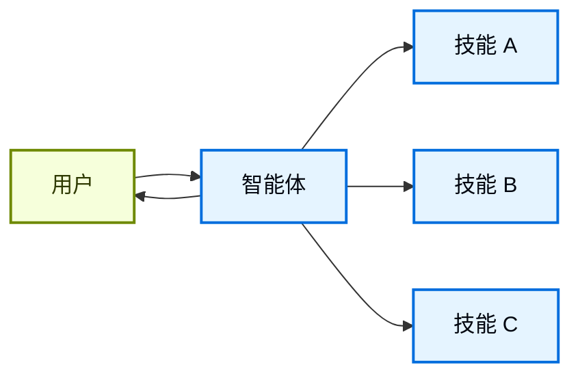

在**技能**架构中，专业化的能力被打包为可调用的"技能"来增强[智能体](/oss/javascript/langchain/agents)的行为。技能主要是提示词驱动的专业化，智能体可以按需调用。
如需内置的技能支持，请参阅 [Deep Agents](/oss/javascript/deepagents/skills)。

<Tip>
这种模式在概念上与 [Agent Skills](https://agentskills.io/) 和 [llms.txt](https://llmstxt.org/)（由 Jeremy Howard 提出）相同，后者使用工具调用来渐进式披露文档。技能模式将渐进式披露应用于专业化的提示词和领域知识，而不仅仅是文档页面。

如需现成的技能来提升你的智能体在 LangChain 生态系统任务上的表现，请参阅 [LangChain Skills](https://github.com/langchain-ai/langchain-skills) 仓库。
</Tip>



## 关键特征

* 提示词驱动的专业化：技能主要由专业化的提示词定义
* 渐进式披露：技能根据上下文或用户需求变得可用
* 团队分发：不同团队可以独立开发和维护技能
* 轻量级组合：技能比完整的子智能体更简单
* 引用感知：技能可以引用脚本、模板和其他资源

## 何时使用

当你希望单个[智能体](/oss/javascript/langchain/agents)拥有多种可能的专业化、不需要在技能之间强制执行特定约束、或者不同团队需要独立开发能力时，使用技能模式。常见示例包括编码助手（不同语言或任务的技能）、知识库（不同领域的技能）和创作助手（不同格式的技能）。

## 基本实现


```typescript
import { tool, createAgent } from "langchain";
import * as z from "zod";

const loadSkill = tool(
  async ({ skillName }) => {
    // 从文件/数据库加载技能内容
    return "";
  },
  {
    name: "load_skill",
    description: `Load a specialized skill.

Available skills:
- write_sql: SQL query writing expert
- review_legal_doc: Legal document reviewer

Returns the skill's prompt and context.`,
    schema: z.object({
      skillName: z
        .string()
        .describe("Name of skill to load")
    })
  }
);

const agent = createAgent({
  model: "gpt-5.4",
  tools: [loadSkill],
  systemPrompt: (
    "You are a helpful assistant. " +
    "You have access to two skills: " +
    "write_sql and review_legal_doc. " +
    "Use load_skill to access them."
  ),
});
```


如需完整实现，请参阅下面的教程。

<Card
    title="教程：使用按需技能构建 SQL 助手"
    icon="wand"
    href="/oss/javascript/langchain/multi-agent/skills-sql-assistant"
    arrow cta="了解更多"
>
    学习如何实现具有渐进式披露的技能，其中智能体按需而非预先加载专业化的提示词和模式。
</Card>

## 扩展模式

在编写自定义实现时，你可以通过多种方式扩展基本技能模式：

- **动态工具注册**：将渐进式披露与状态管理结合，在技能加载时注册新[工具](/oss/javascript/langchain/tools)。例如，加载"database_admin"技能可以同时添加专业上下文和注册数据库特定工具（备份、恢复、迁移）。这使用了多智能体模式中通用的工具和状态机制——工具更新状态来动态改变智能体能力。

- **层级技能**：技能可以在树形结构中定义其他技能，创建嵌套的专业化。例如，加载"data_science"技能可能会使"pandas_expert"、"visualization"和"statistical_analysis"等子技能变得可用。每个子技能可以按需独立加载，允许对领域知识进行细粒度的渐进式披露。这种层级方法通过将能力组织成逻辑分组来帮助管理大型知识库，这些分组可以按需发现和加载。

- **引用感知**：虽然每个技能只有一个提示词，但这个提示词可以引用其他资源的位置，并提供关于智能体何时应该使用这些资源的信息。
当这些资源变得相关时，智能体会知道这些文件存在，并在需要时将它们读入内存以完成任务。
这也遵循渐进式披露模式，限制了上下文窗口中的信息。

---

<div className="source-links">
<Callout icon="terminal-2">
    [连接这些文档](/use-these-docs)到 Claude、VSCode 等，通过 MCP 获取实时答案。
</Callout>
<Callout icon="edit">
    [在 GitHub 上编辑此页面](https://github.com/langchain-ai/docs/edit/main/src/oss/langchain/multi-agent/skills.mdx)或[提交 issue](https://github.com/langchain-ai/docs/issues/new/choose)。
</Callout>
</div>
