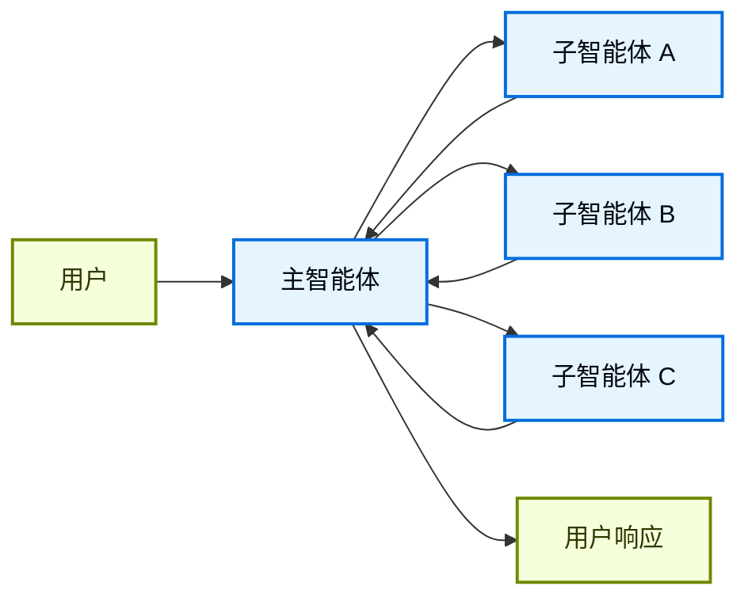
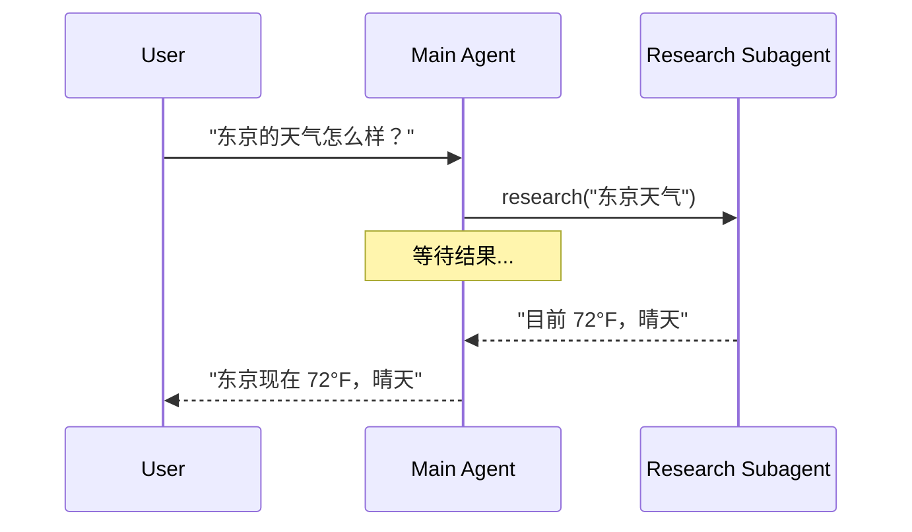
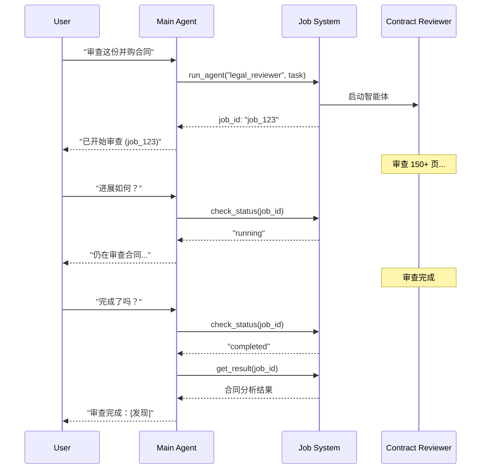
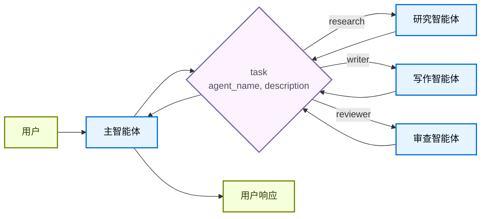

在**子智能体**架构中，一个中央主[智能体](/oss/javascript/langchain/agents)（通常称为**主管**）通过将子智能体作为[工具](/oss/javascript/langchain/tools)来调用进行协调。主智能体决定调用哪个子智能体、提供什么输入、以及如何组合结果。子智能体是无状态的——它们不记住过去的交互，所有对话记忆都由主智能体维护。这提供了[上下文](/oss/javascript/langchain/context-engineering)隔离：每次子智能体调用都在干净的上下文窗口中工作，防止主对话中的上下文膨胀。

如需内置的子智能体支持，请参阅 [Deep Agents](/oss/javascript/deepagents/subagents)。



## 关键特征

* 集中控制：所有路由都经过主智能体
* 不与用户直接交互：子智能体将结果返回给主智能体，而非用户（但你可以在子智能体中使用[中断](/oss/javascript/langgraph/interrupts#pause-using-interrupt)来允许用户交互）
* 通过工具调用子智能体：子智能体通过工具被调用
* 并行执行：主智能体可以在单轮中调用多个子智能体

<Note>
**主管 vs 路由器**：主管智能体（本模式）与[路由器](/oss/javascript/langchain/multi-agent/router)不同。主管是一个完整的智能体，维护对话上下文并动态决定跨多轮调用哪些子智能体。路由器通常是一个单一的分类步骤，将请求分发给智能体而不维护持续的对话状态。
</Note>

## 何时使用

当你有多个不同的领域（例如日历、电子邮件、CRM、数据库）、子智能体不需要与用户直接对话、或者你想要集中式的工作流控制时，使用子智能体模式。对于只有少数[工具](/oss/javascript/langchain/tools)的简单情况，使用[单一智能体](/oss/javascript/langchain/agents)。

<Tip>
**需要在子智能体内进行用户交互？** 虽然子智能体通常将结果返回给主智能体而不是直接与用户对话，但你可以在子智能体中使用[中断](/oss/javascript/langgraph/interrupts#pause-using-interrupt)来暂停执行并收集用户输入。当子智能体在继续之前需要澄清或批准时，这很有用。主智能体仍然是编排者，但子智能体可以在任务执行过程中从用户那里收集信息。
</Tip>

## 基本实现

核心机制是将子智能体包装为主智能体可以调用的工具：


```typescript
import { createAgent, tool } from "langchain";
import { z } from "zod";

// 创建子智能体
const subagent = createAgent({ model: "google_genai:gemini-3.1-pro-preview", tools: [...] });

// 将其包装为工具
const callResearchAgent = tool(
  async ({ query }) => {
    const result = await subagent.invoke({
      messages: [{ role: "user", content: query }]
    });
    return result.messages.at(-1)?.content;
  },
  {
    name: "research",
    description: "Research a topic and return findings",
    schema: z.object({ query: z.string() })
  }
);

// 主智能体使用子智能体作为工具
const mainAgent = createAgent({ model: "google_genai:gemini-3.1-pro-preview", tools: [callResearchAgent] });
```


<Card
    title="教程：使用子智能体构建个人助手"
    icon="sitemap"
    href="/oss/javascript/langchain/multi-agent/subagents-personal-assistant"
    arrow cta="了解更多"
>
    学习如何使用子智能体模式构建个人助手，其中中央主智能体（主管）协调专业化的工作者智能体。
</Card>

## 设计决策

在实现子智能体模式时，你需要做出几个关键的设计选择。下表总结了这些选项——每个选项在下面的章节中都有详细介绍。

| 决策 | 选项 |
|----------|---------|
| [**同步 vs 异步**](#同步-vs-异步) | 同步（阻塞）vs 异步（后台） |
| [**工具模式**](#工具模式) | 每个智能体一个工具 vs 单一调度工具 |
| [**子智能体规格**](#子智能体规格) | 系统提示词 vs 枚举约束 vs 基于工具的发现（仅限单一调度工具） |
| [**子智能体输入**](#子智能体输入) | 仅查询 vs 完整上下文 |
| [**子智能体输出**](#子智能体输出) | 子智能体结果 vs 完整对话历史 |

## 同步 vs 异步

子智能体执行可以是**同步的**（阻塞）或**异步的**（后台）。你的选择取决于主智能体是否需要结果才能继续。

| 模式 | 主智能体行为 | 适用场景 | 权衡 |
|------|---------------------|----------|----------|
| **同步** | 等待子智能体完成 | 主智能体需要结果才能继续 | 简单，但阻塞对话 |
| **异步** | 子智能体在后台运行时继续 | 独立任务，用户不应等待 | 响应快，但更复杂 |

<Tip>
不要与 Python 的 `async`/`await` 混淆。这里的"异步"意味着主智能体启动一个后台作业（通常在单独的进程或服务中）并在不阻塞的情况下继续。
</Tip>

### 同步（默认）

默认情况下，子智能体调用是**同步的**：主智能体等待每个子智能体完成后才继续。当主智能体的下一步操作依赖于子智能体的结果时使用同步。



**何时使用同步：**
- 主智能体需要子智能体的结果来构建响应
- 任务有顺序依赖（例如，获取数据 → 分析 → 响应）
- 子智能体失败应阻塞主智能体的响应

**权衡：**
- 实现简单——只需调用并等待
- 在所有子智能体完成之前用户看不到响应
- 长时间运行的任务会冻结对话

### 异步

当子智能体的工作是独立的——主智能体不需要结果来继续与用户对话时，使用**异步执行**。主智能体启动后台作业并保持响应。



**何时使用异步：**
- 子智能体的工作独立于主对话流
- 用户应该能够在工作进行时继续聊天
- 你想并行运行多个独立任务

**三工具模式：**
1. **启动作业**：启动后台任务，返回作业 ID
2. **检查状态**：返回当前状态（pending、running、completed、failed）
3. **获取结果**：检索已完成的结果

**处理作业完成：** 当作业完成时，你的应用需要通知用户。一种方法：显示一个通知，点击时发送类似"检查 job_123 并总结结果"的 `HumanMessage`。

## 工具模式

有两种主要方式将子智能体暴露为工具：

| 模式 | 适用场景 | 权衡 |
|---------|----------|-----------|
| [**每个智能体一个工具**](#每个智能体一个工具) | 对每个子智能体输入/输出的精细控制 | 设置更多，但自定义程度更高 |
| [**单一调度工具**](#单一调度工具) | 多智能体、分布式团队、约定优于配置 | 组合更简单，每个智能体的自定义较少 |

### 每个智能体一个工具


关键思想是将子智能体包装为主智能体可以调用的工具：


```typescript
import { createAgent, tool } from "langchain";
import * as z from "zod";

// 创建子智能体
const subagent = createAgent({...});  // [!code highlight]

// 将其包装为工具  // [!code highlight]
const callSubagent = tool(  // [!code highlight]
  async ({ query }) => {  // [!code highlight]
    const result = await subagent.invoke({
      messages: [{ role: "user", content: query }]
    });
    return result.messages.at(-1)?.text;
  },
  {
    name: "subagent_name",
    description: "subagent_description",
    schema: z.object({
      query: z.string().describe("The query to send to subagent")
    })
  }
);

// 主智能体使用子智能体作为工具  // [!code highlight]
const mainAgent = createAgent({ model, tools: [callSubagent] });  // [!code highlight]
```


当主智能体决定任务与子智能体的描述匹配时，它会调用子智能体工具，接收结果，并继续编排。请参阅[上下文工程](#上下文工程)了解精细控制。

### 单一调度工具

另一种方法使用单个参数化工具为独立任务调用临时子智能体。与[每个智能体一个工具](#每个智能体一个工具)方法不同（每个子智能体被包装为单独的工具），这使用基于约定的方法和单一的 `task` 工具：任务描述作为人类消息传递给子智能体，子智能体的最终消息作为工具结果返回。

当你想要跨多个团队分发智能体开发、需要将复杂任务隔离到单独的上下文窗口、需要可扩展的方式在不修改协调器的情况下添加新智能体、或者偏好约定而非自定义时，使用此方法。这种方法以灵活的上下文工程换取智能体组合的简单性和强大的上下文隔离。



**关键特征：**

* 单一任务工具：一个可以按名称调用任何已注册子智能体的参数化工具
* 基于约定的调用：按名称选择智能体，任务作为人类消息传递，最终消息作为工具结果返回
* 团队分发：不同团队可以独立开发和部署智能体
* 智能体发现：子智能体可以通过系统提示词发现（列出可用智能体），或通过[渐进式披露](/oss/javascript/langchain/multi-agent/skills-sql-assistant)（通过工具按需加载智能体信息）

<Tip>
这种方法的一个有趣之处在于，子智能体可能与主智能体拥有完全相同的能力。在这种情况下，调用子智能体**真正的目的是上下文隔离**——允许复杂的多步任务在隔离的上下文窗口中运行，而不会膨胀主智能体的对话历史。子智能体自主完成工作并只返回简洁的摘要，保持主线程的聚焦和高效。
</Tip>

<Accordion title="带任务调度器的智能体注册表">


```typescript
import { tool, createAgent } from "langchain";
import * as z from "zod";

// 由不同团队开发的子智能体
const researchAgent = createAgent({
  model: "gpt-5.4",
  prompt: "You are a research specialist...",
});

const writerAgent = createAgent({
  model: "gpt-5.4",
  prompt: "You are a writing specialist...",
});

// 可用子智能体的注册表
const SUBAGENTS = {
  research: researchAgent,
  writer: writerAgent,
};

const task = tool(
  async ({ agentName, description }) => {
    const agent = SUBAGENTS[agentName];
    const result = await agent.invoke({
      messages: [
        { role: "user", content: description }
      ],
    });
    return result.messages.at(-1)?.content;
  },
  {
    name: "task",
    description: `Launch an ephemeral subagent.

Available agents:
- research: Research and fact-finding
- writer: Content creation and editing`,
    schema: z.object({
      agentName: z
        .string()
        .describe("Name of agent to invoke"),
      description: z
        .string()
        .describe("Task description"),
    }),
  }
);

// 主协调智能体
const mainAgent = createAgent({
  model: "gpt-5.4",
  tools: [task],
  prompt: (
    "You coordinate specialized sub-agents. " +
    "Available: research (fact-finding), " +
    "writer (content creation). " +
    "Use the task tool to delegate work."
  ),
});
```


</Accordion>

## 上下文工程

控制上下文如何在主智能体和其子智能体之间流动：

| 类别 | 目的 | 影响 |
|----------|---------|---------|
| [**子智能体规格**](#子智能体规格) | 确保子智能体在应该被调用时被调用 | 主智能体的路由决策 |
| [**子智能体输入**](#子智能体输入) | 确保子智能体能以优化的上下文良好执行 | 子智能体性能 |
| [**子智能体输出**](#子智能体输出) | 确保主管能基于子智能体结果采取行动 | 主智能体性能 |

另请参阅我们关于智能体[上下文工程](/oss/javascript/langchain/context-engineering)的综合指南。

### 子智能体规格

与子智能体关联的**名称**和**描述**是主智能体了解要调用哪些子智能体的主要方式。这些是提示词杠杆——请仔细选择。

* **名称**：主智能体如何引用子智能体。保持清晰和面向操作（例如 `research_agent`、`code_reviewer`）。
* **描述**：主智能体对子智能体能力的了解。具体说明它处理什么任务以及何时使用它。

对于[单一调度工具](#单一调度工具)设计，你还需要为主智能体提供关于它可以调用的子智能体的信息。
你可以根据智能体数量以及注册表是静态还是动态来以不同方式提供这些信息：

| 方法 | 适用场景 | 权衡 |
|--------|----------|----------|
| **系统提示词枚举** | 小型静态智能体列表（< 10 个智能体） | 简单，但智能体变更时需要更新提示词 |
| **枚举约束** | 小型静态智能体列表（< 10 个智能体） | 类型安全且明确，但智能体变更时需要修改代码 |
| **基于工具的发现** | 大型或动态智能体注册表 | 灵活且可扩展，但增加复杂性 |

#### 系统提示词枚举

直接在主智能体的系统提示词中列出可用智能体。主智能体将智能体列表和描述视为其指令的一部分。

**何时使用：**
- 你有一组小型固定的智能体（< 10）
- 智能体注册表很少变化
- 你想要最简单的实现

**示例：**
```python
main_agent = create_agent(
    model="...",
    tools=[task],
    system_prompt=(
        "You coordinate specialized sub-agents. "
        "Available agents:\n"
        "- research: Research and fact-finding\n"
        "- writer: Content creation and editing\n"
        "- reviewer: Code and document review\n"
        "Use the task tool to delegate work."
    ),
)
```

#### 调度工具上的枚举约束

在调度工具的 `agent_name` 参数上添加枚举约束。这提供了类型安全性，并使可用智能体在工具模式中显式化。

**何时使用：**
- 你有一组小型固定的智能体（< 10）
- 你想要类型安全和明确的智能体名称
- 你偏好基于模式的验证而非基于提示词的引导

**示例：**
```python
from enum import Enum

class AgentName(str, Enum):
    RESEARCH = "research"
    WRITER = "writer"
    REVIEWER = "reviewer"

@tool
def task(
    agent_name: AgentName,  # 枚举约束
    description: str
) -> str:
    """Launch an ephemeral subagent for a task."""
    # ...
```

#### 基于工具的发现

提供一个单独的工具（例如 `list_agents` 或 `search_agents`），主智能体可以调用它来按需发现可用智能体。这实现了渐进式披露并支持动态注册表。

**何时使用：**
- 你有很多智能体（> 10）或不断增长的注册表
- 智能体注册表经常变化或是动态的
- 你想减少提示词大小和 Token 使用
- 不同团队独立管理不同的智能体

**示例：**
```python
@tool
def list_agents(query: str = "") -> str:
    """List available subagents, optionally filtered by query."""
    agents = search_agent_registry(query)
    return format_agent_list(agents)

@tool
def task(agent_name: str, description: str) -> str:
    """Launch an ephemeral subagent for a task."""
    # ...

main_agent = create_agent(
    model="...",
    tools=[task, list_agents],
    system_prompt="Use list_agents to discover available subagents, then use task to invoke them."
)
```

### 子智能体输入

自定义子智能体接收什么上下文来执行其任务。添加静态提示词中不实际捕获的输入——完整消息历史、先前结果或任务元数据——通过从智能体的状态中提取。


```typescript Subagent inputs example expandable
import { createAgent, tool, AgentState, ToolMessage } from "langchain";
import { Command } from "@langchain/langgraph";
import * as z from "zod";

// 通过状态将完整对话历史传递给子智能体的示例
const callSubagent1 = tool(
  async ({query}) => {
    const state = getCurrentTaskInput<AgentState>();
    // 应用任何需要的逻辑来将消息转换为合适的输入
    const subAgentInput = someLogic(query, state.messages);
    const result = await subagent1.invoke({
      messages: subAgentInput,
      // 你也可以在这里传递其他状态键。
      // 确保在主智能体和子智能体的
      // 状态模式中都定义了这些键。
      exampleStateKey: state.exampleStateKey
    });
    return result.messages.at(-1)?.content;
  },
  {
    name: "subagent1_name",
    description: "subagent1_description",
  }
);
```


### 子智能体输出

自定义主智能体收到什么回来，以便它能做出好的决策。两种策略：

1. **提示子智能体**：明确指定应该返回什么。一个常见的失败模式是子智能体执行了工具调用或推理但没有在最终消息中包含结果——提醒它主管只能看到最终输出。
2. **在代码中格式化**：在返回前调整或丰富响应。例如，使用 [`Command`](/oss/javascript/langgraph/graph-api#command) 除了最终文本外还传回特定的状态键。


```typescript Subagent outputs example expandable
import { tool, ToolMessage } from "langchain";
import { Command } from "@langchain/langgraph";
import * as z from "zod";

const callSubagent1 = tool(
  async ({ query }, config) => {
    const result = await subagent1.invoke({
      messages: [{ role: "user", content: query }]
    });

    // 返回 Command 以更新多个状态键
    return new Command({
      update: {
        // 从子智能体传回额外状态
        exampleStateKey: result.exampleStateKey,
        messages: [
          new ToolMessage({
            content: result.messages.at(-1)?.text,
            tool_call_id: config.toolCall?.id!
          })
        ]
      }
    });
  },
  {
    name: "subagent1_name",
    description: "subagent1_description",
    schema: z.object({
      query: z.string().describe("The query to send to subagent1")
    })
  }
);
```


## 检查点和状态检查

默认情况下，子智能体使用**继承检查点**模式——每次调用以全新状态开始，支持[中断](/oss/javascript/langgraph/interrupts#pause-using-interrupt)，并且可以安全地并行运行。如果你需要子智能体跨调用维护自己的持久对话历史，请使用 `checkpointer=True`（延续模式）编译它。请参阅[子图持久化](/oss/javascript/langgraph/use-subgraphs#subgraph-persistence)了解各模式的完整比较。

因为子智能体是在工具函数内部调用的，LangGraph 无法[静态发现](/oss/javascript/langgraph/use-subgraphs#view-subgraph-state)它们。这意味着使用 `subgraphs` 的 [`get_state`](/oss/javascript/langgraph/use-subgraphs#view-subgraph-state) 不会返回子智能体状态。如果你需要读取嵌套图的状态（例如在[中断](/oss/javascript/langgraph/interrupts#pause-using-interrupt)期间），请在自定义图中从[节点函数](/oss/javascript/langgraph/use-subgraphs#call-a-subgraph-inside-a-node)调用子智能体。请参阅[子图持久化](/oss/javascript/langgraph/use-subgraphs#subgraph-persistence)了解每种模式如何影响状态可见性。

---

<div className="source-links">
<Callout icon="terminal-2">
    [连接这些文档](/use-these-docs)到 Claude、VSCode 等，通过 MCP 获取实时答案。
</Callout>
<Callout icon="edit">
    [在 GitHub 上编辑此页面](https://github.com/langchain-ai/docs/edit/main/src/oss/langchain/multi-agent/subagents.mdx)或[提交 issue](https://github.com/langchain-ai/docs/issues/new/choose)。
</Callout>
</div>
