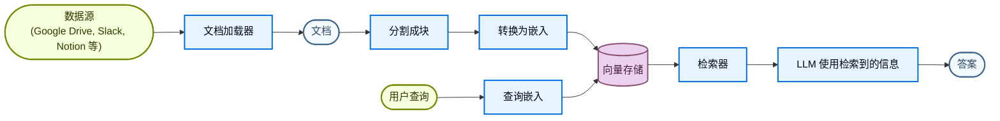
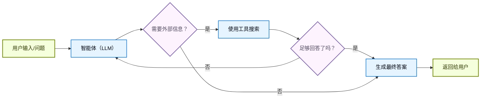
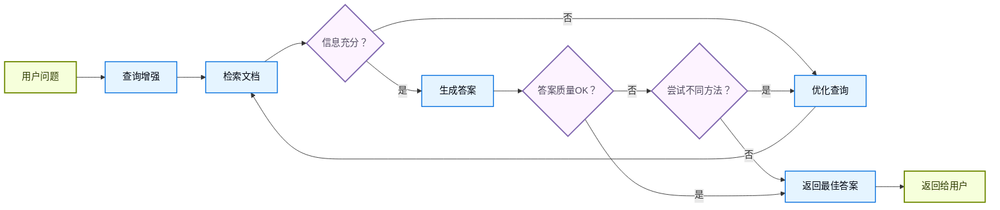

大语言模型（LLM）非常强大，但它们有两个关键限制：

* **有限的上下文**——它们无法一次性处理整个语料库。
* **静态知识**——它们的训练数据在某个时间点被冻结。

检索通过在查询时获取相关的外部知识来解决这些问题。这是**检索增强生成（RAG）**的基础：用特定于上下文的信息增强 LLM 的答案。


## 构建知识库

**知识库**是在检索过程中使用的文档或结构化数据的存储库。

如果你需要自定义知识库，可以使用 LangChain 的文档加载器和向量存储从你自己的数据构建一个。

<Note>
    如果你已经有知识库（例如 SQL 数据库、CRM 或内部文档系统），你**不**需要重建它。你可以：
    - 将其作为智能体 RAG 中的**工具**连接。
    - 查询它并将检索到的内容作为上下文提供给 LLM [（两步 RAG）](#两步-rag)。
</Note>

请参阅以下教程以构建可搜索的知识库和最小 RAG 工作流：

<Card
    title="教程：语义搜索"
    icon="database"
    href="/oss/javascript/langchain/knowledge-base"
    arrow cta="了解更多"
>
    学习如何使用 LangChain 的文档加载器、嵌入和向量存储从你自己的数据创建可搜索的知识库。
    在本教程中，你将构建一个基于 PDF 的搜索引擎，能够检索与查询相关的段落。你还将在这个引擎之上实现一个最小的 RAG 工作流，以了解如何将外部知识整合到 LLM 推理中。
</Card>

### 从检索到 RAG

检索使 LLM 能够在运行时访问相关上下文。但大多数实际应用更进一步：它们**将检索与生成整合**以产生有根据的、上下文感知的答案。

这是**检索增强生成（RAG）**的核心思想。检索管道成为更广泛系统的基础，该系统将搜索与生成相结合。

### 检索管道

典型的检索工作流如下所示：



每个组件都是模块化的：你可以在不重写应用逻辑的情况下替换加载器、分割器、嵌入或向量存储。

### 构建模块

<Columns cols={2}>
    <Card
        title="文档加载器"
        icon="file-import"
        href="/oss/javascript/integrations/document_loaders"
        arrow cta="了解更多"
    >
        从外部数据源（Google Drive、Slack、Notion 等）摄取数据，返回标准化的 [`Document`](https://reference.langchain.com/javascript/langchain-core/documents/Document) 对象。
    </Card>


    <Card
        title="嵌入模型"
        icon="sitemap"
        href="/oss/javascript/integrations/embeddings"
        arrow
        cta="了解更多"
    >
        嵌入模型将文本转换为数字向量，使含义相似的文本在该向量空间中彼此靠近。
    </Card>

    <Card
        title="向量存储"
        icon="database"
        href="/oss/javascript/integrations/vectorstores/"
        arrow
        cta="了解更多"
    >
        用于存储和搜索嵌入的专用数据库。
    </Card>

    <Card
        title="检索器"
        icon="binoculars"
        href="/oss/javascript/integrations/retrievers/"
        arrow
        cta="了解更多"
    >
        检索器是给定非结构化查询返回文档的接口。
    </Card>
</Columns>

## RAG 架构

RAG 可以根据系统需求以多种方式实现。我们在下面的章节中概述了每种类型。

| 架构            | 描述                                                                | 控制力   | 灵活性 | 延迟        | 示例用例                                   |
|-------------------------|----------------------------------------------------------------------------|-----------|-------------|----------------|----------------------------------------------------|
| **两步 RAG**          | 检索总是在生成之前进行。简单且可预测         | ✅ 高    | ❌ 低       | ⚡ 快速         | FAQ、文档机器人                           |
| **智能体 RAG**         | 由 LLM 驱动的智能体在推理过程中决定*何时*以及*如何*检索 | ❌ 低     | ✅ 高      | ⏳ 可变     | 拥有多工具访问权限的研究助手  |
| **混合型**              | 结合两种方法的特点并带有验证步骤          | ⚖️ 中等 | ⚖️ 中等   | ⏳ 可变     | 带有质量验证的领域特定问答        |

<Info>
**延迟**：在**两步 RAG** 中延迟通常更**可预测**，因为 LLM 调用的最大次数是已知且有上限的。这种可预测性假设 LLM 推理时间是主导因素。然而，实际延迟也可能受到检索步骤性能的影响——如 API 响应时间、网络延迟或数据库查询——这些可能因使用的工具和基础设施而异。
</Info>

### 两步 RAG

在**两步 RAG** 中，检索步骤总是在生成步骤之前执行。这种架构简单直观且可预测，适用于文档检索明确是生成答案前提条件的许多应用。


<Card
    title="教程：检索增强生成（RAG）"
    icon="robot"
    href="/oss/javascript/langchain/rag#rag-chains"
    arrow cta="了解更多"
>
    了解如何构建一个能够回答基于你的数据的问题的问答聊天机器人，使用检索增强生成。
    本教程介绍了两种方法：
    * **RAG 智能体**：使用灵活工具运行搜索——适合通用场景。
    * **两步 RAG** 链：每次查询只需一次 LLM 调用——对于简单任务快速高效。
</Card>

### 智能体 RAG

**智能体检索增强生成（RAG）**结合了检索增强生成与基于智能体的推理的优势。智能体（由 LLM 驱动）不是在回答之前检索文档，而是逐步推理并在交互过程中决定**何时**以及**如何**检索信息。

<Tip>
智能体启用 RAG 行为所需的唯一条件是访问一个或多个能够获取外部知识的**工具**——例如文档加载器、Web API 或数据库查询。
</Tip>




```typescript
import { tool, createAgent } from "langchain";

const fetchUrl = tool(
    (url: string) => {
        return `Fetched content from ${url}`;
    },
    { name: "fetch_url", description: "Fetch text content from a URL" }
);

const agent = createAgent({
    model: "claude-sonnet-4-0",
    tools: [fetchUrl],
    systemPrompt,
});
```


<Expandable title="扩展示例：LangGraph 的 llms.txt 智能体 RAG">

此示例实现了一个**智能体 RAG 系统**，用于帮助用户查询 LangGraph 文档。智能体首先加载 [llms.txt](https://llmstxt.org/)（其中列出了可用的文档 URL），然后可以根据用户的问题动态使用 `fetch_documentation` 工具检索和处理相关内容。


```typescript
import { tool, createAgent, HumanMessage } from "langchain";
import * as z from "zod";

const ALLOWED_DOMAINS = ["https://langchain-ai.github.io/"];
const LLMS_TXT = "https://langchain-ai.github.io/langgraph/llms.txt";

const fetchDocumentation = tool(
  async (input) => {  // [!code highlight]
    if (!ALLOWED_DOMAINS.some((domain) => input.url.startsWith(domain))) {
      return `Error: URL not allowed. Must start with one of: ${ALLOWED_DOMAINS.join(", ")}`;
    }
    const response = await fetch(input.url);
    if (!response.ok) {
      throw new Error(`HTTP error! status: ${response.status}`);
    }
    return response.text();
  },
  {
    name: "fetch_documentation",
    description: "Fetch and convert documentation from a URL",
    schema: z.object({
      url: z.string().describe("The URL of the documentation to fetch"),
    }),
  }
);

const llmsTxtResponse = await fetch(LLMS_TXT);
const llmsTxtContent = await llmsTxtResponse.text();

const systemPrompt = `
You are an expert TypeScript developer and technical assistant.
Your primary role is to help users with questions about LangGraph and related tools.

Instructions:

1. If a user asks a question you're unsure about—or one that likely involves API usage,
   behavior, or configuration—you MUST use the \`fetch_documentation\` tool to consult the relevant docs.
2. When citing documentation, summarize clearly and include relevant context from the content.
3. Do not use any URLs outside of the allowed domain.
4. If a documentation fetch fails, tell the user and proceed with your best expert understanding.

You can access official documentation from the following approved sources:

${llmsTxtContent}

You MUST consult the documentation to get up to date documentation
before answering a user's question about LangGraph.

Your answers should be clear, concise, and technically accurate.
`;

const tools = [fetchDocumentation];

const agent = createAgent({
  model: "claude-sonnet-4-0"
  tools,  // [!code highlight]
  systemPrompt,  // [!code highlight]
  name: "Agentic RAG",
});

const response = await agent.invoke({
  messages: [
    new HumanMessage(
      "Write a short example of a langgraph agent using the " +
      "prebuilt create react agent. the agent should be able " +
      "to look up stock pricing information."
    ),
  ],
});

console.log(response.messages.at(-1)?.content);
```

</Expandable>

<Card
    title="教程：检索增强生成（RAG）"
    icon="robot"
    href="/oss/javascript/langchain/rag"
    arrow cta="了解更多"
>
    了解如何构建一个能够回答基于你的数据的问题的问答聊天机器人，使用检索增强生成。
    本教程介绍了两种方法：
    * **RAG 智能体**：使用灵活工具运行搜索——适合通用场景。
    * **两步 RAG** 链：每次查询只需一次 LLM 调用——对于简单任务快速高效。
</Card>

### 混合 RAG

混合 RAG 结合了两步 RAG 和智能体 RAG 两者的特点。它引入了中间步骤，如查询预处理、检索验证和生成后检查。这些系统在提供比固定管道更多灵活性的同时，保持了对执行的一定控制。

典型组件包括：

* **查询增强**：修改输入问题以提高检索质量。这可能涉及重写不清楚的查询、生成多个变体或用额外上下文扩展查询。
* **检索验证**：评估检索到的文档是否相关且充分。如果不充分，系统可以优化查询并重新检索。
* **答案验证**：检查生成的答案的准确性、完整性以及与源内容的一致性。如果需要，系统可以重新生成或修改答案。

该架构通常支持这些步骤之间的多次迭代：



此架构适用于：

* 具有模糊或未充分指定查询的应用
* 需要验证或质量控制步骤的系统
* 涉及多个数据源或迭代优化的工作流

<Card
    title="教程：带自我纠正的智能体 RAG"
    icon="robot"
    href="/oss/javascript/langgraph/agentic-rag"
    arrow cta="了解更多"
>
    一个将智能体推理与检索和自我纠正相结合的**混合 RAG** 示例。
</Card>

---

<div className="source-links">
<Callout icon="terminal-2">
    [将这些文档连接](/use-these-docs)到 Claude、VSCode 等，通过 MCP 获取实时答案。
</Callout>
<Callout icon="edit">
    [在 GitHub 上编辑此页面](https://github.com/langchain-ai/docs/edit/main/src/oss/langchain/retrieval.mdx)或[提交问题](https://github.com/langchain-ai/docs/issues/new/choose)。
</Callout>
</div>