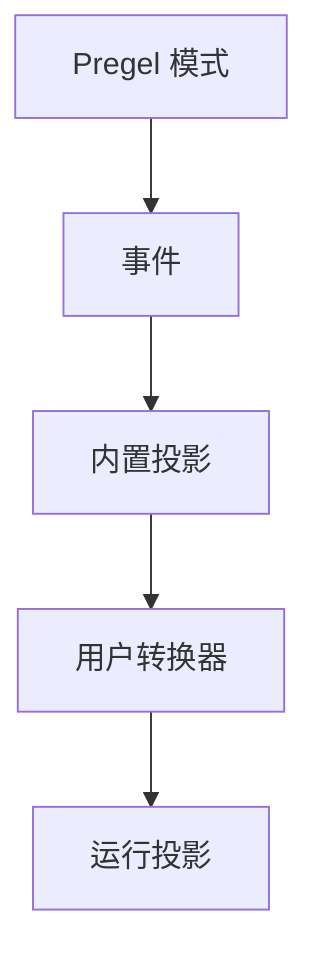

事件 Streaming 是大多数 LangGraph 应用代码推荐的进程内 Streaming 模型。它返回一个运行流对象，可以同时以多种方式消费。

## 快速开始


```ts
const stream = await graph.streamEvents(
  { messages: [{ role: "user", content: "What is 42 * 17?" }] },
  { version: "v3" }
);

for await (const message of stream.messages) {
  for await (const token of message.text) {
    process.stdout.write(token);
  }
}

const finalState = await stream.output;
```


要对部署在 Agent Server 后面的 Graph 进行 Streaming，请参阅 [LangSmith Streaming API](/langsmith/streaming)。

## 各部分如何协同工作

Streaming 栈有两个主要层次：

1. **Streaming** 从 Pregel 引擎发出原始的 Graph 执行事件。
2. **事件 Streaming** 对这些事件进行规范化，通过流转换器处理它们，并暴露类型化投影。

<div className="my-6 rounded-xl border bg-gray-50 p-4 dark:bg-gray-900">
  <div className="mx-auto max-w-2xl space-y-2 text-sm">
    <div className="rounded-lg border border-slate-300 bg-white p-3 text-center dark:border-slate-700 dark:bg-slate-950">
      <div className="font-semibold text-slate-900 dark:text-slate-100">Pregel 引擎</div>
      <div className="mt-1 text-xs text-slate-600 dark:text-slate-300">运行 Graph 步骤</div>
    </div>
    <div className="text-center text-xs font-medium uppercase tracking-wide text-slate-500 dark:text-slate-400">发出</div>
    <div className="rounded-lg border border-orange-300 bg-orange-50 p-3 text-center dark:border-orange-800 dark:bg-orange-950">
      <div className="font-semibold text-orange-900 dark:text-orange-100">原始 Pregel 事件</div>
      <div className="mt-1 text-xs text-orange-700 dark:text-orange-300"><code>updates</code>、<code>values</code>、<code>messages</code>、<code>custom</code>、<code>checkpoints</code>、<code>tasks</code>、<code>debug</code></div>
    </div>
    <div className="text-center text-xs font-medium uppercase tracking-wide text-slate-500 dark:text-slate-400">发送到</div>
    <div className="rounded-lg border border-blue-300 bg-blue-50 p-3 text-center dark:border-blue-800 dark:bg-blue-950">
      <div className="font-semibold text-blue-900 dark:text-blue-100">事件路由器</div>
      <div className="mt-1 text-xs text-blue-700 dark:text-blue-300">将每个事件通过转换器管道进行路由</div>
    </div>
    <div className="text-center text-xs font-medium uppercase tracking-wide text-slate-500 dark:text-slate-400">级联通过</div>
    <div className="rounded-lg border border-green-300 bg-green-50 p-3 dark:border-green-800 dark:bg-green-950">
      <div className="font-semibold text-green-900 dark:text-green-100">流转换器</div>
      <div className="mt-2 grid gap-2 text-xs text-green-800 dark:text-green-200 sm:grid-cols-4">
        <div className="rounded border border-green-200 bg-white px-2 py-1 dark:border-green-800 dark:bg-green-950">ValuesTransformer</div>
        <div className="rounded border border-green-200 bg-white px-2 py-1 dark:border-green-800 dark:bg-green-950">MessagesTransformer</div>
        <div className="px-2 py-1 text-center text-green-600 dark:text-green-300">...</div>
        <div className="rounded border border-green-200 bg-white px-2 py-1 dark:border-green-800 dark:bg-green-950">自定义转换器</div>
      </div>
    </div>
    <div className="text-center text-xs font-medium uppercase tracking-wide text-slate-500 dark:text-slate-400">生成</div>
    <div className="rounded-lg border border-purple-300 bg-purple-50 p-3 text-center dark:border-purple-800 dark:bg-purple-950">
      <div className="font-semibold text-purple-900 dark:text-purple-100">事件流</div>
      <div className="mt-1 text-xs text-purple-700 dark:text-purple-300">面向应用代码的投影事件</div>
    </div>
  </div>
</div>

事件路由器是两个层次之间的桥梁。它接收规范化的 Pregel 事件，并将每个事件传递给已注册的流转换器。内置转换器创建标准投影，例如 `stream.messages`、`stream.values`、`stream.subgraphs` 和 `stream.output`。自定义转换器可以在 `stream.extensions` 下添加特定于应用的投影。

## 事件 Streaming 提供了什么

运行流在一个底层事件流上暴露类型化投影：

| 投影 | 用途 |
| ---------- | --- |
| `stream` | 迭代每个协议事件。 |
| `stream.messages` | 流式传输 Chat Model 消息和 Token 增量。 |
| `stream.values` | 迭代状态快照并等待最终值。 |
| `stream.output` | 等待最终输出。 |
| `stream.subgraphs` | 发现和观察嵌套的 Graph 执行。 |
| `stream.interrupts` | 检查人机协作 Interrupt 载荷。 |
| `stream.interrupted` | 检查运行是否暂停等待人工输入。 |
| `stream.extensions` | 消费自定义流转换器投影。 |

多个消费者可以并发读取这些投影。读取 `stream.messages` 不会消耗 `stream.values`、`stream.subgraphs` 或 `stream.output` 所需的事件。

事件 Streaming 位于 [Streaming](/oss/javascript/langgraph/streaming) 之上一层，后者通过 `stream_mode` 模式（如 `updates`、`values`、`messages`、`custom`、`checkpoints`、`tasks` 和 `debug`）暴露原始的 Graph 执行事件。当你需要低级别访问这些模式时使用 Streaming；当应用代码受益于类型化投影时使用事件 Streaming。

## 流式传输消息

使用 `stream.messages` 获取 Chat Model 输出：


```ts
const stream = await graph.streamEvents(input, { version: "v3" });

for await (const message of stream.messages) {
  const text = await message.text;
  const usage = await message.usage;

  console.log(text);
  console.log(usage);
}
```


`message.text` 既是异步可迭代对象又是类 Promise 值。迭代它可获得逐 Token 的输出，或者等待它获取完整文本。


## 流式传输 Subgraph

使用 `stream.subgraphs` 观察嵌套的 Graph 工作，无需解析命名空间字符串：


```ts
const stream = await graph.streamEvents(input, { version: "v3" });

for await (const subgraph of stream.subgraphs) {
  console.log(subgraph.name, subgraph.path);

  for await (const message of subgraph.messages) {
    console.log(await message.text);
  }
}
```


有关产品特定的流，请参阅 [Deep Agents Streaming](/oss/javascript/deepagents/event-streaming) 了解子 Agent 流，以及 [LangChain Agent Streaming](/oss/javascript/langchain/streaming) 了解工具调用和 Middleware 事件。

## 流式传输状态

使用 `stream.values` 在每个步骤后流式传输完整状态快照：


```ts
const stream = await graph.streamEvents(input, { version: "v3" });

for await (const snapshot of stream.values) {
  console.log(snapshot);
}

const finalState = await stream.output;
```


## 流式传输多个投影


在 JavaScript 中需要多个投影时使用并发消费者：

```ts
await Promise.all([
  (async () => {
    for await (const message of stream.messages) {
      console.log(await message.text);
    }
  })(),
  (async () => {
    for await (const subgraph of stream.subgraphs) {
      console.log(subgraph.path);
    }
  })(),
]);
```


## Interrupt 后恢复

当 Graph 暂停等待人工输入时，检查 `stream.interrupted` 和 `stream.interrupts`，然后通过使用 `Command` 再次调用 `stream_events(..., version="v3")` 来恢复。

恢复需要使用 Checkpointer 编译的 Graph 和携带线程 ID 的配置 — 请参阅 [Persistence](/oss/javascript/langgraph/persistence)。


```ts
import { Command } from "@langchain/langgraph";

let stream = await graph.streamEvents(input, { version: "v3" });

for await (const message of stream.messages) {
  console.log(await message.text);
}

if (stream.interrupted) {
  console.log(stream.interrupts);
}

stream = await graph.streamEvents(
  new Command({ resume: { decisions: [{ type: "approve" }] } }),
  { version: "v3" }
);
const finalState = await stream.output;
```


## 流式传输所有协议事件

当你需要原始协议事件流时，使用运行对象本身：


```ts
const stream = await graph.streamEvents(
  { messages: [{ role: "user", content: "What is 42 * 17?" }] },
  { version: "v3" }
);

for await (const event of stream) {
  const namespace = event.params.namespace;
  console.log(namespace, event.method, event.params.data);
}
```


每个事件都是一个 `ProtocolEvent` 信封，包装了特定于通道的载荷。这与转换器的 `process(event)` 接收的形状相同。


```ts
interface ProtocolEvent {
  readonly seq: number;         // 在一次运行中严格递增；用于排序
  readonly method: string;      // 通道名称："messages"、"values"、"updates"、"custom"、"tools"、"lifecycle" 等
  readonly params: {
    readonly namespace: string[];  // 从根 Graph 到发出事件的作用域的 "<name>:<runtime_id>" 路径段；[] 表示根
    readonly timestamp: number;    // 挂钟时间毫秒数；可能有偏差，不要依赖它来排序
    readonly node?: string;        // 发出此事件的 Graph Node（如适用）
    readonly data: unknown;        // 特定于通道的载荷；形状取决于 `method`
  };
}
```


`namespace` 是从根 Graph 到发出事件的作用域的路径。根为空数组 `[]`。每个子执行添加一个 `"name:runtime_id"` 段，因此 Subgraph 内的嵌套工具调用看起来像 `["researcher:6f4d", "tools:91ac"]`。`:` 前面的名称是稳定的 Graph 或 Node 名称；后缀是每次调用的运行时 ID。当你只关心特定子树时，自行按命名空间过滤原始事件 — `stream.subgraphs` 已经为嵌套的 Graph 执行做了这件事。

## 通道和事件生命周期

原始事件在通道上流动。通道名称作为事件的 `method` 出现；每个通道发出特定的事件形状。

| 通道 | 用途 |
| ------- | ------- |
| `values` | 完整的 Graph 状态快照。 |
| `updates` | 每个 Node 的状态增量。 |
| `messages` | 基于内容块的 Chat Model 输出。 |
| `tools` | 工具调用开始、流式输出、完成和错误事件。 |
| `lifecycle` | 运行、Subgraph 和子 Agent 状态变更。 |
| `checkpoints` | 用于分支和时间旅行的轻量级 Checkpoint 信封。 |
| `input` | 人机协作输入请求和响应。 |
| `tasks` | Pregel 任务创建和结果事件。 |
| `custom` | 来自 Graph 代码的用户定义载荷。 |
| `custom:<name>` | 应用定义的流转换器输出。 |

类型化投影（`stream.messages`、`stream.values` 等）由这些通道构建。当你直接迭代运行对象时，通道名称作为原始事件的 `method` 字段出现。

### Messages

`messages` 通道将输出建模为内容块。数据的 `event` 字段是以下之一：

- `message-start`
- `content-block-start`
- `content-block-delta`
- `content-block-finish`
- `message-finish`

内容块有明确的边界：一个块开始，发出零个或多个增量，然后在同一消息中的下一个块开始之前完成。这使得 Token Streaming、推理块、工具调用块和多模态内容变得明确，而无需使用特定于提供商的格式。`message-finish` 可能包含 Token 用量；不可恢复的模型调用失败以消息错误事件的形式到达。

直接消费原始内容块事件而不使用 `stream.messages` 投影：


```ts
for await (const event of stream) {
  if (event.method !== "messages") continue;

  const data = event.params.data;
  if (data.event !== "content-block-delta") continue;

  const block = data.delta ?? {};
  if (block.type === "text-delta") {
    process.stdout.write(block.text ?? "");
  } else if (block.type === "reasoning-delta") {
    process.stdout.write(`[thinking]${block.reasoning ?? ""}`);
  }
}
```


### Tools

`tools` 通道暴露 Tool 执行。数据的 `event` 字段是以下之一：

- `tool-started`
- `tool-output-delta`
- `tool-finished`
- `tool-error`

Tool 事件通过工具调用 ID 关联，因此 Tool 执行可以追溯到其在 `messages` 通道上的原始工具调用内容块。

### Lifecycle

`lifecycle` 通道跟踪根运行、Subgraph 和子 Agent 状态。数据的 `event` 字段是以下之一：

- `started`
- `running`
- `completed`
- `failed`
- `interrupted`

除了 `event` 之外，生命周期数据可能包含可选的 `graph_name`、`error` 和描述子作用域启动原因（父工具调用、扇出发送、Edge 转换）的 `cause`。

## 构建你自己的投影

流转换器是事件 Streaming 中的投影层。它们观察协议事件，维护自己的状态，并暴露运行的派生视图 — 例如 Tool 活动、Token 总计、进度事件、工件或另一个协议的消息。`StreamChannel` 是转换器用来发布这些视图的投影原语。

内置投影（`stream.messages`、`stream.values`、`stream.subgraphs`、`stream.output`）和产品特定投影（LangChain 的 `stream.tool_calls`、Deep Agents 的 `stream.subagents`）本身就是使用相同契约的转换器。用户转换器通过编译时或调用时注册叠加在顶部，其投影出现在 `stream.extensions` 下。

当现有投影与应用需要的形状不匹配时，编写一个新的转换器。

### 转换器如何工作

事件 Streaming 从 LangGraph Pregel 引擎的 Streaming 输出开始。运行时将这些块规范化为协议事件，然后流处理器将每个事件路由通过流转换器栈。



流处理器是一个流的中央调度器。对于每个协议事件，它：

1. 按顺序调用每个已注册转换器的 `process(event)` 钩子。
2. 将命名 `StreamChannel` 的推送连接回协议事件流。
3. 将事件存储在运行流中，除非转换器抑制了它。
4. 当运行结束时对每个转换器调用 `finalize()` 或 `fail()`。

转换器是观察性的。它们不会回调 Graph 运行时。相反，它们消费事件并将派生值推送到 `StreamChannel`、Promise 或其他投影对象中。

### 转换器形状

转换器实现 `StreamTransformer` 接口：


```ts
interface StreamTransformer<TProjection = unknown> {
  init(): TProjection;
  process(event: ProtocolEvent): boolean;
  finalize?(): void | PromiseLike<void>;
  fail?(err: unknown): void;
}
```


- `init()` 创建投影对象。用户转换器投影出现在 `stream.extensions` 下。
- `process()` 观察每个协议事件。有关 `ProtocolEvent` 形状，请参阅[流式传输所有协议事件](#stream-all-protocol-events)。仅当你有意要抑制原始事件时才返回 `false`。
- `finalize()` 在成功的流之后关闭或解析非通道投影。
- `fail()` 将错误传播到非通道投影。

### 声明所需的流模式

`required_stream_modes` 控制底层 Graph 在 Streaming 期间发出哪些 Pregel 流模式。运行时取所有已注册转换器的 `required_stream_modes` 的并集，并将该并集作为 `stream_mode` 参数传递给 Graph 的 `.stream()` 调用。**没有转换器请求的模式永远不会被发出** — 声明 `("custom",)` 才是使 `custom` 事件在运行中流动的原因。


`process()` 接收 Graph 发出的每个事件，并负责按 `event["method"]` 进行过滤。声明开启上游发出；它不会缩窄 `process()` 看到的内容。有效值是 Pregel 流模式：`"messages"`、`"tools"`、`"custom"`、`"values"`、`"updates"`、`"checkpoints"`、`"tasks"`、`"debug"`。每个转换器必须声明其作用的每个模式 — 省略的模式不会被 Graph 发出，也永远不会到达 `process()`。

### StreamChannel

`StreamChannel` 是转换器用于流式传输值的投影原语。它始终在 `stream.extensions.<name>` 上暴露一个可迭代流。构造函数参数决定每次 `push()` 是否也作为 `custom:<name>` 事件流入运行的主事件流 — 即投影的值是否在迭代原始协议事件时显示。

| 需求 | 使用方式 |
| ---- | --- |
| 仅侧通道投影 | `new StreamChannel<T>()` |
| 同时将每次推送流入主事件流 | `new StreamChannel<T>(name)` |


命名通道载荷必须是可序列化的，因为每个推送的值也会成为主流中的 `custom:<name>` 协议事件。将 Promise、异步可迭代对象、类实例和其他进程内句柄保留在未命名通道中。

流处理器拥有通道生命周期。一旦 `init()` 返回一个通道，处理器会在运行结束时为你关闭或使其失败。转换器只推送值。

### 示例：命名通道

将字符串名称传递给 `StreamChannel`，以通过 `stream.extensions` 暴露 Streaming 投影，*并且*将每个推送的值作为 `custom:<name>` 协议事件转发到运行的主事件流中：


```ts
import { StreamChannel } from "@langchain/langgraph";

const toolActivityTransformer = () => {
  const activity = new StreamChannel<{
    name: string;
    status: "started" | "finished" | "error";
  }>("toolActivity");

  return {
    init: () => ({ toolActivity: activity }),
    process(event) {
      if (event.method === "tools") {
        const data = event.params.data as { tool_name?: string; event?: string };
        if (data.tool_name && data.event) {
          activity.push({
            name: data.tool_name,
            status: data.event === "tool-error" ? "error" : "started",
          });
        }
      }
      return true;
    },
  };
};
```


### 示例：未命名通道

没有名称时，通道仅是侧通道投影 — 可在 `stream.extensions` 上访问，但对迭代原始事件的消费者不可见。这是持有进程内句柄（Promise、异步可迭代对象、类实例）的投影的正确选择，因为这些无法序列化到主事件流中。

下面的示例将未命名通道与 `get_stream_writer` 配对，后者让 Graph Node 发出 `custom` 通道事件，转换器随后将其排入投影：


```ts
import { StreamChannel } from "@langchain/langgraph";

const customTransformer = () => {
  const custom = new StreamChannel<unknown>();

  return {
    init: () => ({ custom }),
    process(event) {
      if (event.method === "custom") {
        custom.push(event.params.data);
      }
      return true;
    },
  };
};
```


### 示例：最终值投影

当投影不应流入主事件流时，使用未命名流、Promise 或其他进程内对象：


```ts
const statsTransformer = () => {
  let totalTokens = 0;
  let resolveTotal!: (value: number) => void;
  const totalTokensPromise = new Promise<number>((resolve) => {
    resolveTotal = resolve;
  });

  return {
    init: () => ({ totalTokens: totalTokensPromise }),
    process(event) {
      if (event.method === "messages") {
        const data = event.params.data as { usage?: { output_tokens?: number } };
        totalTokens += data.usage?.output_tokens ?? 0;
      }
      return true;
    },
    finalize: () => resolveTotal(totalTokens),
  };
};
```


### 在调用时或编译时注册

在调用时传递转换器用于本地实验：


```ts
const stream = await graph.streamEvents(input, {
  version: "v3",
  transformers: [statsTransformer, toolActivityTransformer],
});
```


当该 Graph 的每次运行都应产生投影时，将转换器编译到 Graph 中：


```ts
const graph = builder.compile({
  transformers: [statsTransformer, toolActivityTransformer],
});
```


### 内置：`ToolCallTransformer`


## 相关

LangGraph 定义了 Streaming 原语。有关将 Streaming 与 LangChain 或 Deep Agents 配合使用，请参阅相关产品文档：

- [LangChain Agent Streaming](/oss/javascript/langchain/event-streaming) 涵盖 ReAct 风格的 Agent 消息、工具调用和 Middleware 更新。
- [Deep Agents Streaming](/oss/javascript/deepagents/event-streaming) 涵盖子 Agent、嵌套消息和子 Agent 工具调用。
- [LangChain 前端模式](/oss/javascript/langchain/frontend/overview)和 [LangGraph 前端模式](/oss/javascript/langgraph/frontend/overview) 展示了基于流式状态构建的 UI 用例。
- [LangSmith Streaming API](/langsmith/streaming) 涵盖对部署在 Agent Server 后面的 Graph 进行 Streaming。

线级事件和命令格式在 [Agent Protocol](https://github.com/langchain-ai/agent-protocol) 仓库中定义，可通过 PyPI 上的 [`langchain-protocol`](https://pypi.org/project/langchain-protocol/) 和 npm 上的 [`@langchain/protocol`](https://www.npmjs.com/package/@langchain/protocol) 使用。

---

<div className="source-links">
<Callout icon="terminal-2">
    [连接这些文档](/use-these-docs)到 Claude、VSCode 等工具，通过 MCP 获取实时回答。
</Callout>
<Callout icon="edit">
    [在 GitHub 上编辑此页面](https://github.com/langchain-ai/docs/edit/main/src/oss/langgraph/event-streaming.mdx)或[提交 issue](https://github.com/langchain-ai/docs/issues/new/choose)。
</Callout>
</div>
