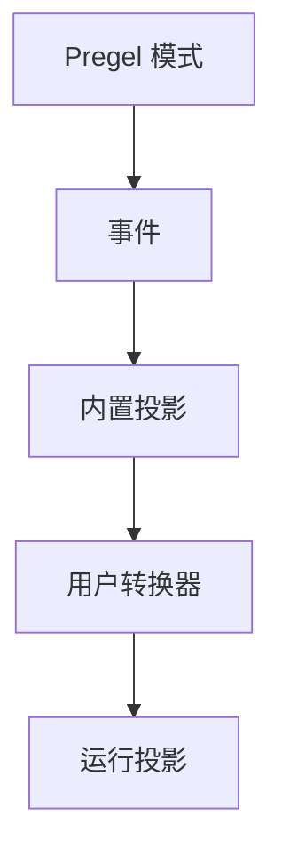

事件流式输出是大多数 LangGraph 应用代码推荐的进程内流式输出模型。它返回一个运行流对象，可以同时以多种方式消费。

<Tip>
查看[流式输出食谱](https://github.com/langchain-ai/streaming-cookbook)获取可运行的示例和详细参考文档的链接。
</Tip>


```typescript
const run = await graph.streamEvents(
  { messages: [{ role: "user", content: "What is 42 * 17?" }] },
  { version: "v3" }
);

for await (const message of run.messages) {
  for await (const token of message.text) {
    process.stdout.write(token);
  }
}

const finalState = await run.output;
```


<Note>
`version="v3"` 标志暂时需要用于选择此流式行为。新行为将在下一个 LangGraph 主版本中成为默认流版本。
</Note>

## 事件流式输出提供什么

运行流在一个底层事件流上暴露类型化投影：

| 投影 | 用途 |
| ---------- | --- |
| `run` | 迭代每个协议事件。 |
| `run.messages` | 流式传输聊天模型消息和 Token 增量。 |
| `run.values` | 迭代状态快照并等待最终值。 |
| `run.output` | 等待最终输出。 |
| `run.subgraphs` | 发现和观察嵌套图执行。 |
| `run.interrupts` | 检查人机协作中断负载。 |
| `run.interrupted` | 检查运行是否因人工输入而暂停。 |
| `run.extensions` | 消费自定义流转换器投影。 |

多个消费者可以并发读取这些投影。读取 `run.messages` 不会消费 `run.values`、`run.subgraphs` 或 `run.output` 所需的事件。

## 流协议事件

当你需要原始协议事件流时，使用运行对象本身：


```typescript
const run = await graph.streamEvents(input, { version: "v3" });

for await (const event of run) {
  const namespace = event.params.namespace;
  console.log(namespace, event.method, event.params.data);
}
```


每个协议事件都有一个类似通道的 `method`、一个单调递增的 `seq` 编号，以及包含 `namespace`、`timestamp`、可选的 `node` 和通道特定 `data` 的 `params`。

```json
{
  "type": "event",
  "seq": 42,
  "method": "messages",
  "params": {
    "namespace": [],
    "timestamp": 1770000000000,
    "node": "agent",
    "data": {
      "event": "content-block-delta",
      "content_block": {
        "type": "text",
        "text": "hello"
      }
    }
  }
}
```

核心通道包括：

| 通道 | 用途 |
| ------- | ------- |
| `values` | 完整的图状态快照。 |
| `updates` | 每节点的状态增量。 |
| `messages` | 以内容块为中心的聊天模型输出。 |
| `tools` | 工具调用开始、流式输出、完成和错误事件。 |
| `lifecycle` | 运行、子图和子智能体状态变更。 |
| `checkpoints` | 用于分支和时间旅行的轻量级检查点信封。 |
| `input` | 人机协作输入请求和响应。 |
| `tasks` | Pregel 任务创建和结果事件。 |
| `custom` | 来自图代码的用户定义负载。 |
| `custom:<name>` | 应用定义的流转换器输出。 |

`messages` 通道将输出建模为内容块。这使得 Token 流式输出、推理块、工具调用块和多模态内容在应用代码中无需提供商特定格式即可显式化。

## 添加自定义转换器

流转换器是事件流式输出中的投影层。它们观察协议事件，维护自己的状态，并暴露运行的派生视图，如进度事件、工件、Token 总数、工具活动或第三方协议消息。



转换器在 `init()` 中创建投影，在 `process()` 中观察每个事件，并在运行完成时最终化或使投影失败。


```typescript
interface StreamTransformer<TProjection = unknown> {
  init(): TProjection;
  process(event: ProtocolEvent): boolean;
  finalize?(): void | PromiseLike<void>;
  fail?(err: unknown): void;
}
```


启动事件流时传入转换器：


```typescript
const run = await graph.streamEvents(input, {
  version: "v3",
  transformers: [toolActivityTransformer],
});

for await (const activity of run.extensions.toolActivity) {
  console.log(activity);
}
```


## 使用 StreamChannel

`StreamChannel` 是自定义流式数据的投影原语。它为进程内消费者提供可迭代流，当通道有协议名称时，还可以将推送的值转发给远程 SDK 客户端。

| 需求 | 使用 |
| ---- | --- |
| 数据仅保留在进程内 | `StreamChannel()` 或 `new StreamChannel<T>()` |
| 数据应在进程内和网络上都可用 | `StreamChannel(name)` 或 `new StreamChannel<T>(name)` |

命名通道的负载必须可序列化，因为它们也作为 `custom:<name>` 协议事件发出。将 Promise、异步可迭代对象、类实例和其他进程内句柄保持在本地。


```typescript
import { StreamChannel } from "@langchain/langgraph";

const toolActivityTransformer = () => {
  const activity = new StreamChannel<{
    name: string;
    status: "started" | "finished" | "error";
  }>("toolActivity");

  return {
    init: () => ({ toolActivity: activity }),
    process(event) {
      if (event.method === "tools") {
        const data = event.params.data as { tool_name?: string; event?: string };
        if (data.tool_name && data.event) {
          activity.push({
            name: data.tool_name,
            status: data.event === "tool-error" ? "error" : "started",
          });
        }
      }
      return true;
    },
  };
};
```


## 相关

- [流式输出食谱](https://github.com/langchain-ai/streaming-cookbook)展示可运行的事件流式输出示例。
- [LangGraph 流式输出](/oss/javascript/langgraph/streaming)涵盖更底层的流模式。
- [LangChain 事件流式输出](/oss/javascript/langchain/event-streaming)涵盖基于 LangGraph 构建的智能体流式输出接口。
- [Deep Agents 事件流式输出](/oss/javascript/deepagents/event-streaming)涵盖委托子智能体流。

---

<div className="source-links">
<Callout icon="terminal-2">
    [将这些文档连接](/use-these-docs)到 Claude、VSCode 等工具，通过 MCP 获取实时答案。
</Callout>
<Callout icon="edit">
    [在 GitHub 上编辑此页面](https://github.com/langchain-ai/docs/edit/main/src/oss/langgraph/streaming/event-streaming.mdx) 或 [提交问题](https://github.com/langchain-ai/docs/issues/new/choose)。
</Callout>
</div>
