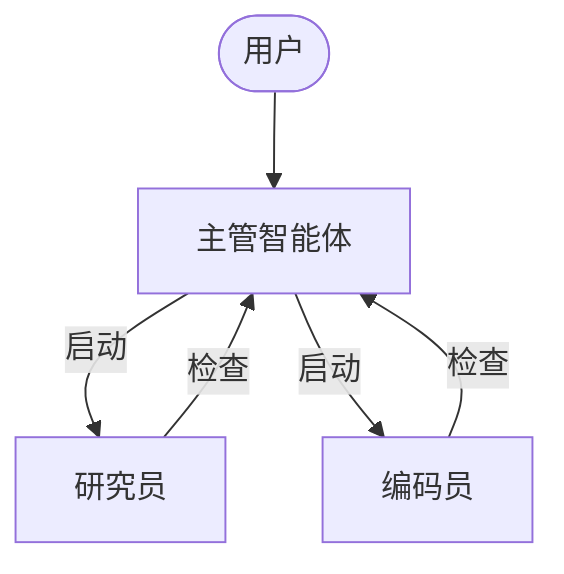
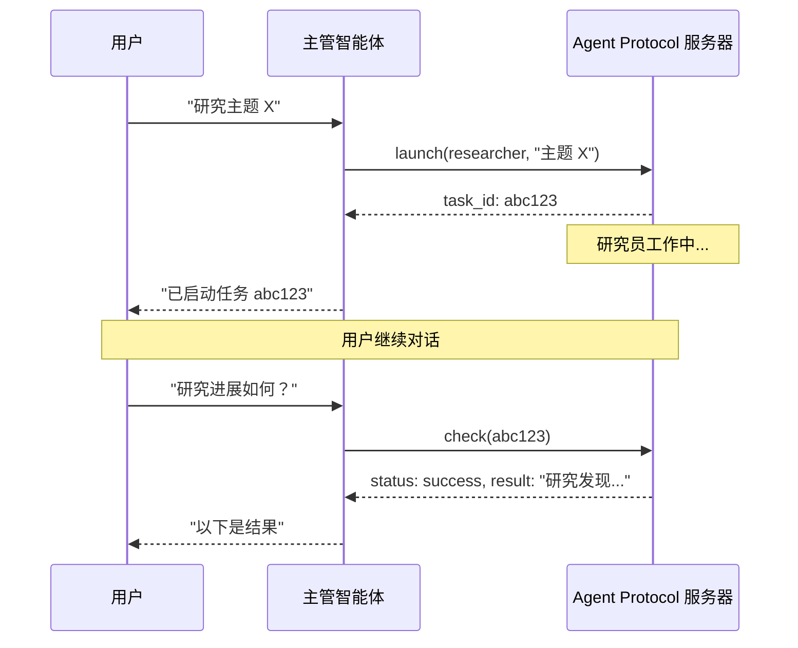

异步子智能体允许主管智能体启动后台任务并立即返回，使主管智能体可以在子智能体并发工作时继续与用户交互。主管智能体可以随时检查进度、发送后续指令或取消任务。

这是在[子智能体](/oss/python/deepagents/subagents)基础上的扩展，子智能体同步运行并阻塞主管智能体直到完成。当任务长时间运行、可并行化或需要中途调整时，请使用异步子智能体。

<Note>
异步子智能体是 `deepagents` 0.5.0 中的预览功能。预览功能正在积极开发中，API 可能会发生变化。


</Note>



<Note>
异步子智能体可与任何实现了 [Agent Protocol](https://github.com/langchain-ai/agent-protocol) 的服务器通信。你可以使用 [LangSmith Deployments](/langsmith/deployment)，或自行托管任何兼容 Agent Protocol 的服务器。每个子智能体独立于主管智能体运行，主管智能体通过 SDK 对其进行启动、检查、更新和取消操作。
</Note>

## 何时使用异步子智能体

| 维度 | 同步子智能体 | 异步子智能体 |
|------|-------------|-------------|
| **执行模型** | 主管智能体阻塞直到子智能体完成 | 立即返回任务 ID；主管智能体继续运行 |
| **并发性** | 并行但阻塞 | 并行且非阻塞 |
| **任务中更新** | 不支持 | 通过 `update_async_task` 发送后续指令 |
| **取消** | 不支持 | 通过 `cancel_async_task` 取消运行中的任务 |
| **状态性** | 无状态——调用之间不保持持久状态 | 有状态——在自己的线程上跨交互维护状态 |
| **适用场景** | 智能体需要等待结果后再继续的任务 | 在聊天中交互式管理的长时间运行的复杂任务 |

## 配置异步子智能体

将异步子智能体定义为 [`AsyncSubAgent`](https://reference.langchain.com/python/deepagents/middleware/async_subagents/AsyncSubAgent) 规格列表，每个指向一个 Agent Protocol 服务器：

```python
from deepagents import AsyncSubAgent, create_deep_agent

async_subagents = [
    AsyncSubAgent(
        name="researcher",
        description="Research agent for information gathering and synthesis",
        graph_id="researcher",
        # 不设置 url → ASGI 传输（在同一部署中共同部署）
    ),
    AsyncSubAgent(
        name="coder",
        description="Coding agent for code generation and review",
        graph_id="coder",
        # url="https://coder-deployment.langsmith.dev"  # 可选：HTTP 传输用于远程连接
    ),
]

agent = create_deep_agent(
    model="google_genai:gemini-3.1-pro-preview",
    subagents=async_subagents,
)
```

| 字段 | 类型 | 说明 |
|------|------|------|
| `name` | `str` | 必填。唯一标识符。主管智能体启动任务时使用此名称。 |
| `description` | `str` | 必填。描述此子智能体的功能。主管智能体据此决定委派给哪个智能体。 |
| `graph_id` | `str` | 必填。Agent Protocol 服务器上的图 ID（或助手 ID）。对于基于 LangGraph 的部署，必须与 `langgraph.json` 中注册的图匹配。 |
| `url` | `str` | 可选。省略时使用 ASGI 传输（进程内）。设置时使用 HTTP 传输连接远程 Agent Protocol 服务器。 |
| `headers` | `dict[str, str]` | 可选。发往远程服务器的附加请求头。用于自托管 Agent Protocol 服务器的自定义认证。 |


对于基于 LangGraph 的部署，在共同部署设置中将所有图注册到同一个 `langgraph.json`：

```json
{
  "graphs": {
    "supervisor": "./src/supervisor.py:graph",
    "researcher": "./src/researcher.py:graph",
    "coder": "./src/coder.py:graph"
  }
}
```

## 使用异步子智能体工具

[`AsyncSubAgentMiddleware`](https://reference.langchain.com/python/deepagents/middleware/async_subagents/AsyncSubAgentMiddleware) 为主管智能体提供五个工具：

| 工具 | 用途 | 返回值 |
|------|------|--------|
| `start_async_task` | 启动新的后台任务 | 任务 ID（立即返回） |
| `check_async_task` | 获取任务的当前状态和结果 | 状态 + 结果（如已完成） |
| `update_async_task` | 向运行中的任务发送新指令 | 确认 + 更新后的状态 |
| `cancel_async_task` | 停止运行中的任务 | 确认 |
| `list_async_tasks` | 列出所有已跟踪任务及实时状态 | 所有任务的摘要 |

主管智能体的大语言模型(LLM)像调用其他工具一样调用这些工具。中间件自动处理线程创建、运行管理和状态持久化。

### 理解生命周期

典型的交互遵循以下序列：



- **启动** 在服务器上创建新线程，以任务描述作为输入启动一次运行，并将线程 ID 作为任务 ID 返回。主管智能体将此 ID 报告给用户，不会轮询完成状态。
- **检查** 获取当前运行状态。如果运行成功，则检索线程状态以提取子智能体的最终输出。如果仍在运行，则向用户报告该状态。
- **更新** 在同一线程上创建新运行，使用中断多任务策略。之前的运行被中断，子智能体重新启动，获得完整对话历史加上新指令。任务 ID 保持不变。
- **取消** 在服务器上调用 `runs.cancel()` 并将任务标记为 `"cancelled"`。
- **列表** 遍历所有已跟踪的任务。对于非终态任务，并行从服务器获取实时状态。终态状态（`success`、`error`、`cancelled`）从缓存返回。

## 理解状态管理

任务元数据存储在主管智能体图的专用状态通道（`async_tasks`）中，与消息历史分离。这至关重要，因为深度智能体会在上下文窗口满时[压缩消息历史](/oss/python/deepagents/context-engineering#summarization)。如果任务 ID 仅存在于工具消息中，它们会在压缩过程中丢失。专用通道确保主管智能体始终能通过 `list_async_tasks` 回忆其任务，即使经过多轮摘要。

每个跟踪的任务记录任务 ID、智能体名称、线程 ID、运行 ID、状态和时间戳（`created_at`、`last_checked_at`、`last_updated_at`）。


## 选择传输方式

### ASGI 传输（共同部署）

当子智能体规格省略 `url` 字段时，LangGraph SDK 使用 ASGI 传输——SDK 调用通过进程内函数调用路由，而非 HTTP。对于基于 LangGraph 的部署，这要求两个图都注册在同一个 `langgraph.json` 中。

ASGI 传输消除了网络延迟，不需要额外的认证配置。子智能体仍然作为独立线程运行，拥有自己的状态。这是推荐的默认方式。

### HTTP 传输（远程）

添加 `url` 字段切换到 HTTP 传输，SDK 调用通过网络发送到远程 Agent Protocol 服务器：

```python
AsyncSubAgent(
    name="researcher",
    description="Research agent",
    graph_id="researcher",
    url="https://my-research-deployment.langsmith.dev",
)
```


对于 LangGraph 部署，认证由 LangGraph SDK 使用环境变量中的 `LANGSMITH_API_KEY`（或 `LANGGRAPH_API_KEY`）处理。自托管的 Agent Protocol 服务器可能使用不同的认证机制。

当子智能体需要独立扩展、不同的资源配置或由不同团队维护时，使用 HTTP 传输。

## 选择部署拓扑

### 单一部署

单一部署意味着所有智能体使用 ASGI 传输共同部署在同一服务器上。对于基于 LangGraph 的部署，在一个 `langgraph.json` 中注册所有图。这是推荐的起点——管理一台服务器，智能体之间零网络延迟。

### 拆分部署

主管智能体在一台服务器上，子智能体通过 HTTP 传输在另一台服务器上。当子智能体需要不同的计算配置或独立扩展时使用。

### 混合部署

在拆分部署中，主管智能体在一台服务器上，子智能体通过 HTTP 传输在另一台服务器上。当子智能体需要不同的计算配置或独立扩展时使用。

### 混合部署

在混合部署中，部分子智能体通过 ASGI 共同部署，其他通过 HTTP 远程连接：

```python
async_subagents = [
    AsyncSubAgent(
        name="researcher",
        description="Research agent",
        graph_id="researcher",
        # 不设置 url → ASGI（共同部署）
    ),
    AsyncSubAgent(
        name="coder",
        description="Coding agent",
        graph_id="coder",
        url="https://coder-deployment.langsmith.dev",
        # 设置了 url → HTTP（远程）
    ),
]
```


## 最佳实践

### 为本地开发配置工作线程池大小

使用 `langgraph dev` 在本地运行时，增加工作线程池以容纳并发的子智能体运行。每个活跃运行占用一个工作线程槽。一个带有 3 个并发子智能体任务的主管智能体需要 4 个槽（1 个主管 + 3 个子智能体）。配置不足会导致启动排队。

```bash
langgraph dev --n-jobs-per-worker 10
```

### 编写清晰的子智能体描述

主管智能体使用描述来决定启动哪个子智能体。描述应具体且面向行动：

```python
# 好的示例
AsyncSubAgent(
    name="researcher",
    description="Conducts in-depth research using web search. Use for questions requiring multiple searches and synthesis.",
    graph_id="researcher",
)

# 不好的示例
AsyncSubAgent(
    name="helper",
    description="helps with stuff",
    graph_id="helper",
)
```


### 使用线程 ID 进行追踪

使用基于 LangGraph 的部署时，每个异步子智能体运行都是标准的 LangGraph 运行，在 LangSmith 中完全可见。主管智能体的追踪显示 `launch`、`check`、`update`、`cancel` 和 `list` 的工具调用。每个子智能体运行显示为独立的追踪，通过线程 ID 关联。使用线程 ID（任务 ID）将主管智能体的编排追踪与子智能体的执行追踪关联起来。

## 故障排除

### 主管智能体在启动后立即轮询

**问题**：主管智能体在启动后立即循环调用 `check`，将异步执行变成了阻塞执行。

**解决方案**：中间件注入了系统提示词规则来防止这种情况。如果轮询仍然存在，请在主管智能体的系统提示词中强化该行为：

```python
agent = create_deep_agent(
    model="google_genai:gemini-3.1-pro-preview",
    system_prompt="""...你的指令...

    After launching an async subagent, ALWAYS return control to the user.
    Never call check_async_task immediately after launch.""",
    subagents=async_subagents,
)
```


### 主管智能体报告过时状态

**问题**：主管智能体引用对话历史中较早的任务状态，而不是进行新的 `check` 调用。

**解决方案**：中间件提示词指示模型"对话历史中的任务状态始终是过时的"。如果仍然出现此问题，请添加明确指令，要求在报告状态前始终调用 `check` 或 `list`。

### 任务 ID 查找失败

**问题**：主管智能体截断或重新格式化了任务 ID，导致 `check` 或 `cancel` 失败。

**解决方案**：中间件提示词指示模型始终使用完整的任务 ID。如果截断问题持续存在，这通常是特定模型的问题——尝试使用不同的模型或在系统提示词中添加"always show the full task_id, never truncate or abbreviate it"。

### 子智能体启动排队而非运行

**问题**：启动子智能体时挂起或需要很长时间才能开始。

**解决方案**：工作线程池可能已耗尽。使用 `--n-jobs-per-worker` 增加池大小。参见[配置工作线程池大小](#为本地开发配置工作线程池大小)。

## 参考实现

[async-deep-agents](https://github.com/langchain-ai/async-deep-agents) 仓库包含 Python 和 TypeScript 的工作示例，可部署到 LangSmith Deployments。它演示了一个带有研究员和编码员子智能体作为后台任务运行的主管智能体。

---

<div className="source-links">
<Callout icon="terminal-2">
    [连接这些文档](/use-these-docs)到 Claude、VSCode 等工具，通过 MCP 获取实时答案。
</Callout>
<Callout icon="edit">
    [在 GitHub 上编辑此页面](https://github.com/langchain-ai/docs/edit/main/src/oss/deepagents/async-subagents.mdx) 或[提交 Issue](https://github.com/langchain-ai/docs/issues/new/choose)。
</Callout>
</div>
