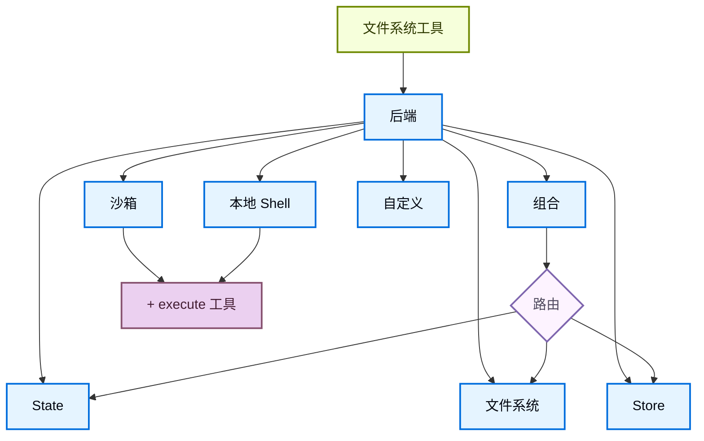

import BackendStatePy from '/snippets/backend-state-py.mdx';
import BackendStateJs from '/snippets/backend-state-js.mdx';
import BackendFilesystemPy from '/snippets/backend-filesystem-py.mdx';
import BackendFilesystemJs from '/snippets/backend-filesystem-js.mdx';
import BackendLocalShellPy from '/snippets/backend-local-shell-py.mdx';
import BackendLocalShellJs from '/snippets/backend-local-shell-js.mdx';
import BackendStorePy from '/snippets/backend-store-py.mdx';
import BackendStoreJs from '/snippets/backend-store-js.mdx';
import BackendCompositePy from '/snippets/backend-composite-py.mdx';
import BackendCompositeJs from '/snippets/backend-composite-js.mdx';

深度智能体通过 `ls`、`read_file`、`write_file`、`edit_file`、`glob` 和 `grep` 等工具向智能体暴露文件系统接口。这些工具通过可插拔后端运行。`read_file` 工具在所有后端中原生支持图片文件（`.png`、`.jpg`、`.jpeg`、`.gif`、`.webp`），将其作为多模态内容块返回。


沙箱和 [`LocalShellBackend`](https://reference.langchain.com/python/deepagents/backends/local_shell/LocalShellBackend) 还提供 `execute` 工具。
本页说明如何：


- [选择后端](#specify-a-backend)，
- [将不同路径路由到不同后端](#route-to-different-backends)，
- [实现自定义虚拟文件系统](#use-a-virtual-filesystem)（如 S3 或 Postgres），
- [设置权限](#permissions)控制文件系统访问，

- [遵循后端协议](#protocol-reference)，


## 快速入门

以下是一些预构建的文件系统后端，你可以快速用于深度智能体：

| 内置后端 | 说明 |
|---|---|
| [默认](#statebackend) | `agent = create_deep_agent(model="google_genai:gemini-3.1-pro-preview")` <br></br> 线程作用域。智能体的默认文件系统后端存储在 `langgraph` 状态中。文件在同一线程内跨轮次持久化（通过 checkpointer），不会跨线程共享。 |
| [本地文件系统持久化](#filesystembackend-local-disk) | `agent = create_deep_agent(model="google_genai:gemini-3.1-pro-preview", backend=FilesystemBackend(root_dir="/Users/nh/Desktop/"))` <br></br>这让深度智能体访问你本地机器的文件系统。你可以指定智能体可访问的根目录。注意提供的 `root_dir` 必须是绝对路径。 |
| [持久存储（LangGraph store）](#storebackend-langgraph-store) | `agent = create_deep_agent(model="google_genai:gemini-3.1-pro-preview", backend=StoreBackend())` <br></br>这让智能体访问_跨线程持久化_的长期存储。非常适合存储适用于智能体多次执行的长期记忆或指令。 |
| [沙箱](/oss/python/deepagents/sandboxes) | `agent = create_deep_agent(model="google_genai:gemini-3.1-pro-preview", backend=sandbox)` <br></br>在隔离环境中执行代码。沙箱提供文件系统工具和用于运行 Shell 命令的 `execute` 工具。可选择 Modal、Daytona、Deno 或本地 VFS。 |
| [本地 Shell](#localshellbackend-local-shell) | `agent = create_deep_agent(model="google_genai:gemini-3.1-pro-preview", backend=LocalShellBackend(root_dir=".", env={"PATH": "/usr/bin:/bin"}))` <br></br>直接在主机上执行文件系统和 Shell 操作。无隔离——仅在受控的开发环境中使用。参见下方[安全注意事项](#localshellbackend-local-shell)。 |
| [组合](#compositebackend-router) | 默认线程作用域，`/memories/` 跨线程持久化。组合后端最大程度灵活。你可以指定文件系统中的不同路由指向不同后端。参见下方组合路由的即用示例。 |




## 内置后端

### StateBackend

<BackendStatePy />


**工作原理：**
- 通过 [`StateBackend`](https://reference.langchain.com/python/deepagents/backends/state/StateBackend) 在当前线程的 LangGraph 智能体状态中存储文件。
- 通过检查点在同一线程的多次智能体轮次间持久化。文件不会跨线程共享。

<Warning>
设计为在图内使用。在图运行之外调用后端方法（如 `state_backend.upload_files(...)`）不会生效，直到图执行。
</Warning>

**最佳用途：**
- 智能体写入中间结果的草稿本。
- 自动驱逐大型工具输出，智能体随后可以逐块读回。

注意此后端在主管智能体和子智能体之间共享，子智能体写入的任何文件即使在子智能体执行完成后仍会保留在 LangGraph 智能体状态中。这些文件将继续对主管智能体和其他子智能体可用。

### FilesystemBackend（本地磁盘）

[`FilesystemBackend`](https://reference.langchain.com/python/deepagents/backends/filesystem/FilesystemBackend) 在可配置的根目录下读写真实文件。

<Warning>
此后端授予智能体直接的文件系统读写访问权限。
请谨慎使用，仅在适当的环境中使用。

**适当的使用场景：**
- 本地开发 CLI（编程助手、开发工具）
- CI/CD 流水线（参见下方安全注意事项）

**不适当的使用场景：**
- Web 服务器或 HTTP API——请改用 `StateBackend`、`StoreBackend` 或[沙箱后端](/oss/python/deepagents/sandboxes)

**安全风险：**
- 智能体可以读取任何可访问的文件，包括密钥（API 密钥、凭证、`.env` 文件）
- 结合网络工具，密钥可能通过 SSRF 攻击被窃取
- 文件修改是永久且不可逆的

**推荐的安全措施：**
1. 启用[人机协作（HITL）中间件](/oss/python/deepagents/human-in-the-loop)以审查敏感操作。
1. 从可访问的文件系统路径中排除密钥（特别是在 CI/CD 中）。
1. 对需要文件系统交互的生产环境使用[沙箱后端](/oss/python/deepagents/sandboxes)。
1. **始终**配合 `root_dir` 使用 `virtual_mode=True` 以启用基于路径的访问限制（阻止 `..`、`~` 和根目录外的绝对路径）。
   注意默认值（`virtual_mode=False`）即使设置了 `root_dir` 也不提供安全保障。
</Warning>

<BackendFilesystemPy />


**工作原理：**
- 在可配置的 `root_dir` 下读写真实文件。
- 你可以选择设置 `virtual_mode=True` 以在 `root_dir` 下沙箱化和规范化路径。
- 使用安全的路径解析，尽可能防止不安全的符号链接遍历，可使用 ripgrep 加速 `grep`。

**最佳用途：**
- 你机器上的本地项目
- CI 沙箱
- 挂载的持久卷

### LocalShellBackend（本地 Shell）

<Warning>
此后端授予智能体直接的文件系统读写访问权限**以及**在主机上不受限的 Shell 执行。
请极其谨慎使用，仅在适当的环境中使用。

**适当的使用场景：**
- 本地开发 CLI（编程助手、开发工具）
- 你信任智能体代码的个人开发环境
- 具有适当密钥管理的 CI/CD 流水线

**不适当的使用场景：**
- 生产环境（如 Web 服务器、API、多租户系统）
- 处理不可信的用户输入或执行不可信的代码

**安全风险：**
- 智能体可以使用你的用户权限执行**任意 Shell 命令**
- 智能体可以读取任何可访问的文件，包括密钥（API 密钥、凭证、`.env` 文件）
- 密钥可能被暴露
- 文件修改和命令执行是**永久且不可逆的**
- 命令直接在你的主机系统上运行
- 命令可以消耗无限的 CPU、内存、磁盘

**推荐的安全措施：**
1. 启用[人机协作（HITL）中间件](/oss/python/deepagents/human-in-the-loop)以在执行前审查和批准操作。这是**强烈推荐的**。
2. 仅在专用开发环境中运行。切勿在共享或生产系统上使用。
3. 对需要 Shell 执行的生产环境使用[沙箱后端](/oss/python/deepagents/sandboxes)。

**注意：** 启用 Shell 访问时，`virtual_mode=True` 不提供安全保障，因为命令可以访问系统上的任何路径。
</Warning>

<BackendLocalShellPy />


**工作原理：**
- 扩展 `FilesystemBackend`，增加 `execute` 工具用于在主机上运行 Shell 命令。
- 命令使用 `subprocess.run(shell=True)` 直接在你的机器上运行，无沙箱化。
- 支持 `timeout`（默认 120 秒）、`max_output_bytes`（默认 100,000）、`env` 和 `inherit_env` 环境变量配置。
- Shell 命令使用 `root_dir` 作为工作目录，但可以访问系统上的任何路径。

**最佳用途：**
- 本地编程助手和开发工具
- 你信任智能体时的快速开发迭代

### StoreBackend（LangGraph store）

<BackendStorePy />


<Tip>
    `namespace` 参数控制数据隔离。对于多用户部署，始终设置[命名空间工厂](/oss/python/deepagents/backends#namespace-factories)以按用户或租户隔离数据。
</Tip>

**工作原理：**
- [`StoreBackend`](https://reference.langchain.com/python/deepagents/backends/store/StoreBackend) 将文件存储在运行时提供的 LangGraph [`BaseStore`](https://reference.langchain.com/python/langchain-core/stores/BaseStore) 中，实现跨线程的持久存储。

**最佳用途：**
- 当你已经使用配置好的 LangGraph store 运行时（例如 Redis、Postgres 或 [`BaseStore`](https://reference.langchain.com/python/langchain-core/stores/BaseStore) 背后的云实现）。
- 当你通过 [LangSmith Deployment](/langsmith/deployment) 部署智能体时（会自动为你的智能体配置 store）。

#### 命名空间工厂

命名空间工厂控制 `StoreBackend` 读写数据的位置。它接收 LangGraph [`Runtime`](https://reference.langchain.com/python/langgraph/runtime/Runtime) 并返回一个字符串元组作为 store 命名空间。使用命名空间工厂在用户、租户或助手之间隔离数据。

在构造 `StoreBackend` 时将命名空间工厂传递给 `namespace` 参数：

```python
NamespaceFactory = Callable[[Runtime], tuple[str, ...]]
```

`Runtime` 提供：
- `rt.context` — 通过 LangGraph 的 [context schema](https://langchain-ai.github.io/langgraph/concepts/runtime/) 传递的用户提供的上下文（例如 `user_id`）
- `rt.server_info` — 在 LangGraph Server 上运行时的服务器特定元数据（助手 ID、图 ID、已认证用户）
- `rt.execution_info` — 执行身份信息（线程 ID、运行 ID、检查点 ID）


<Note>
`Runtime` 参数在 `deepagents>=0.5.2` 中可用。早期的 0.5.x 版本传递的是 `BackendContext`——参见下方[从 `BackendContext` 迁移](#migrating-from-backendcontext)。`rt.server_info` 和 `rt.execution_info` 需要 `deepagents>=0.5.0`。
</Note>


**常用命名空间模式：**

```python
from deepagents.backends import StoreBackend

# 按用户：每个用户获得自己的隔离存储
backend = StoreBackend(
    namespace=lambda rt: (rt.server_info.user.identity,),  # [!code highlight]
)

# 按助手：同一助手的所有用户共享存储
backend = StoreBackend(
    namespace=lambda rt: (
        rt.server_info.assistant_id,  # [!code highlight]
    ),
)

# 按线程：存储作用域限定到单个对话
backend = StoreBackend(
    namespace=lambda rt: (
        rt.execution_info.thread_id,  # [!code highlight]
    ),
)
```


你可以组合多个组件来创建更具体的作用域——例如，`(user_id, thread_id)` 用于按用户按对话隔离，或附加后缀如 `"filesystem"` 以在同一作用域使用多个 store 命名空间时消除歧义。

命名空间组件只能包含字母数字字符、连字符、下划线、点号、`@`、`+`、冒号和波浪号。通配符（`*`、`?`）会被拒绝以防止 glob 注入。

<Warning>
    `namespace` 参数将在 v0.5.0 中成为**必填项**。新代码中始终显式设置。
</Warning>


<Note>
    当未提供命名空间工厂时，旧的默认行为使用 LangGraph config 元数据中的 `assistant_id`。这意味着同一[助手](/langsmith/assistants)的所有用户共享同一存储。对于多用户的[生产环境](/oss/python/deepagents/going-to-production)，始终提供命名空间工厂。
</Note>

### CompositeBackend（路由器）

<BackendCompositePy />


**工作原理：**
- [`CompositeBackend`](https://reference.langchain.com/python/deepagents/backends/composite/CompositeBackend) 根据路径前缀将文件操作路由到不同的后端。
- 在列表和搜索结果中保留原始路径前缀。

**最佳用途：**
- 当你想为智能体同时提供线程作用域和跨线程存储时，`CompositeBackend` 允许你同时提供 `StateBackend` 和 `StoreBackend`
- 当你有多个信息源想要作为单个文件系统的一部分提供给智能体时。
    - 例如：你有长期记忆存储在一个 Store 的 `/memories/` 下，同时还有一个自定义后端在 /docs/ 下提供文档访问。

## 指定后端

- 将后端实例传递给 `create_deep_agent(model=..., backend=...)`。文件系统中间件将其用于所有工具操作。
- 后端必须实现 `BackendProtocol`（例如 `StateBackend()`、`FilesystemBackend(root_dir=".")`、`StoreBackend()`）。
- 如果省略，默认为 `StateBackend()`。


## 路由到不同后端

将命名空间的不同部分路由到不同后端。常用于跨线程持久化 `/memories/*`，其他内容保持线程作用域。

```python
from deepagents import create_deep_agent
from deepagents.backends import CompositeBackend, StateBackend, FilesystemBackend

agent = create_deep_agent(
    model="google_genai:gemini-3.1-pro-preview",
    backend=CompositeBackend(
        default=StateBackend(),
        routes={
            "/memories/": FilesystemBackend(root_dir="/deepagents/myagent", virtual_mode=True),
        },
    )
)
```


行为：
- `/workspace/plan.md` → `StateBackend`（线程作用域）
- `/memories/agent.md` → `FilesystemBackend`，位于 `/deepagents/myagent` 下
- `ls`、`glob`、`grep` 聚合结果并显示原始路径前缀。

注意：
- 较长的前缀优先（例如，路由 `"/memories/projects/"` 可以覆盖 `"/memories/"`）。
- 对于 StoreBackend 路由，确保通过 `create_deep_agent(model=..., store=...)` 提供 store 或由平台配置。

## 使用虚拟文件系统

构建自定义后端将远程或数据库文件系统（如 S3 或 Postgres）投射到工具命名空间中。

设计指南：

- 路径是绝对的（`/x/y.txt`）。决定如何将它们映射到你的存储键/行。
- 高效实现 `ls` 和 `glob`（尽可能使用服务端过滤，否则在本地过滤）。
- 对于外部持久化（S3、Postgres 等），在写入/编辑结果中返回 `files_update=None`（Python）或省略 `filesUpdate`（JS）——只有内存状态后端需要返回文件更新字典。

- 使用 `ls` 和 `glob` 作为方法名。
- 返回带有 `error` 字段的结构化结果类型，用于缺失文件或无效模式（不要抛出异常）。


S3 风格大纲：

```python
from deepagents.backends.protocol import (
    BackendProtocol, WriteResult, EditResult, LsResult, ReadResult, GrepResult, GlobResult,
)

class S3Backend(BackendProtocol):
    def __init__(self, bucket: str, prefix: str = ""):
        self.bucket = bucket
        self.prefix = prefix.rstrip("/")

    def _key(self, path: str) -> str:
        return f"{self.prefix}{path}"

    def ls(self, path: str) -> LsResult:
        # 列出 _key(path) 下的对象；构建 FileInfo 条目（path、size、modified_at）
        ...

    def read(self, file_path: str, offset: int = 0, limit: int = 2000) -> ReadResult:
        # 获取对象；返回 ReadResult(file_data=...) 或 ReadResult(error=...)
        ...

    def grep(self, pattern: str, path: str | None = None, glob: str | None = None) -> GrepResult:
        # 可选的服务端过滤；否则列出并扫描内容
        ...

    def glob(self, pattern: str, path: str = "/") -> GlobResult:
        # 相对于 path 对键应用 glob
        ...

    def write(self, file_path: str, content: str) -> WriteResult:
        # 强制仅创建语义；返回 WriteResult(path=file_path, files_update=None)
        ...

    def edit(self, file_path: str, old_string: str, new_string: str, replace_all: bool = False) -> EditResult:
        # 读取 → 替换（尊重唯一性或 replace_all）→ 写入 → 返回出现次数
        ...
```


Postgres 风格大纲：

- 表 `files(path text primary key, content text, created_at timestamptz, modified_at timestamptz)`
- 将工具操作映射到 SQL：
  - `ls` 使用 `WHERE path LIKE $1 || '%'`
  - `glob` 在 SQL 中过滤或获取后在 Python 中应用 glob
  - `grep` 可以按扩展名或最后修改时间获取候选行，然后扫描行


## 权限

使用[权限](/oss/python/deepagents/permissions)声明式地控制智能体可以读写的文件和目录。权限应用于内置文件系统工具，在调用后端之前进行评估。

```python
from deepagents import create_deep_agent, FilesystemPermission

agent = create_deep_agent(
    model="google_genai:gemini-3.1-pro-preview",
    backend=CompositeBackend(
        default=StateBackend(),
        routes={
            "/memories/": StoreBackend(
                namespace=lambda rt: (rt.server_info.user.identity,),
            ),
            "/policies/": StoreBackend(
                namespace=lambda rt: (rt.context.org_id,),
            ),
        },
    ),
    permissions=[
        FilesystemPermission(
            operations=["write"],
            paths=["/policies/**"],
            mode="deny",
        ),
    ],
)
```


有关完整的选项集，包括规则排序、子智能体权限和组合后端交互，请参阅[权限指南](/oss/python/deepagents/permissions)。

## 添加策略钩子

对于超出基于路径的允许/拒绝规则的自定义验证逻辑（速率限制、审计日志、内容检查），通过子类化或包装后端来执行企业规则。

在选定前缀下阻止写入/编辑（子类方式）：

```python
from deepagents.backends.filesystem import FilesystemBackend
from deepagents.backends.protocol import WriteResult, EditResult

class GuardedBackend(FilesystemBackend):
    def __init__(self, *, deny_prefixes: list[str], **kwargs):
        super().__init__(**kwargs)
        self.deny_prefixes = [p if p.endswith("/") else p + "/" for p in deny_prefixes]

    def write(self, file_path: str, content: str) -> WriteResult:
        if any(file_path.startswith(p) for p in self.deny_prefixes):
            return WriteResult(error=f"Writes are not allowed under {file_path}")
        return super().write(file_path, content)

    def edit(self, file_path: str, old_string: str, new_string: str, replace_all: bool = False) -> EditResult:
        if any(file_path.startswith(p) for p in self.deny_prefixes):
            return EditResult(error=f"Edits are not allowed under {file_path}")
        return super().edit(file_path, old_string, new_string, replace_all)
```


通用包装器（适用于任何后端）：

```python
from deepagents.backends.protocol import (
    BackendProtocol, WriteResult, EditResult, LsResult, ReadResult, GrepResult, GlobResult,
)

class PolicyWrapper(BackendProtocol):
    def __init__(self, inner: BackendProtocol, deny_prefixes: list[str] | None = None):
        self.inner = inner
        self.deny_prefixes = [p if p.endswith("/") else p + "/" for p in (deny_prefixes or [])]

    def _deny(self, path: str) -> bool:
        return any(path.startswith(p) for p in self.deny_prefixes)

    def ls(self, path: str) -> LsResult:
        return self.inner.ls(path)

    def read(self, file_path: str, offset: int = 0, limit: int = 2000) -> ReadResult:
        return self.inner.read(file_path, offset=offset, limit=limit)
    def grep(self, pattern: str, path: str | None = None, glob: str | None = None) -> GrepResult:
        return self.inner.grep(pattern, path, glob)
    def glob(self, pattern: str, path: str = "/") -> GlobResult:
        return self.inner.glob(pattern, path)
    def write(self, file_path: str, content: str) -> WriteResult:
        if self._deny(file_path):
            return WriteResult(error=f"Writes are not allowed under {file_path}")
        return self.inner.write(file_path, content)
    def edit(self, file_path: str, old_string: str, new_string: str, replace_all: bool = False) -> EditResult:
        if self._deny(file_path):
            return EditResult(error=f"Edits are not allowed under {file_path}")
        return self.inner.edit(file_path, old_string, new_string, replace_all)
```


## 从后端工厂迁移

<Warning>
后端工厂模式从 `deepagents` 0.5.0 起已**弃用**。请直接传递预构建的后端实例，而不是工厂函数。


</Warning>

此前，`StateBackend` 和 `StoreBackend` 等后端需要一个接收运行时对象的工厂函数，因为它们需要运行时上下文（状态、存储）才能运行。后端现在通过 LangGraph 的 `get_config()`、`get_store()` 和 `get_runtime()` 辅助函数在内部解析此上下文，因此你可以直接传递实例。

### 变更内容

| 之前（已弃用） | 之后 |
|---|---|
| `backend=lambda rt: StateBackend(rt)` | `backend=StateBackend()` |
| `backend=lambda rt: StoreBackend(rt)` | `backend=StoreBackend()` |
| `backend=lambda rt: CompositeBackend(default=StateBackend(rt), ...)` | `backend=CompositeBackend(default=StateBackend(), ...)` |
| `backend: (config) => new StateBackend(config)` | `backend: new StateBackend()` |
| `backend: (config) => new StoreBackend(config)` | `backend: new StoreBackend()` |

### 已弃用的 API

| 已弃用 | 替代方案 |
|---|---|
| 将可调用对象传递给 `create_deep_agent` 的 `backend=` | 直接传递后端实例 |
| `StateBackend(runtime)` 的 `runtime` 构造函数参数 | `StateBackend()`（不需要参数） |
| `StoreBackend(runtime)` 的 `runtime` 构造函数参数 | `StoreBackend()` 或 `StoreBackend(namespace=..., store=...)` |
| `WriteResult` 和 `EditResult` 上的 `files_update` 字段 | 状态写入现在由后端内部处理 |
| 中间件写入/编辑工具中的 `Command` 包装 | 工具返回普通字符串；不需要 `Command(update=...)` |


<Note>
工厂模式在运行时仍然有效并发出弃用警告。请在下一个主要版本之前更新代码使用直接实例。
</Note>

### 迁移示例

```python
# 之前（已弃用）
from deepagents import create_deep_agent
from deepagents.backends import CompositeBackend, StateBackend, StoreBackend

agent = create_deep_agent(
    model="google_genai:gemini-3.1-pro-preview",
    backend=lambda rt: CompositeBackend(
        default=StateBackend(rt),
        routes={"/memories/": StoreBackend(rt, namespace=lambda rt: (rt.server_info.user.identity,))},
    ),
)

# 之后
agent = create_deep_agent(
    model="google_genai:gemini-3.1-pro-preview",
    backend=CompositeBackend(
        default=StateBackend(),
        routes={"/memories/": StoreBackend(namespace=lambda rt: (rt.server_info.user.identity,))},
    ),
)
```


### 从 `BackendContext` 迁移

在 `deepagents>=0.5.2`（Python）和 `deepagents>=1.9.1`（TypeScript）中，命名空间工厂直接接收 LangGraph [`Runtime`](https://reference.langchain.com/python/langgraph/runtime/Runtime)，而不是 `BackendContext` 包装器。旧的 `BackendContext` 形式仍然通过向后兼容的 `.runtime` 和 `.state` 访问器工作，但这些访问器会发出弃用警告，将在 `deepagents>=0.7` 中移除。

**变更内容：**

- 工厂参数现在是 `Runtime`，而不是 `BackendContext`。
- 移除 `.runtime` 访问器——例如，`ctx.runtime.context.user_id` 变为 `rt.server_info.user.identity`。
- `ctx.state` 没有直接替代。命名空间信息应该是只读的，在运行的生命周期内保持稳定，而状态是可变的且逐步变化——从中派生命名空间可能导致数据存储在不一致的键下。如果你的用例需要读取智能体状态，请[提交 Issue](https://github.com/langchain-ai/deepagents/issues)。

```python
# 之前（已弃用，将在 v0.7 中移除）
StoreBackend(
    namespace=lambda ctx: (ctx.runtime.context.user_id,),  # [!code --]
)

# 之后
StoreBackend(
    namespace=lambda rt: (rt.server_info.user.identity,),  # [!code ++]
)
```


## 协议参考

后端必须实现 [`BackendProtocol`](https://reference.langchain.com/python/deepagents/backends/protocol/BackendProtocol)。

必需方法：
- `ls(path: str) -> LsResult`
  - 返回至少包含 `path` 的条目。在可用时包含 `is_dir`、`size`、`modified_at`。按 `path` 排序以获得确定性输出。
- `read(file_path: str, offset: int = 0, limit: int = 2000) -> ReadResult`
  - 成功时返回文件数据。文件缺失时返回 `ReadResult(error="Error: File '/x' not found")`。
- `grep(pattern: str, path: Optional[str] = None, glob: Optional[str] = None) -> GrepResult`
  - 返回结构化匹配结果。出错时返回 `GrepResult(error="...")`（不要抛出异常）。
- `glob(pattern: str, path: str = "/") -> GlobResult`
  - 将匹配的文件作为 `FileInfo` 条目返回（如果没有则返回空列表）。
- `write(file_path: str, content: str) -> WriteResult`
  - 仅创建语义。冲突时返回 `WriteResult(error=...)`。成功时设置 `path`，对于状态后端设置 `files_update={...}`；外部后端应使用 `files_update=None`。
- `edit(file_path: str, old_string: str, new_string: str, replace_all: bool = False) -> EditResult`
  - 除非 `replace_all=True`，否则强制 `old_string` 的唯一性。如果未找到则返回错误。成功时包含 `occurrences`。

支持类型：
- `LsResult(error, entries)` — `entries` 成功时为 `list[FileInfo]`，失败时为 `None`。
- `ReadResult(error, file_data)` — `file_data` 成功时为 `FileData` 字典，失败时为 `None`。
- `GrepResult(error, matches)` — `matches` 成功时为 `list[GrepMatch]`，失败时为 `None`。
- `GlobResult(error, matches)` — `matches` 成功时为 `list[FileInfo]`，失败时为 `None`。
- `WriteResult(error, path, files_update)`
- `EditResult(error, path, files_update, occurrences)`
- `FileInfo` 字段：`path`（必需），可选 `is_dir`、`size`、`modified_at`。
- `GrepMatch` 字段：`path`、`line`、`text`。
- `FileData` 字段：`content`（str）、`encoding`（`"utf-8"` 或 `"base64"`）、`created_at`、`modified_at`。
:::

---

<div className="source-links">
<Callout icon="terminal-2">
    [连接这些文档](/use-these-docs)到 Claude、VSCode 等工具，通过 MCP 获取实时答案。
</Callout>
<Callout icon="edit">
    [在 GitHub 上编辑此页面](https://github.com/langchain-ai/docs/edit/main/src/oss/deepagents/backends.mdx) 或[提交 Issue](https://github.com/langchain-ai/docs/issues/new/choose)。
</Callout>
</div>
