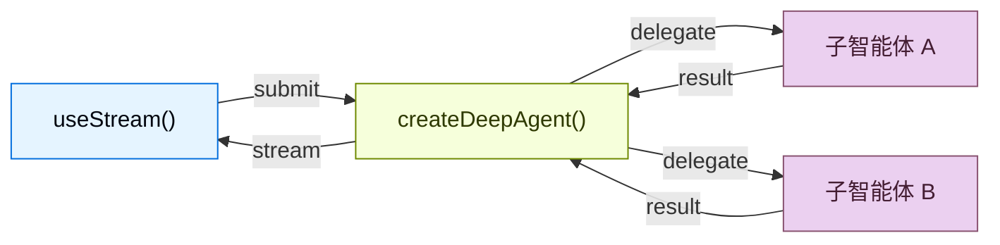

构建可视化深度智能体工作流的实时前端。这些模式展示了如何从使用 `createDeepAgent` 创建的智能体中渲染子智能体进度、任务规划、流式内容和类 IDE 沙箱体验。

## 架构

深度智能体使用协调器-工作者架构。主智能体规划任务并委派给专门的子智能体，每个子智能体在隔离环境中运行。在前端，`useStream` 同时展示协调器的消息和每个子智能体的流式状态。



```python
from deepagents import create_deep_agent

agent = create_deep_agent(
    model="google_genai:gemini-3.1-pro-preview",
    tools=[get_weather],
    system_prompt="You are a helpful assistant",
    subagents=[
        {
            "name": "researcher",
            "description": "Research assistant",
        }
    ],
)
```


在前端，以与 `createAgent` 相同的方式使用 `useStream` 连接。深度智能体模式使用额外的 `useStream` 功能，如 `stream.subagents`、`stream.values.todos` 和 `filterSubagentMessages` 来渲染子智能体特定的 UI。

```ts
import { useStream } from "@langchain/react";

function App() {
  const stream = useStream<typeof agent>({
    apiUrl: "http://localhost:2024",
    assistantId: "agent",
  });

  // 消息之外的深度智能体状态
  const todos = stream.values?.todos;
  const subagents = stream.subagents;
}
```

## 模式

<CardGroup cols={3}>
  <Card title="子智能体流式输出" icon="arrows-split" href="/oss/python/deepagents/frontend/subagent-streaming">
    显示专业子智能体的流式内容、进度跟踪和可折叠卡片。
  </Card>
  <Card title="待办事项列表" icon="list-check" href="/oss/python/deepagents/frontend/todo-list">
    使用从智能体状态同步的实时待办事项列表跟踪智能体进度。
  </Card>
  <Card title="沙箱" icon="code" href="/oss/python/deepagents/frontend/sandbox">
    构建由沙箱支持的类 IDE UI，包含文件浏览器、代码查看器和差异面板。
  </Card>
</CardGroup>

## 相关模式

[LangChain 前端模式](/oss/python/langchain/frontend/overview)，包括
markdown 消息、工具调用和人机协作，同样适用于深度
智能体。深度智能体构建在相同的 LangGraph 运行时之上，因此
`useStream` 提供相同的核心 API。

---

<div className="source-links">
<Callout icon="terminal-2">
    [连接这些文档](/use-these-docs)到 Claude、VSCode 等，通过 MCP 获取实时答案。
</Callout>
<Callout icon="edit">
    [在 GitHub 上编辑此页面](https://github.com/langchain-ai/docs/edit/main/src/oss/deepagents/frontend/overview.mdx)或[提交问题](https://github.com/langchain-ai/docs/issues/new/choose)。
</Callout>
</div>
