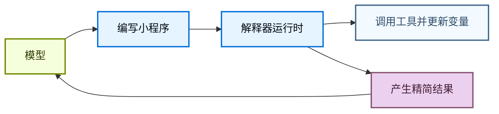
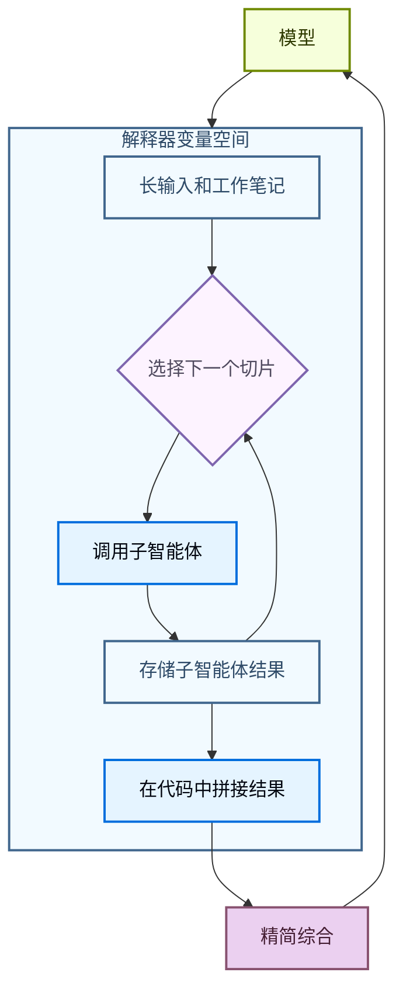

解释器为智能体提供了一个可编程工作空间，在其中可以探索数据、协调工具调用，并将中间工作保持在模型上下文之外。智能体编写代码来表达其意图，然后**内存中**的运行时执行该代码并返回相关结果。

[沙箱](/oss/python/deepagents/sandboxes)是对环境执行操作（如运行命令、安装依赖和编辑文件）的代码优先方式，而解释器是在智能体循环内部执行操作的代码优先方式：组合工具、保持状态，并决定哪些信息应返回给模型。

<Warning>
    解释器是实验性的。API 和生命周期行为可能在版本之间变化。
</Warning>

<Note>
    解释器需要 `langchain-quickjs>=0.1.0` 和 Python `>=3.11`。
</Note>


## 何时使用解释器

大多数智能体工作在模型推理和工具执行之间交替。这对简单操作有效，但当智能体需要组合多个步骤、推理结构化数据或管理中间状态时就变得笨拙。

解释器为智能体提供了一个运行时来完成这项工作。与其让模型每次选择一个工具调用来决定下一步，智能体可以编写一个小程序来运行控制流、调用允许列表中的工具、存储变量，并将精简的结果返回给模型。

在以下情况下使用解释器：

- 使用代码组合多个工具调用，包括循环、分支、重试和并发。
- 从代码协调子智能体，将工作分割为聚焦的调用、存储结果，并将结果拼接成最终综合。
- 在运行时状态中保持中间值，而不是将每个临时结果都通过模型上下文发送回去。
- 确定性地转换结构化数据，如排序、分组、解析、验证、评分或聚合。
- 探索大型变量空间，仅向模型返回选定的证据、摘要或输出。



这通过在 [**QuickJS**](https://github.com/quickjs-ng/quickjs) 上运行代码实现，QuickJS 是一个为嵌入式执行设计的轻量级 JavaScript 运行时。运行时为智能体提供了一个评估代码的场所，默认不暴露宿主文件系统、网络、shell、包或时钟 API。

QuickJS 是解释器代码的执行边界。显式桥接（如程序化工具调用）决定代码可以访问哪些能力。

## 选择正确的执行路径

| 需求 | 使用 |
| --- | --- |
| 一两个简单的外部调用 | 普通工具调用 |
| 循环、分支、重试或聚合结果的小程序 | 解释器 |
| 应从代码运行的多个选定工具调用 | 带程序化工具调用的解释器 |
| 跨线程使用的可复用辅助工具 | 带[解释器技能](/oss/python/deepagents/skills#use-interpreter-skills)的解释器 |
| Shell 命令、包安装、测试或完整的 OS 文件系统访问 | [沙箱](/oss/python/deepagents/sandboxes) |

## 向智能体添加解释器

安装 QuickJS 中间件包，然后在创建智能体时添加中间件。

<CodeGroup>
```bash pip
pip install -U "deepagents[quickjs]"
```

```bash uv
uv add "deepagents[quickjs]"
```
</CodeGroup>

```python
from deepagents import create_deep_agent
from langchain_quickjs import CodeInterpreterMiddleware

agent = create_deep_agent(
    model="openai:gpt-5.4",
    middleware=[CodeInterpreterMiddleware()],
)
```


## 在解释器中运行代码

中间件向智能体添加一个 `eval` 工具。该工具在持久上下文中运行 TypeScript，捕获 `console.log`，并返回最后一个表达式的结果。

智能体可以编写如下代码：

```javascript
const rows = [
  { team: "alpha", score: 8 },
  { team: "beta", score: 13 },
  { team: "alpha", score: 21 },
];

const totals = rows.reduce((acc, row) => {
  acc[row.team] = (acc[row.team] ?? 0) + row.score;
  console.log(`${row.team} score: ${acc[row.team]}`)
  return acc;
}, {});

totals;
```

默认情况下，解释器状态还通过在每次智能体运行后快照工作状态并在下次运行前恢复它来跨同一线程的各轮次持久化。


## 程序化工具调用

程序化工具调用（PTC）在解释器内部的全局 `tools` 命名空间下暴露选定的智能体工具。与其让模型发出一个工具调用、等待结果、然后决定下一个调用，智能体可以编写在循环、分支、重试或并行批次中调用工具的代码。

当中间工具结果仅作为下一步的输入时，这很有用。解释器可以在任何内容返回到模型上下文之前处理、过滤或聚合这些结果，这可以使多工具/多步骤工作流更高效地使用 Token。

PTC 在深度智能体中是模型无关的。它由中间件实现，而非提供商特定的代码执行或工具调用 API。

### 工作原理

1. 你使用 `ptc` 允许列表选择解释器可以调用哪些工具。
2. 中间件在 `tools` 下将这些工具作为异步 JavaScript 函数暴露。
3. 智能体编写使用 `await` 调用这些函数的解释器代码。
4. 解释器运行工具桥接，接收工具结果，并继续执行代码。
5. 模型接收最终解释器输出，而不是每个中间值。

每个允许列表中的工具变成一个异步函数。工具名称转换为驼峰式，但输入对象仍遵循工具的模式。例如，名为 `web_search` 的工具变为 `tools.webSearch(...)`：

```typescript
const result: string = await tools.webSearch({
  query: "deepagents interpreters",
});
```

### 有用的模式

| **模式** | **解释器可以做什么** |
| --- | --- |
| 批量处理 | 循环遍历多个输入并为每个调用工具。 |
| 并行工作 | 对独立调用使用 `Promise.all`。 |
| 条件逻辑 | 根据早期结果选择下一个工具调用。 |
| 提前终止 | 一旦满足成功条件就停止调用工具。 |
| 数据过滤 | 仅将相关行、片段、错误或摘要返回给模型。 |
| 递归编排 | 重复调用 `task`，然后在代码中组合子智能体结果。 |

### 启用 PTC

使用显式允许列表启用 PTC：

```python
from deepagents import create_deep_agent
from langchain_quickjs import CodeInterpreterMiddleware

agent = create_deep_agent(
    model="openai:gpt-5.4",
    middleware=[CodeInterpreterMiddleware(ptc=["task"])],
)
```


启用 PTC 后，智能体可以从解释器代码调用允许列表中的工具。此示例并行启动多个子智能体，并在返回模型之前合并它们的最终报告：

```javascript
const topics = ["retrieval", "memory", "evaluation"];

const reports = await Promise.all(
  topics.map((topic) =>
    tools.task({
      description: `Research ${topic} in Deep Agents and return three concise findings.`,
      subagent_type: "general-purpose",
    }),
  ),
);

reports.join("\n\n");
```

因为这是代码，智能体还可以在本地处理失败：

```javascript
try {
  const report = await tools.task({
    description: "Check the migration notes and return breaking changes.",
    subagent_type: "general-purpose",
  });
  console.log(report);
} catch (error) {
  console.log(`Subagent failed: ${error.message}`);
}
```

<Warning>
    PTC 调用目前通过解释器桥接执行，不通过正常的工具调用路径。因此，`interrupt_on` 审批工作流不会对每个 PTC 调用的工具执行。
</Warning>

## 递归语言模型

递归语言模型使用解释器作为分解的工作空间。模型将大型输入或工作集保存在运行时变量中，编写代码来检查和分割它，对较小的部分调用子智能体或其他模型工具，然后在代码中将返回的结果拼接在一起。

这将变量空间与智能体的上下文分离。变量空间是存储在解释器中的信息，智能体的上下文是模型在下一次模型调用中实际处理的内容。模型可以决定哪些片段成为子智能体任务、哪些结果需要再次处理，以及最终综合应返回给主对话什么。



关于此模式的背景，参见[递归语言模型论文](https://arxiv.org/abs/2512.24601)。

在深度智能体中，递归调用通常是通过程序化工具调用暴露的 `task` 工具。解释器可以在许多切片上调用子智能体，组合它们的答案，并返回单一的综合结果：

```javascript
const candidates = notes
  .filter((note) => note.includes("migration"))
  .slice(0, 5);

const riskReports = await Promise.all(
  candidates.map((note) =>
    tools.task({
      description: `Analyze this migration note for release risk. Return risks, affected users, and recommended follow-up:\n\n${note}`,
      subagent_type: "general-purpose",
    }),
  ),
);

const releaseSummary = riskReports
  .map((report, index) => `## Candidate ${index + 1}\n${report}`)
  .join("\n\n");

releaseSummary;
```

## 解释器技能

解释器技能是向解释器暴露代码模块的[技能](/oss/python/deepagents/skills)。配置了解释器中间件后，智能体可以从代码中导入这些模块并将它们用于确定性的辅助逻辑。

解释器技能在智能体需要用于结构化数据工作流的可复用辅助工具时很有用，如排序、分组、评分、解析、验证或聚合数据。有关设置详情，参见[解释器技能](/oss/python/deepagents/skills#use-interpreter-skills)。

## 快照和时间旅行

`CodeInterpreterMiddleware` 默认在每次智能体运行后快照解释器状态，并在下次运行前恢复它。快照是解释器内存中 JavaScript 状态的序列化副本，包括智能体完成运行代码时存在的全局变量、变量、函数和导入的模块。

跨对话轮次，生命周期为：

1. 一个轮次开始，`CodeInterpreterMiddleware` 恢复线程的最新解释器快照。
2. 智能体调用 `eval`，代码可以读取或变更解释器变量。
3. 智能体运行完成，中间件将更新的解释器状态快照到图状态中。
4. 下一个轮次从该恢复的解释器状态开始，而不是空运行时。

在单次智能体运行内，重复的 `eval` 调用使用实时解释器上下文对象。中间件不在这些调用之间快照和恢复；它在运行完成时快照上下文，以便在后续轮次或检查点重放时可以恢复。

<Note>
    在对话轮次之间，快照只保留可以合理序列化的值。将它们用于数据，而不是实时运行时对象。函数、类和其他不可序列化的值被恢复为不可访问的工件。如果恢复后解释器代码访问某个此类值，eval 工具将抛出类似 `Value for 'fn' was not restored because it is not serializable (type: function).` 的错误。
</Note>

快照保留解释器记忆，而不是外部世界效果。如果解释器代码通过 PTC 调用工具，恢复先前的解释器快照不会撤消该工具调用的副作用。它只恢复记录或处理结果的解释器变量。

当图使用检查点器时，这与 [LangGraph 时间旅行](/oss/python/langgraph/use-time-travel)配对。恢复图检查点可以恢复图状态中存储的解释器快照，因此你可以在调试或重放时返回到更早的智能体上下文和解释器状态。

```python
from deepagents import create_deep_agent
from langchain_quickjs import CodeInterpreterMiddleware
from langgraph.checkpoint.memory import MemorySaver

checkpointer = MemorySaver()

agent = create_deep_agent(
    model="openai:gpt-5.4",
    checkpointer=checkpointer,
    middleware=[
        CodeInterpreterMiddleware(
            snapshot_between_turns=True,  # 默认值
        )
    ],
)
```

你可以使用 `snapshot_between_turns=False` 禁用跨轮次快照。


## 安全和限制

解释器使用 QuickJS 以严格的默认隔离运行不受信任的 JavaScript。将其视为范围受限的解释器运行时，而非完整的生产沙箱后端。

你通过 PTC 暴露的每个工具都是解释器代码可以使用的外部能力。将 PTC 允许列表视为权限边界：仅暴露智能体需要的工具，避免桥接可以访问敏感系统、花费金钱、变更数据或调用无限制网络的广泛工具，除非该行为是有意的。

| 能力 | 默认可用 | 如何暴露 |
| --- | --- | --- |
| JavaScript 执行 | 是 | 添加解释器中间件 |
| 顶层 `await` | 是 | 在解释器代码中使用 promise |
| `console.log` 捕获 | 是 | 使用 `capture_console=False` 禁用 |
| 智能体工具 | 否 | 添加 PTC 允许列表 |
| 解释器技能模块 | 否 | 添加 `module` 条目并配置 `skills_backend` 或 `skillsBackend` |
| 文件系统访问 | 否 | 通过 PTC 允许列表添加[内置文件系统工具](/oss/python/deepagents/harness#virtual-filesystem-access) |
| 网络访问 | 否 | 通过 PTC 暴露特定网络工具 |
| 壁钟或日期时间访问 | 否 | 如需要暴露显式时间工具 |
| Shell 命令、包安装、测试、OS 级执行 | 否 | 使用[沙箱后端](/oss/python/deepagents/sandboxes) |


<Note>
    **代码执行工作原理**

    解释器代码在嵌入式 QuickJS 上下文中运行，而非独立的 VM 或进程。在 Python 中，此运行时由 [`quickjs-rs`](https://github.com/langchain-ai/quickjs-rs) 提供，其[安全指南](https://github.com/langchain-ai/quickjs-rs#security)中记录了同一进程执行边界。

    将解释器视为能力受限的执行层，而非宿主内存隔离边界。对于不受信任或半受信任的代码，在隔离的工作进程或容器中运行智能体，并保持 PTC 允许列表窄小。
</Note>


## 中间件选项

`CodeInterpreterMiddleware` 接受以下选项：

| 参数 | 默认值 | 用途 |
| --- | --- | --- |
| `memory_limit` | `64 * 1024 * 1024` <br/>(64 MB) | QuickJS 堆内存限制（字节）。 |
| `timeout` | `5.0` | 每次 eval 的超时（秒）。 |
| `max_ptc_calls` | `256` | 每次 eval 的最大 `tools.*` 调用数。仅在受信任环境中使用 `None`。 |
| `tool_name` | `"eval"` | 暴露给模型的解释器工具名称。 |
| `max_result_chars` | `4000` | 从结果和 stdout 块返回的最大字符数。 |
| `capture_console` | `True` | 是否捕获 `console.log`、`console.warn` 和 `console.error` 输出。 |
| `ptc` | `None` | PTC 允许列表：工具名称或 `BaseTool` 实例列表。 |
| `skills_backend` | `None` | 用于解析解释器技能模块的后端。 |
| `snapshot_between_turns` | `True` | 解释器状态快照是否在智能体轮次之间持久化。 |
| `max_snapshot_bytes` | `None` | 最大序列化快照大小。默认为 `memory_limit`。 |

---

<div className="source-links">
<Callout icon="terminal-2">
    [连接这些文档](/use-these-docs)到 Claude、VSCode 等，通过 MCP 获取实时答案。
</Callout>
<Callout icon="edit">
    [在 GitHub 上编辑此页面](https://github.com/langchain-ai/docs/edit/main/src/oss/deepagents/interpreters.mdx)或[提交问题](https://github.com/langchain-ai/docs/issues/new/choose)。
</Callout>
</div>
