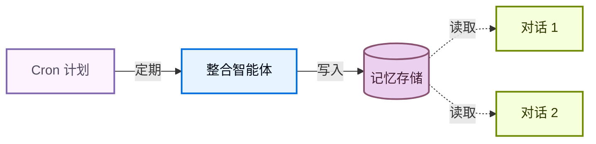

记忆让你的智能体能够跨对话学习和改进。深度智能体将记忆作为一等公民，采用基于文件系统的记忆：智能体以文件形式读写记忆，你使用[后端](/oss/python/deepagents/backends)控制这些文件的存储位置。

<Note>
本页面涵盖**长期记忆**：跨对话持久化的记忆。有关短期记忆（单次会话中的对话历史和临时文件），请参见[上下文工程](/oss/python/deepagents/context-engineering)指南。短期记忆作为智能体[状态](/oss/python/langgraph/graph-api#state)的一部分自动管理。


</Note>

## 记忆工作原理

1. **将智能体指向记忆文件。** 创建智能体时将文件路径传递给 `memory=`。你还可以通过 `skills=` 传递[技能](/oss/python/deepagents/skills)用于程序化记忆（告诉智能体*如何*执行任务的可复用指令）。[后端](/oss/python/deepagents/backends)控制文件的存储位置和访问权限。
2. **智能体读取记忆。** 智能体可以在启动时将记忆文件加载到系统提示词中，或在对话期间按需读取。例如，[技能](/oss/python/deepagents/skills)使用按需加载：智能体在启动时仅读取技能描述，然后仅在匹配任务时才读取完整的技能文件。这使上下文保持精简，直到需要某个能力时才加载。
3. **智能体更新记忆（可选）。** 当智能体学习到新信息时，它可以使用内置的 `edit_file` 工具更新记忆文件。更新可以在对话期间（默认）或通过[后台整合](#background-consolidation)在对话之间进行。更改会被持久化并在下次对话中可用。并非所有记忆都是可写的：开发者定义的[技能](/oss/python/deepagents/skills)和[组织级记忆](#organization-level-memory)通常是只读的。详情请参见[只读与可写记忆](#read-only-vs-writable-memory)。

两种最常见的模式是[智能体范围记忆](#agent-scoped-memory)（所有用户共享）和[用户范围记忆](#user-scoped-memory)（按用户隔离）。

## 范围化记忆

智能体记忆可以设定范围，使相同的记忆文件对使用该智能体的所有人可访问，或者记忆文件可以对每个用户独立。

### 智能体范围记忆

赋予智能体随时间演变的持久身份。智能体范围记忆在所有用户之间共享，因此智能体通过每次对话建立自己的人格、积累知识和学习偏好。随着与用户的交互，它发展专业知识、完善方法并记住什么有效。它还可以在具有写入权限时学习和更新[技能](/oss/python/deepagents/skills)。

关键是后端命名空间：将其设置为 `(assistant_id,)` 意味着此智能体的每次对话都读写相同的记忆文件。

<Note>
访问 `rt.server_info` 需要 `deepagents>=0.5.0`。在较旧版本上，改为从 `get_config()["metadata"]["assistant_id"]` 读取 assistant ID。
</Note>


```python
from deepagents import create_deep_agent
from deepagents.backends import CompositeBackend, StateBackend, StoreBackend

agent = create_deep_agent(
    model="google_genai:gemini-3.1-pro-preview",
    memory=["/memories/AGENTS.md"],
    skills=["/skills/"],
    backend=CompositeBackend(
        default=StateBackend(),
        routes={
            "/memories/": StoreBackend(
                namespace=lambda rt: (
                    rt.server_info.assistant_id,  # [!code highlight]
                ),
            ),
            "/skills/": StoreBackend(
                namespace=lambda rt: (
                    rt.server_info.assistant_id,  # [!code highlight]
                ),
            ),
        },
    ),
)
```


<Accordion title="完整示例：初始化记忆并调用">

填充存储的初始记忆，然后跨两个线程调用智能体，查看它记住和更新所学内容。

```python
from langchain_core.utils.uuid import uuid7

from deepagents import create_deep_agent
from deepagents.backends import CompositeBackend, StateBackend, StoreBackend
from deepagents.backends.utils import create_file_data
from langgraph.store.memory import InMemoryStore

store = InMemoryStore()  # 部署到 LangSmith 时使用平台存储

# 初始化记忆文件
store.put(
    ("my-agent",),
    "/memories/AGENTS.md",
    create_file_data("""## Response style
- Keep responses concise
- Use code examples where possible
"""),
)

# 初始化技能
store.put(
    ("my-agent",),
    "/skills/langgraph-docs/SKILL.md",
    create_file_data("""---
name: langgraph-docs
description: Fetch relevant LangGraph documentation to provide accurate guidance.
---

# langgraph-docs

Use the fetch_url tool to read https://docs.langchain.com/llms.txt, then fetch relevant pages.
"""),
)

agent = create_deep_agent(
    model="google_genai:gemini-3.1-pro-preview",
    memory=["/memories/AGENTS.md"],
    skills=["/skills/"],
    backend=lambda rt: CompositeBackend(
        default=StateBackend(rt),
        routes={
            "/memories/": StoreBackend(
                rt, namespace=lambda rt: ("my-agent",)
            ),
            "/skills/": StoreBackend(
                rt, namespace=lambda rt: ("my-agent",)
            ),
        },
    ),
    store=store,
)

# 线程 1：智能体学习新偏好并保存到记忆中
config1 = {"configurable": {"thread_id": str(uuid7())}}
agent.invoke(
    {"messages": [{"role": "user", "content": "I prefer detailed explanations. Remember that."}]},
    config=config1,
)

# 线程 2：智能体读取记忆并应用偏好
config2 = {"configurable": {"thread_id": str(uuid7())}}
agent.invoke(
    {"messages": [{"role": "user", "content": "Explain how transformers work."}]},
    config=config2,
)
```


</Accordion>

### 用户范围记忆

为每个用户提供自己的记忆文件。智能体按用户记住偏好、上下文和历史，同时核心智能体指令保持不变。如果存储在用户范围的后端中，用户也可以拥有按用户的[技能](/oss/python/deepagents/skills)。

命名空间使用 `(user_id,)` 使每个用户获得记忆文件的隔离副本。用户 A 的偏好永远不会泄露到用户 B 的对话中。

```python
from deepagents import create_deep_agent
from deepagents.backends import CompositeBackend, StateBackend, StoreBackend

agent = create_deep_agent(
    model="google_genai:gemini-3.1-pro-preview",
    memory=["/memories/preferences.md"],
    skills=["/skills/"],
    backend=CompositeBackend(
        default=StateBackend(),
        routes={
            "/memories/": StoreBackend(
                namespace=lambda rt: (rt.server_info.user.identity,),
            ),
            "/skills/": StoreBackend(
                namespace=lambda rt: (rt.server_info.user.identity,),
            ),
        },
    ),
)
```


<Accordion title="完整示例：跨用户的隔离记忆">

初始化按用户的记忆并以两个不同用户身份调用智能体。每个用户只看到自己的偏好。

```python
from langchain_core.utils.uuid import uuid7

from deepagents import create_deep_agent
from deepagents.backends import CompositeBackend, StateBackend, StoreBackend
from deepagents.backends.utils import create_file_data
from langgraph.store.memory import InMemoryStore


store = InMemoryStore()  # 部署到 LangSmith 时使用平台存储

# 为两个用户初始化偏好
store.put(
    ("user-alice",),
    "/memories/preferences.md",
    create_file_data("""## Preferences
- Likes concise bullet points
- Prefers Python examples
"""),
)
store.put(
    ("user-bob",),
    "/memories/preferences.md",
    create_file_data("""## Preferences
- Likes detailed explanations
- Prefers TypeScript examples
"""),
)

# 为 Alice 初始化技能
store.put(
    ("user-alice",),
    "/skills/langgraph-docs/SKILL.md",
    create_file_data("""---
name: langgraph-docs
description: Fetch relevant LangGraph documentation to provide accurate guidance.
---

# langgraph-docs

Use the fetch_url tool to read https://docs.langchain.com/llms.txt, then fetch relevant pages.
"""),
)

agent = create_deep_agent(
    model="google_genai:gemini-3.1-pro-preview",
    memory=["/memories/preferences.md"],
    skills=["/skills/"],
    backend=lambda rt: CompositeBackend(
        default=StateBackend(rt),
        routes={
            "/memories/": StoreBackend(
                rt,
                namespace=lambda rt: (rt.server_info.user.identity,),
            ),
            "/skills/": StoreBackend(
                rt,
                namespace=lambda rt: (rt.server_info.user.identity,),
            ),
        },
    ),
    store=store,
)

# 部署后，每个经过身份验证的请求会将
# `rt.server_info.user.identity` 解析为调用用户，因此 Alice 和 Bob
# 自动只看到自己的偏好。
agent.invoke(
    {"messages": [{"role": "user", "content": "How do I read a CSV file?"}]},
    config={"configurable": {"thread_id": str(uuid7())}},
)
```


</Accordion>

## 高级用法

除了记忆路径和范围的基本配置选项之外，你还可以配置更高级的记忆参数：

| 维度 | 回答的问题 | 选项 |
|---|---|---|
| **持续时间** | 持续多长时间？ | [短期](/oss/python/deepagents/context-engineering)（单次对话）或[长期](#scoped-memory)（跨对话） |
| **信息类型** | 什么类型的信息？ | [情景式](#episodic-memory)（过去的经验）、[程序化](/oss/python/deepagents/skills)（指令和技能）或[语义化](/oss/python/concepts/memory#semantic-memory)（事实） |
| **范围** | 谁可以查看和修改？ | [用户](#user-scoped-memory)、[智能体](#agent-scoped-memory)或[组织](#organization-level-memory) |
| **更新策略** | 何时写入记忆？ | 对话期间（默认）或[对话之间](#background-consolidation) |
| **检索** | 如何读取记忆？ | 加载到提示词中（默认）或按需（例如[技能](/oss/python/deepagents/skills)） |
| **智能体权限** | 智能体能否写入记忆？ | [读写](#read-only-vs-writable-memory)（默认）或[只读](#read-only-vs-writable-memory)（用于共享策略） |

### 情景记忆

情景记忆存储过去经验的记录：发生了什么、以什么顺序以及结果是什么。与语义记忆（存储在 `AGENTS.md` 等文件中的事实和偏好）不同，情景记忆保留完整的对话上下文，使智能体可以回忆*如何*解决了一个问题，而不仅仅是从中*学到了什么*。

深度智能体已经使用[检查点器](/oss/python/langgraph/persistence#checkpoints)，这是支持情景记忆的机制：每次对话都作为带检查点的线程持久化。

要使过去的对话可搜索，请将线程搜索封装在工具中。`user_id` 从运行时上下文中提取，而不是作为参数传递：

```python
from langgraph_sdk import get_client
from langchain.tools import tool, ToolRuntime

client = get_client(url="<DEPLOYMENT_URL>")


@tool
async def search_past_conversations(query: str, runtime: ToolRuntime) -> str:
    """搜索过去的对话以获取相关上下文。"""
    user_id = runtime.server_info.user.identity  # [!code highlight]
    threads = await client.threads.search(
        metadata={"user_id": user_id},
        limit=5,
    )
    results = []
    for thread in threads:
        history = await client.threads.get_history(thread_id=thread["thread_id"])
        results.append(history)
    return str(results)
```


你可以通过调整元数据过滤器按用户或组织限定线程搜索范围：

```python
# 搜索特定用户的对话
threads = await client.threads.search(
    metadata={"user_id": user_id},
    limit=5,
)

# 搜索组织范围内的对话
threads = await client.threads.search(
    metadata={"org_id": org_id},
    limit=5,
)
```


这对执行复杂多步骤任务的智能体很有用。例如，编码智能体可以回顾过去的调试会话并直接跳到可能的根本原因。

### 组织级记忆

组织级记忆遵循与用户范围记忆相同的模式，但使用组织范围的命名空间而不是按用户的命名空间。用于应在组织中所有用户和智能体之间应用的策略或知识。

组织记忆通常是**只读的**，以防止通过共享状态进行提示注入。详情请参见[只读与可写记忆](#read-only-vs-writable-memory)。

```python
from deepagents import create_deep_agent
from deepagents.backends import CompositeBackend, StateBackend, StoreBackend

agent = create_deep_agent(
    model="google_genai:gemini-3.1-pro-preview",
    memory=[
        "/memories/preferences.md",
        "/policies/compliance.md",
    ],
    backend=CompositeBackend(
        default=StateBackend(),
        routes={
            "/memories/": StoreBackend(
                namespace=lambda rt: (rt.server_info.user.identity,),
            ),
            "/policies/": StoreBackend(
                namespace=lambda rt: (rt.context.org_id,),
            ),
        },
    ),
)
```


从你的应用代码填充组织记忆：

```python
from langgraph_sdk import get_client
from deepagents.backends.utils import create_file_data

client = get_client(url="<DEPLOYMENT_URL>")

await client.store.put_item(
    (org_id,),
    "/compliance.md",
    create_file_data("""## Compliance policies
- Never disclose internal pricing
- Always include disclaimers on financial advice
"""),
)
```


使用[权限](/oss/python/deepagents/permissions)确保组织级记忆为只读，或使用[策略钩子](/oss/python/deepagents/backends#add-policy-hooks)实现自定义验证逻辑。

### 后台整合

默认情况下，智能体在对话期间写入记忆（热路径）。另一种方法是在对话**之间**作为后台任务处理记忆，有时称为**睡眠时间计算**。一个单独的深度智能体审查最近的对话、提取关键事实并将其与现有记忆合并。

| 方法 | 优点 | 缺点 |
|---|---|---|
| **热路径**（对话期间） | 记忆立即可用，对用户透明 | 增加延迟，智能体必须多任务处理 |
| **后台**（对话之间） | 无面向用户的延迟，可跨多次对话综合 | 记忆在下次对话之前不可用，需要第二个智能体 |

对于大多数应用，热路径已经足够。当你需要减少延迟或提高跨多次对话的记忆质量时，添加后台整合。

推荐的模式是在主智能体旁部署一个**整合智能体**——一个读取最近对话历史、提取关键事实并将其合并到记忆存储中的深度智能体——并通过 [cron 计划](#cron)触发它。选择一个反映用户实际交互频率的节奏：每天有稳定流量的聊天产品可能每几个小时整合一次，而每周只使用几次的工具只需要每晚或每周运行一次。整合频率远高于用户对话频率只会在空操作运行上浪费 Token。

#### 整合智能体

整合智能体读取最近的对话历史并将关键事实合并到记忆存储中。在 `langgraph.json` 中与主智能体一起注册它：

```python consolidation_agent.py
from datetime import datetime, timedelta, timezone

from deepagents import create_deep_agent
from langchain.tools import tool, ToolRuntime
from langgraph_sdk import get_client

sdk_client = get_client(url="<DEPLOYMENT_URL>")


@tool
async def search_recent_conversations(query: str, runtime: ToolRuntime) -> str:
    """搜索此用户在过去 6 小时内更新的对话。"""
    user_id = runtime.server_info.user.identity  # [!code highlight]

    since = datetime.now(timezone.utc) - timedelta(hours=6)
    threads = await sdk_client.threads.search(
        metadata={"user_id": user_id},
        updated_after=since.isoformat(),
        limit=20,
    )
    conversations = []
    for thread in threads:
        history = await sdk_client.threads.get_history(
            thread_id=thread["thread_id"]
        )
        conversations.append(history["values"]["messages"])
    return str(conversations)


agent = create_deep_agent(
    model="google_genai:gemini-3.1-pro-preview",
    system_prompt="""Review recent conversations and update the user's memory file.
Merge new facts, remove outdated information, and keep it concise.""",
    tools=[search_recent_conversations],
)
```


```json langgraph.json
{
  "dependencies": ["."],
  "graphs": {
    "agent": "./agent.py:agent",
    "consolidation_agent": "./consolidation_agent.py:agent"
  },
  "env": ".env"
}
```


#### Cron

[cron 作业](/langsmith/cron-jobs)按固定计划运行整合智能体。智能体搜索最近的对话并将其综合到记忆中。将计划与使用模式匹配，使整合运行大致跟踪实际活动。



使用 cron 作业计划整合智能体：

```python
from langgraph_sdk import get_client

client = get_client(url="<DEPLOYMENT_URL>")

cron_job = await client.crons.create(
    assistant_id="consolidation_agent",
    schedule="0 */6 * * *",
    input={"messages": [{"role": "user", "content": "Consolidate recent memories."}]},
)
```


<Note>
所有 cron 计划都以 **UTC** 解释。有关管理和删除 cron 作业的详情，请参见 [cron 作业](/langsmith/cron-jobs)。
</Note>

<Warning>
cron 间隔必须与整合智能体内的回溯窗口匹配。上面的示例每 6 小时运行一次（`0 */6 * * *`），智能体的 `search_recent_conversations` 工具回溯 `timedelta(hours=6)` — 保持这些同步。如果 cron 运行频率高于回溯窗口，你将重新处理相同的对话；如果运行频率低于回溯窗口，你将丢失落在窗口之外的记忆。
</Warning>

有关使用后台进程部署智能体的更多信息，请参见[投入生产](/oss/python/deepagents/going-to-production)。

### 只读与可写记忆

默认情况下，智能体可以读写记忆文件。对于组织策略或合规规则等共享状态，你可能希望将记忆设为**只读**，这样智能体可以引用它但不能修改它。这可以防止通过共享记忆进行提示注入，并确保只有你的应用代码控制文件中的内容。

| 权限 | 用例 | 工作方式 |
|---|---|---|
| **读写**（默认） | 用户偏好、智能体自我改进、已学习的[技能](/oss/python/deepagents/skills) | 智能体通过 `edit_file` 工具更新文件 |
| **只读** | 组织策略、合规规则、共享知识库、开发者定义的[技能](/oss/python/deepagents/skills) | 通过应用代码或[存储 API](/langsmith/custom-store) 填充。使用[权限](/oss/python/deepagents/permissions)拒绝对特定路径的写入，或使用[策略钩子](/oss/python/deepagents/backends#add-policy-hooks)实现自定义验证逻辑。 |

**安全注意事项：** 如果一个用户可以写入另一个用户读取的记忆，恶意用户可以向共享状态注入指令。为减轻这种风险：

- **默认使用用户范围** `(user_id)` 除非有特定原因需要共享
- 对共享策略使用**只读记忆**（通过应用代码填充，而非智能体）
- 在智能体写入共享记忆之前添加**人机协作**验证。使用[中断](/oss/python/langgraph/interrupts)要求人工批准对敏感路径的写入。

要强制只读记忆，使用[权限](/oss/python/deepagents/permissions)以声明方式拒绝对特定路径的写入。对于自定义验证逻辑（速率限制、审计日志、内容检查），使用[后端策略钩子](/oss/python/deepagents/backends#add-policy-hooks)。

### 并发写入

多个线程可以并行写入记忆，但对**相同文件**的并发写入可能导致后写入者优先的冲突。对于用户范围的记忆，这种情况很少见，因为用户通常一次只有一个活跃对话。对于智能体范围或组织范围的记忆，考虑使用[后台整合](#background-consolidation)来序列化写入，或将记忆按主题结构化为单独的文件以减少争用。

在实践中，如果写入因冲突失败，大语言模型（LLM）通常足够智能来重试或优雅恢复，因此单次丢失的写入并不是灾难性的。

### 同一部署中的多个智能体

要在共享部署中为每个智能体提供自己的记忆，请在命名空间中添加 `assistant_id`：

```python
StoreBackend(
    namespace=lambda rt: (
        rt.server_info.assistant_id,  # [!code highlight]
        rt.server_info.user.identity,
    ),
)
```


如果只需要按智能体隔离而不需要按用户范围，可以单独使用 `assistant_id`。

<Tip>
使用 [LangSmith 追踪](/langsmith/trace-with-langgraph)来审计你的智能体写入记忆的内容。每次文件写入都作为工具调用出现在追踪中。
</Tip>

---

<div className="source-links">
<Callout icon="terminal-2">
    [连接这些文档](/use-these-docs)到 Claude、VSCode 等工具，通过 MCP 获取实时答案。
</Callout>
<Callout icon="edit">
    [在 GitHub 上编辑此页面](https://github.com/langchain-ai/docs/edit/main/src/oss/deepagents/memory.mdx)或[提交问题](https://github.com/langchain-ai/docs/issues/new/choose)。
</Callout>
</div>