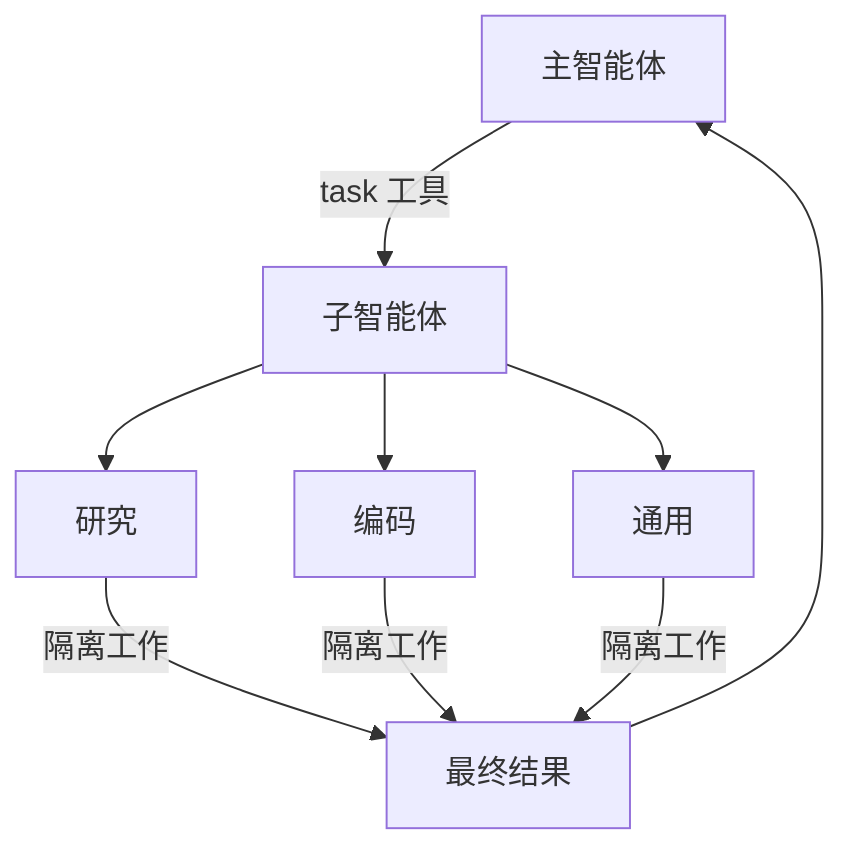

import SubagentBasicPy from '/snippets/subagent-basic-py.mdx';
import SubagentBasicJs from '/snippets/subagent-basic-js.mdx';

深度智能体可以创建子智能体来委派工作。你可以在 `subagents` 参数中指定自定义子智能体。子智能体适用于[上下文隔离](https://www.dbreunig.com/2025/06/26/how-to-fix-your-context.html#context-quarantine)（保持主智能体的上下文清洁）以及提供专门的指令。

本页面涵盖**同步**子智能体，即主管智能体会阻塞直到子智能体完成。对于长时间运行的任务、并行工作流，或需要中途调整和取消的场景，请参阅[异步子智能体](/oss/python/deepagents/async-subagents)。



## 为什么使用子智能体？

子智能体解决了**上下文膨胀问题**。当智能体使用产生大量输出的工具（网络搜索、文件读取、数据库查询）时，上下文窗口很快会被中间结果填满。子智能体隔离这些详细工作——主智能体只接收最终结果，而非产生结果的大量工具调用。

**何时使用子智能体：**
- 多步骤任务会使主智能体的上下文变得混乱
- 需要自定义指令或工具的专门领域
- 需要不同模型能力的任务
- 当你希望主智能体专注于高层协调时

**何时不使用子智能体：**
- 简单的单步骤任务
- 当你需要维护中间上下文时
- 当开销大于收益时

## 配置

`subagents` 应该是一个字典列表或 [`CompiledSubAgent`](https://reference.langchain.com/python/deepagents/middleware/subagents/CompiledSubAgent) 对象。有两种类型：

### 默认子智能体

深度智能体会自动添加一个同步的 `general-purpose` 子智能体，除非你已经提供了一个同名的同步子智能体。

- 要替换它，请传入你自己的名为 `general-purpose` 的子智能体。
- 要重命名或重新设置自动添加版本的提示词，请在活跃的 [Harness 配置](/oss/python/deepagents/profiles#harness-profiles)上设置 `general_purpose_subagent=GeneralPurposeSubagentProfile(...)`。
- 要禁用它，请参阅下面的[不使用子智能体运行](#running-without-subagents)。

### 不使用子智能体运行

要运行不带 `task` 工具的智能体，需要执行两个操作：

1. 在活跃的 [Harness 配置](/oss/python/deepagents/profiles#harness-profiles)上设置 `general_purpose_subagent=GeneralPurposeSubagentProfile(enabled=False)`。
2. 在 `create_deep_agent` 上不通过 `subagents=` 传入同步子智能体。

深度智能体仅在存在至少一个同步子智能体时才会附加 `SubAgentMiddleware`（和 `task` 工具）。当既没有默认的也没有调用者提供的子智能体时，智能体将在不委派的情况下运行。

异步子智能体不受影响——它们通过自己的中间件和工具流转，详见[异步子智能体](/oss/python/deepagents/async-subagents)。

<Tip>
    不要尝试使用 `excluded_middleware`——`SubAgentMiddleware` 是必需的基础设施，将其列入会引发 `ValueError`。`general_purpose_subagent.enabled = False` 是受支持的方式。
</Tip>

### SubAgent（基于字典）

对于大多数用例，将子智能体定义为符合 [`SubAgent`](https://reference.langchain.com/python/deepagents/middleware/subagents/SubAgent) 规范的字典，包含以下字段：

| 字段 | 类型 | 描述 |
|-------|------|-------------|
| `name` | `str` | 必需。子智能体的唯一标识符。主智能体在调用 `task()` 工具时使用此名称。子智能体名称成为 `AIMessage` 和流式输出的元数据，有助于区分不同智能体。 |
| `description` | `str` | 必需。此子智能体的功能描述。要具体且面向操作。主智能体使用此描述来决定何时委派。 |
| `system_prompt` | `str` | 必需。子智能体的指令。自定义子智能体必须定义自己的指令。包含工具使用指南和输出格式要求。<br></br>不从主智能体继承。 |
| `tools` | `list[Callable]` | 可选。子智能体可以使用的工具。保持最小化，只包含所需的工具。<br></br>默认从主智能体继承。指定后，完全覆盖继承的工具。 |
| `model` | `str` \| `BaseChatModel` | 可选。覆盖主智能体的模型。省略则使用主智能体的模型。<br></br>默认从主智能体继承。你可以传入 `'openai:gpt-5.4'` 格式的模型标识符字符串（使用 `'provider:model'` 格式），或 LangChain 聊天模型对象（`init_chat_model("gpt-5.4")` 或 `ChatOpenAI(model="gpt-5.4")`）。 |
| `middleware` | `list[Middleware]` | 可选。用于自定义行为、日志记录或速率限制的额外中间件。<br></br>不从主智能体继承。 |
| `interrupt_on` | `dict[str, bool]` | 可选。为特定工具配置[人机协作](/oss/python/deepagents/human-in-the-loop)。子智能体的值覆盖主智能体。需要 checkpointer。<br></br>默认从主智能体继承。子智能体的值覆盖默认值。 |
| `skills` | `list[str]` | 可选。[技能](/oss/python/deepagents/skills)源路径。指定后，子智能体将从这些目录加载技能（例如 `["/skills/research/", "/skills/web-search/"]`）。这允许子智能体拥有与主智能体不同的技能集。<br></br>不从主智能体继承。只有通用子智能体继承主智能体的技能。当子智能体配有技能时，它运行自己独立的 [`SkillsMiddleware`](https://reference.langchain.com/python/deepagents/middleware/skills/SkillsMiddleware) 实例。技能状态完全隔离——子智能体加载的技能对父级不可见，反之亦然。 |
| `response_format` | `ResponseFormat` | 可选。子智能体的[结构化输出](/oss/python/langchain/structured-output)模式。设置后，父级接收子智能体的结果为 JSON 而非自由文本。接受 Pydantic 模型、`ToolStrategy(...)`、`ProviderStrategy(...)` 或原始模式类型。参阅[结构化输出](#structured-output)。 |
| `permissions` | `list[FilesystemPermission]` | 可选。子智能体的[文件系统权限规则](/oss/python/deepagents/permissions)。设置后，**完全替换**父智能体的权限。<br></br>默认从主智能体继承。 |


<Tip>
    **CLI 用户：** 你也可以将子智能体定义为磁盘上的 `AGENTS.md` 文件，而非代码。`name`、`description` 和 `model` 字段映射到 YAML frontmatter，markdown 正文成为 `system_prompt`。参阅[在 CLI 中使用子智能体](/oss/python/deepagents/cli/subagents)了解文件格式。

    **部署用户：** 在 `subagents/` 下将子智能体定义为目录，包含自己的 `deepagents.toml` 和 `AGENTS.md`。打包工具会自动发现它们。参阅[部署子智能体](/oss/python/deepagents/deploy#subagents)了解完整的配置参考。
</Tip>

### CompiledSubAgent

对于复杂的工作流，使用预构建的 LangGraph 图作为 [`CompiledSubAgent`](https://reference.langchain.com/python/deepagents/middleware/subagents/CompiledSubAgent)：

| 字段 | 类型 | 描述 |
|-------|------|-------------|
| `name` | `str` | 必需。子智能体的唯一标识符。子智能体名称成为 `AIMessage` 和流式输出的元数据，有助于区分不同智能体。 |
| `description` | `str` | 必需。此子智能体的功能。 |
| `runnable` | `Runnable` | 必需。已编译的 LangGraph 图（必须先调用 `.compile()`）。 |

## 使用 SubAgent

<SubagentBasicPy />


## 使用 CompiledSubAgent

对于更复杂的用例，你可以使用 [`CompiledSubAgent`](https://reference.langchain.com/python/deepagents/middleware/subagents/CompiledSubAgent) 提供自定义子智能体。
你可以使用 LangChain 的 [`create_agent`](https://reference.langchain.com/python/langchain/agents/factory/create_agent) 创建自定义子智能体，或使用[图 API](/oss/python/langgraph/graph-api) 创建自定义 LangGraph 图。

如果你创建自定义 LangGraph 图，请确保图有一个[名为 `"messages"` 的状态键](/oss/python/langgraph/quickstart#2-define-state)：

```python
from deepagents import create_deep_agent, CompiledSubAgent
from langchain.agents import create_agent

# 创建自定义智能体图
custom_graph = create_agent(
    model=your_model,
    tools=specialized_tools,
    prompt="You are a specialized agent for data analysis..."
)

# 将其用作自定义子智能体
custom_subagent = CompiledSubAgent(
    name="data-analyzer",
    description="Specialized agent for complex data analysis tasks",
    runnable=custom_graph
)

subagents = [custom_subagent]

agent = create_deep_agent(
    model="google_genai:gemini-3.1-pro-preview",
    tools=[internet_search],
    system_prompt=research_instructions,
    subagents=subagents
)
```


## 流式输出

在流式追踪信息中，智能体名称可作为元数据中的 `lc_agent_name` 获取。
在查看追踪信息时，你可以使用此元数据来区分数据来自哪个智能体。

以下示例创建了一个名为 `main-agent` 的深度智能体和一个名为 `research-agent` 的子智能体：

```python
import os
from typing import Literal
from tavily import TavilyClient
from deepagents import create_deep_agent

tavily_client = TavilyClient(api_key=os.environ["TAVILY_API_KEY"])

def internet_search(
    query: str,
    max_results: int = 5,
    topic: Literal["general", "news", "finance"] = "general",
    include_raw_content: bool = False,
):
    """运行网络搜索"""
    return tavily_client.search(
        query,
        max_results=max_results,
        include_raw_content=include_raw_content,
        topic=topic,
    )

research_subagent = {
    "name": "research-agent",
    "description": "Used to research more in depth questions",
    "system_prompt": "You are a great researcher",
    "tools": [internet_search],
    "model": "google_genai:gemini-3.1-pro-preview",  # 可选覆盖，默认使用主智能体模型
}
subagents = [research_subagent]

agent = create_deep_agent(
    model="google_genai:gemini-3.1-pro-preview",
    subagents=subagents,
    name="main-agent"
)
```

当你向深度智能体发出提示时，子智能体或深度智能体执行的所有智能体运行都会在其元数据中包含智能体名称。
在此例中，名为 `"research-agent"` 的子智能体在任何关联的智能体运行元数据中都会有 `{'lc_agent_name': 'research-agent'}`：


## 结构化输出

子智能体支持[结构化输出](/oss/python/langchain/structured-output)，使父智能体接收可预测、可解析的 JSON 而非自由文本。

<Note>
    子智能体的结构化输出需要 `deepagents>=0.5.3`。
</Note>

在子智能体配置上传入 `response_format`。当子智能体完成时，其结构化响应会被 JSON 序列化并作为 `ToolMessage` 内容返回给父智能体。该模式接受 [`create_agent`](https://reference.langchain.com/python/langchain/agents/factory/create_agent) 支持的任何内容：Pydantic 模型、`ToolStrategy(...)`、`ProviderStrategy(...)` 或原始模式类型。

```python
from pydantic import BaseModel, Field

from deepagents import create_deep_agent


class ResearchFindings(BaseModel):
    """研究任务的结构化结果。"""
    summary: str = Field(description="研究结果摘要")
    confidence: float = Field(description="0 到 1 之间的置信度分数")
    sources: list[str] = Field(description="来源 URL 列表")

research_subagent = {
    "name": "researcher",
    "description": "Researches topics and returns structured findings",
    "system_prompt": "Research the given topic thoroughly. Return your findings.",
    "tools": [web_search],
    "response_format": ResearchFindings,
}

agent = create_deep_agent(
    model="claude-sonnet-4-6",
    subagents=[research_subagent],
)

result = await agent.ainvoke(
    {"messages": [{"role": "user", "content": "Research recent advances in quantum computing"}]}
)

# 父级的 ToolMessage 包含 JSON 序列化的结构化数据：
# '{"summary": "...", "confidence": 0.87, "sources": ["https://..."]}'
```


如果没有 `response_format`，父级接收子智能体的最后消息文本原样。有了它，父级始终获得匹配模式的有效 JSON，这在父级需要以编程方式处理结果或将其传递给下游工具时非常有用。

有关模式类型和策略（工具调用 vs. 提供商原生）的完整详情，请参阅[结构化输出](/oss/python/langchain/structured-output)。

## 通用子智能体

除了用户定义的子智能体外，每个深度智能体始终可以访问一个 `general-purpose` 子智能体。该子智能体：

- 与主智能体具有相同的系统提示词
- 可以访问所有相同的工具
- 使用相同的模型（除非被覆盖）
- 当配置了技能时，继承主智能体的技能

### 覆盖通用子智能体

在 `subagents` 列表中包含一个 `name="general-purpose"` 的子智能体来替换默认的。用它来为通用子智能体配置不同的模型、工具或系统提示词：

```python
from deepagents import create_deep_agent

# 主智能体使用 Gemini；通用子智能体使用 GPT
agent = create_deep_agent(
    model="google_genai:gemini-3.1-pro-preview",
    tools=[internet_search],
    subagents=[
        {
            "name": "general-purpose",
            "description": "General-purpose agent for research and multi-step tasks",
            "system_prompt": "You are a general-purpose assistant.",
            "tools": [internet_search],
            "model": "openai:gpt-5.4",  # 委派任务使用不同模型
        },
    ],
)
```


当你提供一个同名的子智能体时，默认的通用子智能体不会被添加。你的规范完全替换它。

要完全移除内置的通用子智能体而非替换它，请将活跃 Harness 配置的通用子智能体 `enabled` 标志设置为 `False`。

### 何时使用

通用子智能体非常适合不需要专门行为的上下文隔离。主智能体可以将复杂的多步骤任务委派给该子智能体，并获得简洁的结果，避免中间工具调用的膨胀。

<Card title="示例">
    主智能体不必自己进行 10 次网络搜索并用结果填满上下文，而是委派给通用子智能体：`task(name="general-purpose", task="Research quantum computing trends")`。子智能体在内部执行所有搜索并只返回摘要。
</Card>

### 技能继承

使用 `create_deep_agent` 配置[技能](/oss/python/deepagents/skills)时：

- **通用子智能体**：自动继承主智能体的技能
- **自定义子智能体**：默认**不**继承技能——使用 `skills` 参数为它们提供自己的技能

<Note>
    只有配置了技能的子智能体才会获得 `SkillsMiddleware` 实例——没有 `skills` 参数的自定义子智能体不会获得。当存在时，技能状态在两个方向上完全隔离：父级的技能对子级不可见，子级的技能不会传播回父级。
</Note>

```python
from deepagents import create_deep_agent

# 带有自己技能的研究子智能体
research_subagent = {
    "name": "researcher",
    "description": "Research assistant with specialized skills",
    "system_prompt": "You are a researcher.",
    "tools": [web_search],
    "skills": ["/skills/research/", "/skills/web-search/"],  # 子智能体专属技能
}

agent = create_deep_agent(
    model="google_genai:gemini-3.1-pro-preview",
    skills=["/skills/main/"],  # 主智能体和通用子智能体获得这些
    subagents=[research_subagent],  # 只获得 /skills/research/ 和 /skills/web-search/
)
```


## 最佳实践

### 编写清晰的描述

主智能体使用描述来决定调用哪个子智能体。要具体：

**好的示例：** `"Analyzes financial data and generates investment insights with confidence scores"`

**差的示例：** `"Does finance stuff"`

### 保持系统提示词详细

包含关于如何使用工具和格式化输出的具体指导：

```python
research_subagent = {
    "name": "research-agent",
    "description": "Conducts in-depth research using web search and synthesizes findings",
    "system_prompt": """You are a thorough researcher. Your job is to:

    1. Break down the research question into searchable queries
    2. Use internet_search to find relevant information
    3. Synthesize findings into a comprehensive but concise summary
    4. Cite sources when making claims

    Output format:
    - Summary (2-3 paragraphs)
    - Key findings (bullet points)
    - Sources (with URLs)

    Keep your response under 500 words to maintain clean context.""",
    "tools": [internet_search],
}
```


### 最小化工具集

只给子智能体它们需要的工具。这可以提高专注度和安全性：

```python
# 好的：专注的工具集
email_agent = {
    "name": "email-sender",
    "tools": [send_email, validate_email],  # 只有邮件相关的
}

# 差的：工具太多
email_agent = {
    "name": "email-sender",
    "tools": [send_email, web_search, database_query, file_upload],  # 不够专注
}
```


### 根据任务选择模型

不同的模型擅长不同的任务：

```python
subagents = [
    {
        "name": "contract-reviewer",
        "description": "Reviews legal documents and contracts",
        "system_prompt": "You are an expert legal reviewer...",
        "tools": [read_document, analyze_contract],
        "model": "google_genai:gemini-3.1-pro-preview",  # 大上下文适合长文档
    },
    {
        "name": "financial-analyst",
        "description": "Analyzes financial data and market trends",
        "system_prompt": "You are an expert financial analyst...",
        "tools": [get_stock_price, analyze_fundamentals],
        "model": "openai:gpt-5.4",  # 更擅长数值分析
    },
]
```


### 返回简洁的结果

指示子智能体返回摘要，而非原始数据：

```python
data_analyst = {
    "system_prompt": """Analyze the data and return:
    1. Key insights (3-5 bullet points)
    2. Overall confidence score
    3. Recommended next actions

    Do NOT include:
    - Raw data
    - Intermediate calculations
    - Detailed tool outputs

    Keep response under 300 words."""
}
```


## 常见模式

### 多个专门子智能体

为不同领域创建专门的子智能体：

```python
from deepagents import create_deep_agent

subagents = [
    {
        "name": "data-collector",
        "description": "Gathers raw data from various sources",
        "system_prompt": "Collect comprehensive data on the topic",
        "tools": [web_search, api_call, database_query],
    },
    {
        "name": "data-analyzer",
        "description": "Analyzes collected data for insights",
        "system_prompt": "Analyze data and extract key insights",
        "tools": [statistical_analysis],
    },
    {
        "name": "report-writer",
        "description": "Writes polished reports from analysis",
        "system_prompt": "Create professional reports from insights",
        "tools": [format_document],
    },
]

agent = create_deep_agent(
    model="google_genai:gemini-3.1-pro-preview",
    system_prompt="You coordinate data analysis and reporting. Use subagents for specialized tasks.",
    subagents=subagents
)
```


**工作流：**
1. 主智能体创建高层计划
2. 将数据收集委派给 data-collector
3. 将结果传递给 data-analyzer
4. 将洞见发送给 report-writer
5. 汇编最终输出

每个子智能体都以仅专注于其任务的清洁上下文工作。

## 上下文管理

当你使用[运行时上下文](/oss/python/langchain/runtime)调用父智能体时，该上下文会自动传播到所有子智能体。每个子智能体运行都会接收你在父级 `invoke` / `ainvoke` 调用中提供的相同运行时上下文。

这意味着在任何子智能体内运行的工具都可以访问你提供给父级的相同上下文值：

```python
from dataclasses import dataclass

from deepagents import create_deep_agent
from langchain.messages import HumanMessage
from langchain.tools import tool, ToolRuntime

@dataclass
class Context:
    user_id: str
    session_id: str

@tool
def get_user_data(query: str, runtime: ToolRuntime[Context]) -> str:
    """获取当前用户的数据。"""
    user_id = runtime.context.user_id
    return f"Data for user {user_id}: {query}"

research_subagent = {
    "name": "researcher",
    "description": "Conducts research for the current user",
    "system_prompt": "You are a research assistant.",
    "tools": [get_user_data],
}

agent = create_deep_agent(
    model="google_genai:gemini-3.1-pro-preview",
    subagents=[research_subagent],
    context_schema=Context,
)

# 上下文自动流向 researcher 子智能体及其工具
result = await agent.invoke(
    {"messages": [HumanMessage("Look up my recent activity")]},
    context=Context(user_id="user-123", session_id="abc"),
)
```


### 每个子智能体的上下文

所有子智能体接收相同的父级上下文。要传递特定于某个子智能体的配置，请在扁平 `context` 映射中使用**命名空间键**（用子智能体名称作为键前缀，例如 `researcher:max_depth`），**或**在上下文类型上将这些设置建模为单独的字段：

```python
from dataclasses import dataclass

from langchain.messages import HumanMessage
from langchain.tools import tool, ToolRuntime

@dataclass
class Context:
    user_id: str
    researcher_max_depth: int | None = None
    fact_checker_strict_mode: bool | None = None

result = await agent.invoke(
    {"messages": [HumanMessage("Research this and verify the claims")]},
    context=Context(
        user_id="user-123",
        researcher_max_depth=3,
        fact_checker_strict_mode=True,
    ),
)

@tool
def verify_claim(claim: str, runtime: ToolRuntime[Context]) -> str:
    """验证事实性声明。"""
    strict_mode = runtime.context.fact_checker_strict_mode or False
    if strict_mode:
        return strict_verification(claim)
    return basic_verification(claim)
```


### 识别哪个子智能体调用了工具

当同一个工具在父级和多个子智能体之间共享时，你可以使用 `lc_agent_name` 元数据（与[流式输出](#streaming)中使用的值相同）来确定是哪个智能体发起了调用：

```python
from langchain.tools import tool, ToolRuntime

@tool
def shared_lookup(query: str, runtime: ToolRuntime) -> str:
    """查找信息。"""
    agent_name = runtime.config.get("metadata", {}).get("lc_agent_name")
    if agent_name == "fact-checker":
        return strict_lookup(query)
    return general_lookup(query)
```


你可以结合两种模式——从 `runtime.context` 读取智能体特定的设置，从 `runtime.config` 元数据读取 `lc_agent_name` 来分支工具行为。

```python
from langchain.tools import tool, ToolRuntime

@tool
def flexible_search(query: str, runtime: ToolRuntime[Context]) -> str:
    """使用智能体特定设置进行搜索。"""
    agent_name = runtime.config.get("metadata", {}).get("lc_agent_name", "unknown")
    ctx = runtime.context
    if agent_name == "researcher":
        max_results = ctx.researcher_max_depth or 5
    else:
        max_results = 5
    include_raw = False

    return perform_search(query, max_results=max_results, include_raw=include_raw)
```


## 故障排除

### 子智能体未被调用

**问题**：主智能体试图自己完成工作而不是委派。

**解决方案**：

1. **使描述更具体：**

   ```python
   # 好的
   {"name": "research-specialist", "description": "Conducts in-depth research on specific topics using web search. Use when you need detailed information that requires multiple searches."}

   # 差的
   {"name": "helper", "description": "helps with stuff"}
   ```


2. **指示主智能体进行委派：**

   ```python
   agent = create_deep_agent(
       model="google_genai:gemini-3.1-pro-preview",
       system_prompt="""...your instructions...

       IMPORTANT: For complex tasks, delegate to your subagents using the task() tool.
       This keeps your context clean and improves results.""",
       subagents=[...]
   )
   ```


### 上下文仍然膨胀

**问题**：尽管使用了子智能体，上下文仍然填满。

**解决方案**：

1. **指示子智能体返回简洁的结果：**

   ```python
   system_prompt="""...

   IMPORTANT: Return only the essential summary.
   Do NOT include raw data, intermediate search results, or detailed tool outputs.
   Your response should be under 500 words."""
   ```


2. **使用文件系统处理大数据：**

   ```python
   system_prompt="""When you gather large amounts of data:
   1. Save raw data to /data/raw_results.txt
   2. Process and analyze the data
   3. Return only the analysis summary

   This keeps context clean."""
   ```


### 选择了错误的子智能体

**问题**：主智能体为任务调用了不恰当的子智能体。

**解决方案**：在描述中清楚地区分子智能体：

```python
subagents = [
    {
        "name": "quick-researcher",
        "description": "For simple, quick research questions that need 1-2 searches. Use when you need basic facts or definitions.",
    },
    {
        "name": "deep-researcher",
        "description": "For complex, in-depth research requiring multiple searches, synthesis, and analysis. Use for comprehensive reports.",
    }
]
```


:::

---

<div className="source-links">
<Callout icon="terminal-2">
    [连接这些文档](/use-these-docs) 到 Claude、VSCode 等工具，通过 MCP 获取实时解答。
</Callout>
<Callout icon="edit">
    [在 GitHub 上编辑此页面](https://github.com/langchain-ai/docs/edit/main/src/oss/deepagents/subagents.mdx) 或 [提交问题](https://github.com/langchain-ai/docs/issues/new/choose)。
</Callout>
</div>
