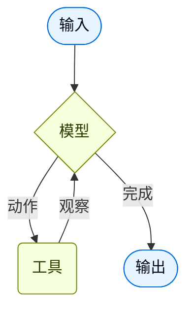

智能体将语言模型与[工具](/oss/python/langchain/tools)结合，创建能够推理任务、决定使用哪些工具并迭代地朝着解决方案工作的系统。

[`create_agent`](https://reference.langchain.com/python/langchain/agents/factory/create_agent) 提供了一个生产就绪的智能体实现。


[LLM 智能体在循环中运行工具以实现目标](https://simonwillison.net/2025/Sep/18/agents/)。
智能体持续运行直到满足停止条件——即当模型发出最终输出或达到迭代限制时。



<Info>

[`create_agent`](https://reference.langchain.com/python/langchain/agents/factory/create_agent) 使用 [LangGraph](/oss/python/langgraph/overview) 构建了一个基于**图**的智能体运行时。图由节点（步骤）和边（连接）组成，定义了智能体如何处理信息。智能体在此图中移动，执行模型节点（调用模型）、工具节点（执行工具）或中间件等节点。


了解更多关于[图 API](/oss/python/langgraph/graph-api) 的信息。

</Info>

<Tip>
使用 [LangSmith](https://smith.langchain.com?utm_source=docs&utm_medium=cta&utm_campaign=langsmith-signup&utm_content=oss-langchain-agents) 追踪此循环的每一步、调试工具调用并评估智能体输出。按照[追踪快速入门](/langsmith/trace-with-langchain)进行设置。
</Tip>

## 核心组件

### 模型

[模型](/oss/python/langchain/models)是智能体的推理引擎。它可以通过多种方式指定，支持静态和动态模型选择。

#### 静态模型

静态模型在创建智能体时配置一次，并在整个执行过程中保持不变。这是最常见和最直接的方法。

要从<Tooltip tip="遵循 `provider:model` 格式的字符串（例如 openai:gpt-5）" cta="查看映射" href="https://reference.langchain.com/python/langchain/models/#langchain.chat_models.init_chat_model(model)">模型标识符字符串</Tooltip>初始化静态模型：

```python wrap
from langchain.agents import create_agent

agent = create_agent("openai:gpt-5.4", tools=tools)
```


<Tip>
    模型标识符字符串支持自动推断（例如，`"gpt-5.4"` 会被推断为 `"openai:gpt-5.4"`）。请参考[参考文档](https://reference.langchain.com/python/langchain/chat_models/base/init_chat_model)查看完整的模型标识符字符串映射列表。
</Tip>

要更精细地控制模型配置，请直接使用提供商包初始化模型实例。在此示例中，我们使用 [`ChatOpenAI`](https://reference.langchain.com/python/langchain-openai/chat_models/base/ChatOpenAI)。请参阅[聊天模型](/oss/python/integrations/chat)了解其他可用的聊天模型类。

```python wrap
from langchain.agents import create_agent
from langchain_openai import ChatOpenAI

model = ChatOpenAI(
    model="gpt-5.4",
    temperature=0.1,
    max_tokens=1000,
    timeout=30
    # ...（其他参数）
)
agent = create_agent(model, tools=tools)
```

模型实例让你完全控制配置。当你需要设置特定[参数](/oss/python/langchain/models#parameters)（如 `temperature`、`max_tokens`、`timeouts`、`base_url` 和其他提供商特定设置）时使用它们。请参考[参考文档](/oss/python/integrations/providers/all_providers)查看模型上可用的参数和方法。


#### 动态模型

动态模型在<Tooltip tip="智能体的执行环境，包含在智能体执行期间持续存在的不可变配置和上下文数据（例如用户 ID、会话详情或特定于应用的配置）。">运行时</Tooltip>根据当前<Tooltip tip="流经智能体执行的数据，包括消息、自定义字段以及在处理过程中需要跟踪和可能修改的任何信息（例如用户偏好或工具使用统计）。">状态</Tooltip>和上下文进行选择。这支持复杂的路由逻辑和成本优化。

要使用动态模型，请使用 [`@wrap_model_call`](https://reference.langchain.com/python/langchain/agents/middleware/types/wrap_model_call) 装饰器创建中间件来修改请求中的模型：

```python
from langchain_openai import ChatOpenAI
from langchain.agents import create_agent
from langchain.agents.middleware import wrap_model_call, ModelRequest, ModelResponse


basic_model = ChatOpenAI(model="gpt-5.4-mini")
advanced_model = ChatOpenAI(model="gpt-5.4")

@wrap_model_call
def dynamic_model_selection(request: ModelRequest, handler) -> ModelResponse:
    """根据对话复杂度选择模型。"""
    message_count = len(request.state["messages"])

    if message_count > 10:
        # 对较长的对话使用高级模型
        model = advanced_model
    else:
        model = basic_model

    return handler(request.override(model=model))

agent = create_agent(
    model=basic_model,  # 默认模型
    tools=tools,
    middleware=[dynamic_model_selection]
)
```

<Warning>
使用结构化输出时不支持预绑定模型（已调用 [`bind_tools`](https://reference.langchain.com/python/langchain-core/language_models/chat_models/BaseChatModel/bind_tools) 的模型）。如果你需要结合结构化输出进行动态模型选择，请确保传给中间件的模型未被预绑定。
</Warning>


<Tip>
有关模型配置的详细信息，请参阅[模型](/oss/python/langchain/models)。有关动态模型选择模式，请参阅[中间件中的动态模型](/oss/python/langchain/middleware#dynamic-model)。
</Tip>

### 工具

工具赋予智能体执行操作的能力。智能体超越了简单的纯模型工具绑定，提供了以下能力：

- 按顺序执行多个工具调用（由单个提示词触发）
- 在适当时并行调用工具
- 基于先前结果动态选择工具
- 工具重试逻辑和错误处理
- 跨工具调用的状态持久化

更多信息请参阅[工具](/oss/python/langchain/tools)。

#### 静态工具

静态工具在创建智能体时定义，并在整个执行过程中保持不变。这是最常见和最直接的方法。

要定义具有静态工具的智能体，请将工具列表传给智能体。

<Tip>
工具可以指定为普通 Python 函数或<Tooltip tip="可以暂停执行并在稍后恢复的方法">协程</Tooltip>。

[tool 装饰器](/oss/python/langchain/tools#create-tools)可用于自定义工具名称、描述、参数模式和其他属性。
</Tip>

```python wrap
from langchain.tools import tool
from langchain.agents import create_agent


@tool
def search(query: str) -> str:
    """搜索信息。"""
    return f"Results for: {query}"

@tool
def get_weather(location: str) -> str:
    """获取某个地点的天气信息。"""
    return f"Weather in {location}: Sunny, 72°F"

agent = create_agent(model, tools=[search, get_weather])
```


如果提供空的工具列表，智能体将只包含一个没有工具调用能力的 LLM 节点。

#### 动态工具

使用动态工具，智能体可用的工具集在运行时被修改，而不是全部预先定义。并非每个工具都适合每种情况。太多工具可能会压垮模型（上下文过载）并增加错误；太少则会限制能力。动态工具选择支持根据身份验证状态、用户权限、功能标志或对话阶段来调整可用工具集。

根据工具是否预先已知，有两种方法：

<Tabs>
  <Tab title="过滤预注册工具">

    当所有可能的工具在智能体创建时已知时，你可以预注册它们并根据状态、权限或上下文动态过滤暴露给模型的工具。

    <Tabs>
      <Tab title="状态">
        仅在特定对话里程碑后启用高级工具：

        ```python
        from langchain.agents import create_agent
        from langchain.agents.middleware import wrap_model_call, ModelRequest, ModelResponse
        from typing import Callable

        @wrap_model_call
        def state_based_tools(
            request: ModelRequest,
            handler: Callable[[ModelRequest], ModelResponse]
        ) -> ModelResponse:
            """基于对话状态过滤工具。"""
            # 从状态读取：检查用户是否已认证
            state = request.state
            is_authenticated = state.get("authenticated", False)
            message_count = len(state["messages"])

            # 仅在认证后启用敏感工具
            if not is_authenticated:
                tools = [t for t in request.tools if t.name.startswith("public_")]
                request = request.override(tools=tools)
            elif message_count < 5:
                # 在对话早期限制工具
                tools = [t for t in request.tools if t.name != "advanced_search"]
                request = request.override(tools=tools)

            return handler(request)

        agent = create_agent(
            model="gpt-5.4",
            tools=[public_search, private_search, advanced_search],
            middleware=[state_based_tools]
        )
        ```


      </Tab>

      <Tab title="存储">
        基于存储中的用户偏好或功能标志过滤工具：

        ```python
        from dataclasses import dataclass
        from langchain.agents import create_agent
        from langchain.agents.middleware import wrap_model_call, ModelRequest, ModelResponse
        from typing import Callable
        from langgraph.store.memory import InMemoryStore

        @dataclass
        class Context:
            user_id: str

        @wrap_model_call
        def store_based_tools(
            request: ModelRequest,
            handler: Callable[[ModelRequest], ModelResponse]
        ) -> ModelResponse:
            """基于存储偏好过滤工具。"""
            user_id = request.runtime.context.user_id

            # 从存储读取：获取用户启用的功能
            store = request.runtime.store
            feature_flags = store.get(("features",), user_id)

            if feature_flags:
                enabled_features = feature_flags.value.get("enabled_tools", [])
                # 仅包含为此用户启用的工具
                tools = [t for t in request.tools if t.name in enabled_features]
                request = request.override(tools=tools)

            return handler(request)

        agent = create_agent(
            model="gpt-5.4",
            tools=[search_tool, analysis_tool, export_tool],
            middleware=[store_based_tools],
            context_schema=Context,
            store=InMemoryStore()
        )
        ```


      </Tab>

      <Tab title="运行时上下文">
        基于运行时上下文中的用户权限过滤工具：

        ```python
        from dataclasses import dataclass
        from langchain.agents import create_agent
        from langchain.agents.middleware import wrap_model_call, ModelRequest, ModelResponse
        from typing import Callable

        @dataclass
        class Context:
            user_role: str

        @wrap_model_call
        def context_based_tools(
            request: ModelRequest,
            handler: Callable[[ModelRequest], ModelResponse]
        ) -> ModelResponse:
            """基于运行时上下文权限过滤工具。"""
            # 从运行时上下文读取：获取用户角色
            if request.runtime is None or request.runtime.context is None:
                # 如果未提供上下文，默认为查看者（最严格）
                user_role = "viewer"
            else:
                user_role = request.runtime.context.user_role

            if user_role == "admin":
                # 管理员获得所有工具
                pass
            elif user_role == "editor":
                # 编辑者不能删除
                tools = [t for t in request.tools if t.name != "delete_data"]
                request = request.override(tools=tools)
            else:
                # 查看者只获得只读工具
                tools = [t for t in request.tools if t.name.startswith("read_")]
                request = request.override(tools=tools)

            return handler(request)

        agent = create_agent(
            model="gpt-5.4",
            tools=[read_data, write_data, delete_data],
            middleware=[context_based_tools],
            context_schema=Context
        )
        ```


      </Tab>
    </Tabs>

    此方法最适用于：
    - 所有可能的工具在编译/启动时已知
    - 你需要基于权限、功能标志或对话状态进行过滤
    - 工具是静态的但其可用性是动态的

    请参阅[动态选择工具](/oss/python/langchain/middleware/custom#dynamically-selecting-tools)获取更多示例。

  </Tab>

  <Tab title="运行时工具注册">

    当工具在运行时发现或创建（例如从 MCP 服务器加载、基于用户数据生成或从远程注册表获取）时，你需要同时注册工具并动态处理它们的执行。

    这需要两个中间件钩子：
    1. `wrap_model_call` - 将动态工具添加到请求中
    2. `wrap_tool_call` - 处理动态添加的工具的执行

    ```python
    from langchain.tools import tool
    from langchain.agents import create_agent
    from langchain.agents.middleware import AgentMiddleware, ModelRequest, ToolCallRequest

    # 将在运行时动态添加的工具
    @tool
    def calculate_tip(bill_amount: float, tip_percentage: float = 20.0) -> str:
        """计算账单的小费金额。"""
        tip = bill_amount * (tip_percentage / 100)
        return f"Tip: ${tip:.2f}, Total: ${bill_amount + tip:.2f}"

    class DynamicToolMiddleware(AgentMiddleware):
        """注册和处理动态工具的中间件。"""

        def wrap_model_call(self, request: ModelRequest, handler):
            # 将动态工具添加到请求中
            # 这可以从 MCP 服务器、数据库等加载
            updated = request.override(tools=[*request.tools, calculate_tip])
            return handler(updated)

        def wrap_tool_call(self, request: ToolCallRequest, handler):
            # 处理动态工具的执行
            if request.tool_call["name"] == "calculate_tip":
                return handler(request.override(tool=calculate_tip))
            return handler(request)

    agent = create_agent(
        model="gpt-4o",
        tools=[get_weather],  # 这里只注册静态工具
        middleware=[DynamicToolMiddleware()],
    )

    # 智能体现在可以同时使用 get_weather 和 calculate_tip
    result = agent.invoke({
        "messages": [{"role": "user", "content": "Calculate a 20% tip on $85"}]
    })
    ```


    此方法最适用于：
    - 工具在运行时发现（例如来自 MCP 服务器）
    - 工具基于用户数据或配置动态生成
    - 你正在与外部工具注册表集成

    <Note>
    运行时注册的工具需要 `wrap_tool_call` 钩子，因为智能体需要知道如何执行不在原始工具列表中的工具。没有它，智能体将不知道如何调用动态添加的工具。
    </Note>

  </Tab>
</Tabs>

<Tip>
要了解更多关于工具的信息，请参阅[工具](/oss/python/langchain/tools)。
</Tip>

#### 工具错误处理

要自定义工具错误的处理方式，请使用 [`@wrap_tool_call`](https://reference.langchain.com/python/langchain/agents/middleware/types/wrap_tool_call) 装饰器创建中间件：

```python wrap
from langchain.agents import create_agent
from langchain.agents.middleware import wrap_tool_call
from langchain.messages import ToolMessage


@wrap_tool_call
def handle_tool_errors(request, handler):
    """使用自定义消息处理工具执行错误。"""
    try:
        return handler(request)
    except Exception as e:
        # 向模型返回自定义错误消息
        return ToolMessage(
            content=f"Tool error: Please check your input and try again. ({str(e)})",
            tool_call_id=request.tool_call["id"]
        )

agent = create_agent(
    model="gpt-5.4",
    tools=[search, get_weather],
    middleware=[handle_tool_errors]
)
```

当工具失败时，智能体将返回一个包含自定义错误消息的 [`ToolMessage`](https://reference.langchain.com/python/langchain-core/messages/tool/ToolMessage)：

```python
[
    ...
    ToolMessage(
        content="Tool error: Please check your input and try again. (division by zero)",
        tool_call_id="..."
    ),
    ...
]
```


#### ReAct 循环中的工具使用

智能体遵循 ReAct（"推理 + 行动"）模式，在简短的推理步骤与目标明确的工具调用之间交替进行，并将产生的观察结果反馈到后续决策中，直到能够给出最终回答。

<Accordion title="ReAct 循环示例">
**提示词：**识别当前最受欢迎的无线耳机并验证其库存情况。

```
================================ Human Message =================================

Find the most popular wireless headphones right now and check if they're in stock
```

* **推理**："受欢迎程度是时效性的，我需要使用提供的搜索工具。"
* **行动**：调用 `search_products("wireless headphones")`

```
================================== Ai Message ==================================
Tool Calls:
  search_products (call_abc123)
 Call ID: call_abc123
  Args:
    query: wireless headphones
```
```
================================= Tool Message =================================

Found 5 products matching "wireless headphones". Top 5 results: WH-1000XM5, ...
```

* **推理**："我需要在回答之前确认排名第一的商品的库存情况。"
* **行动**：调用 `check_inventory("WH-1000XM5")`

```
================================== Ai Message ==================================
Tool Calls:
  check_inventory (call_def456)
 Call ID: call_def456
  Args:
    product_id: WH-1000XM5
```
```
================================= Tool Message =================================

Product WH-1000XM5: 10 units in stock
```

* **推理**："我已经有了最受欢迎的型号及其库存状态。我现在可以回答用户的问题了。"
* **行动**：生成最终回答

```
================================== Ai Message ==================================

I found wireless headphones (model WH-1000XM5) with 10 units in stock...
```
</Accordion>

### 系统提示词

你可以通过提供提示词来塑造智能体处理任务的方式。[`system_prompt`](https://reference.langchain.com/python/langchain/agents/#langchain.agents.create_agent(system_prompt)) 参数可以作为字符串提供：


```python wrap
agent = create_agent(
    model,
    tools,
    system_prompt="You are a helpful assistant. Be concise and accurate."
)
```


当未提供 [`system_prompt`](https://reference.langchain.com/python/langchain/agents/#langchain.agents.create_agent(system_prompt)) 时，智能体将直接从消息中推断其任务。

[`system_prompt`](https://reference.langchain.com/python/langchain/agents/#langchain.agents.create_agent(system_prompt)) 参数接受 `str` 或 [`SystemMessage`](https://reference.langchain.com/python/langchain-core/messages/system/SystemMessage)。使用 `SystemMessage` 可以更精细地控制提示词结构，这对于提供商特定的功能（如 [Anthropic 的提示词缓存](/oss/python/integrations/chat/anthropic#prompt-caching)）很有用：

```python wrap
from langchain.agents import create_agent
from langchain.messages import SystemMessage, HumanMessage

literary_agent = create_agent(
    model="google_genai:gemini-3.1-pro-preview",
    system_prompt=SystemMessage(
        content=[
            {
                "type": "text",
                "text": "You are an AI assistant tasked with analyzing literary works.",
            },
            {
                "type": "text",
                "text": "<the entire contents of 'Pride and Prejudice'>",
                "cache_control": {"type": "ephemeral"}
            }
        ]
    )
)

result = literary_agent.invoke(
    {"messages": [HumanMessage("Analyze the major themes in 'Pride and Prejudice'.")]}
)
```

`cache_control` 字段设置 `{"type": "ephemeral"}` 告诉 Anthropic 缓存该内容块，减少使用相同系统提示词的重复请求的延迟和成本。


#### 动态系统提示词

对于需要根据运行时上下文或智能体状态修改系统提示词的更高级用例，你可以使用[中间件](/oss/python/langchain/middleware)。

[`@dynamic_prompt`](https://reference.langchain.com/python/langchain/agents/middleware/types/dynamic_prompt) 装饰器创建基于模型请求生成系统提示词的中间件：

```python wrap
from typing import TypedDict

from langchain.agents import create_agent
from langchain.agents.middleware import dynamic_prompt, ModelRequest


class Context(TypedDict):
    user_role: str

@dynamic_prompt
def user_role_prompt(request: ModelRequest) -> str:
    """基于用户角色生成系统提示词。"""
    user_role = request.runtime.context.get("user_role", "user")
    base_prompt = "You are a helpful assistant."

    if user_role == "expert":
        return f"{base_prompt} Provide detailed technical responses."
    elif user_role == "beginner":
        return f"{base_prompt} Explain concepts simply and avoid jargon."

    return base_prompt

agent = create_agent(
    model="gpt-5.4",
    tools=[web_search],
    middleware=[user_role_prompt],
    context_schema=Context
)

# 系统提示词将基于上下文动态设置
result = agent.invoke(
    {"messages": [{"role": "user", "content": "Explain machine learning"}]},
    context={"user_role": "expert"}
)
```


<Tip>
有关消息类型和格式的更多详细信息，请参阅[消息](/oss/python/langchain/messages)。有关完整的中间件文档，请参阅[中间件](/oss/python/langchain/middleware)。
</Tip>

### 名称

为智能体设置可选的 [`name`](https://reference.langchain.com/python/langchain/agents/factory/create_agent)。当在[多智能体系统](/oss/python/langchain/multi-agent)中将智能体作为子图添加时，它用作节点标识符：

```python
agent = create_agent(
    model,
    tools,
    name="research_assistant"
)
```


<Warning>
    智能体名称优先使用 `snake_case`（例如 `research_assistant` 而不是 `Research Assistant`）。某些模型提供商会拒绝包含空格或特殊字符的名称并返回错误。仅使用字母数字字符、下划线和连字符可确保跨所有提供商的兼容性。[工具名称](/oss/python/langchain/tools)同理。
</Warning>

## 调用

你可以通过传递对其 [`State`](/oss/python/langgraph/graph-api#state) 的更新来调用智能体。所有智能体在其状态中包含[消息序列](/oss/python/langgraph/use-graph-api#messagesstate)；要调用智能体，请传递一条新消息：


```python
result = agent.invoke(
    {"messages": [{"role": "user", "content": "What's the weather in San Francisco?"}]}
)
```


有关从智能体流式传输步骤和/或 Token 的信息，请参阅[流式处理](/oss/python/langchain/streaming)指南。

其他方面，智能体遵循 LangGraph [图 API](/oss/python/langgraph/use-graph-api)并支持所有关联的方法，如 `stream` 和 `invoke`。

## 高级概念

### 结构化输出

在某些情况下，你可能希望智能体以特定格式返回输出。LangChain 通过 [`response_format`](https://reference.langchain.com/python/langchain/agents/factory/create_agent) 参数提供结构化输出策略。

#### ToolStrategy

`ToolStrategy` 使用人工工具调用来生成结构化输出。这适用于任何支持工具调用的模型。当提供商原生的结构化输出（通过 [`ProviderStrategy`](#providerstrategy)）不可用或不可靠时，应使用 `ToolStrategy`。

```python wrap
from pydantic import BaseModel
from langchain.agents import create_agent
from langchain.agents.structured_output import ToolStrategy


class ContactInfo(BaseModel):
    name: str
    email: str
    phone: str

agent = create_agent(
    model="gpt-5.4-mini",
    tools=[search_tool],
    response_format=ToolStrategy(ContactInfo)
)

result = agent.invoke({
    "messages": [{"role": "user", "content": "Extract contact info from: John Doe, john@example.com, (555) 123-4567"}]
})

result["structured_response"]
# ContactInfo(name='John Doe', email='john@example.com', phone='(555) 123-4567')
```

#### ProviderStrategy

`ProviderStrategy` 使用模型提供商原生的结构化输出生成。这更可靠，但仅适用于支持原生结构化输出的提供商：

```python wrap
from langchain.agents.structured_output import ProviderStrategy

agent = create_agent(
    model="gpt-5.4",
    response_format=ProviderStrategy(ContactInfo)
)
```

<Note>
从 `langchain 1.0` 起，只需传递模式（例如 `response_format=ContactInfo`），如果模型支持原生结构化输出，将默认使用 `ProviderStrategy`。否则回退到 `ToolStrategy`。
</Note>


<Tip>
    要了解结构化输出，请参阅[结构化输出](/oss/python/langchain/structured-output)。
</Tip>

### 记忆

智能体通过消息状态自动维护对话历史。你还可以配置智能体使用自定义状态模式来在对话过程中记住额外信息。

存储在状态中的信息可以被视为智能体的[短期记忆](/oss/python/langchain/short-term-memory)：

自定义状态模式必须作为 `TypedDict` 扩展 [`AgentState`](https://reference.langchain.com/python/langchain/agents/middleware/types/AgentState)。

有两种定义自定义状态的方式：
1. 通过[中间件](/oss/python/langchain/middleware)（推荐）
2. 通过 [`create_agent`](https://reference.langchain.com/python/langchain/agents/factory/create_agent) 上的 [`state_schema`](https://reference.langchain.com/python/langchain/middleware/#langchain.agents.middleware.AgentMiddleware.state_schema)

#### 通过中间件定义状态

当你的自定义状态需要被特定的中间件钩子和附属于该中间件的工具访问时，使用中间件来定义自定义状态。

```python
from langchain.agents import AgentState
from langchain.agents.middleware import AgentMiddleware
from typing import Any


class CustomState(AgentState):
    user_preferences: dict

class CustomMiddleware(AgentMiddleware):
    state_schema = CustomState
    tools = [tool1, tool2]

    def before_model(self, state: CustomState, runtime) -> dict[str, Any] | None:
        ...

agent = create_agent(
    model,
    tools=tools,
    middleware=[CustomMiddleware()]
)

# 智能体现在可以追踪消息之外的额外状态
result = agent.invoke({
    "messages": [{"role": "user", "content": "I prefer technical explanations"}],
    "user_preferences": {"style": "technical", "verbosity": "detailed"},
})
```

#### 通过 `state_schema` 定义状态

使用 [`state_schema`](https://reference.langchain.com/python/langchain/middleware/#langchain.agents.middleware.AgentMiddleware.state_schema) 参数作为快捷方式来定义仅在工具中使用的自定义状态。

```python
from langchain.agents import AgentState


class CustomState(AgentState):
    user_preferences: dict

agent = create_agent(
    model,
    tools=[tool1, tool2],
    state_schema=CustomState
)
# 智能体现在可以追踪消息之外的额外状态
result = agent.invoke({
    "messages": [{"role": "user", "content": "I prefer technical explanations"}],
    "user_preferences": {"style": "technical", "verbosity": "detailed"},
})
```

<Note>
从 `langchain 1.0` 起，自定义状态模式**必须**是 `TypedDict` 类型。不再支持 Pydantic 模型和 dataclass。详见 [v1 迁移指南](/oss/python/migrate/langchain-v1#state-type-restrictions)。
</Note>


<Note>
    通过中间件定义自定义状态优于在 [`create_agent`](https://reference.langchain.com/python/langchain/agents/factory/create_agent) 上通过 [`state_schema`](https://reference.langchain.com/python/langchain/middleware/#langchain.agents.middleware.AgentMiddleware.state_schema) 定义，因为它允许你将状态扩展在概念上限定到相关的中间件和工具。

    为了向后兼容，[`create_agent`](https://reference.langchain.com/python/langchain/agents/factory/create_agent) 上仍然支持 [`state_schema`](https://reference.langchain.com/python/langchain/middleware/#langchain.agents.middleware.AgentMiddleware.state_schema)。
</Note>


<Tip>
    要了解更多关于记忆的信息，请参阅[记忆](/oss/python/concepts/memory)。有关实现跨会话持久化的长期记忆的信息，请参阅[长期记忆](/oss/python/langchain/long-term-memory)。
</Tip>

### 流式处理

我们已经看到如何使用 `invoke` 调用智能体以获取最终响应。如果智能体执行多个步骤，这可能需要一段时间。要显示中间进度，我们可以在消息产生时流式回传。

```python
from langchain.messages import AIMessage, HumanMessage

for chunk in agent.stream({
    "messages": [{"role": "user", "content": "Search for AI news and summarize the findings"}]
}, stream_mode="values"):
    # 每个块包含该时刻的完整状态
    latest_message = chunk["messages"][-1]
    if latest_message.content:
        if isinstance(latest_message, HumanMessage):
            print(f"User: {latest_message.content}")
        elif isinstance(latest_message, AIMessage):
            print(f"Agent: {latest_message.content}")
    elif latest_message.tool_calls:
        print(f"Calling tools: {[tc['name'] for tc in latest_message.tool_calls]}")
```


<Tip>
有关流式处理的更多详细信息，请参阅[流式处理](/oss/python/langchain/streaming)。
</Tip>

### 中间件

[中间件](/oss/python/langchain/middleware)为在执行的不同阶段自定义智能体行为提供了强大的扩展性。你可以使用中间件来：

- 在调用模型之前处理状态（例如消息修剪、上下文注入）
- 修改或验证模型的响应（例如护栏、内容过滤）
- 使用自定义逻辑处理工具执行错误
- 基于状态或上下文实现动态模型选择
- 添加自定义日志记录、监控或分析

中间件无缝集成到智能体的执行中，允许你在关键点拦截和修改数据流，而无需更改核心智能体逻辑。

<Tip>
有关完整的中间件文档，包括 [`@before_model`](https://reference.langchain.com/python/langchain/agents/middleware/types/before_model)、[`@after_model`](https://reference.langchain.com/python/langchain/agents/middleware/types/after_model) 和 [`@wrap_tool_call`](https://reference.langchain.com/python/langchain/agents/middleware/types/wrap_tool_call) 等装饰器，请参阅[中间件](/oss/python/langchain/middleware)。
</Tip>

---

<div className="source-links">
<Callout icon="terminal-2">
    [将这些文档连接](/use-these-docs)到 Claude、VSCode 等工具，通过 MCP 获取实时回答。
</Callout>
<Callout icon="edit">
    [在 GitHub 上编辑此页面](https://github.com/langchain-ai/docs/edit/main/src/oss/langchain/agents.mdx)或[提交问题](https://github.com/langchain-ai/docs/issues/new/choose)。
</Callout>
</div>
