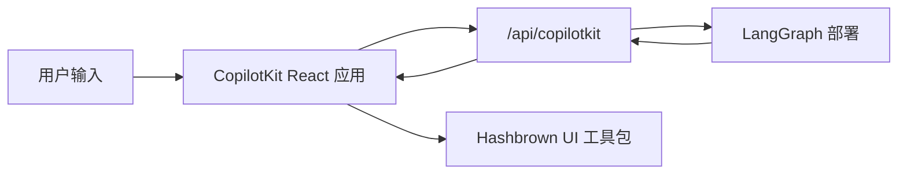

[CopilotKit](https://www.copilotkit.ai/) 提供完整的 React 聊天运行时，在你希望智能体返回**结构化 UI 载荷**而不仅仅是纯文本时，与 LangGraph 配合尤为出色。在此模式中，你的 LangGraph 部署同时服务图 API 和自定义 CopilotKit 端点，而前端将助手消息解析为动态 React 组件。

此方法适用于以下场景：

- 你想要一个现成的聊天运行时，而非自己连接 `stream.messages`
- 你需要一个自定义服务端点，可以在部署的图旁边添加特定于提供商的行为
- 从受约束的组件注册表渲染结构化生成式 UI

<Info>
  有关 CopilotKit 特定的 API、UI 模式和运行时配置，请参阅
  [CopilotKit 文档](https://docs.copilotkit.ai/langgraph)。
</Info>

import { ExampleEmbed } from "/snippets/example-embed.jsx"

<ExampleEmbed example="copilotkit" minHeight={700} />

## 工作原理

总体而言，CopilotKit 位于你的 React 应用和 LangGraph 部署之间。前端将对话状态发送到挂载在图 API 旁边的自定义 `/api/copilotkit` 路由，该路由将请求转发到 LangGraph，响应返回时包含助手消息和你的组件注册表可以渲染的结构化 UI 载荷。

1. **照常部署图**，使用 LangSmith 或 LangGraph 开发服务器。
2. **用 HTTP 应用扩展部署**，在图 API 旁边挂载 CopilotKit 路由。
3. **用 `CopilotKit` 包裹前端**，并指向该自定义运行时 URL。
4. **注册动态 UI 组件**，并在渲染时将助手响应解析为这些组件。



## 安装

后端端点：


```bash
uv add copilotkit ag-ui-langgraph fastapi uvicorn
```


前端应用：

```bash
bun add @copilotkit/react-core @copilotkit/react-ui @hashbrownai/core @hashbrownai/react
```

## 用自定义端点扩展 LangGraph 部署

关键思路是 LangGraph 部署不仅仅服务图。它还可以加载 HTTP 应用，让你在部署本身旁边挂载额外的路由。

在 `langgraph.json` 中，将 `http.app` 指向你的自定义应用入口点：


```json
{
  "dependencies": ["."],
  "graphs": {
    "copilotkit_shadify": "./main.py:agent"
  },
  "http": {
    "app": "./main.py:app"
  }
}
```


在 Python 中，创建一个 `FastAPI` 应用，并通过 CopilotKit 的 AG-UI 桥接暴露 LangGraph 智能体：

```python main.py
from typing import Any, TypedDict

from ag_ui_langgraph import add_langgraph_fastapi_endpoint
from copilotkit import CopilotKitMiddleware, CopilotKitState, LangGraphAGUIAgent
from fastapi import FastAPI
from langchain.agents import create_agent

from src.middleware import apply_structured_output_schema, normalize_context


class AgentState(CopilotKitState):
    pass


class AgentContext(TypedDict, total=False):
    output_schema: dict[str, Any]


agent = create_agent(
    model="openai:gpt-5.4",
    middleware=[
        normalize_context,
        CopilotKitMiddleware(),
        apply_structured_output_schema,
    ],
    context_schema=AgentContext,
    state_schema=AgentState,
    system_prompt=(
        "你是一个有帮助的 UI 助手。使用可用组件构建可视化响应。"
    ),
)

app = FastAPI()

add_langgraph_fastapi_endpoint(
    app=app,
    agent=LangGraphAGUIAgent(
        name="copilotkit_shadify",
        description="一个返回结构化组件载荷的 UI 助手。",
        graph=agent,
    ),
    path="/",
)
```


这个自定义应用是重要的扩展点：它挂载了一个 CopilotKit 感知的运行时，而不会替换底层的 LangGraph 部署。


在 Python 中，等效的工作在中间件中完成：规范化 CopilotKit 上下文，并将 `useAgentContext(...)` 中的 `output_schema` 转发到模型的结构化输出配置中。

```python expandable src/middleware.py
import json
from collections.abc import Mapping

from langchain.agents.middleware import before_agent, wrap_model_call
from langchain.agents.structured_output import ProviderStrategy


@wrap_model_call
async def apply_structured_output_schema(request, handler):
    schema = None
    runtime = getattr(request, "runtime", None)
    runtime_context = getattr(runtime, "context", None)

    if isinstance(runtime_context, Mapping):
        schema = runtime_context.get("output_schema")

    if schema is None and isinstance(getattr(request, "state", None), dict):
        copilot_context = request.state.get("copilotkit", {}).get("context")
        if isinstance(copilot_context, list):
            for item in copilot_context:
                if isinstance(item, dict) and item.get("description") == "output_schema":
                    schema = item.get("value")
                    break

    if isinstance(schema, str):
        try:
            schema = json.loads(schema)
        except json.JSONDecodeError:
            schema = None

    if isinstance(schema, dict):
        request = request.override(
            response_format=ProviderStrategy(schema=schema, strict=True),
        )

    return await handler(request)


@before_agent
def normalize_context(state, runtime):
    copilotkit_state = state.get("copilotkit", {})
    context = copilotkit_state.get("context")

    if isinstance(context, list):
        normalized = [
            item.model_dump() if hasattr(item, "model_dump") else item
            for item in context
        ]
        return {"copilotkit": {**copilotkit_state, "context": normalized}}

    return None
```


最终实现了清晰的关注点分离：

- LangGraph 仍然负责图的执行和持久化
- CopilotKit 负责面向聊天的运行时契约
- 你的自定义端点在一个部署中将它们粘合在一起

## 构建前端应用

在前端，用 `CopilotKit` 包裹你的应用并指向自定义运行时 URL：

```tsx
import { CopilotKit } from "@copilotkit/react-core";
import { CopilotChat, useAgentContext } from "@copilotkit/react-core/v2";
import { s } from "@hashbrownai/core";

import { useChatKit } from "@/components/chat/chat-kit";
import { chatTheme } from "@/lib/chat-theme";

export function App() {
  return (
    <CopilotKit runtimeUrl={import.meta.env.VITE_RUNTIME_URL ?? "/api/copilotkit"}>
      <Page />
    </CopilotKit>
  );
}

function Page() {
  const chatKit = useChatKit();

  useAgentContext({
    description: "output_schema",
    value: s.toJsonSchema(chatKit.schema),
  });

  return <CopilotChat {...chatTheme} />;
}
```

这里有两个重要部分：

- `runtimeUrl="/api/copilotkit"` 将聊天发送到你的自定义后端路由，而不是直接发送到原始 LangGraph API
- `useAgentContext(...)` 将 UI schema 发送给智能体，让模型知道应该产生什么结构化输出格式

## 注册动态组件

组件注册表位于 `useChatKit()` 中。这里你定义智能体被允许发出的组件集合，如卡片、行、列、图表、代码块和按钮。

```tsx
import { s } from "@hashbrownai/core";
import { exposeComponent, exposeMarkdown, useUiKit } from "@hashbrownai/react";

import { Button } from "@/components/ui/button";
import { Card } from "@/components/ui/card";
import { CodeBlock } from "@/components/ui/code-block";
import { Row, Column } from "@/components/ui/layout";
import { SimpleChart } from "@/components/ui/simple-chart";

export function useChatKit() {
  return useUiKit({
    components: [
      exposeMarkdown(),
      exposeComponent(Card, {
        name: "card",
        description: "用于包裹生成式 UI 内容的卡片。",
        children: "any",
      }),
      exposeComponent(Row, {
        name: "row",
        props: {
          gap: s.string("Tailwind 间距大小") as never,
        },
        children: "any",
      }),
      exposeComponent(Column, {
        name: "column",
        children: "any",
      }),
      exposeComponent(SimpleChart, {
        name: "chart",
        props: {
          labels: s.array("类别标签", s.string("一个标签")),
          values: s.array("数值", s.number("一个数值")),
        },
        children: false,
      }),
      exposeComponent(CodeBlock, {
        name: "code_block",
        props: {
          code: s.streaming.string("要显示的代码"),
          language: s.string("编程语言") as never,
        },
        children: false,
      }),
      exposeComponent(Button, {
        name: "button",
        children: "text",
      }),
    ],
  });
}
```

这个注册表成为智能体和 UI 之间的契约。模型不是在生成任意 JSX，而是生成必须根据你暴露的组件和 props 进行验证的结构化数据。

## 将助手消息渲染为动态 UI

助手响应到达后，自定义消息渲染器决定如何显示它。在这个示例中：

- 助手消息被解析为针对 UI 工具包 schema 的结构化 JSON
- 有效的结构化输出被渲染为真实的 React 组件
- 用户消息被渲染为普通聊天气泡

```tsx
import type { AssistantMessage } from "@ag-ui/core";
import type { RenderMessageProps } from "@copilotkit/react-ui";
import { useJsonParser } from "@hashbrownai/react";
import { memo } from "react";

import { useChatKit } from "@/components/chat/chat-kit";
import { Squircle } from "@/components/squircle";

const AssistantMessageRenderer = memo(function AssistantMessageRenderer({
  message,
}: {
  message: AssistantMessage;
}) {
  const kit = useChatKit();
  const { value } = useJsonParser(message.content ?? "", kit.schema);

  if (!value) return null;

  return (
    <div className="group/msg mt-2 flex w-full justify-start">
      <div className="magic-text-output w-full px-1 py-1">{kit.render(value)}</div>
    </div>
  );
});

export function CustomMessageRenderer({ message }: RenderMessageProps) {
  if (message.role === "assistant") {
    return <AssistantMessageRenderer message={message} />;
  }

  return (
    <div className="flex w-full justify-end">
      <Squircle className="w-full max-w-[64ch] px-4 py-3">
        <pre>{typeof message.content === "string" ? message.content : JSON.stringify(message.content, null, 2)}</pre>
      </Squircle>
    </div>
  );
}
```

这种渲染器模式使集成感觉很原生：

- CopilotKit 处理聊天状态和传输
- 自定义渲染器决定如何将助手载荷变成 UI
- [Hashbrown](https://hashbrown.dev/) 将经过验证的结构化数据转换为具体的 React 元素

## 最佳实践

- **保持自定义端点精简：**使用它来将 CopilotKit 适配到你的图部署，而不是复制图内部已有的业务逻辑
- **显式发送 schema：**每次页面加载时，`useAgentContext` 应描述 UI 契约
- **注册受约束的组件集：**只暴露你实际希望模型使用的组件和 props
- **将渲染视为解析步骤：**在渲染之前，先将助手内容针对你的 schema 进行解析
- **保持用户消息简单：**只有助手消息需要结构化渲染器；用户消息可以保持普通聊天气泡

---

<div className="source-links">
<Callout icon="terminal-2">
    [将这些文档连接](/use-these-docs)到 Claude、VSCode 等工具，通过 MCP 获取实时答案。
</Callout>
<Callout icon="edit">
    [在 GitHub 上编辑此页面](https://github.com/langchain-ai/docs/edit/main/src/oss/langchain/frontend/integrations/copilotkit.mdx)或[提交 issue](https://github.com/langchain-ai/docs/issues/new/choose)。
</Callout>
</div>
