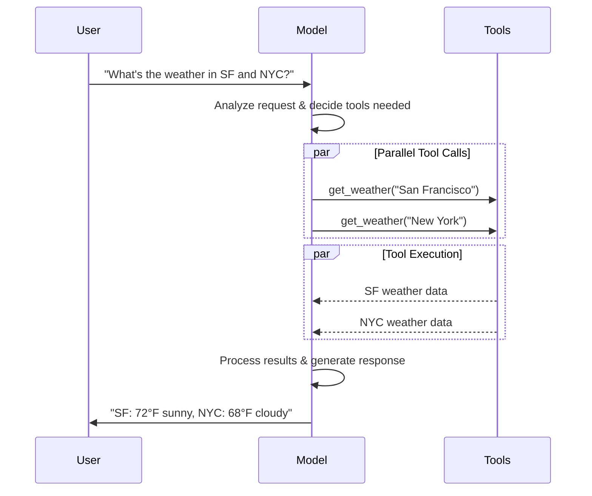

import ChatModelTabsPy from '/snippets/chat-model-tabs.mdx';
import ChatModelTabsJS from '/snippets/chat-model-tabs-js.mdx';

[大语言模型（LLM）](https://en.wikipedia.org/wiki/Large_language_model)是强大的 AI 工具，能够像人类一样理解和生成文本。它们用途广泛，可以撰写内容、翻译语言、生成摘要和回答问题，无需针对每项任务进行专门训练。

除了文本生成之外，许多模型还支持：

* <Icon icon="hammer" size={16} /> [工具调用](#tool-calling) - 调用外部工具（如数据库查询或 API 调用）并在响应中使用结果。
* <Icon icon="layout-grid" size={16} /> [结构化输出](#structured-output) - 模型的响应被约束为遵循预定义的格式。
* <Icon icon="photo" size={16} /> [多模态](#multimodal) - 处理和返回文本以外的数据，如图像、音频和视频。
* <Icon icon="brain" size={16} /> [推理](#reasoning) - 模型执行多步推理以得出结论。

模型是[智能体](/oss/python/langchain/agents)的推理引擎。它们驱动智能体的决策过程，决定调用哪些工具、如何解释结果以及何时给出最终答案。

你选择的模型的质量和能力直接影响智能体的基线可靠性和性能。不同的模型擅长不同的任务——有些更擅长遵循复杂指令，有些更擅长结构化推理，还有一些支持更大的上下文窗口以处理更多信息。

LangChain 的标准模型接口让你可以访问许多不同的提供商集成，这使得实验和切换模型以找到最适合你用例的模型变得非常容易。

<Info>
    有关特定提供商的集成信息和能力，请参阅提供商的[聊天模型页面](/oss/python/integrations/chat)。
</Info>

## 基本用法

模型可以通过两种方式使用：

1. **与智能体一起使用** - 在创建[智能体](/oss/python/langchain/agents#model)时可以动态指定模型。
2. **独立使用** - 模型可以直接调用（在智能体循环之外），用于文本生成、分类或提取等任务，无需智能体框架。

相同的模型接口在两种场景下都有效，这让你可以灵活地从简单开始，并在需要时扩展到更复杂的基于智能体的工作流。

### 初始化模型

在 LangChain 中开始使用独立模型的最简单方式是使用 [`init_chat_model`](https://reference.langchain.com/python/langchain/chat_models/base/init_chat_model) 从你选择的聊天模型提供商初始化一个模型（示例如下）：

<ChatModelTabsPy />
```python
response = model.invoke("Why do parrots talk?")
```

有关更多详情，包括如何传递模型[参数](#parameters)的信息，请参阅 [`init_chat_model`](https://reference.langchain.com/python/langchain/chat_models/base/init_chat_model)。


### 支持的提供商和模型

LangChain 通过专用的集成包支持所有主要模型提供商。每个提供商包都实现了相同的标准接口，因此你可以在不重写应用程序逻辑的情况下切换提供商。新的模型名称可以立即使用——无需更新 LangChain——因为提供商包会直接将模型名称传递给提供商的 API。

浏览[完整的支持提供商列表](/oss/python/integrations/providers/overview)，或参阅[提供商和模型](/oss/python/concepts/providers-and-models)了解提供商、包和模型名称如何在 LangChain 中协同工作的概念性概述。

### 关键方法

<Card title="Invoke" href="#invoke" icon="send" arrow="true" horizontal>
    模型接收消息作为输入，在生成完整响应后输出消息。
</Card>
<Card title="Stream" href="#stream" icon="broadcast" arrow="true" horizontal>
    调用模型，但在生成过程中实时流式输出结果。
</Card>
<Card title="Batch" href="#batch" icon="grip-vertical" arrow="true" horizontal>
    将多个请求以批量方式发送给模型，以实现更高效的处理。
</Card>

<Info>
    除了聊天模型之外，LangChain 还提供对其他相关技术的支持，例如向量嵌入模型和向量存储。详情请参阅[集成页面](/oss/python/integrations/providers/overview)。
</Info>

## 参数

聊天模型接受可用于配置其行为的参数。完整的支持参数集因模型和提供商而异，但标准参数包括：

<ParamField body="model" type="string" required>
   你要在提供商中使用的特定模型的名称或标识符。你也可以使用 '{model_provider}:{model}' 格式在单个参数中同时指定模型及其提供商，例如 'openai:o1'。
</ParamField>

<ParamField body="api_key" type="string">
    用于与模型提供商进行身份验证的密钥。这通常在你注册获取模型访问权限时签发。通常通过设置<Tooltip tip="一个值在程序外部设置的变量，通常通过操作系统或微服务内置的功能。">环境变量</Tooltip>来访问。
</ParamField>


<ParamField body="temperature" type="number">
    控制模型输出的随机性。较高的值使响应更有创意；较低的值使响应更确定性。
</ParamField>

<ParamField body="max_tokens" type="number">
    限制响应中 <Tooltip tip="模型读取和生成的基本单位。提供商可能对其有不同的定义，但一般来说，它们可以代表一个完整的词或词的一部分。">Token</Tooltip> 的总数，从而有效控制输出的长度。
</ParamField>


<ParamField body="timeout" type="number">
    在取消请求之前等待模型响应的最长时间（秒）。
</ParamField>

<ParamField body="max_retries" type="number" default="6">
    如果由于网络超时或速率限制等问题导致请求失败，系统将尝试重新发送请求的最大次数。重试使用带抖动的指数退避策略。网络错误、速率限制（429）和服务器错误（5xx）会自动重试。客户端错误如 401（未授权）或 404 则不会重试。对于在不可靠网络上运行的长时间[智能体](/oss/python/deepagents/overview)任务，考虑将此值增加到 10-15。
</ParamField>


使用 [`init_chat_model`](https://reference.langchain.com/python/langchain/chat_models/base/init_chat_model)，将这些参数作为内联 <Tooltip tip="任意关键字参数" cta="了解更多" href="https://www.w3schools.com/python/python_args_kwargs.asp">`**kwargs`</Tooltip> 传递：

```python 使用模型参数初始化
model = init_chat_model(
    "claude-sonnet-4-6",
    # 传递给模型的关键字参数：
    temperature=0.7,
    timeout=30,
    max_tokens=1000,
    max_retries=6,  # 默认值；在不可靠网络上可增大
)
```


### 连接弹性

LangChain 聊天模型会自动使用指数退避重试失败的 API 请求。默认情况下，模型会对网络错误、速率限制（429）和服务器错误（5xx）最多重试 **6 次**。客户端错误如 401（未授权）或 404 不会重试。

你可以在创建模型时调整 `max_retries` 和 `timeout`，然后将该实例传递给 `create_agent`、`create_deep_agent` 或独立调用：

```python
from langchain.chat_models import init_chat_model

model = init_chat_model(
    "google_genai:gemini-3.1-pro-preview",
    max_retries=10,  # 在不可靠网络上可增大（默认：6）
    timeout=120,  # 秒；在慢速连接上可增大
)
```


<Tip>
    对于在不可靠网络上运行的长时间智能体图，考虑使用更高的 `max_retries`（例如 10-15）和一个[检查点](/oss/python/langgraph/persistence)，以便在失败时保留进度。
</Tip>

<Info>
    每个聊天模型集成可能有额外的参数用于控制提供商特定的功能。

    例如，[`ChatOpenAI`](https://reference.langchain.com/python/langchain-openai/chat_models/base/ChatOpenAI) 有 `use_responses_api` 来指定是否使用 OpenAI Responses 或 Completions API。

    要查找给定聊天模型支持的所有参数，请前往[聊天模型集成](/oss/python/integrations/chat)页面。
</Info>

---

## 调用

聊天模型必须被调用才能生成输出。有三种主要的调用方法，每种适用于不同的使用场景。

### Invoke

调用模型最直接的方式是使用 [`invoke()`](https://reference.langchain.com/python/langchain-core/language_models/chat_models/BaseChatModel/invoke)，传入单条消息或消息列表。

```python 单条消息
response = model.invoke("Why do parrots have colorful feathers?")
print(response)
```


可以向聊天模型提供消息列表来表示对话历史。每条消息都有一个角色，模型用它来标识对话中消息的发送者。

有关角色、类型和内容的更多详情，请参阅[消息](/oss/python/langchain/messages)指南。

```python 字典格式
conversation = [
    {"role": "system", "content": "You are a helpful assistant that translates English to French."},
    {"role": "user", "content": "Translate: I love programming."},
    {"role": "assistant", "content": "J'adore la programmation."},
    {"role": "user", "content": "Translate: I love building applications."}
]

response = model.invoke(conversation)
print(response)  # AIMessage("J'adore créer des applications.")
```
```python 消息对象
from langchain.messages import HumanMessage, AIMessage, SystemMessage

conversation = [
    SystemMessage("You are a helpful assistant that translates English to French."),
    HumanMessage("Translate: I love programming."),
    AIMessage("J'adore la programmation."),
    HumanMessage("Translate: I love building applications.")
]

response = model.invoke(conversation)
print(response)  # AIMessage("J'adore créer des applications.")
```


<Info>
    如果你调用返回的类型是字符串，请确保你使用的是聊天模型而不是旧版 LLM。旧版的文本补全 LLM 直接返回字符串。LangChain 聊天模型以 "Chat" 为前缀，例如 [`ChatOpenAI`](https://reference.langchain.com/python/langchain-openai/chat_models/base/ChatOpenAI)(/oss/integrations/chat/openai)。
</Info>

### Stream

大多数模型可以在生成输出内容的同时进行流式输出。通过逐步显示输出，流式输出显著改善了用户体验，特别是对于较长的响应。

调用 [`stream()`](https://reference.langchain.com/python/langchain-core/language_models/chat_models/BaseChatModel/stream) 会返回一个<Tooltip tip="一个对象，按顺序逐步提供对集合中每个项目的访问。">迭代器</Tooltip>，在生成输出块时逐个返回。你可以使用循环来实时处理每个块：

<CodeGroup>
    ```python 基本文本流式输出
    for chunk in model.stream("Why do parrots have colorful feathers?"):
        print(chunk.text, end="|", flush=True)
    ```

    ```python 流式输出工具调用、推理和其他内容
    for chunk in model.stream("What color is the sky?"):
        for block in chunk.content_blocks:
            if block["type"] == "reasoning" and (reasoning := block.get("reasoning")):
                print(f"Reasoning: {reasoning}")
            elif block["type"] == "tool_call_chunk":
                print(f"Tool call chunk: {block}")
            elif block["type"] == "text":
                print(block["text"])
            else:
                ...
    ```
</CodeGroup>


与 [`invoke()`](#invoke) 在模型完成完整响应生成后返回单个 [`AIMessage`](https://reference.langchain.com/python/langchain-core/messages/ai/AIMessage) 不同，`stream()` 返回多个 [`AIMessageChunk`](https://reference.langchain.com/python/langchain-core/messages/ai/AIMessageChunk) 对象，每个包含输出文本的一部分。重要的是，流中的每个块都设计为可以通过求和来聚合成完整消息：

```python 构建一个 AIMessage
full = None  # None | AIMessageChunk
for chunk in model.stream("What color is the sky?"):
    full = chunk if full is None else full + chunk
    print(full.text)

# The
# The sky
# The sky is
# The sky is typically
# The sky is typically blue
# ...

print(full.content_blocks)
# [{"type": "text", "text": "The sky is typically blue..."}]
```


得到的消息可以与通过 [`invoke()`](#invoke) 生成的消息同样处理——例如，它可以被聚合到消息历史中并作为对话上下文传回给模型。

<Warning>
    流式输出仅在程序中的所有步骤都知道如何处理块流时才有效。例如，一个不支持流式输出的应用程序是需要在处理之前将整个输出存储在内存中的应用程序。
</Warning>

<Accordion title="高级流式输出主题">
    <Accordion title="流式事件">
        LangChain 聊天模型还可以使用 `astream_events()` 流式输出语义事件。

        这简化了基于事件类型和其他元数据的过滤，并会在后台聚合完整消息。参见下面的示例。

        ```python
        async for event in model.astream_events("Hello"):

            if event["event"] == "on_chat_model_start":
                print(f"Input: {event['data']['input']}")

            elif event["event"] == "on_chat_model_stream":
                print(f"Token: {event['data']['chunk'].text}")

            elif event["event"] == "on_chat_model_end":
                print(f"Full message: {event['data']['output'].text}")

            else:
                pass
        ```
        ```txt
        Input: Hello
        Token: Hi
        Token:  there
        Token: !
        Token:  How
        Token:  can
        Token:  I
        ...
        Full message: Hi there! How can I help today?
        ```

        <Tip>
            有关事件类型和其他详情，请参阅 [`astream_events()`](https://reference.langchain.com/python/langchain_core/language_models/#langchain_core.language_models.chat_models.BaseChatModel.astream_events) 参考。
        </Tip>


    </Accordion>
    <Accordion title='"自动流式输出"聊天模型'>
        LangChain 通过在某些情况下自动启用流式输出模式来简化聊天模型的流式输出，即使你没有显式调用流式方法。当你使用非流式的 invoke 方法但仍想流式输出整个应用程序（包括聊天模型的中间结果）时，这特别有用。

        例如，在 [LangGraph 智能体](/oss/python/langchain/agents)中，你可以在节点内调用 `model.invoke()`，但如果检测到你正在尝试流式输出整个应用程序，LangChain 会自动委托给流式模式。

        #### 工作原理

        当你 `invoke()` 一个聊天模型时，如果 LangChain 检测到你正在尝试流式输出整个应用程序，它会自动切换到内部流式模式。就使用 invoke 的代码而言，调用的结果将是相同的；然而，在聊天模型流式输出期间，LangChain 会负责在 LangChain 的回调系统中调用 [`on_llm_new_token`](https://reference.langchain.com/python/langchain-core/callbacks/base/AsyncCallbackHandler/on_llm_new_token) 事件。

        回调事件允许 LangGraph 的 `stream()` 和 `astream_events()` 实时展示聊天模型的输出。


    </Accordion>
</Accordion>

### Batch

将一组独立请求批量发送给模型可以显著提高性能并降低成本，因为处理可以并行完成：

```python 批量处理
responses = model.batch([
    "Why do parrots have colorful feathers?",
    "How do airplanes fly?",
    "What is quantum computing?"
])
for response in responses:
    print(response)
```

<Note>
    本节描述的是聊天模型的 [`batch()`](https://reference.langchain.com/python/langchain_core/language_models/#langchain_core.language_models.chat_models.BaseChatModel.batch) 方法，它在客户端并行化模型调用。

    它**不同于**推理提供商支持的批量 API，例如 [OpenAI](https://platform.openai.com/docs/guides/batch) 或 [Anthropic](https://platform.claude.com/docs/en/build-with-claude/batch-processing#message-batches-api)。
</Note>

默认情况下，[`batch()`](https://reference.langchain.com/python/langchain_core/language_models/#langchain_core.language_models.chat_models.BaseChatModel.batch) 只会返回整个批次的最终输出。如果你希望在每个输入完成生成时接收其输出，可以使用 [`batch_as_completed()`](https://reference.langchain.com/python/langchain_core/language_models/#langchain_core.language_models.chat_models.BaseChatModel.batch_as_completed) 来流式返回结果：

```python 完成时返回批量响应
for response in model.batch_as_completed([
    "Why do parrots have colorful feathers?",
    "How do airplanes fly?",
    "What is quantum computing?"
]):
    print(response)
```
<Note>
    使用 [`batch_as_completed()`](https://reference.langchain.com/python/langchain_core/language_models/#langchain_core.language_models.chat_models.BaseChatModel.batch_as_completed) 时，结果可能会乱序到达。每个结果包含输入索引，以便在需要时重建原始顺序。
</Note>

<Tip>
    当使用 [`batch()`](https://reference.langchain.com/python/langchain_core/language_models/#langchain_core.language_models.chat_models.BaseChatModel.batch) 或 [`batch_as_completed()`](https://reference.langchain.com/python/langchain_core/language_models/#langchain_core.language_models.chat_models.BaseChatModel.batch_as_completed) 处理大量输入时，你可能想要控制最大并行调用数。可以通过在 [`RunnableConfig`](https://reference.langchain.com/python/langchain-core/runnables/config/RunnableConfig) 字典中设置 [`max_concurrency`](https://reference.langchain.com/python/langchain-core/runnables/config/RunnableConfig) 属性来实现。

    ```python 带最大并发的批量处理
    model.batch(
        list_of_inputs,
        config={
            'max_concurrency': 5,  # 限制为 5 个并行调用
        }
    )
    ```

    有关完整的支持属性列表，请参阅 [`RunnableConfig`](https://reference.langchain.com/python/langchain-core/runnables/config/RunnableConfig) 参考。
</Tip>

有关批量处理的更多详情，请参阅[参考文档](https://reference.langchain.com/python/langchain_core/language_models/#langchain_core.language_models.chat_models.BaseChatModel.batch)。


---

## 工具调用

模型可以请求调用执行任务的工具，例如从数据库获取数据、搜索网页或运行代码。工具由以下两部分组成：

1. 模式（schema），包括工具的名称、描述和/或参数定义（通常是 JSON schema）
2. 要执行的函数或<Tooltip tip="一种可以暂停执行并在稍后恢复的方法">协程</Tooltip>。

<Note>
    你可能会听到"函数调用"这个术语。我们将其与"工具调用"互换使用。
</Note>

以下是用户和模型之间基本的工具调用流程：




要使你定义的工具可供模型使用，必须使用 [`bind_tools`](https://reference.langchain.com/python/langchain-core/language_models/chat_models/BaseChatModel/bind_tools) 绑定它们。在后续调用中，模型可以根据需要选择调用任何已绑定的工具。


一些模型提供商提供可以通过模型或调用参数启用的<Tooltip tip="在服务器端执行的工具，例如网络搜索和代码解释器">内置工具</Tooltip>（例如 [`ChatOpenAI`](/oss/python/integrations/chat/openai)、[`ChatAnthropic`](/oss/python/integrations/chat/anthropic)）。详情请查看相应的[提供商参考](/oss/python/integrations/providers/overview)。

<Tip>
    有关创建工具的详情和其他选项，请参阅[工具指南](/oss/python/langchain/tools)。
</Tip>

```python 绑定用户工具
from langchain.tools import tool

@tool
def get_weather(location: str) -> str:
    """Get the weather at a location."""
    return f"It's sunny in {location}."


model_with_tools = model.bind_tools([get_weather])  # [!code highlight]

response = model_with_tools.invoke("What's the weather like in Boston?")
for tool_call in response.tool_calls:
    # 查看模型发起的工具调用
    print(f"Tool: {tool_call['name']}")
    print(f"Args: {tool_call['args']}")
```


当绑定用户定义的工具时，模型的响应包含执行工具的**请求**。当在[智能体](/oss/python/langchain/agents)之外单独使用模型时，需要你自己执行请求的工具并将结果返回给模型用于后续推理。当使用[智能体](/oss/python/langchain/agents)时，智能体循环会为你处理工具执行循环。

以下展示了一些常见的工具调用使用方式。

<AccordionGroup>
    <Accordion title="工具执行循环" icon="refresh">
        当模型返回工具调用时，你需要执行工具并将结果传回给模型。这创建了一个对话循环，模型可以使用工具结果来生成最终响应。LangChain 包含[智能体](/oss/python/langchain/agents)抽象来为你处理这种编排。

        以下是一个简单的示例：

        ```python 工具执行循环
        # 将（可能多个）工具绑定到模型
        model_with_tools = model.bind_tools([get_weather])

        # 步骤 1：模型生成工具调用
        messages = [{"role": "user", "content": "What's the weather in Boston?"}]
        ai_msg = model_with_tools.invoke(messages)
        messages.append(ai_msg)

        # 步骤 2：执行工具并收集结果
        for tool_call in ai_msg.tool_calls:
            # 使用生成的参数执行工具
            tool_result = get_weather.invoke(tool_call)
            messages.append(tool_result)

        # 步骤 3：将结果传回模型以获取最终响应
        final_response = model_with_tools.invoke(messages)
        print(final_response.text)
        # "The current weather in Boston is 72°F and sunny."
        ```


        每个由工具返回的 [`ToolMessage`](https://reference.langchain.com/python/langchain-core/messages/tool/ToolMessage) 都包含一个与原始工具调用匹配的 `tool_call_id`，帮助模型将结果与请求关联起来。
    </Accordion>
    <Accordion title="强制工具调用" icon="asterisk">
        默认情况下，模型可以根据用户输入自由选择使用哪个已绑定的工具。但是，你可能想要强制选择一个工具，确保模型使用特定工具或给定列表中的**任何**工具：

        <CodeGroup>
            ```python 强制使用任意工具
            model_with_tools = model.bind_tools([tool_1], tool_choice="any")
            ```
            ```python 强制使用特定工具
            model_with_tools = model.bind_tools([tool_1], tool_choice="tool_1")
            ```
        </CodeGroup>


    </Accordion>
    <Accordion title="并行工具调用" icon="stack-2">
        许多模型支持在适当时并行调用多个工具。这允许模型同时从不同来源收集信息。

        ```python 并行工具调用
        model_with_tools = model.bind_tools([get_weather])

        response = model_with_tools.invoke(
            "What's the weather in Boston and Tokyo?"
        )


        # 模型可能生成多个工具调用
        print(response.tool_calls)
        # [
        #   {'name': 'get_weather', 'args': {'location': 'Boston'}, 'id': 'call_1'},
        #   {'name': 'get_weather', 'args': {'location': 'Tokyo'}, 'id': 'call_2'},
        # ]


        # 执行所有工具（可以使用 async 并行完成）
        results = []
        for tool_call in response.tool_calls:
            if tool_call['name'] == 'get_weather':
                result = get_weather.invoke(tool_call)
            ...
            results.append(result)
        ```


        模型会根据请求操作的独立性智能判断何时适合并行执行。

        <Tip>
        大多数支持工具调用的模型默认启用并行工具调用。部分模型（包括 [OpenAI](/oss/python/integrations/chat/openai) 和 [Anthropic](/oss/python/integrations/chat/anthropic)）允许你禁用此功能。方法是设置 `parallel_tool_calls=False`：
        ```python
        model.bind_tools([get_weather], parallel_tool_calls=False)
        ```
        </Tip>
    </Accordion>
    <Accordion title="流式工具调用" icon="rss">
        在流式输出响应时，工具调用通过 [`ToolCallChunk`](https://reference.langchain.com/python/langchain-core/messages/tool/ToolCallChunk) 逐步构建。这允许你在工具调用被生成时就看到它们，而不是等待完整响应。

        ```python 流式工具调用
        for chunk in model_with_tools.stream(
            "What's the weather in Boston and Tokyo?"
        ):
            # 工具调用块逐步到达
            for tool_chunk in chunk.tool_call_chunks:
                if name := tool_chunk.get("name"):
                    print(f"Tool: {name}")
                if id_ := tool_chunk.get("id"):
                    print(f"ID: {id_}")
                if args := tool_chunk.get("args"):
                    print(f"Args: {args}")

        # 输出：
        # Tool: get_weather
        # ID: call_SvMlU1TVIZugrFLckFE2ceRE
        # Args: {"lo
        # Args: catio
        # Args: n": "B
        # Args: osto
        # Args: n"}
        # Tool: get_weather
        # ID: call_QMZdy6qInx13oWKE7KhuhOLR
        # Args: {"lo
        # Args: catio
        # Args: n": "T
        # Args: okyo
        # Args: "}
        ```

        你可以累积块来构建完整的工具调用：

        ```python 累积工具调用
        gathered = None
        for chunk in model_with_tools.stream("What's the weather in Boston?"):
            gathered = chunk if gathered is None else gathered + chunk
            print(gathered.tool_calls)
        ```


    </Accordion>
</AccordionGroup>

---

## 结构化输出

可以请求模型以匹配给定模式的格式提供响应。这对于确保输出可以被轻松解析并用于后续处理非常有用。LangChain 支持多种模式类型和强制结构化输出的方法。

<Tip>
    要了解结构化输出，请参阅[结构化输出](/oss/python/langchain/structured-output)。
</Tip>

<Tabs>
    <Tab title="Pydantic">
        [Pydantic 模型](https://docs.pydantic.dev/latest/concepts/models/#basic-model-usage)提供最丰富的功能集，包括字段验证、描述和嵌套结构。

        ```python
        from pydantic import BaseModel, Field

        class Movie(BaseModel):
            """A movie with details."""
            title: str = Field(description="The title of the movie")
            year: int = Field(description="The year the movie was released")
            director: str = Field(description="The director of the movie")
            rating: float = Field(description="The movie's rating out of 10")

        model_with_structure = model.with_structured_output(Movie)
        response = model_with_structure.invoke("Provide details about the movie Inception")
        print(response)  # Movie(title="Inception", year=2010, director="Christopher Nolan", rating=8.8)
        ```
    </Tab>
    <Tab title="TypedDict">
        Python 的 `TypedDict` 提供了比 Pydantic 模型更简单的替代方案，适用于不需要运行时验证的场景。

        ```python
        from typing_extensions import TypedDict, Annotated

        class MovieDict(TypedDict):
            """A movie with details."""
            title: Annotated[str, ..., "The title of the movie"]
            year: Annotated[int, ..., "The year the movie was released"]
            director: Annotated[str, ..., "The director of the movie"]
            rating: Annotated[float, ..., "The movie's rating out of 10"]

        model_with_structure = model.with_structured_output(MovieDict)
        response = model_with_structure.invoke("Provide details about the movie Inception")
        print(response)  # {'title': 'Inception', 'year': 2010, 'director': 'Christopher Nolan', 'rating': 8.8}
        ```
    </Tab>
    <Tab title="JSON Schema">
        提供 [JSON Schema](https://json-schema.org/understanding-json-schema/about) 以获得最大的控制力和互操作性。

        ```python
        import json

        json_schema = {
            "title": "Movie",
            "description": "A movie with details",
            "type": "object",
            "properties": {
                "title": {
                    "type": "string",
                    "description": "The title of the movie"
                },
                "year": {
                    "type": "integer",
                    "description": "The year the movie was released"
                },
                "director": {
                    "type": "string",
                    "description": "The director of the movie"
                },
                "rating": {
                    "type": "number",
                    "description": "The movie's rating out of 10"
                }
            },
            "required": ["title", "year", "director", "rating"]
        }

        model_with_structure = model.with_structured_output(
            json_schema,
            method="json_schema",
        )
        response = model_with_structure.invoke("Provide details about the movie Inception")
        print(response)  # {'title': 'Inception', 'year': 2010, ...}
        ```
    </Tab>
</Tabs>


<Note>
    **结构化输出的关键考虑事项**

    - **method 参数**：一些提供商支持不同的结构化输出方法：
        - `'json_schema'`：使用提供商提供的专用结构化输出功能。
        - `'function_calling'`：通过强制[工具调用](#tool-calling)遵循给定模式来推导结构化输出。
        - `'json_mode'`：一些提供商提供的 `'json_schema'` 的前身。生成有效的 JSON，但模式必须在提示词中描述。
    - **包含原始数据**：设置 `include_raw=True` 可以同时获得解析后的输出和原始 AI 消息。
    - **验证**：Pydantic 模型提供自动验证。`TypedDict` 和 JSON Schema 需要手动验证。

    有关支持的方法和配置选项，请参阅你的[提供商集成页面](/oss/python/integrations/providers/overview)。
</Note>


<Accordion title="示例：输出消息与解析后的结构">

在访问响应元数据（如 [Token 计数](#token-usage)）时，返回原始 [`AIMessage`](https://reference.langchain.com/python/langchain-core/messages/ai/AIMessage) 对象和解析后的表示会很有用。为此，在调用 [`with_structured_output`](https://reference.langchain.com/python/langchain-core/language_models/chat_models/BaseChatModel/with_structured_output) 时设置 [`include_raw=True`](https://reference.langchain.com/python/langchain-core/language_models/chat_models/BaseChatModel/with_structured_output)：

    ```python
    from pydantic import BaseModel, Field

    class Movie(BaseModel):
        """A movie with details."""
        title: str = Field(description="The title of the movie")
        year: int = Field(description="The year the movie was released")
        director: str = Field(description="The director of the movie")
        rating: float = Field(description="The movie's rating out of 10")

    model_with_structure = model.with_structured_output(Movie, include_raw=True)  # [!code highlight]
    response = model_with_structure.invoke("Provide details about the movie Inception")
    response
    # {
    #     "raw": AIMessage(...),
    #     "parsed": Movie(title=..., year=..., ...),
    #     "parsing_error": None,
    # }
    ```


</Accordion>
<Accordion title="示例：嵌套结构">
    模式可以嵌套：
    <CodeGroup>
        ```python Pydantic BaseModel
        from pydantic import BaseModel, Field

        class Actor(BaseModel):
            name: str
            role: str

        class MovieDetails(BaseModel):
            title: str
            year: int
            cast: list[Actor]
            genres: list[str]
            budget: float | None = Field(None, description="Budget in millions USD")

        model_with_structure = model.with_structured_output(MovieDetails)
        ```

        ```python TypedDict
        from typing_extensions import Annotated, TypedDict

        class Actor(TypedDict):
            name: str
            role: str

        class MovieDetails(TypedDict):
            title: str
            year: int
            cast: list[Actor]
            genres: list[str]
            budget: Annotated[float | None, ..., "Budget in millions USD"]

        model_with_structure = model.with_structured_output(MovieDetails)
        ```
    </CodeGroup>


</Accordion>

---

## 高级主题

### 模型配置文件

<Info>
    模型配置文件需要 `langchain>=1.1`。
</Info>

LangChain 聊天模型可以通过 `profile` 属性公开一个包含支持的功能和能力的字典：

```python
model.profile
# {
#   "max_input_tokens": 400000,
#   "image_inputs": True,
#   "reasoning_output": True,
#   "tool_calling": True,
#   ...
# }
```

完整的字段集请参阅 [API 参考](https://reference.langchain.com/python/langchain-core/language_models/model_profile/ModelProfile)。

模型配置文件的大部分数据由 [models.dev](https://github.com/sst/models.dev) 项目提供支持，这是一个提供模型能力数据的开源项目。这些数据通过附加字段进行增强，以便与 LangChain 配合使用。这些增强随着上游项目的发展而保持同步。

模型配置文件数据允许应用程序动态地根据模型能力进行调整。例如：

1. [摘要中间件](/oss/python/langchain/middleware/built-in#summarization)可以根据模型的上下文窗口大小触发摘要。
2. `create_agent` 中的[结构化输出](/oss/python/langchain/structured-output)策略可以自动推断（例如，通过检查对原生结构化输出功能的支持）。
3. 模型输入可以根据支持的[模态](#multimodal)和最大输入 Token 数进行限制。
4. [Deep Agents CLI](/oss/python/deepagents/cli) 将[交互式模型切换器](/oss/python/deepagents/cli/providers#which-models-appear-in-the-switcher)过滤为配置文件报告支持 `tool_calling` 和文本 I/O 的模型，并在选择器详情视图中显示上下文窗口大小和能力标志。

<Accordion title="更新或覆盖配置文件数据">
    如果模型配置文件数据缺失、过时或不正确，可以进行更改。

    **选项 1（快速修复）**

    你可以使用任何有效的配置文件实例化聊天模型：

    ```python
    custom_profile = {
        "max_input_tokens": 100_000,
        "tool_calling": True,
        "structured_output": True,
        # ...
    }
    model = init_chat_model("...", profile=custom_profile)
    ```

    `profile` 也是一个普通的 `dict`，可以就地更新。如果模型实例是共享的，考虑使用 `model_copy` 来避免修改共享状态。

    ```python
    new_profile = model.profile | {"key": "value"}
    model.model_copy(update={"profile": new_profile})
    ```

    **选项 2（上游修复数据）**

    数据的主要来源是 [models.dev](https://models.dev/) 项目。这些数据与 LangChain [集成包](/oss/python/integrations/providers/overview)中的附加字段和覆盖合并，并随这些包一起发布。

    模型配置文件数据可以通过以下流程更新：

    1. （如需）通过向 [GitHub 上的仓库](https://github.com/sst/models.dev)提交 pull request 来更新 [models.dev](https://models.dev/) 的源数据。
    2. （如需）通过向 LangChain [集成包](/oss/python/integrations/providers/overview)提交 pull request 来更新 `langchain_<package>/data/profile_augmentations.toml` 中的附加字段和覆盖。
    3. 使用 [`langchain-model-profiles`](https://pypi.org/project/langchain-model-profiles/) CLI 工具从 [models.dev](https://models.dev/) 拉取最新数据，合并增强并更新配置文件数据：

    ```bash
    pip install langchain-model-profiles
    ```

    ```bash
    langchain-profiles refresh --provider <provider> --data-dir <data_dir>
    ```

    此命令会：
    - 从 models.dev 下载 `<provider>` 的最新数据
    - 合并 `<data_dir>` 中 `profile_augmentations.toml` 的增强
    - 将合并后的配置文件写入 `<data_dir>` 中的 `profiles.py`

    例如：从 [LangChain 单体仓库](https://github.com/langchain-ai/langchain)中的 [`libs/partners/anthropic`](https://github.com/langchain-ai/langchain/tree/master/libs/partners/anthropic)：

    ```bash
    uv run --with langchain-model-profiles --provider anthropic --data-dir langchain_anthropic/data
    ```
</Accordion>


<Warning>
    模型配置文件是 Beta 功能。配置文件的格式可能会更改。
</Warning>

### 多模态

某些模型可以处理和返回非文本数据，如图像、音频和视频。你可以通过提供[内容块](/oss/python/langchain/messages#message-content)向模型传递非文本数据。

<Tip>
    所有具有底层多模态能力的 LangChain 聊天模型支持：

    1. 跨提供商标准格式的数据（参见[我们的消息指南](/oss/python/langchain/messages)）
    2. OpenAI [chat completions](https://platform.openai.com/docs/api-reference/chat) 格式
    3. 特定提供商原生的任何格式（例如，Anthropic 模型接受 Anthropic 原生格式）
</Tip>

有关详情，请参阅消息指南中的[多模态部分](/oss/python/langchain/messages#multimodal)。

<Tooltip tip="并非所有 LLM 都是等同的！" cta="查看参考" href="https://models.dev/">某些模型</Tooltip>可以在响应中返回多模态数据。如果被要求这样做，生成的 [`AIMessage`](https://reference.langchain.com/python/langchain-core/messages/ai/AIMessage) 将包含多模态类型的内容块。

```python 多模态输出
response = model.invoke("Create a picture of a cat")
print(response.content_blocks)
# [
#     {"type": "text", "text": "Here's a picture of a cat"},
#     {"type": "image", "base64": "...", "mime_type": "image/jpeg"},
# ]
```


有关特定提供商的详情，请参阅[集成页面](/oss/python/integrations/providers/overview)。

### 推理

许多模型能够执行多步推理以得出结论。这涉及将复杂问题分解为更小、更易管理的步骤。

**如果底层模型支持，**你可以展示这个推理过程以更好地理解模型如何得出最终答案。

<CodeGroup>
    ```python 流式推理输出
    for chunk in model.stream("Why do parrots have colorful feathers?"):
        reasoning_steps = [r for r in chunk.content_blocks if r["type"] == "reasoning"]
        print(reasoning_steps if reasoning_steps else chunk.text)
    ```

    ```python 完整推理输出
    response = model.invoke("Why do parrots have colorful feathers?")
    reasoning_steps = [b for b in response.content_blocks if b["type"] == "reasoning"]
    print(" ".join(step["reasoning"] for step in reasoning_steps))
    ```
</CodeGroup>


根据模型的不同，你有时可以指定模型在推理上投入的努力程度。同样，你可以请求模型完全关闭推理。这可能采用推理分类"层级"的形式（例如 `'low'` 或 `'high'`）或整数 Token 预算。

有关详情，请参阅相应聊天模型的[集成页面](/oss/python/integrations/providers/overview)或[参考文档](https://reference.langchain.com/python/integrations/)。


### 本地模型

LangChain 支持在你自己的硬件上本地运行模型。这对于数据隐私至关重要、你想调用自定义模型或希望避免使用云端模型产生的费用等场景非常有用。

[Ollama](/oss/python/integrations/chat/ollama) 是本地运行聊天和向量嵌入模型最简单的方式之一。

{/* TODO: whenever we have a better integrations directory, x-ref to that page with a local query filter */}

### 提示词缓存

许多提供商提供提示词缓存功能，以减少对相同 Token 重复处理的延迟和成本。这些功能可以是**隐式的**或**显式的**：

- **隐式提示词缓存：**如果请求命中缓存，提供商会自动传递成本节省。例如：[OpenAI](/oss/python/integrations/chat/openai) 和 [Gemini](/oss/python/integrations/chat/google_generative_ai)。
- **显式缓存：**提供商允许你手动指示缓存点以获得更大控制或保证成本节省。例如：
    - [`ChatOpenAI`](https://reference.langchain.com/python/langchain-openai/chat_models/base/ChatOpenAI)（通过 `prompt_cache_key`）
    - Anthropic 的 [`AnthropicPromptCachingMiddleware`](/oss/python/integrations/chat/anthropic#prompt-caching)
    - [Gemini](https://reference.langchain.com/python/integrations/langchain_google_genai/)
    - [AWS Bedrock](/oss/python/integrations/chat/bedrock)

<Warning>
    提示词缓存通常只在超过最低输入 Token 阈值时才会生效。详情请参阅[提供商页面](/oss/python/integrations/chat)。
</Warning>

缓存使用情况将反映在模型响应的[使用元数据](/oss/python/langchain/messages#token-usage)中。

### 服务器端工具使用

一些提供商支持服务器端[工具调用](#tool-calling)循环：模型可以在单个对话轮次中与网络搜索、代码解释器和其他工具交互并分析结果。

如果模型在服务器端调用了工具，响应消息的内容将包含表示工具调用和结果的内容。访问响应的[内容块](/oss/python/langchain/messages#standard-content-blocks)将以与提供商无关的格式返回服务器端工具调用和结果：

```python 使用服务器端工具调用
from langchain.chat_models import init_chat_model

model = init_chat_model("gpt-5.4-mini")

tool = {"type": "web_search"}
model_with_tools = model.bind_tools([tool])

response = model_with_tools.invoke("What was a positive news story from today?")
print(response.content_blocks)
```
```python 结果 expandable
[
    {
        "type": "server_tool_call",
        "name": "web_search",
        "args": {
            "query": "positive news stories today",
            "type": "search"
        },
        "id": "ws_abc123"
    },
    {
        "type": "server_tool_result",
        "tool_call_id": "ws_abc123",
        "status": "success"
    },
    {
        "type": "text",
        "text": "Here are some positive news stories from today...",
        "annotations": [
            {
                "end_index": 410,
                "start_index": 337,
                "title": "article title",
                "type": "citation",
                "url": "..."
            }
        ]
    }
]
```


这代表单个对话轮次；不存在像客户端[工具调用](#tool-calling)那样需要传入的 [ToolMessage](/oss/python/langchain/messages#tool-message) 对象。

有关可用工具和使用详情，请参阅你所用提供商的[集成页面](/oss/python/integrations/chat)。

### 速率限制

许多聊天模型提供商对在给定时间段内可以发出的调用次数施加限制。如果你达到速率限制，通常会收到来自提供商的速率限制错误响应，并需要等待后才能发出更多请求。

为了帮助管理速率限制，聊天模型集成接受一个 `rate_limiter` 参数，可以在初始化时提供以控制发出请求的速率。

<Accordion title="初始化和使用速率限制器" icon="gauge">
    LangChain 附带了一个（可选的）内置 [`InMemoryRateLimiter`](https://reference.langchain.com/python/langchain-core/rate_limiters/InMemoryRateLimiter)。此限制器是线程安全的，可以被同一进程中的多个线程共享。

    ```python 定义速率限制器
    from langchain_core.rate_limiters import InMemoryRateLimiter

    rate_limiter = InMemoryRateLimiter(
        requests_per_second=0.1,  # 每 10 秒 1 个请求
        check_every_n_seconds=0.1,  # 每 100 毫秒检查一次是否允许发出请求
        max_bucket_size=10,  # 控制最大突发大小
    )

    model = init_chat_model(
        model="gpt-5.4",
        model_provider="openai",
        rate_limiter=rate_limiter  # [!code highlight]
    )
    ```

    <Warning>
        提供的速率限制器只能限制每单位时间的请求数。如果你还需要基于请求大小进行限制，它将无法帮助你。
    </Warning>
</Accordion>


### 自定义 Base URL 和代理设置

你可以为实现了 OpenAI Chat Completions API 的提供商配置自定义 base URL。

<Warning>
    `model_provider="openai"`（或直接使用 `ChatOpenAI`）针对的是官方 OpenAI API 规范。来自路由器和代理的提供商特定字段可能不会被提取或保留。

    对于 OpenRouter 和 LiteLLM，建议使用专用集成：
    - [通过 `ChatOpenRouter` 使用 OpenRouter](/oss/python/integrations/chat/openrouter)（`langchain-openrouter`）
    - [通过 `ChatLiteLLM` / `ChatLiteLLMRouter` 使用 LiteLLM](/oss/python/integrations/chat)（`langchain-litellm`）
</Warning>

<Accordion title="自定义 base URL" icon="link">
    许多模型提供商提供 OpenAI 兼容的 API（例如 [Together AI](https://www.together.ai/)、[vLLM](https://github.com/vllm-project/vllm)）。你可以通过指定适当的 `base_url` 参数将 [`init_chat_model`](https://reference.langchain.com/python/langchain/chat_models/base/init_chat_model) 与这些提供商一起使用：

    ```python
    model = init_chat_model(
        model="MODEL_NAME",
        model_provider="openai",
        base_url="BASE_URL",
        api_key="YOUR_API_KEY",
    )
    ```


    <Note>
        当使用直接聊天模型类实例化时，参数名称可能因提供商而异。详情请查看相应的[参考文档](/oss/python/integrations/providers/overview)。
    </Note>
</Accordion>

<Accordion title="HTTP 代理配置" icon="shield">
    对于需要 HTTP 代理的部署，一些模型集成支持代理配置：

    ```python
    from langchain_openai import ChatOpenAI

    model = ChatOpenAI(
        model="gpt-5.4",
        openai_proxy="http://proxy.example.com:8080"
    )
    ```

<Note>
    代理支持因集成而异。有关代理配置选项，请查看特定模型提供商的[参考文档](/oss/python/integrations/providers/overview)。
</Note>

</Accordion>


### 对数概率

某些模型可以配置为通过在初始化模型时设置 `logprobs` 参数来返回表示给定 Token 可能性的 Token 级对数概率：

```python
model = init_chat_model(
    model="gpt-5.4",
    model_provider="openai"
).bind(logprobs=True)

response = model.invoke("Why do parrots talk?")
print(response.response_metadata["logprobs"])
```


### Token 使用情况

许多模型提供商会在调用响应中返回 Token 使用信息。当可用时，此信息将包含在由相应模型生成的 [`AIMessage`](https://reference.langchain.com/python/langchain-core/messages/ai/AIMessage) 对象中。有关更多详情，请参阅[消息](/oss/python/langchain/messages)指南。

<Note>
    一些提供商 API，特别是 OpenAI 和 Azure OpenAI 的 chat completions，要求用户选择加入在流式上下文中接收 Token 使用数据。详情请参阅集成指南的[流式使用元数据](/oss/python/integrations/chat/openai#streaming-usage-metadata)部分。
</Note>


你可以使用回调或上下文管理器跟踪应用程序中跨模型的聚合 Token 计数，如下所示：

<Tabs>
    <Tab title="回调处理器">
        ```python
        from langchain.chat_models import init_chat_model
        from langchain_core.callbacks import UsageMetadataCallbackHandler

        model_1 = init_chat_model(model="gpt-5.4-mini")
        model_2 = init_chat_model(model="claude-haiku-4-5-20251001")

        callback = UsageMetadataCallbackHandler()
        result_1 = model_1.invoke("Hello", config={"callbacks": [callback]})
        result_2 = model_2.invoke("Hello", config={"callbacks": [callback]})
        print(callback.usage_metadata)
        ```
        ```python
        {
            'gpt-5.4-mini': {
                'input_tokens': 8,
                'output_tokens': 10,
                'total_tokens': 18,
                'input_token_details': {'audio': 0, 'cache_read': 0},
                'output_token_details': {'audio': 0, 'reasoning': 0}
            },
            'claude-haiku-4-5-20251001': {
                'input_tokens': 8,
                'output_tokens': 21,
                'total_tokens': 29,
                'input_token_details': {'cache_read': 0, 'cache_creation': 0}
            }
        }
        ```
    </Tab>
    <Tab title="上下文管理器">
        ```python
        from langchain.chat_models import init_chat_model
        from langchain_core.callbacks import get_usage_metadata_callback

        model_1 = init_chat_model(model="gpt-5.4-mini")
        model_2 = init_chat_model(model="claude-haiku-4-5-20251001")

        with get_usage_metadata_callback() as cb:
            model_1.invoke("Hello")
            model_2.invoke("Hello")
            print(cb.usage_metadata)
        ```
        ```python
        {
            'gpt-5.4-mini': {
                'input_tokens': 8,
                'output_tokens': 10,
                'total_tokens': 18,
                'input_token_details': {'audio': 0, 'cache_read': 0},
                'output_token_details': {'audio': 0, 'reasoning': 0}
            },
            'claude-haiku-4-5-20251001': {
                'input_tokens': 8,
                'output_tokens': 21,
                'total_tokens': 29,
                'input_token_details': {'cache_read': 0, 'cache_creation': 0}
            }
        }
        ```
    </Tab>
</Tabs>


### 调用配置

调用模型时，你可以通过 `config` 参数使用 [`RunnableConfig`](https://reference.langchain.com/python/langchain-core/runnables/config/RunnableConfig) 字典传递额外的配置。这提供了对执行行为、回调和元数据跟踪的运行时控制。


常见的配置选项包括：

```python 带配置的调用
response = model.invoke(
    "Tell me a joke",
    config={
        "run_name": "joke_generation",      # 此次运行的自定义名称
        "tags": ["humor", "demo"],          # 用于分类的标签
        "metadata": {"user_id": "123"},     # 自定义元数据
        "callbacks": [my_callback_handler], # 回调处理器
    }
)
```


这些配置值在以下场景中特别有用：
- 使用 [LangSmith](/langsmith/home) 追踪进行调试
- 实现自定义日志记录或监控
- 在生产环境中控制资源使用
- 跨复杂管道跟踪调用

<Accordion title="关键配置属性">
    <ParamField body="run_name" type="string">
        在日志和追踪中标识此特定调用。不会被子调用继承。
    </ParamField>

    <ParamField body="tags" type="string[]">
        被所有子调用继承的标签，用于在调试工具中进行过滤和组织。
    </ParamField>

    <ParamField body="metadata" type="object">
        用于跟踪额外上下文的自定义键值对，被所有子调用继承。
    </ParamField>

    <ParamField body="max_concurrency" type="number">
        控制使用 [`batch()`](https://reference.langchain.com/python/langchain_core/language_models/#langchain_core.language_models.chat_models.BaseChatModel.batch) 或 [`batch_as_completed()`](https://reference.langchain.com/python/langchain_core/language_models/#langchain_core.language_models.chat_models.BaseChatModel.batch_as_completed) 时的最大并行调用数。
    </ParamField>

    <ParamField body="callbacks" type="array">
        用于在执行期间监控和响应事件的处理器。
    </ParamField>

    <ParamField body="recursion_limit" type="number">
        链的最大递归深度，防止复杂管道中的无限循环。
    </ParamField>
</Accordion>


<Tip>
    有关所有支持属性的完整列表，请参阅 [`RunnableConfig`](https://reference.langchain.com/python/langchain-core/runnables/config/RunnableConfig) 参考。
</Tip>

### 可配置模型

你还可以通过指定 [`configurable_fields`](https://reference.langchain.com/python/langchain_core/language_models/#langchain_core.language_models.chat_models.BaseChatModel.configurable_fields) 来创建运行时可配置的模型。如果你不指定模型值，那么 `'model'` 和 `'model_provider'` 将默认可配置。

```python
from langchain.chat_models import init_chat_model

configurable_model = init_chat_model(temperature=0)

configurable_model.invoke(
    "what's your name",
    config={"configurable": {"model": "gpt-5-nano"}},  # 使用 GPT-5-Nano 运行
)
configurable_model.invoke(
    "what's your name",
    config={"configurable": {"model": "claude-sonnet-4-6"}},  # 使用 Claude 运行
)
```

<Accordion title="带默认值的可配置模型">
    我们可以创建带有默认模型值的可配置模型，指定哪些参数可配置，并为可配置参数添加前缀：

    ```python
    first_model = init_chat_model(
            model="gpt-5.4-mini",
            temperature=0,
            configurable_fields=("model", "model_provider", "temperature", "max_tokens"),
            config_prefix="first",  # 当你有一个包含多个模型的链时很有用
    )

    first_model.invoke("what's your name")
    ```

    ```python
    first_model.invoke(
        "what's your name",
        config={
            "configurable": {
                "first_model": "claude-sonnet-4-6",
                "first_temperature": 0.5,
                "first_max_tokens": 100,
            }
        },
    )
    ```

    有关 `configurable_fields` 和 `config_prefix` 的更多详情，请参阅 [`init_chat_model`](https://reference.langchain.com/python/langchain/chat_models/base/init_chat_model) 参考。
</Accordion>

<Accordion title="声明式使用可配置模型">
    我们可以在可配置模型上调用声明式操作，如 `bind_tools`、`with_structured_output`、`with_configurable` 等，并以与常规实例化的聊天模型对象相同的方式链接可配置模型。

    ```python
    from pydantic import BaseModel, Field


    class GetWeather(BaseModel):
        """Get the current weather in a given location"""

            location: str = Field(description="The city and state, e.g. San Francisco, CA")


    class GetPopulation(BaseModel):
        """Get the current population in a given location"""

            location: str = Field(description="The city and state, e.g. San Francisco, CA")


    model = init_chat_model(temperature=0)
    model_with_tools = model.bind_tools([GetWeather, GetPopulation])

    model_with_tools.invoke(
        "what's bigger in 2024 LA or NYC", config={"configurable": {"model": "gpt-5.4-mini"}}
    ).tool_calls
    ```
    ```
    [
        {
            'name': 'GetPopulation',
            'args': {'location': 'Los Angeles, CA'},
            'id': 'call_Ga9m8FAArIyEjItHmztPYA22',
            'type': 'tool_call'
        },
        {
            'name': 'GetPopulation',
            'args': {'location': 'New York, NY'},
            'id': 'call_jh2dEvBaAHRaw5JUDthOs7rt',
            'type': 'tool_call'
        }
    ]
    ```
    ```python
    model_with_tools.invoke(
        "what's bigger in 2024 LA or NYC",
        config={"configurable": {"model": "claude-sonnet-4-6"}},
    ).tool_calls
    ```
    ```
    [
        {
            'name': 'GetPopulation',
            'args': {'location': 'Los Angeles, CA'},
            'id': 'toolu_01JMufPf4F4t2zLj7miFeqXp',
            'type': 'tool_call'
        },
        {
            'name': 'GetPopulation',
            'args': {'location': 'New York City, NY'},
            'id': 'toolu_01RQBHcE8kEEbYTuuS8WqY1u',
            'type': 'tool_call'
        }
    ]
    ```
</Accordion>

---

<div className="source-links">
<Callout icon="terminal-2">
    [连接这些文档](/use-these-docs)到 Claude、VSCode 等工具，通过 MCP 获取实时答案。
</Callout>
<Callout icon="edit">
    [在 GitHub 上编辑此页面](https://github.com/langchain-ai/docs/edit/main/src/oss/langchain/models.mdx)或[提交 issue](https://github.com/langchain-ai/docs/issues/new/choose)。
</Callout>
</div>
