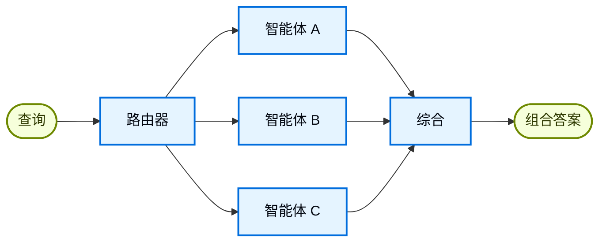

在**路由器**架构中，路由步骤对输入进行分类并将其定向到专业[智能体](/oss/python/langchain/agents)。当你有不同的**垂直领域**（各自需要独立智能体的独立知识域）时，这很有用。



## 关键特征

* 路由器分解查询
* 零个或多个专业智能体被并行调用
* 结果被综合成连贯的响应

## 何时使用

当你有不同的垂直领域（各自需要独立智能体的独立知识域）、需要并行查询多个来源，以及希望将结果综合成组合响应时，使用路由器模式。

## 基本实现

路由器对查询进行分类并将其定向到适当的智能体。使用 [`Command`](/oss/python/langgraph/graph-api#command) 进行单智能体路由，或使用 [`Send`](/oss/python/langgraph/graph-api#send) 进行并行扇出到多个智能体。

<Tabs>
<Tab title="单个智能体">

使用 `Command` 路由到单个专业智能体：

```python
from langgraph.types import Command

def classify_query(query: str) -> str:
    """使用 LLM 对查询进行分类并确定适当的智能体。"""
    # 分类逻辑
    ...

def route_query(state: State) -> Command:
    """根据查询分类路由到适当的智能体。"""
    active_agent = classify_query(state["query"])

    # 路由到选定的智能体
    return Command(goto=active_agent)
```


</Tab>
<Tab title="多个智能体（并行）">

使用 `Send` 并行扇出到多个专业智能体：

```python
from typing import TypedDict
from langgraph.types import Send

class ClassificationResult(TypedDict):
    query: str
    agent: str

def classify_query(query: str) -> list[ClassificationResult]:
    """使用 LLM 对查询进行分类并确定要调用的智能体。"""
    # 分类逻辑
    ...

def route_query(state: State):
    """根据查询分类路由到相关智能体。"""
    classifications = classify_query(state["query"])

    # 并行扇出到选定的智能体
    return [
        Send(c["agent"], {"query": c["query"]})
        for c in classifications
    ]
```


</Tab>
</Tabs>

有关完整实现，请参阅下面的教程。

<Card title="教程：使用路由构建多源知识库" icon="book" href="/oss/python/langchain/multi-agent/router-knowledge-base">
构建一个并行查询 GitHub、Notion 和 Slack 的路由器，然后将结果综合成连贯的答案。涵盖状态定义、专业智能体、使用 `Send` 的并行执行和结果综合。
</Card>

## 无状态 vs. 有状态

两种方法：
* [**无状态路由器**](#无状态)独立处理每个请求
* [**有状态路由器**](#有状态)在请求之间维护对话历史

## 无状态

每个请求被独立路由——调用之间没有记忆。对于多轮对话，请参阅[有状态路由器](#有状态)。

<Tip>
**路由器 vs. 子智能体**：两种模式都可以将工作分派给多个智能体，但它们在路由决策方式上有所不同：

- **路由器**：专门的路由步骤（通常是单次 LLM 调用或基于规则的逻辑）对输入进行分类并分派给智能体。路由器本身通常不维护对话历史或执行多轮编排——它是一个预处理步骤。
- **子智能体**：主管智能体作为持续对话的一部分动态决定调用哪些[子智能体](/oss/python/langchain/multi-agent/subagents)。主智能体维护上下文，可以跨轮次调用多个子智能体，并编排复杂的多步工作流。

当你有明确的输入类别并希望确定性或轻量级分类时，使用**路由器**。当你需要灵活的、对话感知的编排，其中 LLM 根据不断变化的上下文决定下一步做什么时，使用**主管**。
</Tip>


## 有状态

对于多轮对话，你需要在调用之间维护上下文。

### 工具包装

最简单的方法：将无状态路由器包装为对话智能体可以调用的工具。对话智能体处理记忆和上下文；路由器保持无状态。这避免了在多个并行智能体之间管理对话历史的复杂性。

```python
@tool
def search_docs(query: str) -> str:
    """跨多个文档源搜索。"""
    result = workflow.invoke({"query": query})  # [!code highlight]
    return result["final_answer"]

# 对话智能体将路由器用作工具
conversational_agent = create_agent(
    model,
    tools=[search_docs],
    prompt="You are a helpful assistant. Use search_docs to answer questions."
)
```


### 完整持久化

如果你需要路由器本身维护状态，请使用[持久化](/oss/python/langchain/short-term-memory)存储消息历史。路由到智能体时，从状态中获取先前的消息，并有选择地将其包含在智能体的上下文中——这是[上下文工程](/oss/python/langchain/context-engineering)的一个杠杆。

<Warning>
**有状态路由器需要自定义历史管理。** 如果路由器在不同轮次之间切换智能体，当智能体具有不同的语调或提示词时，对话可能对终端用户来说不够流畅。对于并行调用，你需要在路由器级别维护历史（输入和综合输出），并在路由逻辑中利用这些历史。考虑使用[交接模式](/oss/python/langchain/multi-agent/handoffs)或[子智能体模式](/oss/python/langchain/multi-agent/subagents)——两者都为多轮对话提供了更清晰的语义。
</Warning>

---

<div className="source-links">
<Callout icon="terminal-2">
    [将这些文档连接](/use-these-docs)到 Claude、VSCode 等工具，通过 MCP 获取实时答案。
</Callout>
<Callout icon="edit">
    [在 GitHub 上编辑此页面](https://github.com/langchain-ai/docs/edit/main/src/oss/langchain/multi-agent/router.mdx)或[提交问题](https://github.com/langchain-ai/docs/issues/new/choose)。
</Callout>
</div>
