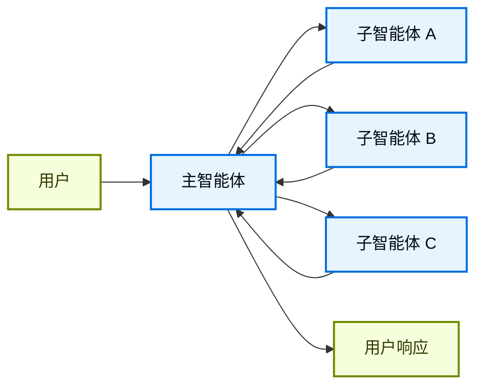
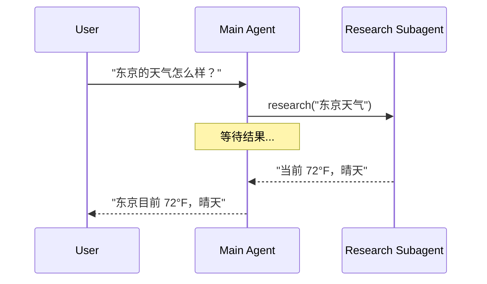
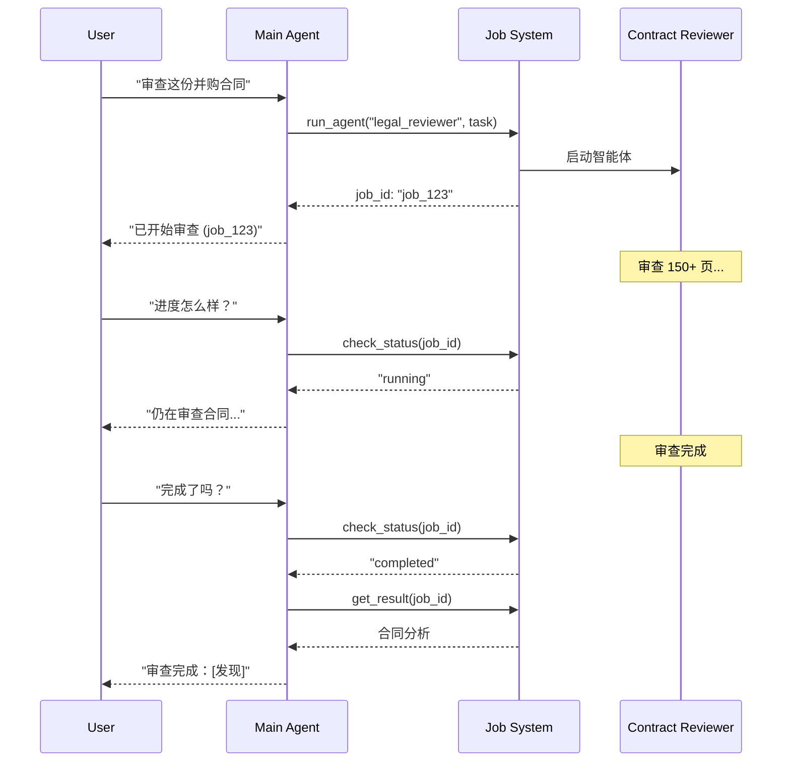
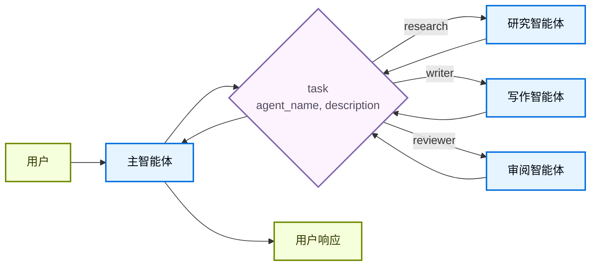

在**子智能体**架构中，一个中央主[智能体](/oss/python/langchain/agents)（通常称为**监督者**）通过将子智能体作为[工具](/oss/python/langchain/tools)调用来协调它们。主智能体决定调用哪个子智能体、提供什么输入以及如何组合结果。子智能体是无状态的——它们不记住过去的交互，所有对话记忆由主智能体维护。这提供了[上下文](/oss/python/langchain/context-engineering)隔离：每次子智能体调用在干净的上下文窗口中工作，防止主对话中的上下文膨胀。

有关内置子智能体支持，请参阅 [Deep Agents](/oss/python/deepagents/subagents)。



## 关键特征

* 集中控制：所有路由通过主智能体
* 无直接用户交互：子智能体将结果返回给主智能体而非用户（不过你可以在子智能体中使用[中断](/oss/python/langgraph/interrupts#pause-using-interrupt)来允许用户交互）
* 通过工具调用子智能体：子智能体通过工具被调用
* 并行执行：主智能体可以在单轮中调用多个子智能体

<Note>
**监督者 vs. 路由器**：监督者智能体（此模式）与[路由器](/oss/python/langchain/multi-agent/router)不同。监督者是一个完整的智能体，它维护对话上下文并跨多轮动态决定调用哪些子智能体。路由器通常是一个单一的分类步骤，将请求分发给智能体而不维护持续的对话状态。
</Note>

## 何时使用

当你有多个不同的领域（例如日历、邮件、CRM、数据库）、子智能体不需要直接与用户对话，或者你想要集中的工作流控制时，使用子智能体模式。对于只有少量[工具](/oss/python/langchain/tools)的简单情况，使用[单个智能体](/oss/python/langchain/agents)。

<Tip>
**需要在子智能体中与用户交互？** 虽然子智能体通常将结果返回给主智能体而不是直接与用户对话，但你可以在子智能体中使用[中断](/oss/python/langgraph/interrupts#pause-using-interrupt)来暂停执行并收集用户输入。当子智能体在继续之前需要澄清或批准时，这很有用。主智能体仍然是编排者，但子智能体可以在任务中途收集用户信息。
</Tip>

## 基本实现

核心机制是将子智能体包装为主智能体可以调用的工具：

```python
from langchain.tools import tool
from langchain.agents import create_agent

# 创建子智能体
subagent = create_agent(model="google_genai:gemini-3.1-pro-preview", tools=[...])

# 包装为工具
@tool("research", description="研究一个主题并返回发现")
def call_research_agent(query: str):
    result = subagent.invoke({"messages": [{"role": "user", "content": query}]})
    return result["messages"][-1].content

# 将子智能体作为工具的主智能体
main_agent = create_agent(model="google_genai:gemini-3.1-pro-preview", tools=[call_research_agent])
```


<Card
    title="教程：使用子智能体构建个人助手"
    icon="sitemap"
    href="/oss/python/langchain/multi-agent/subagents-personal-assistant"
    arrow cta="了解更多"
>
    学习如何使用子智能体模式构建个人助手，其中中央主智能体（监督者）协调专业的工作智能体。
</Card>

## 设计决策

实现子智能体模式时，你需要做出几个关键设计选择。下表总结了各选项——每个都在下面的章节中详细介绍。

| 决策 | 选项 |
|----------|---------|
| [**同步 vs. 异步**](#sync-vs-async) | 同步（阻塞）vs. 异步（后台） |
| [**工具模式**](#tool-patterns) | 每个智能体一个工具 vs. 单一调度工具 |
| [**子智能体规格**](#subagent-specs) | 系统提示词 vs. 枚举约束 vs. 基于工具的发现（仅限单一调度工具） |
| [**子智能体输入**](#subagent-inputs) | 仅查询 vs. 完整上下文 |
| [**子智能体输出**](#subagent-outputs) | 子智能体结果 vs. 完整对话历史 |

## 同步 vs. 异步

子智能体执行可以是**同步的**（阻塞）或**异步的**（后台）。你的选择取决于主智能体是否需要结果才能继续。

| 模式 | 主智能体行为 | 最适合 | 权衡 |
|------|---------------------|----------|----------|
| **同步** | 等待子智能体完成 | 主智能体需要结果才能继续 | 简单，但阻塞对话 |
| **异步** | 在子智能体后台运行时继续 | 独立任务，用户不应等待 | 响应更快，但更复杂 |

<Tip>
不要与 Python 的 `async`/`await` 混淆。这里的"异步"意味着主智能体启动后台任务（通常在单独的进程或服务中）并继续而不阻塞。
</Tip>

### 同步（默认）

默认情况下，子智能体调用是**同步的**：主智能体等待每个子智能体完成后再继续。当主智能体的下一步操作依赖于子智能体的结果时，使用同步。



**何时使用同步：**
- 主智能体需要子智能体的结果来制定响应
- 任务有顺序依赖（例如获取数据 → 分析 → 响应）
- 子智能体失败应阻止主智能体的响应

**权衡：**
- 实现简单——只需调用并等待
- 用户在所有子智能体完成之前看不到响应
- 长时间运行的任务会冻结对话

### 异步

当子智能体的工作是独立的时，使用**异步执行**——主智能体不需要结果就能继续与用户对话。主智能体启动后台任务并保持响应性。



**何时使用异步：**
- 子智能体的工作独立于主对话流
- 用户应该能在工作进行时继续聊天
- 你想并行运行多个独立任务

**三工具模式：**
1. **启动任务**：启动后台任务，返回任务 ID
2. **检查状态**：返回当前状态（pending、running、completed、failed）
3. **获取结果**：检索完成的结果

**处理任务完成：** 当任务完成时，你的应用需要通知用户。一种方法：显示一个通知，点击后发送类似"检查 job_123 并总结结果"的 `HumanMessage`。

## 工具模式

有两种主要方式将子智能体暴露为工具：

| 模式 | 最适合 | 权衡 |
|---------|----------|-----------|
| [**每个智能体一个工具**](#tool-per-agent) | 对每个子智能体输入/输出的精细控制 | 更多设置，但更多自定义 |
| [**单一调度工具**](#single-dispatch-tool) | 许多智能体，分布式团队，约定优于配置 | 更简单的组合，更少的每智能体自定义 |

### 每个智能体一个工具


核心思想是将子智能体包装为主智能体可以调用的工具：

```python
from langchain.tools import tool
from langchain.agents import create_agent

# 创建子智能体
subagent = create_agent(model="...", tools=[...])  # [!code highlight]

# 包装为工具  # [!code highlight]
@tool("subagent_name", description="subagent_description")  # [!code highlight]
def call_subagent(query: str):  # [!code highlight]
    result = subagent.invoke({"messages": [{"role": "user", "content": query}]})
    return result["messages"][-1].content

# 将子智能体作为工具的主智能体  # [!code highlight]
main_agent = create_agent(model="...", tools=[call_subagent])  # [!code highlight]
```


主智能体在决定任务匹配子智能体的描述时调用子智能体工具，接收结果，然后继续编排。有关精细控制，请参阅[上下文工程](#context-engineering)。

### 单一调度工具

另一种方法使用单个参数化工具来调用临时子智能体执行独立任务。与[每个智能体一个工具](#tool-per-agent)方法（每个子智能体都包装为单独的工具）不同，这使用基于约定的方法和单个 `task` 工具：任务描述作为人类消息传递给子智能体，子智能体的最终消息作为工具结果返回。

当你想跨多个团队分配智能体开发、需要将复杂任务隔离到单独的上下文窗口中、需要一种可扩展的方式添加新智能体而无需修改协调器，或者偏好约定优于自定义时，使用此方法。此方法用上下文工程的灵活性换取了智能体组合的简单性和强大的上下文隔离。



**关键特征：**

* 单一 task 工具：一个可按名称调用任何注册子智能体的参数化工具
* 基于约定的调用：按名称选择智能体，任务作为人类消息传递，最终消息作为工具结果返回
* 团队分发：不同团队可以独立开发和部署智能体
* 智能体发现：子智能体可以通过系统提示词（列出可用智能体）或通过[渐进式披露](/oss/python/langchain/multi-agent/skills-sql-assistant)（通过工具按需加载智能体信息）来发现

<Tip>
此方法的一个有趣方面是子智能体可能与主智能体具有完全相同的能力。在这种情况下，调用子智能体**实际上主要是为了上下文隔离**——允许复杂的多步骤任务在隔离的上下文窗口中运行，而不会膨胀主智能体的对话历史。子智能体自主完成工作并仅返回简洁的摘要，保持主线程的专注和高效。
</Tip>

<Accordion title="带任务调度器的智能体注册表">

```python
from langchain.tools import tool
from langchain.agents import create_agent

# 由不同团队开发的子智能体
research_agent = create_agent(
    model="gpt-5.4",
    prompt="你是一个研究专家..."
)

writer_agent = create_agent(
    model="gpt-5.4",
    prompt="你是一个写作专家..."
)

# 可用子智能体的注册表
SUBAGENTS = {
    "research": research_agent,
    "writer": writer_agent,
}

@tool
def task(
    agent_name: str,
    description: str
) -> str:
    """为任务启动一个临时子智能体。

    可用智能体：
    - research：研究和事实查找
    - writer：内容创建和编辑
    """
    agent = SUBAGENTS[agent_name]
    result = agent.invoke({
        "messages": [
            {"role": "user", "content": description}
        ]
    })
    return result["messages"][-1].content

# 主协调智能体
main_agent = create_agent(
    model="gpt-5.4",
    tools=[task],
    system_prompt=(
        "你协调专业的子智能体。"
        "可用：research（事实查找）、"
        "writer（内容创建）。"
        "使用 task 工具委派工作。"
    ),
)
```


</Accordion>

## 上下文工程

控制上下文如何在主智能体和其子智能体之间流动：

| 类别 | 目的 | 影响 |
|----------|---------|---------|
| [**子智能体规格**](#subagent-specs) | 确保子智能体在应该被调用时被调用 | 主智能体路由决策 |
| [**子智能体输入**](#subagent-inputs) | 确保子智能体能以优化的上下文良好执行 | 子智能体性能 |
| [**子智能体输出**](#subagent-outputs) | 确保监督者能基于子智能体结果做出好决策 | 主智能体性能 |

另请参阅我们关于智能体[上下文工程](/oss/python/langchain/context-engineering)的全面指南。

### 子智能体规格

与子智能体关联的**名称**和**描述**是主智能体了解要调用哪些子智能体的主要方式。这些是提示词杠杆——请仔细选择。

* **名称**：主智能体如何引用子智能体。保持清晰和面向操作（例如 `research_agent`、`code_reviewer`）。
* **描述**：主智能体了解子智能体能力的信息。具体说明它处理什么任务以及何时使用它。

对于[单一调度工具](#single-dispatch-tool)设计，你还需要为主智能体提供关于它可以调用的子智能体的信息。
你可以根据智能体数量以及注册表是静态还是动态的，以不同方式提供此信息：

| 方法 | 最适合 | 权衡 |
|--------|----------|----------|
| **系统提示词枚举** | 小型、静态的智能体列表（< 10 个智能体） | 简单，但智能体变化时需要更新提示词 |
| **枚举约束** | 小型、静态的智能体列表（< 10 个智能体） | 类型安全且明确，但智能体变化时需要代码更改 |
| **基于工具的发现** | 大型或动态的智能体注册表 | 灵活且可扩展，但增加复杂性 |

#### 系统提示词枚举

直接在主智能体的系统提示词中列出可用智能体。主智能体在其指令中看到智能体列表及其描述。

**何时使用：**
- 你有少量固定的智能体（< 10 个）
- 智能体注册表很少变化
- 你想要最简单的实现

**示例：**
```python
main_agent = create_agent(
    model="...",
    tools=[task],
    system_prompt=(
        "你协调专业的子智能体。"
        "可用智能体：\n"
        "- research：研究和事实查找\n"
        "- writer：内容创建和编辑\n"
        "- reviewer：代码和文档审阅\n"
        "使用 task 工具委派工作。"
    ),
)
```

#### 调度工具上的枚举约束

在调度工具的 `agent_name` 参数上添加枚举约束。这提供了类型安全性并使可用智能体在工具模式中明确。

**何时使用：**
- 你有少量固定的智能体（< 10 个）
- 你想要类型安全和明确的智能体名称
- 你偏好基于模式的验证而非基于提示词的指导

**示例：**
```python
from enum import Enum

class AgentName(str, Enum):
    RESEARCH = "research"
    WRITER = "writer"
    REVIEWER = "reviewer"

@tool
def task(
    agent_name: AgentName,  # 枚举约束
    description: str
) -> str:
    """为任务启动一个临时子智能体。"""
    # ...
```

#### 基于工具的发现

提供一个单独的工具（例如 `list_agents` 或 `search_agents`），主智能体可以调用它来按需发现可用智能体。这启用了渐进式披露并支持动态注册表。

**何时使用：**
- 你有许多智能体（> 10 个）或不断增长的注册表
- 智能体注册表频繁变化或是动态的
- 你想减少提示词大小和 Token 用量
- 不同团队独立管理不同智能体

**示例：**
```python
@tool
def list_agents(query: str = "") -> str:
    """列出可用的子智能体，可选按查询过滤。"""
    agents = search_agent_registry(query)
    return format_agent_list(agents)

@tool
def task(agent_name: str, description: str) -> str:
    """为任务启动一个临时子智能体。"""
    # ...

main_agent = create_agent(
    model="...",
    tools=[task, list_agents],
    system_prompt="使用 list_agents 发现可用的子智能体，然后使用 task 调用它们。"
)
```

### 子智能体输入

自定义子智能体接收什么上下文来执行其任务。添加无法在静态提示词中捕获的输入——完整消息历史、先前结果或任务元数据——通过从智能体状态中提取。

```python Subagent inputs example expandable
from langchain.agents import AgentState
from langchain.tools import tool, ToolRuntime

class CustomState(AgentState):
    example_state_key: str

@tool(
    "subagent1_name",
    description="subagent1_description"
)
def call_subagent1(query: str, runtime: ToolRuntime[None, CustomState]):
    # 应用任何需要的逻辑将消息转换为合适的输入
    subagent_input = some_logic(query, runtime.state["messages"])
    result = subagent1.invoke({
        "messages": subagent_input,
        # 你也可以根据需要传递其他状态键。
        # 确保在主智能体和子智能体的
        # 状态模式中都定义这些。
        "example_state_key": runtime.state["example_state_key"]
    })
    return result["messages"][-1].content
```


### 子智能体输出

自定义主智能体接收回什么，以便它能做出好的决策。两种策略：

1. **提示子智能体**：指定应该返回什么。一个常见的失败模式是子智能体执行工具调用或推理但不在最终消息中包含结果——提醒它监督者只能看到最终输出。
2. **在代码中格式化**：在返回之前调整或丰富响应。例如，使用 [`Command`](/oss/python/langgraph/graph-api#command) 除了最终文本外还传回特定状态键。

```python Subagent outputs example expandable
from typing import Annotated
from langchain.agents import AgentState
from langchain.tools import InjectedToolCallId
from langgraph.types import Command


@tool(
    "subagent1_name",
    description="subagent1_description"
)
def call_subagent1(
    query: str,
    tool_call_id: Annotated[str, InjectedToolCallId],
) -> Command:
    result = subagent1.invoke({
        "messages": [{"role": "user", "content": query}]
    })
    return Command(update={
        # 从子智能体传回额外状态
        "example_state_key": result["example_state_key"],
        "messages": [
            ToolMessage(
                content=result["messages"][-1].content,
                tool_call_id=tool_call_id
            )
        ]
    })
```


## 检查点和状态检查

默认情况下，子智能体使用**继承的检查点器**模式——每次调用从新状态开始，支持[中断](/oss/python/langgraph/interrupts#pause-using-interrupt)，并安全地并行运行。如果你需要子智能体跨调用维护自己的持久化对话历史，请使用 `checkpointer=True`（延续模式）编译它。有关模式的完整比较，请参阅[子图持久化](/oss/python/langgraph/use-subgraphs#subgraph-persistence)。

因为子智能体在工具函数内部被调用，LangGraph 无法[静态发现](/oss/python/langgraph/use-subgraphs#view-subgraph-state)它们。这意味着带 `subgraphs` 的 [`get_state`](/oss/python/langgraph/use-subgraphs#view-subgraph-state) 不会返回子智能体状态。如果你需要读取嵌套图状态（例如在[中断](/oss/python/langgraph/interrupts#pause-using-interrupt)期间），请在自定义图中从[节点函数](/oss/python/langgraph/use-subgraphs#call-a-subgraph-inside-a-node)调用子智能体。有关每种模式如何影响状态可见性的详情，请参阅[子图持久化](/oss/python/langgraph/use-subgraphs#subgraph-persistence)。

---

<div className="source-links">
<Callout icon="terminal-2">
    通过 MCP [连接这些文档](/use-these-docs)到 Claude、VSCode 等，获取实时答案。
</Callout>
<Callout icon="edit">
    [在 GitHub 上编辑此页面](https://github.com/langchain-ai/docs/edit/main/src/oss/langchain/multi-agent/subagents.mdx) 或 [提交 issue](https://github.com/langchain-ai/docs/issues/new/choose)。
</Callout>
</div>
