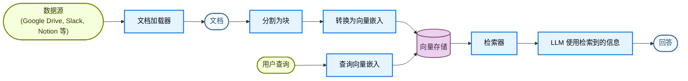
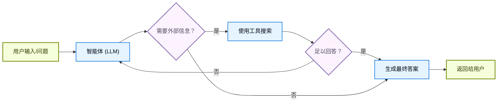
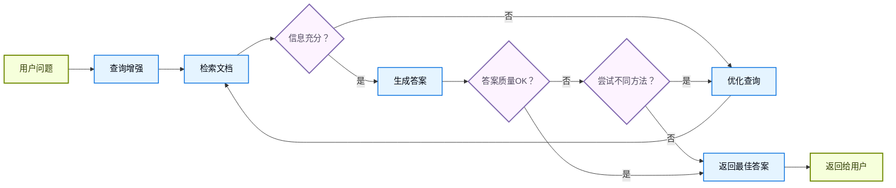

大语言模型(LLM)功能强大，但有两个关键限制：

* **有限的上下文**——它们无法一次性吸收整个语料库。
* **静态知识**——它们的训练数据在某个时间点被冻结。

检索通过在查询时获取相关的外部知识来解决这些问题。这是**检索增强生成（RAG）**的基础：用特定上下文的信息增强大语言模型(LLM)的回答。


## 构建知识库

**知识库**是在检索过程中使用的文档或结构化数据的存储库。

如果你需要自定义知识库，可以使用 LangChain 的文档加载器和向量存储从自己的数据构建。

<Note>
    如果你已经有知识库（例如 SQL 数据库、CRM 或内部文档系统），你**不需要**重新构建。你可以：
    - 在智能体 RAG 中将其连接为**工具**。
    - 查询它并将检索到的内容作为上下文提供给大语言模型(LLM) [（两步 RAG）](#两步-rag)。
</Note>

请参阅以下教程来构建可搜索的知识库和最小化的 RAG 工作流：

<Card
    title="教程：语义搜索"
    icon="database"
    href="/oss/python/langchain/knowledge-base"
    arrow cta="了解更多"
>
    学习如何使用 LangChain 的文档加载器、向量嵌入和向量存储从自己的数据创建可搜索的知识库。
    在本教程中，你将构建一个基于 PDF 的搜索引擎，实现与查询相关段落的检索。你还将在此搜索引擎之上实现一个最小化的 RAG 工作流，了解外部知识如何集成到 LLM 推理中。
</Card>

### 从检索到 RAG

检索允许大语言模型(LLM)在运行时访问相关上下文。但大多数实际应用更进一步：它们**将检索与生成集成**以产生有依据的、上下文感知的回答。

这是**检索增强生成（RAG）**背后的核心思想。检索管道成为一个更广泛系统的基础，该系统将搜索与生成相结合。

### 检索管道

典型的检索工作流如下所示：



每个组件都是模块化的：你可以在不重写应用逻辑的情况下替换加载器、分割器、向量嵌入或向量存储。

### 构建块

<Columns cols={2}>
    <Card
        title="文档加载器"
        icon="file-import"
        href="/oss/python/integrations/document_loaders"
        arrow cta="了解更多"
    >
        从外部源（Google Drive、Slack、Notion 等）导入数据，返回标准化的 [`Document`](https://reference.langchain.com/python/langchain-core/documents/base/Document) 对象。
    </Card>

    <Card
        title="文本分割器"
        icon="scissors"
        href="/oss/python/integrations/splitters"
        arrow
        cta="了解更多"
    >
        将大文档分割成更小的块，使其可以被单独检索并适合模型的上下文窗口。
    </Card>

    <Card
        title="向量嵌入模型"
        icon="sitemap"
        href="/oss/python/integrations/embeddings"
        arrow
        cta="了解更多"
    >
        向量嵌入模型将文本转换为数字向量，使含义相似的文本在向量空间中距离相近。
    </Card>

    <Card
        title="向量存储"
        icon="database"
        href="/oss/python/integrations/vectorstores/"
        arrow
        cta="了解更多"
    >
        用于存储和搜索向量嵌入的专用数据库。
    </Card>

    <Card
        title="检索器"
        icon="binoculars"
        href="/oss/python/integrations/retrievers/"
        arrow
        cta="了解更多"
    >
        检索器是一个接收非结构化查询并返回文档的接口。
    </Card>
</Columns>

## RAG 架构

RAG 可以根据系统需求以多种方式实现。我们在以下部分概述每种类型。

| 架构 | 描述 | 控制力 | 灵活性 | 延迟 | 示例用例 |
|-------------------------|----------------------------------------------------------------------------|-----------|-------------|----------------|----------------------------------------------------|
| **两步 RAG** | 检索总是在生成之前发生。简单且可预测 | ✅ 高 | ❌ 低 | ⚡ 快 | FAQ、文档机器人 |
| **智能体 RAG** | 由 LLM 驱动的智能体在推理过程中决定*何时*以及*如何*检索 | ❌ 低 | ✅ 高 | ⏳ 可变 | 可访问多种工具的研究助手 |
| **混合** | 结合两种方法的特点，带有验证步骤 | ⚖️ 中等 | ⚖️ 中等 | ⏳ 可变 | 带有质量验证的领域特定问答 |

<Info>
**延迟**：**两步 RAG** 的延迟通常更**可预测**，因为 LLM 调用的最大次数已知且有上限。这种可预测性假设 LLM 推理时间是主导因素。然而，实际延迟也可能受到检索步骤性能的影响——如 API 响应时间、网络延迟或数据库查询——这些可能因使用的工具和基础设施而异。
</Info>

### 两步 RAG

在**两步 RAG** 中，检索步骤总是在生成步骤之前执行。这种架构简单且可预测，适合许多检索相关文档是生成答案明确先决条件的应用。


<Card
    title="教程：检索增强生成（RAG）"
    icon="robot"
    href="/oss/python/langchain/rag#rag-chains"
    arrow cta="了解更多"
>
    了解如何构建一个可以使用检索增强生成回答基于数据的问题的问答聊天机器人。
    本教程介绍两种方法：
    * 使用灵活工具执行搜索的 **RAG 智能体**——适合通用场景。
    * 每次查询只需一次 LLM 调用的**两步 RAG** 链——快速高效，适合简单任务。
</Card>

### 智能体 RAG

**智能体检索增强生成（RAG）**结合了检索增强生成与基于智能体的推理优势。智能体（由 LLM 驱动）不是在回答前检索文档，而是逐步推理并在交互过程中决定**何时**以及**如何**检索信息。

<Tip>
智能体实现 RAG 行为只需要访问一个或多个可以获取外部知识的**工具**——如文档加载器、Web API 或数据库查询。
</Tip>



```python
import requests
from langchain.tools import tool
from langchain.chat_models import init_chat_model
from langchain.agents import create_agent


@tool
def fetch_url(url: str) -> str:
    """从 URL 获取文本内容"""
    response = requests.get(url, timeout=10.0)
    response.raise_for_status()
    return response.text

system_prompt = """\
Use fetch_url when you need to fetch information from a web-page; quote relevant snippets.
"""

agent = create_agent(
    model="claude-sonnet-4-6",
    tools=[fetch_url], # 用于检索的工具 [!code highlight]
    system_prompt=system_prompt,
)
```


<Expandable title="扩展示例：用于 LangGraph llms.txt 的智能体 RAG">

此示例实现了一个**智能体 RAG 系统**来帮助用户查询 LangGraph 文档。智能体首先加载 [llms.txt](https://llmstxt.org/)（列出可用的文档 URL），然后可以根据用户的问题动态使用 `fetch_documentation` 工具检索和处理相关内容。

```python
import requests
from langchain.agents import create_agent
from langchain.messages import HumanMessage
from langchain.tools import tool
from markdownify import markdownify


ALLOWED_DOMAINS = ["https://langchain-ai.github.io/"]
LLMS_TXT = 'https://langchain-ai.github.io/langgraph/llms.txt'


@tool
def fetch_documentation(url: str) -> str:  # [!code highlight]
    """获取并转换 URL 中的文档"""
    if not any(url.startswith(domain) for domain in ALLOWED_DOMAINS):
        return (
            "Error: URL not allowed. "
            f"Must start with one of: {', '.join(ALLOWED_DOMAINS)}"
        )
    response = requests.get(url, timeout=10.0)
    response.raise_for_status()
    return markdownify(response.text)


# 我们将获取 llms.txt 的内容，因此可以
# 提前完成，无需 LLM 请求。
llms_txt_content = requests.get(LLMS_TXT).text

# 智能体的系统提示词
system_prompt = f"""
You are an expert Python developer and technical assistant.
Your primary role is to help users with questions about LangGraph and related tools.

Instructions:

1. If a user asks a question you're unsure about—or one that likely involves API usage,
   behavior, or configuration—you MUST use the `fetch_documentation` tool to consult the relevant docs.
2. When citing documentation, summarize clearly and include relevant context from the content.
3. Do not use any URLs outside of the allowed domain.
4. If a documentation fetch fails, tell the user and proceed with your best expert understanding.

You can access official documentation from the following approved sources:

{llms_txt_content}

You MUST consult the documentation to get up to date documentation
before answering a user's question about LangGraph.

Your answers should be clear, concise, and technically accurate.
"""

tools = [fetch_documentation]

model = init_chat_model("claude-sonnet-4-0", max_tokens=32_000)

agent = create_agent(
    model=model,
    tools=tools,  # [!code highlight]
    system_prompt=system_prompt,  # [!code highlight]
    name="Agentic RAG",
)

response = agent.invoke({
    'messages': [
        HumanMessage(content=(
            "Write a short example of a langgraph agent using the "
            "prebuilt create react agent. the agent should be able "
            "to look up stock pricing information."
        ))
    ]
})

print(response['messages'][-1].content)
```


</Expandable>

<Card
    title="教程：检索增强生成（RAG）"
    icon="robot"
    href="/oss/python/langchain/rag"
    arrow cta="了解更多"
>
    了解如何构建一个可以使用检索增强生成回答基于数据的问题的问答聊天机器人。
    本教程介绍两种方法：
    * 使用灵活工具执行搜索的 **RAG 智能体**——适合通用场景。
    * 每次查询只需一次 LLM 调用的**两步 RAG** 链——快速高效，适合简单任务。
</Card>

### 混合 RAG

混合 RAG 结合了两步 RAG 和智能体 RAG 的特点。它引入了中间步骤，如查询预处理、检索验证和生成后检查。这些系统在执行控制的同时提供了比固定管道更多的灵活性。

典型组件包括：

* **查询增强**：修改输入问题以提高检索质量。这可以包括重写不清楚的查询、生成多个变体或用额外上下文扩展查询。
* **检索验证**：评估检索到的文档是否相关且充分。如果不够，系统可以优化查询并重新检索。
* **答案验证**：检查生成的答案的准确性、完整性以及与源内容的一致性。如果需要，系统可以重新生成或修改答案。

该架构通常支持这些步骤之间的多次迭代：



此架构适用于：

* 查询模糊或不够具体的应用
* 需要验证或质量控制步骤的系统
* 涉及多个数据源或迭代优化的工作流

<Card
    title="教程：带自我纠正的智能体 RAG"
    icon="robot"
    href="/oss/python/langgraph/agentic-rag"
    arrow cta="了解更多"
>
    一个**混合 RAG** 的示例，结合了智能体推理与检索和自我纠正。
</Card>

---

<div className="source-links">
<Callout icon="terminal-2">
    [将这些文档连接](/use-these-docs)到 Claude、VSCode 等工具，通过 MCP 获取实时答案。
</Callout>
<Callout icon="edit">
    [在 GitHub 上编辑此页面](https://github.com/langchain-ai/docs/edit/main/src/oss/langchain/retrieval.mdx)或[提交问题](https://github.com/langchain-ai/docs/issues/new/choose)。
</Callout>
</div>
