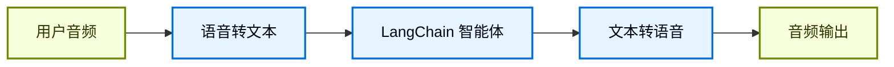
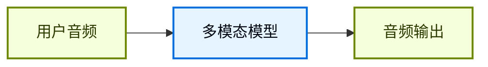

## 概述

聊天界面主导了我们与 AI 的交互方式，但多模态 AI 的最新突破正在开启令人兴奋的新可能性。高质量的生成模型和富有表现力的文本转语音（TTS）系统现在使构建感觉不像工具、更像对话伙伴的智能体成为可能。

语音智能体就是其中一个例子。你可以使用口语与智能体交互，而不是依赖键盘和鼠标输入。这可以是一种更自然、更有吸引力的与 AI 交互的方式，在某些场景中特别有用。

### 什么是语音智能体？

语音智能体是能够与用户进行自然口语对话的[智能体](/oss/python/langchain/agents)。这些智能体结合了语音识别、自然语言处理、生成式 AI 和文本转语音技术，创建无缝、自然的对话。

它们适用于多种用例，包括：

- 客户支持
- 个人助理
- 免提界面
- 培训和训练

### 语音智能体如何工作？

在高层次上，每个语音智能体需要处理三个任务：

1. **听** - 捕获音频并进行转录
2. **思考** - 解释意图、推理、规划
3. **说** - 生成音频并将其流式传输回用户

区别在于这些步骤如何排序和耦合。在实践中，生产智能体遵循两种主要架构之一：

#### 1. STT > 智能体 > TTS 架构（"三明治"架构）

三明治架构组合了三个独立的组件：语音转文本（STT）、基于文本的 LangChain 智能体和文本转语音（TTS）。



**优点：**
- 完全控制每个组件（根据需要更换 STT/TTS 提供商）
- 访问现代文本模态模型的最新能力
- 透明的行为，组件之间有清晰的边界

**缺点：**
- 需要编排多个服务
- 管理管道的额外复杂性
- 从语音到文本的转换会丢失信息（例如语气、情感）

#### 2. 语音到语音架构（S2S）

语音到语音使用多模态模型，原生处理音频输入并生成音频输出。



**优点：**
- 更简单的架构，更少的组件
- 简单交互通常延迟更低
- 直接音频处理捕获语调和其他语音细微差别

**缺点：**
- 有限的模型选择，更大的提供商锁定风险
- 功能可能落后于文本模态模型
- 音频处理方式的透明度较低
- 可控性和自定义选项减少

本指南演示**三明治架构**，以平衡性能、可控性和访问现代模型能力。三明治架构通过某些 STT 和 TTS 提供商可以实现低于 700 毫秒的延迟，同时保持对模块化组件的控制。

### 演示应用概述

我们将逐步构建一个使用三明治架构的基于语音的智能体。该智能体将为一家三明治店管理订单。应用程序将演示三明治架构的所有三个组件，使用 [AssemblyAI](https://www.assemblyai.com/) 进行 STT，使用 [Cartesia](https://cartesia.ai/) 进行 TTS（尽管可以为大多数提供商构建适配器）。

完整的端到端参考应用程序可在 [voice-sandwich-demo](https://github.com/langchain-ai/voice-sandwich-demo) 仓库中找到。我们将在这里逐步讲解该应用程序。

演示使用 WebSocket 进行浏览器和服务器之间的实时双向通信。相同的架构可以适配其他传输方式，如电话系统（Twilio、Vonage）或 WebRTC 连接。

### 架构

演示实现了一个流式管道，每个阶段异步处理数据：

**客户端（浏览器）**
- 捕获麦克风音频并编码为 PCM
- 建立到后端服务器的 WebSocket 连接
- 实时将音频块流式传输到服务器
- 接收并播放合成的语音音频

**服务器（Python）**


- 接受来自客户端的 WebSocket 连接
- 编排三步管道：
  - [语音转文本（STT）](#1-speech-to-text)：将音频转发到 STT 提供商（例如 AssemblyAI），接收转录事件
  - [智能体](#2-langchain-agent)：使用 LangChain 智能体处理转录文本，流式输出响应 Token
  - [文本转语音（TTS）](#3-text-to-speech)：将智能体响应发送到 TTS 提供商（例如 Cartesia），接收音频块

- 将合成的音频返回给客户端进行播放

管道使用异步生成器在每个阶段启用流式输出。这允许下游组件在上游阶段完成之前就开始处理，从而最小化端到端延迟。


## 设置

有关详细的安装说明和设置，请参阅[仓库 README](https://github.com/langchain-ai/voice-sandwich-demo#readme)。

## 1. 语音转文本

STT 阶段将传入的音频流转换为文本转录。实现使用生产者-消费者模式来并发处理音频流式传输和转录接收。

### 关键概念

**生产者-消费者模式**：音频块被发送到 STT 服务的同时接收转录事件。这允许在所有音频到达之前就开始转录。

**事件类型**：
- `stt_chunk`：STT 服务处理音频时提供的部分转录
- `stt_output`：触发智能体处理的最终、格式化的转录

**WebSocket 连接**：维护与 AssemblyAI 实时 STT API 的持久连接，配置为 16kHz PCM 音频和自动轮次格式化。

### 实现

```python
from typing import AsyncIterator
import asyncio
from assemblyai_stt import AssemblyAISTT
from events import VoiceAgentEvent

async def stt_stream(
    audio_stream: AsyncIterator[bytes],
) -> AsyncIterator[VoiceAgentEvent]:
    """
    转换流：音频（Bytes） -> 语音事件（VoiceAgentEvent）

    使用生产者-消费者模式，其中：
    - 生产者：读取音频块并发送到 AssemblyAI
    - 消费者：从 AssemblyAI 接收转录事件
    """
    stt = AssemblyAISTT(sample_rate=16000)

    async def send_audio():
        """后台任务，将音频块推送到 AssemblyAI。"""
        try:
            async for audio_chunk in audio_stream:
                await stt.send_audio(audio_chunk)
        finally:
            # 音频流结束时发出完成信号
            await stt.close()

    # 在后台启动音频发送
    send_task = asyncio.create_task(send_audio())

    try:
        # 在转录事件到达时接收并返回
        async for event in stt.receive_events():
            yield event
    finally:
        # 清理
        with contextlib.suppress(asyncio.CancelledError):
            send_task.cancel()
            await send_task
        await stt.close()
```


该应用程序实现了一个 AssemblyAI 客户端来管理 WebSocket 连接和消息解析。请参见下面的实现；类似的适配器可以为其他 STT 提供商构建。

<Accordion title="AssemblyAI 客户端">

```python
class AssemblyAISTT:
    def __init__(self, api_key: str | None = None, sample_rate: int = 16000):
        self.api_key = api_key or os.getenv("ASSEMBLYAI_API_KEY")
        self.sample_rate = sample_rate
        self._ws: WebSocketClientProtocol | None = None

    async def send_audio(self, audio_chunk: bytes) -> None:
        """将 PCM 音频字节发送到 AssemblyAI。"""
        ws = await self._ensure_connection()
        await ws.send(audio_chunk)

    async def receive_events(self) -> AsyncIterator[STTEvent]:
        """在 AssemblyAI 的 STT 事件到达时返回。"""
        async for raw_message in self._ws:
            message = json.loads(raw_message)

            if message["type"] == "Turn":
                # 最终格式化的转录
                if message.get("turn_is_formatted"):
                    yield STTOutputEvent.create(message["transcript"])
                # 部分转录
                else:
                    yield STTChunkEvent.create(message["transcript"])

    async def _ensure_connection(self) -> WebSocketClientProtocol:
        """如果尚未连接则建立 WebSocket 连接。"""
        if self._ws is None:
            url = f"wss://streaming.assemblyai.com/v3/ws?sample_rate={self.sample_rate}&format_turns=true"
            self._ws = await websockets.connect(
                url,
                additional_headers={"Authorization": self.api_key}
            )
        return self._ws
```


</Accordion>

## 2. LangChain 智能体

智能体阶段通过 LangChain [智能体](/oss/python/langchain/agents)处理文本转录并流式输出响应 Token。在本例中，我们流式输出智能体生成的所有[文本内容块](/oss/python/langchain/messages#content-block-reference)。

### 关键概念

**流式响应**：智能体使用 [`stream_mode="messages"`](/oss/python/langchain/streaming#llm-tokens) 在生成响应 Token 时立即发出，而不是等待完整响应。这使 TTS 阶段能够立即开始合成。

**对话记忆**：[检查点](/oss/python/langchain/short-term-memory)使用唯一的线程 ID 在轮次之间维护对话状态。这允许智能体在对话中引用先前的交流。

### 实现

```python
from langchain_core.utils.uuid import uuid7
from langchain.agents import create_agent
from langchain.messages import HumanMessage
from langgraph.checkpoint.memory import InMemorySaver

# 定义智能体工具
def add_to_order(item: str, quantity: int) -> str:
    """Add an item to the customer's sandwich order."""
    return f"Added {quantity} x {item} to the order."

def confirm_order(order_summary: str) -> str:
    """Confirm the final order with the customer."""
    return f"Order confirmed: {order_summary}. Sending to kitchen."

# 创建带有工具和记忆的智能体
agent = create_agent(
    model="google_genai:gemini-3.1-pro-preview",  # 选择你的模型
    tools=[add_to_order, confirm_order],
    system_prompt="""You are a helpful sandwich shop assistant.
    Your goal is to take the user's order. Be concise and friendly.
    Do NOT use emojis, special characters, or markdown.
    Your responses will be read by a text-to-speech engine.""",
    checkpointer=InMemorySaver(),
)

async def agent_stream(
    event_stream: AsyncIterator[VoiceAgentEvent],
) -> AsyncIterator[VoiceAgentEvent]:
    """
    转换流：语音事件 -> 语音事件（带智能体响应）

    传递所有上游事件并在处理 STT 转录时添加 agent_chunk 事件。
    """
    # 为对话记忆生成唯一线程 ID
    thread_id = str(uuid7())

    async for event in event_stream:
        # 传递所有上游事件
        yield event

        # 通过智能体处理最终转录
        if event.type == "stt_output":
            # 带对话上下文的流式智能体响应
            stream = agent.astream(
                {"messages": [HumanMessage(content=event.transcript)]},
                {"configurable": {"thread_id": thread_id}},
                stream_mode="messages",
            )

            # 在智能体响应块到达时返回
            async for message, _ in stream:
                if message.text:
                    yield AgentChunkEvent.create(message.text)
```


## 3. 文本转语音

TTS 阶段将智能体响应文本合成为音频并流式传输回客户端。与 STT 阶段一样，它使用生产者-消费者模式来并发处理文本发送和音频接收。

### 关键概念

**并发处理**：实现合并了两个异步流：
- **上游处理**：传递所有事件并将智能体文本块发送到 TTS 提供商
- **音频接收**：从 TTS 提供商接收合成的音频块

**流式 TTS**：一些提供商（如 [Cartesia](https://cartesia.ai/)）在收到文本后立即开始合成音频，使音频播放能在智能体完成生成完整响应之前就开始。

**事件透传**：所有上游事件不变地流过，允许客户端或其他观察者跟踪完整的管道状态。

### 实现

```python
from cartesia_tts import CartesiaTTS
from utils import merge_async_iters

async def tts_stream(
    event_stream: AsyncIterator[VoiceAgentEvent],
) -> AsyncIterator[VoiceAgentEvent]:
    """
    转换流：语音事件 -> 语音事件（带音频）

    合并两个并发流：
    1. process_upstream()：传递事件并将文本发送到 Cartesia
    2. tts.receive_events()：从 Cartesia 返回音频块
    """
    tts = CartesiaTTS()

    async def process_upstream() -> AsyncIterator[VoiceAgentEvent]:
        """处理上游事件并将智能体文本发送到 Cartesia。"""
        async for event in event_stream:
            # 传递所有事件
            yield event
            # 将智能体文本发送到 Cartesia 进行合成
            if event.type == "agent_chunk":
                await tts.send_text(event.text)

    try:
        # 合并上游事件和 TTS 音频事件
        # 两个流并发运行
        async for event in merge_async_iters(
            process_upstream(),
            tts.receive_events()
        ):
            yield event
    finally:
        await tts.close()
```


该应用程序实现了一个 Cartesia 客户端来管理 WebSocket 连接和音频流式传输。请参见下面的实现；类似的适配器可以为其他 TTS 提供商构建。

<Accordion title="Cartesia 客户端">

```python
import base64
import json
import websockets

class CartesiaTTS:
    def __init__(
        self,
        api_key: Optional[str] = None,
        voice_id: str = "f6ff7c0c-e396-40a9-a70b-f7607edb6937",
        model_id: str = "sonic-3",
        sample_rate: int = 24000,
        encoding: str = "pcm_s16le",
    ):
        self.api_key = api_key or os.getenv("CARTESIA_API_KEY")
        self.voice_id = voice_id
        self.model_id = model_id
        self.sample_rate = sample_rate
        self.encoding = encoding
        self._ws: WebSocketClientProtocol | None = None

    def _generate_context_id(self) -> str:
        """为 Cartesia 生成有效的 context_id。"""
        timestamp = int(time.time() * 1000)
        counter = self._context_counter
        self._context_counter += 1
        return f"ctx_{timestamp}_{counter}"

    async def send_text(self, text: str | None) -> None:
        """将文本发送到 Cartesia 进行合成。"""
        if not text or not text.strip():
            return

        ws = await self._ensure_connection()
        payload = {
            "model_id": self.model_id,
            "transcript": text,
            "voice": {
                "mode": "id",
                "id": self.voice_id,
            },
            "output_format": {
                "container": "raw",
                "encoding": self.encoding,
                "sample_rate": self.sample_rate,
            },
            "language": self.language,
            "context_id": self._generate_context_id(),
        }
        await ws.send(json.dumps(payload))

    async def receive_events(self) -> AsyncIterator[TTSChunkEvent]:
        """在 Cartesia 的音频块到达时返回。"""
        async for raw_message in self._ws:
            message = json.loads(raw_message)

            # 解码并返回音频块
            if "data" in message and message["data"]:
                audio_chunk = base64.b64decode(message["data"])
                if audio_chunk:
                    yield TTSChunkEvent.create(audio_chunk)

    async def _ensure_connection(self) -> WebSocketClientProtocol:
        """如果尚未连接则建立 WebSocket 连接。"""
        if self._ws is None:
            url = (
                f"wss://api.cartesia.ai/tts/websocket"
                f"?api_key={self.api_key}&cartesia_version={self.cartesia_version}"
            )
            self._ws = await websockets.connect(url)

        return self._ws
```


</Accordion>

### LangSmith

你使用 LangChain 构建的许多应用程序将包含多个步骤和多次 LLM 调用。随着这些应用程序变得更加复杂，能够检查链或智能体内部究竟发生了什么变得至关重要。最好的方法是使用 [LangSmith](https://smith.langchain.com?utm_source=docs&utm_medium=cta&utm_campaign=langsmith-signup&utm_content=oss-langchain-voice-agent)。

在上面的链接注册后，确保设置环境变量以开始记录追踪：

```shell
export LANGSMITH_TRACING="true"
export LANGSMITH_API_KEY="..."
```

或者在 Python 中设置：

```python
import getpass
import os

os.environ["LANGSMITH_TRACING"] = "true"
os.environ["LANGSMITH_API_KEY"] = getpass.getpass()
```


## 整合

完整的管道将三个阶段链接在一起：

```python
from langchain_core.runnables import RunnableGenerator

pipeline = (
    RunnableGenerator(stt_stream)      # 音频 -> STT 事件
    | RunnableGenerator(agent_stream)  # STT 事件 -> 智能体事件
    | RunnableGenerator(tts_stream)    # 智能体事件 -> TTS 音频
)

# 在 WebSocket 端点中使用
@app.websocket("/ws")
async def websocket_endpoint(websocket: WebSocket):
    await websocket.accept()

    async def websocket_audio_stream():
        """从 WebSocket 返回音频字节。"""
        while True:
            data = await websocket.receive_bytes()
            yield data

    # 通过管道转换音频
    output_stream = pipeline.atransform(websocket_audio_stream())

    # 将 TTS 音频发送回客户端
    async for event in output_stream:
        if event.type == "tts_chunk":
            await websocket.send_bytes(event.audio)
```

我们使用 [RunnableGenerator](https://reference.langchain.com/python/langchain_core/runnables/#langchain_core.runnables.base.RunnableGenerator) 来组合管道的每个步骤。这是 LangChain 内部用来管理[跨组件流式输出](https://reference.langchain.com/python/langchain_core/runnables/)的抽象。


每个阶段独立且并发地处理事件：音频一到达就开始转录，转录一可用智能体就开始推理，智能体文本一生成语音合成就开始。这种架构可以实现低于 700 毫秒的延迟来支持自然对话。

有关使用 LangChain 构建智能体的更多信息，请参阅[智能体指南](/oss/python/langchain/agents)。

---

<div className="source-links">
<Callout icon="terminal-2">
    [连接这些文档](/use-these-docs)到 Claude、VSCode 等工具，通过 MCP 获取实时答案。
</Callout>
<Callout icon="edit">
    [在 GitHub 上编辑此页面](https://github.com/langchain-ai/docs/edit/main/src/oss/langchain/voice-agent.mdx)或[提交 issue](https://github.com/langchain-ai/docs/issues/new/choose)。
</Callout>
</div>
