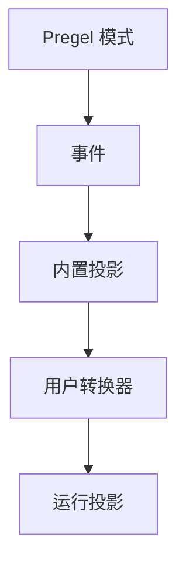

事件流是大多数 LangGraph 应用代码推荐的进程内流式输出模型。它返回一个运行流对象，可以同时以多种方式消费。

<Tip>
查看[流式输出示例集](https://github.com/langchain-ai/streaming-cookbook)获取可运行的示例和详细参考文档的链接。
</Tip>

```python
run = graph.stream_events(
    {"messages": [{"role": "user", "content": "What is 42 * 17?"}]},
    version="v3",
)

for message in run.messages:
    for token in message.text:
        print(token, end="", flush=True)

final_state = run.output
```


<Note>
`version="v3"` 标志目前是临时必需的，用于启用此流行为。新行为将在下一个 LangGraph 主要版本中成为默认流版本。
</Note>

## 事件流提供的功能

运行流在一个底层事件流上暴露类型化投影：

| 投影 | 用途 |
| ---------- | --- |
| `run` | 迭代每个协议事件。 |
| `run.messages` | 流式输出聊天模型消息和 Token 增量。 |
| `run.values` | 迭代状态快照并等待最终值。 |
| `run.output` | 等待最终输出。 |
| `run.subgraphs` | 发现和观察嵌套图执行。 |
| `run.interrupts` | 检查人机协作中断载荷。 |
| `run.interrupted` | 检查运行是否因等待人工输入而暂停。 |
| `run.extensions` | 消费自定义流转换器投影。 |

多个消费者可以并发读取这些投影。读取 `run.messages` 不会消耗 `run.values`、`run.subgraphs` 或 `run.output` 所需的事件。

## 流协议事件

当你需要原始协议事件流时，使用运行对象本身：

```python
run = graph.stream_events(input, version="v3")

for event in run:
    namespace = event["params"]["namespace"]
    print(namespace, event["method"], event["params"]["data"])
```


每个协议事件都有一个类似通道的 `method`、一个单调递增的 `seq` 编号，以及包含 `namespace`、`timestamp`、可选的 `node` 和通道特定 `data` 的 `params`。

```json
{
  "type": "event",
  "seq": 42,
  "method": "messages",
  "params": {
    "namespace": [],
    "timestamp": 1770000000000,
    "node": "agent",
    "data": {
      "event": "content-block-delta",
      "content_block": {
        "type": "text",
        "text": "hello"
      }
    }
  }
}
```

核心通道包括：

| 通道 | 用途 |
| ------- | ------- |
| `values` | 完整的图状态快照。 |
| `updates` | 每个节点的状态增量。 |
| `messages` | 以内容块为中心的聊天模型输出。 |
| `tools` | 工具调用开始、流式输出、完成和错误事件。 |
| `lifecycle` | 运行、子图和子智能体状态变化。 |
| `checkpoints` | 用于分支和时间旅行的轻量级检查点信封。 |
| `input` | 人机协作输入请求和响应。 |
| `tasks` | Pregel 任务创建和结果事件。 |
| `custom` | 来自图代码的用户自定义载荷。 |
| `custom:<name>` | 应用定义的流转换器输出。 |

`messages` 通道将输出建模为内容块。这使得 Token 流式输出、推理块、工具调用块和多模态内容变得明确，无需在应用代码中使用特定提供商的格式。

## 添加自定义转换器

流转换器是事件流中的投影层。它们观察协议事件，维护自己的状态，并暴露运行的派生视图，如进度事件、产物、Token 总数、工具活动或第三方协议消息。



转换器在 `init()` 中创建投影，在 `process()` 中观察每个事件，并在运行完成时完成或使投影失败。

```python
from langgraph.stream import ProtocolEvent, StreamTransformer


class MyTransformer(StreamTransformer):
    def init(self) -> dict:
        ...

    def process(self, event: ProtocolEvent) -> bool:
        ...

    def finalize(self) -> None:
        ...

    def fail(self, err: BaseException) -> None:
        ...
```


在启动事件流时传递转换器：

```python
run = graph.stream_events(
    input,
    version="v3",
    transformers=[ToolActivityTransformer],
)

for activity in run.extensions["tool_activity"]:
    print(activity)
```


## 使用 StreamChannel

`StreamChannel` 是自定义流式数据的投影原语。它为进程内消费者提供可迭代的流，当通道具有协议名称时，还可以将推送的值转发给远程 SDK 客户端。

| 需求 | 使用方式 |
| ---- | --- |
| 数据仅保留在进程内 | `StreamChannel()` 或 `new StreamChannel<T>()` |
| 数据在进程内和网络上都可用 | `StreamChannel(name)` 或 `new StreamChannel<T>(name)` |

命名通道的载荷必须可序列化，因为它们也会作为 `custom:<name>` 协议事件发出。请将 promise、异步可迭代对象、类实例和其他进程内句柄保持为本地的。

```python
from typing import TypedDict

from langgraph.stream import ProtocolEvent, StreamChannel, StreamTransformer


class ToolActivity(TypedDict):
    name: str
    status: str


class ToolActivityTransformer(StreamTransformer):
    required_stream_modes = ("tools",)

    def __init__(self, scope: tuple[str, ...] = ()) -> None:
        super().__init__(scope)
        self.activity = StreamChannel[ToolActivity]("tool_activity")

    def init(self) -> dict:
        return {"tool_activity": self.activity}

    def process(self, event: ProtocolEvent) -> bool:
        if event["method"] != "tools":
            return True

        data = event["params"]["data"]
        if isinstance(data, dict) and data.get("tool_name") and data.get("event"):
            status = "error" if data["event"] == "tool-error" else "started"
            self.activity.push({"name": data["tool_name"], "status": status})
        return True
```


## 相关内容

- [流式输出示例集](https://github.com/langchain-ai/streaming-cookbook)展示了可运行的事件流示例。
- [LangGraph 流式输出](/oss/python/langgraph/streaming)涵盖了底层流模式。
- [LangChain 事件流](/oss/python/langchain/event-streaming)涵盖了基于 LangGraph 构建的智能体流式输出接口。
- [Deep Agents 事件流](/oss/python/deepagents/event-streaming)涵盖了委托子智能体流。

---

<div className="source-links">
<Callout icon="terminal-2">
    [将这些文档连接](/use-these-docs)到 Claude、VSCode 等工具，通过 MCP 获取实时答案。
</Callout>
<Callout icon="edit">
    [在 GitHub 上编辑此页面](https://github.com/langchain-ai/docs/edit/main/src/oss/langgraph/streaming/event-streaming.mdx)或[提交 issue](https://github.com/langchain-ai/docs/issues/new/choose)。
</Callout>
</div>
