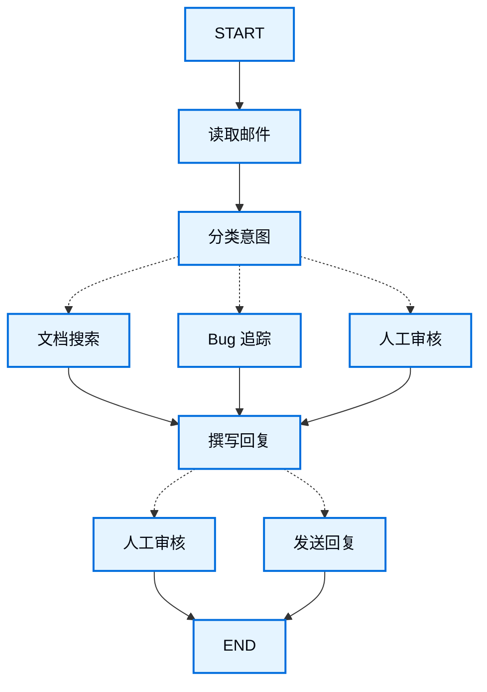

当你使用 LangGraph 构建智能体时，首先要将其拆分为称为**节点**的离散步骤。然后，你需要描述每个节点的不同决策和转换。最后，通过一个每个节点都可以读取和写入的共享**状态**将节点连接在一起。

在本指南中，我们将引导你思考如何使用 LangGraph 构建客户支持邮件智能体的过程。

## 从你想要自动化的流程开始

假设你需要构建一个处理客户支持邮件的 AI 智能体。你的产品团队给了你以下需求：

```txt
智能体应该：

- 读取收到的客户邮件
- 按紧急程度和主题进行分类
- 搜索相关文档以回答问题
- 撰写适当的回复
- 将复杂问题升级给人工客服
- 在需要时安排后续跟进

需要处理的示例场景：

1. 简单产品问题："How do I reset my password?"
2. Bug 报告："The export feature crashes when I select PDF format"
3. 紧急计费问题："I was charged twice for my subscription!"
4. 功能请求："Can you add dark mode to the mobile app?"
5. 复杂技术问题："Our API integration fails intermittently with 504 errors"
```

要在 LangGraph 中实现一个智能体，你通常会遵循相同的五个步骤。

## 步骤 1：将工作流映射为离散步骤

首先识别流程中的不同步骤。每个步骤将成为一个**节点**（执行某个特定操作的函数）。然后，勾画这些步骤之间的连接方式。



图中的箭头显示了可能的路径，但实际选择哪条路径的决策发生在每个节点内部。

现在我们已经识别了工作流中的组件，让我们了解每个节点需要做什么：

- `读取邮件`：提取并解析邮件内容
- `分类意图`：使用 LLM 对紧急程度和主题进行分类，然后路由到适当的操作
- `文档搜索`：查询知识库获取相关信息
- `Bug 追踪`：在追踪系统中创建或更新问题
- `撰写回复`：生成适当的回复
- `人工审核`：升级给人工客服进行审批或处理
- `发送回复`：发送邮件回复

<Tip>
请注意，有些节点会决定接下来去哪里（`分类意图`、`撰写回复`、`人工审核`），而其他节点总是前往相同的下一步（`读取邮件`总是去`分类意图`，`文档搜索`总是去`撰写回复`）。
</Tip>

## 步骤 2：确定每个步骤需要做什么

对于图中的每个节点，确定它代表什么类型的操作以及它需要什么上下文才能正常工作。

<CardGroup cols={2}>
    <Card title="LLM 步骤" icon="brain" href="#llm-steps">
        当你需要理解、分析、生成文本或进行推理决策时使用
    </Card>
    <Card title="数据步骤" icon="database" href="#data-steps">
        当你需要从外部来源检索信息时使用
    </Card>
    <Card title="操作步骤" icon="bolt" href="#action-steps">
        当你需要执行外部操作时使用
    </Card>
    <Card title="用户输入步骤" icon="user" href="#user-input-steps">
        当你需要人工干预时使用
    </Card>
</CardGroup>

### LLM 步骤

当某个步骤需要理解、分析、生成文本或进行推理决策时：

<AccordionGroup>
    <Accordion title="分类意图">
        - 静态上下文（提示词）：分类类别、紧急程度定义、响应格式
        - 动态上下文（来自状态）：邮件内容、发件人信息
        - 期望结果：决定路由的结构化分类
    </Accordion>

    <Accordion title="撰写回复">
        - 静态上下文（提示词）：语气指南、公司政策、回复模板
        - 动态上下文（来自状态）：分类结果、搜索结果、客户历史
        - 期望结果：准备好供审核的专业邮件回复
    </Accordion>
</AccordionGroup>

### 数据步骤

当某个步骤需要从外部来源检索信息时：

<AccordionGroup>
    <Accordion title="文档搜索">
        - 参数：根据意图和主题构建的查询
        - 重试策略：是的，对瞬时失败使用指数退避
        - 缓存：可以缓存常见查询以减少 API 调用
    </Accordion>

    <Accordion title="客户历史查询">
        - 参数：来自状态的客户邮箱或 ID
        - 重试策略：是的，但如果不可用则回退到基本信息
        - 缓存：是的，使用 TTL 平衡新鲜度和性能
    </Accordion>
</AccordionGroup>

### 操作步骤

当某个步骤需要执行外部操作时：

<AccordionGroup>
    <Accordion title="发送回复">
        - 何时执行节点：在审批后（人工或自动）
        - 重试策略：是的，对网络问题使用指数退避
        - 不应缓存：每次发送都是唯一操作
    </Accordion>

    <Accordion title="Bug 追踪">
        - 何时执行节点：当意图为"bug"时总是执行
        - 重试策略：是的，丢失 bug 报告至关重要
        - 返回：要包含在回复中的工单 ID
    </Accordion>
</AccordionGroup>

### 用户输入步骤

当某个步骤需要人工干预时：

<AccordionGroup>
    <Accordion title="人工审核节点">
        - 决策上下文：原始邮件、回复草稿、紧急程度、分类
        - 预期输入格式：审批布尔值加上可选的编辑后回复
        - 触发条件：高紧急程度、复杂问题或质量问题
    </Accordion>
</AccordionGroup>

## 步骤 3：设计你的状态

状态是智能体中所有节点都可以访问的共享[记忆](/oss/python/concepts/memory)。把它想象成你的智能体在处理流程时用来记录所学和所决定的一切的笔记本。

### 什么应该放入状态？

对每条数据问自己以下问题：

<CardGroup cols={2}>
    <Card title="放入状态" icon="check">
        它是否需要跨步骤持久化？如果是，放入状态。
    </Card>

    <Card title="不要存储" icon="code">
        能否从其他数据推导出来？如果是，在需要时计算它而不是存储在状态中。
    </Card>
</CardGroup>

对于我们的邮件智能体，我们需要追踪：

- 原始邮件和发件人信息（后续无法重建）
- 分类结果（多个后续/下游节点需要）
- 搜索结果和客户数据（重新获取代价高）
- 回复草稿（需要在审核过程中持久化）
- 执行元数据（用于调试和恢复）

### 保持状态原始，按需格式化提示词

<Tip>
    关键原则：你的状态应存储原始数据，而不是格式化后的文本。在需要时在节点内部格式化提示词。
</Tip>

这种分离意味着：

- 不同节点可以为各自需求以不同方式格式化相同的数据
- 你可以更改提示词模板而无需修改状态模式
- 调试更清晰——你可以看到每个节点收到了什么确切的数据
- 你的智能体可以演化而不破坏现有状态

让我们定义我们的状态：

```python
from typing import TypedDict, Literal

# 定义邮件分类的结构
class EmailClassification(TypedDict):
    intent: Literal["question", "bug", "billing", "feature", "complex"]
    urgency: Literal["low", "medium", "high", "critical"]
    topic: str
    summary: str

class EmailAgentState(TypedDict):
    # 原始邮件数据
    email_content: str
    sender_email: str
    email_id: str

    # 分类结果
    classification: EmailClassification | None

    # 原始搜索/API 结果
    search_results: list[str] | None  # 原始文档块列表
    customer_history: dict | None  # 来自 CRM 的原始客户数据

    # 生成的内容
    draft_response: str | None
    messages: list[str] | None
```


请注意，状态只包含原始数据——没有提示词模板，没有格式化字符串，没有指令。分类输出作为单个字典存储，直接来自 LLM。

## 步骤 4：构建你的节点

现在我们来实现每个步骤作为函数。LangGraph 中的节点只是一个接受当前状态并返回更新的 Python 函数。


### 适当处理错误

不同的错误需要不同的处理策略：

| 错误类型 | 谁来修复 | 策略 | 何时使用 |
|------------|--------------|----------|-------------|
| 瞬时错误（网络问题、速率限制） | 系统（自动） | 重试策略 | 通常在重试时解决的临时故障 |
| LLM 可恢复错误（工具失败、解析问题） | LLM | 将错误存入状态并循环回退 | LLM 可以看到错误并调整方法 |
| 用户可修复错误（信息缺失、指令不清） | 人工 | 使用 `interrupt()` 暂停 | 需要用户输入才能继续 |
| 重试后可恢复的故障 | 开发者（声明式） | `error_handler` | 在重试耗尽后运行补偿/恢复分支 |
| 意外错误 | 开发者 | 让它们冒泡 | 需要调试的未知问题 |

<Tabs>
    <Tab title="瞬时错误" icon="rotate">
        添加重试策略以自动重试网络问题和速率限制。

    与 `timeout=` 组合以限制每次尝试的时间。完整生命周期请参阅[容错](/oss/python/langgraph/fault-tolerance)。

    ```python
    from langgraph.types import RetryPolicy

    workflow.add_node(
        "search_documentation",
        search_documentation,
        retry_policy=RetryPolicy(max_attempts=3, initial_interval=1.0)
    )
    ```


    </Tab>

    <Tab title="LLM 可恢复" icon="brain">
        将错误存入状态并循环回退，让 LLM 能看到哪里出了问题并再次尝试：

    ```python
    from langgraph.types import Command


    def execute_tool(state: State) -> Command[Literal["agent", "execute_tool"]]:
        try:
            result = run_tool(state['tool_call'])
            return Command(update={"tool_result": result}, goto="agent")
        except ToolError as e:
            # 让 LLM 看到哪里出了问题并再次尝试
            return Command(
                update={"tool_result": f"Tool error: {str(e)}"},
                goto="agent"
            )
    ```


    </Tab>

    <Tab title="用户可修复" icon="user">
        在需要时暂停并从用户收集信息（如账户 ID、订单号或说明）：

    ```python
    from langgraph.types import Command


    def lookup_customer_history(state: State) -> Command[Literal["draft_response"]]:
        if not state.get('customer_id'):
            user_input = interrupt({
                "message": "Customer ID needed",
                "request": "Please provide the customer's account ID to look up their subscription history"
            })
            return Command(
                update={"customer_id": user_input['customer_id']},
                goto="lookup_customer_history"
            )
        # 现在继续查询
        customer_data = fetch_customer_history(state['customer_id'])
        return Command(update={"customer_history": customer_data}, goto="draft_response")
    ```


    </Tab>

    <Tab title="意外错误" icon="alert-triangle">
        让它们冒泡用于调试。不要捕获你无法处理的错误：

    ```python
    def send_reply(state: EmailAgentState):
        try:
            email_service.send(state["draft_response"])
        except Exception:
            raise  # 暴露意外错误
    ```


    </Tab>

    <Tab title="Saga / 补偿" icon="arrows-exchange">
        在重试耗尽后，运行一个恢复函数来更新状态并路由到补偿分支。

    完整模式请参阅[容错](/oss/python/langgraph/fault-tolerance#error-handling)。

    <Note>
    `error_handler` 需要 `langgraph>=1.2`。
    </Note>

    ```python
    from langgraph.errors import NodeError
    from langgraph.types import Command, RetryPolicy

    def payment_error_handler(state: State, error: NodeError) -> Command:
        return Command(
            update={"status": f"compensated: {error.error}"},
            goto="finalize",
        )

    workflow.add_node(
        "charge_payment",
        charge_payment,
        retry_policy=RetryPolicy(max_attempts=3, retry_on=ConnectionError),
        error_handler=payment_error_handler,
    )
    ```


    </Tab>
</Tabs>


### 实现我们的邮件智能体节点

我们将每个节点实现为一个简单的函数。记住：节点接受状态，执行工作，返回更新。

<AccordionGroup>
    <Accordion title="读取和分类节点" icon="brain">

    ```python
    from typing import Literal
    from langgraph.graph import StateGraph, START, END
    from langgraph.types import interrupt, Command, RetryPolicy
    from langchain_openai import ChatOpenAI
    from langchain.messages import HumanMessage

    llm = ChatOpenAI(model="gpt-5-nano")

    def read_email(state: EmailAgentState) -> dict:
        """提取并解析邮件内容"""
        # 在生产中，这将连接到你的邮件服务
        return {
            "messages": [HumanMessage(content=f"Processing email: {state['email_content']}")]
        }

    def classify_intent(state: EmailAgentState) -> Command[Literal["search_documentation", "human_review", "draft_response", "bug_tracking"]]:
        """使用 LLM 分类邮件意图和紧急程度，然后相应路由"""

        # 创建返回 EmailClassification 字典的结构化 LLM
        structured_llm = llm.with_structured_output(EmailClassification)

        # 按需格式化提示词，不存储在状态中
        classification_prompt = f"""
        Analyze this customer email and classify it:

        Email: {state['email_content']}
        From: {state['sender_email']}

        Provide classification including intent, urgency, topic, and summary.
        """

        # 直接获取字典形式的结构化响应
        classification = structured_llm.invoke(classification_prompt)

        # 根据分类确定下一个节点
        if classification['intent'] == 'billing' or classification['urgency'] == 'critical':
            goto = "human_review"
        elif classification['intent'] in ['question', 'feature']:
            goto = "search_documentation"
        elif classification['intent'] == 'bug':
            goto = "bug_tracking"
        else:
            goto = "draft_response"

        # 将分类作为单个字典存储在状态中
        return Command(
            update={"classification": classification},
            goto=goto
        )
    ```


    </Accordion>

    <Accordion title="搜索和追踪节点" icon="database">

    ```python
    def search_documentation(state: EmailAgentState) -> Command[Literal["draft_response"]]:
        """搜索知识库获取相关信息"""

        # 根据分类构建搜索查询
        classification = state.get('classification', {})
        query = f"{classification.get('intent', '')} {classification.get('topic', '')}"

        try:
            # 在此实现你的搜索逻辑
            # 存储原始搜索结果，不是格式化文本
            search_results = [
                "Reset password via Settings > Security > Change Password",
                "Password must be at least 12 characters",
                "Include uppercase, lowercase, numbers, and symbols"
            ]
        except SearchAPIError as e:
            # 对于可恢复的搜索错误，存储错误并继续
            search_results = [f"Search temporarily unavailable: {str(e)}"]

        return Command(
            update={"search_results": search_results},  # 存储原始结果或错误
            goto="draft_response"
        )

    def bug_tracking(state: EmailAgentState) -> Command[Literal["draft_response"]]:
        """创建或更新 bug 追踪工单"""

        # 在你的 bug 追踪系统中创建工单
        ticket_id = "BUG-12345"  # 将通过 API 创建

        return Command(
            update={
                "search_results": [f"Bug ticket {ticket_id} created"],
                "current_step": "bug_tracked"
            },
            goto="draft_response"
        )
    ```


    </Accordion>

    <Accordion title="响应节点" icon="edit">

    ```python
    def draft_response(state: EmailAgentState) -> Command[Literal["human_review", "send_reply"]]:
        """使用上下文生成回复并根据质量进行路由"""

        classification = state.get('classification', {})

        # 按需从原始状态数据格式化上下文
        context_sections = []

        if state.get('search_results'):
            # 为提示词格式化搜索结果
            formatted_docs = "\n".join([f"- {doc}" for doc in state['search_results']])
            context_sections.append(f"Relevant documentation:\n{formatted_docs}")

        if state.get('customer_history'):
            # 为提示词格式化客户数据
            context_sections.append(f"Customer tier: {state['customer_history'].get('tier', 'standard')}")

        # 使用格式化上下文构建提示词
        draft_prompt = f"""
        Draft a response to this customer email:
        {state['email_content']}

        Email intent: {classification.get('intent', 'unknown')}
        Urgency level: {classification.get('urgency', 'medium')}

        {chr(10).join(context_sections)}

        Guidelines:
        - Be professional and helpful
        - Address their specific concern
        - Use the provided documentation when relevant
        """

        response = llm.invoke(draft_prompt)

        # 根据紧急程度和意图确定是否需要人工审核
        needs_review = (
            classification.get('urgency') in ['high', 'critical'] or
            classification.get('intent') == 'complex'
        )

        # 路由到适当的下一个节点
        goto = "human_review" if needs_review else "send_reply"

        return Command(
            update={"draft_response": response.content},  # 只存储原始响应
            goto=goto
        )

    def human_review(state: EmailAgentState) -> Command[Literal["send_reply", END]]:
        """使用中断暂停等待人工审核并根据决策路由"""

        classification = state.get('classification', {})

        # interrupt() 必须放在最前面 - 恢复时它之前的任何代码都会重新运行
        human_decision = interrupt({
            "email_id": state.get('email_id',''),
            "original_email": state.get('email_content',''),
            "draft_response": state.get('draft_response',''),
            "urgency": classification.get('urgency'),
            "intent": classification.get('intent'),
            "action": "Please review and approve/edit this response"
        })

        # 现在处理人工的决策
        if human_decision.get("approved"):
            return Command(
                update={"draft_response": human_decision.get("edited_response", state.get('draft_response',''))},
                goto="send_reply"
            )
        else:
            # 拒绝意味着人工将直接处理
            return Command(update={}, goto=END)

    def send_reply(state: EmailAgentState) -> dict:
        """发送邮件回复"""
        # 与邮件服务集成
        print(f"Sending reply: {state['draft_response'][:100]}...")
        return {}
    ```


    </Accordion>
</AccordionGroup>

## 步骤 5：将它们连接起来

现在我们将节点连接成一个工作图。由于我们的节点处理自己的路由决策，我们只需要几条关键的边。

要启用使用 `interrupt()` 的[人机协作](/oss/python/langgraph/interrupts)，我们需要使用[检查点器](/oss/python/langgraph/persistence)编译以在运行之间保存状态：

<Accordion title="图编译代码" icon="sitemap" defaultOpen={true}>

```python
from langgraph.checkpoint.memory import MemorySaver
from langgraph.types import RetryPolicy

# 创建图
workflow = StateGraph(EmailAgentState)

# 添加节点并设置适当的错误处理
workflow.add_node("read_email", read_email)
workflow.add_node("classify_intent", classify_intent)

# 为可能出现瞬时故障的节点添加重试策略
workflow.add_node(
    "search_documentation",
    search_documentation,
    retry_policy=RetryPolicy(max_attempts=3)
)
workflow.add_node("bug_tracking", bug_tracking)
workflow.add_node("draft_response", draft_response)
workflow.add_node("human_review", human_review)
workflow.add_node("send_reply", send_reply)

# 只添加关键的边
workflow.add_edge(START, "read_email")
workflow.add_edge("read_email", "classify_intent")
workflow.add_edge("send_reply", END)

# 使用检查点器编译以实现持久化，如果使用 Local_Server 运行图 --> 请不使用检查点器编译
memory = MemorySaver()
app = workflow.compile(checkpointer=memory)
```


</Accordion>

图结构很简洁，因为路由发生在节点内部通过 [`Command`](https://reference.langchain.com/python/langgraph/types/Command) 对象。每个节点使用类型提示（如 `Command[Literal["node1", "node2"]]`）声明它可以去哪里，使流程显式且可追踪。


### 试用你的智能体

让我们用一个需要人工审核的紧急计费问题来运行我们的智能体：

<Accordion title="测试智能体" icon="flask">

```python
# 测试一个紧急计费问题
initial_state = {
    "email_content": "I was charged twice for my subscription! This is urgent!",
    "sender_email": "customer@example.com",
    "email_id": "email_123",
    "messages": []
}

# 使用 thread_id 运行以实现持久化
config = {"configurable": {"thread_id": "customer_123"}}
result = app.invoke(initial_state, config)
# 图将在 human_review 处暂停
print(f"human review interrupt:{result['__interrupt__']}")

# 准备好后，提供人工输入以恢复
from langgraph.types import Command

human_response = Command(
    resume={
        "approved": True,
        "edited_response": "We sincerely apologize for the double charge. I've initiated an immediate refund..."
    }
)

# 恢复执行
final_result = app.invoke(human_response, config)
print(f"Email sent successfully!")
```


</Accordion>

图在遇到 `interrupt()` 时暂停，将所有内容保存到检查点器，然后等待。它可以在几天后恢复，从中断的确切位置继续。`thread_id` 确保此对话的所有状态被一起保存。

## 总结和后续步骤

### 关键洞察

构建这个邮件智能体展示了 LangGraph 的思维方式：

<CardGroup cols={2}>
    <Card title="拆分为离散步骤" icon="sitemap" href="#step-1-map-out-your-workflow-as-discrete-steps">
        每个节点做好一件事。这种分解支持流式输出进度更新、可暂停和恢复的持久执行，以及清晰的调试——你可以检查步骤之间的状态。
    </Card>

    <Card title="状态是共享记忆" icon="database" href="#step-3-design-your-state">
        存储原始数据，而不是格式化文本。这让不同节点可以以不同方式使用相同的信息。
    </Card>

    <Card title="节点是函数" icon="code" href="#step-4-build-your-nodes">
        它们接受状态，执行工作，返回更新。当它们需要做出路由决策时，它们同时指定状态更新和下一个目标。
    </Card>

    <Card title="错误是流程的一部分" icon="alert-triangle" href="#handle-errors-appropriately">
        瞬时故障进行重试，LLM 可恢复错误带着上下文循环回退，用户可修复的问题暂停等待输入，意外错误冒泡用于调试。
    </Card>

    <Card title="人工输入是一等公民" icon="user" href="/oss/python/langgraph/interrupts">
        `interrupt()` 函数无限期暂停执行，保存所有状态，并在你提供输入时从中断处精确恢复。当与节点中的其他操作组合时，它必须放在最前面。
    </Card>

    <Card title="图结构自然涌现" icon="sitemap" href="#step-5-wire-it-together">
        你定义关键连接，节点处理自己的路由逻辑。这使控制流保持显式和可追踪——你总是可以通过查看当前节点来了解智能体接下来会做什么。
    </Card>
</CardGroup>

### 高级考虑

<Accordion title="节点粒度权衡" icon="adjustments">
<Info>
本节探讨节点粒度设计中的权衡。大多数应用程序可以跳过此部分，使用上面展示的模式。
</Info>

你可能会问：为什么不将`读取邮件`和`分类意图`合并成一个节点？

或者为什么要将文档搜索和撰写回复分开？

答案涉及弹性和可观测性之间的权衡。

**弹性考虑：** LangGraph 的[持久执行](/oss/python/langgraph/durable-execution)在节点边界处创建检查点。当工作流在中断或失败后恢复时，它从执行停止的节点的开头开始。更小的节点意味着更频繁的检查点，这意味着如果出现问题需要重复的工作更少。如果你将多个操作合并到一个大节点中，接近末尾的失败意味着重新执行该节点开头的所有内容。

为什么我们为邮件智能体选择了这种分解方式：

- **外部服务隔离：** 文档搜索和 Bug 追踪是独立节点，因为它们调用外部 API。如果搜索服务很慢或失败，我们希望将其与 LLM 调用隔离。我们可以为这些特定节点添加重试策略而不影响其他节点。

- **中间可见性：** 将`分类意图`作为独立节点让我们在采取行动之前检查 LLM 的决策。这对于调试和监控很有价值——你可以看到智能体何时以及为何路由到人工审核。

- **不同的失败模式：** LLM 调用、数据库查询和邮件发送有不同的重试策略。独立的节点让你可以独立配置它们。

- **可复用性和可测试性：** 更小的节点更容易单独测试和在其他工作流中重用。

另一种有效的方法：你可以将`读取邮件`和`分类意图`合并成一个节点。你将失去在分类前检查原始邮件的能力，并且在该节点中的任何失败时都需要重复两个操作。对于大多数应用程序，独立节点的可观测性和调试优势值得这种权衡。

应用级考虑：步骤 2 中关于缓存的讨论（是否缓存搜索结果）是应用级决策，而不是 LangGraph 框架功能。你根据具体需求在节点函数中实现缓存——LangGraph 不规定这一点。

性能考虑：更多节点并不意味着执行更慢。LangGraph 默认在后台写入检查点（[异步持久性模式](/oss/python/langgraph/durable-execution#durability-modes)），因此你的图可以继续运行而无需等待检查点完成。这意味着你可以获得频繁的检查点，同时对性能影响最小。如果需要，你可以调整此行为——使用 `"exit"` 模式仅在完成时设置检查点，或使用 `"sync"` 模式阻塞执行直到每个检查点写入完毕。
</Accordion>

### 下一步去哪里

这是关于使用 LangGraph 构建智能体思维方式的入门介绍。你可以用以下方式扩展此基础：

<CardGroup cols={2}>
    <Card title="人机协作模式" icon="user-check" href="/oss/python/langgraph/interrupts">
        学习如何在执行前添加工具审批、批量审批和其他模式
    </Card>

    <Card title="子图" icon="hierarchy" href="/oss/python/langgraph/use-subgraphs">
        为复杂的多步骤操作创建子图
    </Card>

    <Card title="流式输出" icon="broadcast" href="/oss/python/langgraph/streaming">
        添加流式输出以向用户显示实时进度
    </Card>

    <Card title="可观测性" icon="chart-line" href="/oss/python/langgraph/observability">
        使用 LangSmith 添加可观测性以进行调试和监控
    </Card>

    <Card title="工具集成" icon="tool" href="/oss/python/langchain/tools">
        集成更多工具用于网络搜索、数据库查询和 API 调用
    </Card>

    <Card title="重试逻辑" icon="rotate" href="/oss/python/langgraph/use-graph-api#add-retry-policies">
        为失败操作实现带指数退避的重试逻辑
    </Card>
</CardGroup>

---

<div className="source-links">
<Callout icon="terminal-2">
    通过 MCP [连接这些文档](/use-these-docs)到 Claude、VSCode 等工具，获取实时答案。
</Callout>
<Callout icon="edit">
    [在 GitHub 上编辑此页面](https://github.com/langchain-ai/docs/edit/main/src/oss/langgraph/thinking-in-langgraph.mdx)或[提交问题](https://github.com/langchain-ai/docs/issues/new/choose)。
</Callout>
</div>
